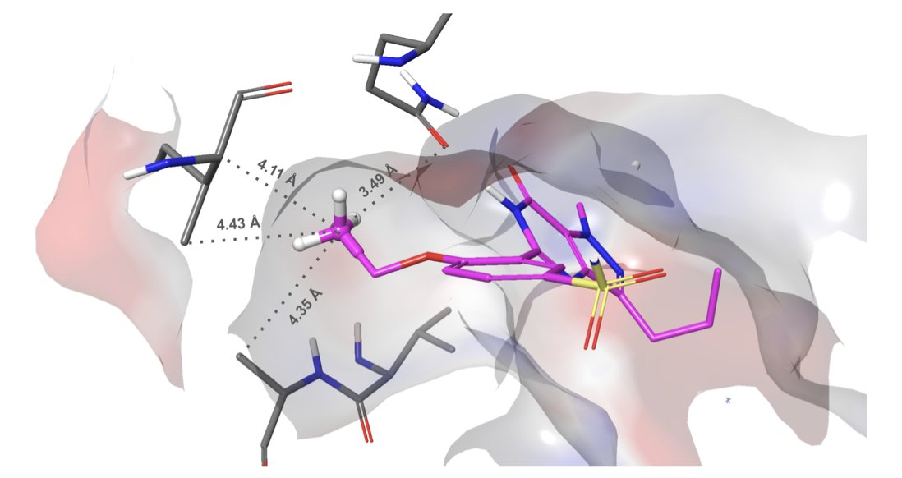
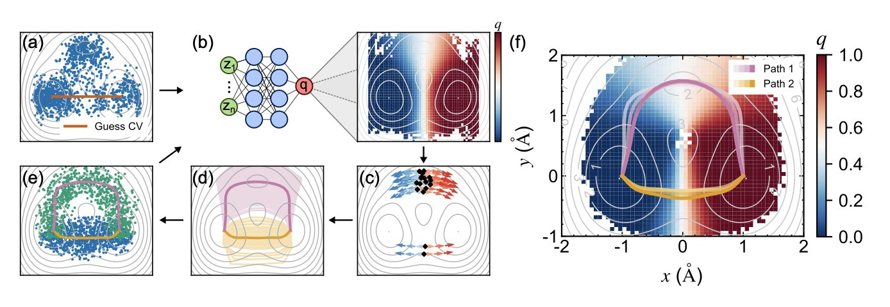
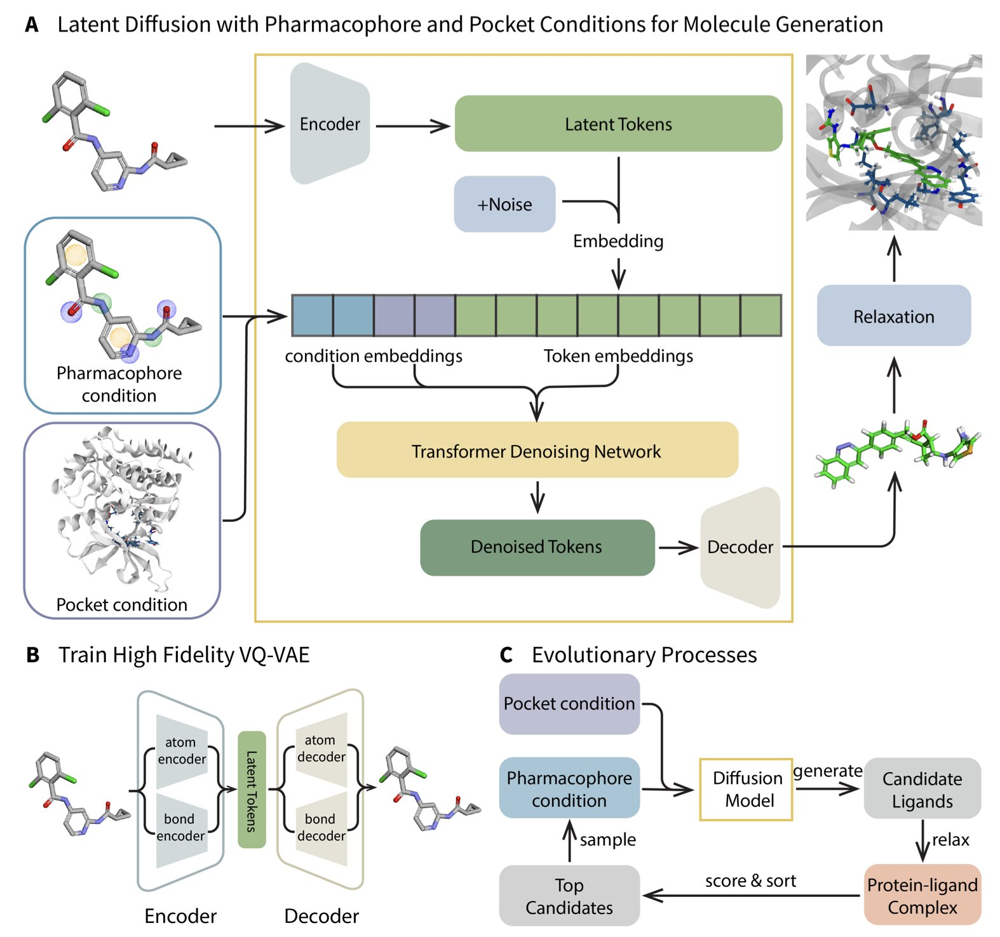
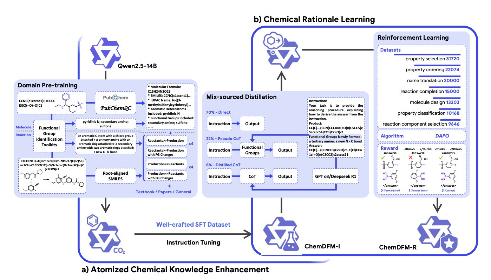
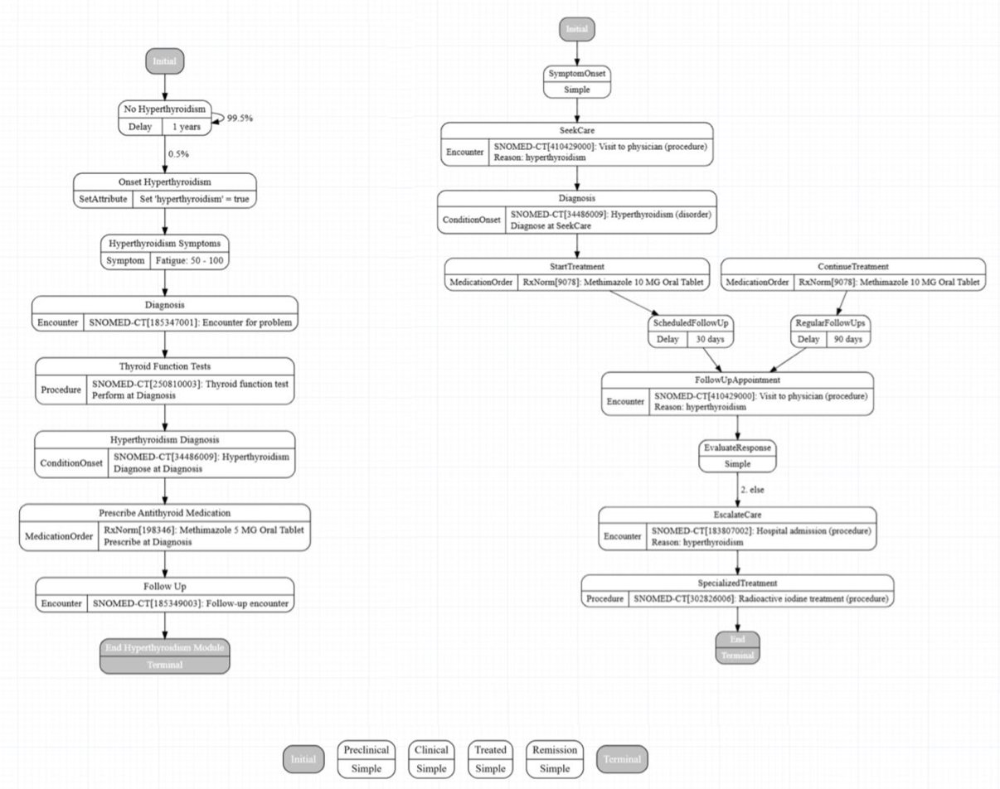

## Table of Contents
1. Schrödinger’s new Glide WS significantly improves docking accuracy and virtual screening efficiency by explicitly handling water molecules in the binding site. This could be a major upgrade to traditional rigid-receptor docking methods.
2. Researchers are using neural networks as guides, letting the data itself iteratively reveal the most likely "highways" for a molecule to get from A to B, solving a major pain point in reaction path searches.
3. MEVO cleverly combines molecule generation with evolutionary strategies, training its model on vast amounts of 'unbound' ligand data to open a new path for structure-based drug design.
4. By "atomizing" chemical knowledge into functional groups, ChemDFM-R helps large models move beyond rote memorization to truly understand the underlying logic of chemical reactions.
5. Large Language Models can greatly simplify the process of creating synthetic health data, but they function as powerful co-pilots, not autopilot systems that can replace the wisdom of human experts.

## 1. Glide WS Arrives: Water Molecules Are the New Frontier in Docking

Anyone who's done molecular docking for a while knows about the elephant in the room: water.

We usually pretend that beautiful protein pocket is a vacuum, then we stick a small molecule inside and score it. But in reality? The pocket is full of water molecules, bouncing around, forming complex hydrogen bond networks. They can be roadblocks for ligand binding, but also springboards.

How to handle these water molecules has always been a tough problem in the docking field. Most programs either ignore them completely or use rough implicit solvent models to get by.

Now, Schrödinger has arrived with Glide WS, claiming they've finally tackled this problem head-on. This isn't just a minor update.

They didn't use any mysterious methods. Instead, they brought out another one of their tools, WaterMap. Simply put, before docking begins, they run a molecular dynamics (MD) simulation to see which water molecules in the protein pocket are "uncomfortable" (high energy) and which are stable (low energy). Then, Glide WS's new scoring function learns to adapt. If your ligand can displace one of those uncomfortable water molecules and take its place, you get a big bonus score. But if you try to push out a happy water molecule, you pay an energy penalty and lose points.

This logic sounds much more refined than the old "desolvation penalty." So how well does it work?

On a broad test set of nearly 1500 complexes, Glide WS achieved a self-docking accuracy of 92%, compared to the previous benchmark Glide SP's 85%. In the docking world, a 7% absolute improvement, especially on a high baseline like 85%, is a huge step forward. This means the binding poses we get are more likely to be correct, which is a fundamental benefit for all subsequent structure-based drug design work.

Of course, accurate scoring is good, but accurate screening is better. Virtual screening is about finding a needle in a haystack of thousands of molecules. Glide WS's performance here is even more exciting.

The report says it significantly reduces the number of "decoy" molecules that get false high scores. This means the false positive rate is much lower. And that means we don't have to waste time and money synthesizing and testing a bunch of compounds that have no activity. Before, you might have had to test 1000 molecules to find one hit. Now, maybe you only need to test 200. That's a huge help for project timelines and budgets.

Even more interesting, they've incorporated some of the "tribal knowledge" of medicinal chemists into the scoring function. Take the "Magic Methyl" term. We all know that adding a methyl group at a specific spot on a molecule can sometimes magically boost activity by tens or hundreds of times. The reasons are often complex; maybe that methyl group precisely displaces a key water molecule or fills a small hydrophobic pocket. Now, Glide WS can recognize this potential, just like a seasoned chemist. This shows that computational tools are evolving from pure physics-based scoring toward incorporating chemical intuition and experience.

The old saying still holds: garbage in, garbage out. All of this depends on preparing your protein structure well. Protonation states, amino acid side-chain conformations, and so on all have to be handled properly. Fortunately, Schrödinger has also automated much of this process, minimizing the chance of human error.

Glide WS isn't a silver bullet that will solve all of drug discovery's problems. But it has sharpened a tool we've been using for decades to a point we've never seen before. For any team or company that relies on computational chemistry to drive new drug discovery projects, this is a new weapon worth evaluating and trying immediately.

📜Title: Glide WS: Methodology and Initial Assessment of Performance for Docking Accuracy and Virtual Screening
📜Paper: <https://doi.org/10.26434/chemrxiv-2025-0s90h>

## 2. AI Navigates Molecular Transitions, Ending Blind Calculations

Researchers who run molecular dynamics simulations know that most of the work is pretty dull. 99.9% of the CPU time is spent watching molecules vibrate in their stable states, like watching a pot of water waiting to boil. The truly exciting moments—the "boiling" of chemical reactions, protein folding, or drug dissociation—are rare events that happen in a flash. Capturing the full path from state A to state B is harder than finding a needle in a haystack.

How did we used to do it? We guessed.

We call these guesses "Collective Variables" (CVs). You had to use your chemical intuition, your "tribal knowledge," to bet on which geometric parameters (like atom-atom distances or dihedral angles) were key to describing the transition.

If you guessed right, your simulation efficiency soared. If you guessed wrong? You just wasted hundreds of thousands of core-hours on useless data. It's like trying to find a hidden path in the Amazon rainforest with just a compass and no map. It relies too much on luck.

The authors of this paper decided to stop playing this guessing game. Their solution gets to the root of the problem.

Their core idea is to use something called the "Committor Probability." The concept isn't new and is, in theory, the perfect reaction coordinate. Imagine a molecule is a messenger traveling from village A to village B. At any point on its path, what's the probability it will reach village B before returning to A? That probability is the Committor. When the probability is 50%, the messenger is standing on the watershed between the two villages—the transition state we've been looking for.

But there's a catch. To know this probability, you need to know the entire landscape first. We're back where we started.

The authors use a neural network (NN) to break this loop. They don't try to solve it all in one go; they do it iteratively.

First, they run some initial simulations. The data can be rough. They feed it to the neural network to learn an approximate Committor function. This is like sending out a first wave of scouts to draw a rough map.

The second step is the most important. They use this rough map to guide the next round of simulations. They focus their computing resources on the region where the Committor probability is around 0.5—near that "watershed." It's like telling the next wave of scouts: "Stop wandering around the village. Go search carefully along the ridge." This improves sampling efficiency exponentially.

Then they repeat the process. They use the new, higher-quality data to train a better neural network, which produces a more accurate map. They use that new map to guide the next round of sampling. They continue this cycle until the Committor function converges and doesn't change much. At that point, you have a high-resolution map of the molecular pathway. The paper uses the decrease in KL divergence to prove the convergence of this method, which is solid.

They also considered the complex reality that there can be more than one path. When a simulation finds multiple different-looking paths, how do you know if they are truly different highways or just different lanes on the same road? They use a geometric tool called Voronoi cells. It groups path points based on their spatial location, merging branches and side roads that essentially belong to the same main route. This avoids a messy, redundant set of results. What you get in the end are a few clean, clear, representative core paths.

They tested this method on several classic systems, from a 2D model to the conformational flip of alanine dipeptide, and the classic Diels-Alder reaction. The results were quite good. The calculated reaction rates also matched previous studies.

What does this mean for drug development? It means we can better understand how a drug molecule "twists" its way into a target's pocket, or how it breaks free—which is critical for optimizing residence time. It also means we can more reliably predict potential side reactions when designing new molecules from scratch. This method turns work that relied heavily on the intuition of "alchemists" into a data-driven, self-correcting, automated process.

They mention that automatically selecting the most meaningful CVs from a vast pool of candidates is still just a preliminary framework. But it already points in a very promising direction.

📜Title: Following the Committor Flow: A Data-Driven Discovery of Transition Pathways
📜Paper: https://arxiv.org/abs/2507.21961

## 3. AI Evolves Generated Molecules for Tough Targets

Anyone on the front lines of structure-based drug design (SBDD) knows the biggest pain point: data. It's always data.

There are only so many high-quality 3D structures of protein-ligand complexes. The PDB database has a finite amount of content. By contrast, the amount of ligand data—just molecular structures, with no target information—is an ocean.

Everyone has been wondering how to use the information in this ocean.

This study on MEVO offers a clever solution. Instead of trying to force a solution to the lack of complex data, it changes direction. The core idea is this: I'm not going to focus on the specific features of the protein pocket for now. Instead, I'll use a VQ-VAE and a diffusion model to learn the "pharmacophore scaffolds" of effective molecules from huge molecular libraries. It's like trying to make a key not by studying a specific lock, but by studying thousands of keys that open all sorts of locks to understand the general design principles of a "good key."

This idea isn't new, but the smart part of MEVO is what comes next: evolutionary optimization.

The molecules generated by AI are, frankly, just nice-looking sketches. They follow the statistical patterns of pharmacophores, but whether they can fit precisely into the tricky pocket of a target protein is a different story. This is where MEVO's Evolutionary Strategy comes in. It throws these generated molecules into the protein pocket and uses a physics-based scoring function (like docking energy or force field calculations) as the judge, running rounds of "survival of the fittest" selection and mutation.

This process is like Darwinian natural selection, but simulated at high speed in a computer. Molecules that don't fit the pocket well are eliminated. The "chosen ones" that form key interactions are kept, and they "reproduce" and "mutate" to create offspring with even higher affinity.

The most important part is that this optimization process is "training-free." It doesn't require complex model retraining, can be used directly, and can be easily adapted to optimize other properties like solubility or permeability. For anyone who has suffered through parameter tuning, this is a relief.

The researchers tested MEVO on the notoriously difficult target KRASG12D. Anyone who has worked on KRAS knows its binding pocket is shallow and flat, like a smooth plate, making it very hard for small molecules to get a firm grip. MEVO not only generated new molecular scaffolds with high affinity but also validated them with free energy perturbation (FEP) calculations, showing their binding strength was competitive with known potent inhibitors. That's persuasive. It shows that MEVO isn't just making "pretty" molecules that follow Lipinski's rules; it's generating things that have real potential to become lead compounds.

MEVO is a very practical engineering solution. It elegantly combines the generative power of data-driven methods with the optimization power of physics-based rules. It acknowledges the current limitations of AI while leveraging the strengths of classical computational methods. This kind of fusion may be more effective at solving the real problems we face in drug discovery than pursuing a single technology to its extreme.

📜Title: Generative Molecule Evolution Using 3D Pharmacophore for Efficient Structure-Based Drug Design
📜Paper: https://arxiv.org/abs/2507.20130

## 4. ChemDFM-R: Teaching AI to Think Like a Chemist

Most so-called "chemistry large models" are still more like linguists than chemists. They are like students who have memorized the entire dictionary but can't form a sentence. They can tell you the name of a reaction but have no idea how electrons actually move or how atoms rearrange.

ChemDFM-R did something very "chemical." Instead of making the model memorize complex chemical reactions whole, they broke down the knowledge, "**atomizing" it to the most fundamental unit of the chemical world: the functional group**.

For a chemist, this is the starting point of all thinking. When they see a molecule, they don't see a jumble of carbon, hydrogen, oxygen, and nitrogen. They see an ester group, a carbonyl group, an amino group... the key components that determine a molecule's "personality" and "behavior."

The authors of this paper clearly understand this. They taught the model to recognize functional groups in molecules and how those groups change during a reaction.

It's like teaching a child to play with LEGOs. You don't just show them a completed Millennium Falcon. You first teach them to recognize each block—this is a 2x4 brick, that one has a hinge—what each one does, and how they can be put together. Only when the child understands the "function" of each block can they truly start to create, rather than just memorizing blueprints.

ChemDFM-R's training method is also quite clever.

It uses a "mixed-source distillation" strategy. On one hand, it uses precise chemical knowledge curated by experts (like the golden rules from a textbook) to give the model a solid foundation. On the other hand, it learns general reasoning and logic from more powerful general-purpose large models (like GPT-4). It's like a student who gets detailed instruction from a specialized professor but also audits a philosophy class on logic.

Finally, it uses reinforcement learning as a "strict teacher" to constantly grade and correct the model's chemistry "answers" until it truly gets it.

So what's the result?

It doesn't just score high on various chemistry benchmarks. The key is its **explainability**.

When ChemDFM-R predicts a reaction, it doesn't just give you a product. It explains its thought process step-by-step, just like a real chemist: "Because there is an ester group in the substrate, and this nucleophile is present in the reaction system, a nucleophilic addition-elimination reaction will occur here..."

It pries open the black box a little, letting you see how the gears are turning. For people in drug discovery, this kind of explainability is far more valuable than a simple 99% accuracy rate. We have to know **why** to trust its predictions and to design the next, potentially multi-million dollar experiment based on its suggestions. Otherwise, what's the difference between it and a fortune teller?

Of course, behind all this is a "data gold mine" that the researchers built—the ChemFG dataset. They processed 12 million papers, 30 million molecules, and 7 million chemical reactions, distilling all this information into knowledge centered on functional groups that the model can understand. This effort is like building a Library of Congress for AI in the field of chemistry.

ChemDFM-R is like a knowledgeable but still inexperienced PhD student. You can discuss things with it, question its logic, and get inspiration from its line of thought.

📜Paper: https://arxiv.org/abs/2507.21990v1

## 5. LLMs for Synthetic Health Data: Efficient, but People Are Still in Charge

In drug development and health tech, everyone knows what a headache it is to get high-quality real-world patient data. HIPAA, privacy, ethics—the regulations can drive you crazy.

So, we often turn to synthetic data. Synthea is a good open-source tool that can generate virtual patient records. The problem is, building a module for a new disease from scratch is a slow, tedious, manual process.

Now, researchers at MITRE have thrown a trendy new tool, the LLM, at this old problem. Their idea wasn't just to tell the AI, "Hey, write me a module for type 2 diabetes." That would be asking for trouble, just waiting for the AI to invent medical miracles.

They set up a four-stage pipeline:

1.  **Give it a blueprint**: First, you have to feed the LLM a solid, authoritative clinical guideline. The old rule, garbage in, garbage out, is still true in the age of AI.
2.  **Get a first draft**: The LLM will produce an initial Synthea module. Think of it as a rough block of marble fresh from the quarry.
3.  **Sanity Check**: This is where the human experts step in. They check two things: Is the code syntax correct? (Will the program run?) And, more importantly, does this make clinical sense? (Does the disease progression, the treatment plan, follow medical logic, or is the AI just making things up again?)
4.  **Iterate, iterate, iterate**: You give the LLM feedback on the errors you found—"This part is wrong, fix it"—and repeat the process. The researchers call this "progressive refinement." I'd call it "training a brilliant but occasionally foolish intern."

The results were quite good. They claim the final module's clinical accuracy was "near-perfect." But we all know that behind the words "near-perfect" are human experts who patiently corrected the LLM's endless "hallucinations." Without that oversight, you might end up with a virtual patient whose high blood pressure is treated with lollipops, as per the AI's suggestion.

So, is this the future?

For tasks that generate structured data from structured information sources like clinical guidelines, the answer is yes. It can take what used to be a week of manual coding and compress it into perhaps a day of review and refinement. That's a huge efficiency gain. But this is not the magic button that will let you "fire your data scientists."

The real value of this method isn't in the LLM's first draft, but in the **process** it establishes. This process uses the LLM as a powerful tool while keeping human expertise as the final judge. The bottleneck shifts from tedious coding to high-level expert validation that requires deep knowledge.

📜Title: Leveraging Generative AI to Enhance Synthea Module Development
📜Paper: https://arxiv.org/abs/2507.21123v1
