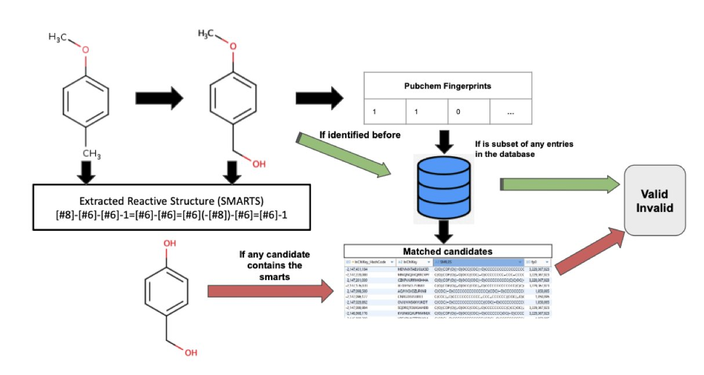
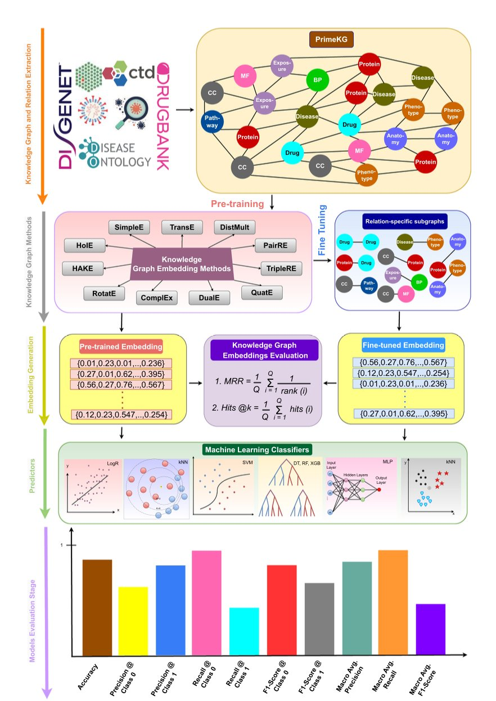
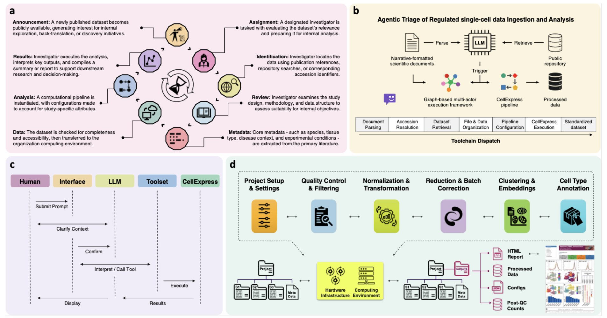

## 目录  
1. BioTransformer 4.0 通过智能过滤和模块化设计，将代谢物预测从"信息海洋"转变为指导药物设计的"实用地图"。
2. BIND 框架试图用一个集成的 AI 平台，解决从分子到表型的多尺度生物网络预测难题，但它的真正价值，在于它给出的新线索能否被实验真正证实。
3. 这款名为 CellAtria 的 AI 框架，试图将繁琐的单细胞数据处理流程，变成一场与聊天机器人的简单对话。

## 1. 代谢预测不再靠猜？BioTransformer 4.0 来了  
  
  

一个看似完美的苗头化合物，合成路线都优化好了，结果一进动物体内，要么"见光死"被代谢得一干二净，要么变成一个有毒的鬼东西，直接把项目送进坟墓。预测药物代谢，一直是一线研发人员心里的一根刺。  
  
以前的那些预测软件，要么像个没感情的规则机器，给你吐出一大堆理论上可能的代谢产物，多到让你怀疑人生，大海捞针般地寻找那个真正重要的。要么就是个黑箱，你根本不知道它怎么想的，漏掉了关键的那个"致命"代谢物，等你在后期实验里发现，黄花菜都凉了。这就是典型的信噪比灾难。  
  
BioTransformer 4.0 那个所谓的 **"代谢物验证模块"** 不是傻乎乎地穷举所有化学可能性，而是把预测出的结果跟一个已知的人类代谢物数据库进行比对。这个操作的精髓在于，它能把那些"理论上存在，但现实中鬼才会生成"的结构给筛掉。根据论文数据，这一步能减少多达 80% 的预测结果。  
  
这是什么概念？这就好比你背后站了一位经验丰富的 DMPK（药物代谢及药代动力学）专家，在你对着满屏的预测结构头疼时，他拍拍你的肩膀说："别费劲了，这个、这个、还有那个，一看就不靠谱，我们实验室里从来没见过这种转化，扔了吧。"这一下，你的工作量就从"大海捞针"变成了"瓮中捉鳖"，能让你把精力真正集中在少数几个高风险的代谢物上。  
  
另一个有意思的点是 **"非生物代谢模块"**。  
  
做药的都知道，分子面临的挑战可不只是肝脏里的 P450 酶。你的分子可能在污水处理厂里打滚，可能在阳光下分解，甚至可能在输液袋里跟别的玩意儿发生点什么。这个新模块的加入，意味着 BioTransformer 的视野从单纯的药代动力学，扩展到了环境毒理学、甚至是制剂稳定性的范畴。这让工具的用途一下子广了很多，对评估一个分子的全生命周期风险很有帮助。  
  
当然，还有那个 **"可定制的多步预测"**。  
  
这才是真正强大的地方。以前的工具大多是"一步到位"，你输入一个母体，它给你一堆可能的"儿子"，但"孙子"辈长什么样，你就得手动把"儿子"再输进去一遍。现在，你可以像搭积木一样，把不同的代谢模块串起来。比如，你可以设定让一个分子先经过一相氧化反应，然后把所有氧化产物直接丢进二相反应的葡萄糖醛酸化模块，看看接下来会发生什么。这种链式反应的模拟，才更接近药物在体内的真实旅程，能帮你发现一些隐藏更深的代谢通路。  
  
至于性能，文章里提到的在 DrugBank 和 PhytoHub 数据集上分别达到 87.2% 和 91.6% 的召回率，数字本身很漂亮。这意味着它确实能"看到"绝大多数已知的代谢物。当然，任何计算工具都不是万能的，它不可能 100% 准确。但作为一个筛选工具，它已经足够好了。  
  
它让我们能在合成前就"枪毙"掉一堆烂想法，或者提前给一个有潜在代谢风险的结构打上"黄牌警告"。在药物研发这个烧钱无底洞的行业里，能早一天发现问题，省下的不仅仅是瓶瓶罐罐，更是宝贵的时间和机会成本。  
  
📜Paper: https://www.biorxiv.org/content/10.1101/2025.07.28.667289v1  

## 2. BIND：用知识图谱预测海量生物互作  
  
  

生物学研究，尤其是在药物发现领域，我们整天都在跟一张无边无际、错综复杂的"关系网"打交道。蛋白质和蛋白质怎么结合？药物会影响哪些基因？某个基因突变又会导致什么表型？这些问题每一个都够喝一壶的。  
  
传统的方法就像是盲人摸象，一次只能摸一个地方。现在，这篇文章的作者们端出了一个叫 BIND 的工具，号称要用知识图谱和机器学习，给我们一副能看清整头大象的眼镜。  
  
研究者把市面上能找到的 11 种主流方法全都拉过来，在一个包含了 800 万条已知互作、涉及近 13 万个节点的巨大知识图谱上，结结实实地跑了一遍。这个知识图谱的野心很大，塞进了 30 种不同的生物关系，小到分子间的亲密接触，大到药物与临床表型的宏观联系。  
  
做过生物信息学预测的都知道，最大的坑之一就是数据不平衡——阳性样本（已知的互作）少得可怜，阴性样本（未知的或不存在的互作）汪洋一片。模型训出来，很容易就变成一个只会摇头说"不"的懒虫。  
  
BIND 在这里耍了个小聪明，搞了个"两阶段训练"。第一阶段，他们用精心平衡过的数据集先让模型"热身"，学会互作的基本模式；第二阶段，再把初步训练好的模型扔到真实世界的不平衡数据里去"淬火"。这法子不新鲜，但对于提升模型在蛋白质互作（PPI）这类经典难题上的表现，确实管用。  
  
他们报告的 F1 分数确实亮眼，很多任务上都达到了 0.85 到 0.99，听起来几乎是完美解决了问题。但在坑里摸爬滚打过的人都知道，魔鬼藏在细节里。这种高分是在特定的测试集上取得的。真正的考验是，它预测出的那些"全新"相互作用，有多少是真正有生物学意义的新发现，又有多少只是算法过拟合产生的统计幻影？  
  
他们没有把模型和代码锁在自己的服务器里，而是做成了一个对公众开放的 Web 应用。它让一个在实验室里摇瓶子的生物学家，也能点点鼠标，从几十亿种可能的配对中寻找自己感兴趣的线索。这极大地降低了计算工具的使用门槛，是连接计算与实验的好事。  
  
当然，一个漂亮的界面并不能保证预测结果的质量。在他们的案例研究里，验证了 1355 个药物 - 表型的高置信度预测。这很不错，但这本质上是一种"事后诸葛亮"式的验证，也就是用已有的文献证据去确认模型的预测。这个工具真正的试金石，在于它能否预测出那些*尚未*被发现、但能被后续实验一举证实的新联系。这才是它能否改变游戏规则的关键。  
  
BIND 是是一个强大的数据整合与预测引擎，一个把复杂知识图谱技术打包成友善界面的"假设生成器"。它不会直接告诉你下一个重磅新药是什么，但它可能会给你一张藏宝图，上面标记了一些看似荒谬却可能埋着金子的地方。至于最后挖出来的是金子还是石头，那还得看我们自己的判断和实验台上的功夫了。  
  
📜Paper: <https://translational-medicine.biomedcentral.com/articles/10.1186/s12967-025-06789-5>  

## 3. AI 智能体上岗，单细胞分析告别繁琐脚本  
  
  

做过单细胞测序（scRNA-seq）分析的人都理解，真正的挑战往往不是生物学问题本身，而是数据的预处理。下载数据、整理 Metadata、运行那套总是报依赖错误的`Seurat`或`Scanpy`流程……这项繁重的工作常常耗费一个博士生大部分的青春。  
  
因此，当一篇 bioRxiv 上的预印本提到他们开发了一个 AI"智能体"（Agentic AI），能够通过交流将这堆繁琐的工作全部处理时，让人既兴奋又怀疑。这听起来实在过于理想，简直就像是为那些整天与数据作斗争的人量身定制的。  
  
这东西叫 CellAtria。它最核心的卖点不是又一个自动化脚本，而是"智能体"这个概念。  
  
这有什么不一样？传统的自动化流程就像一个厨子严格按照菜谱做菜，少一个步骤或者换个配料就傻眼了。而 CellAtria 的架构更像一个后厨团队：一个"经理"（大语言模型 LLM）负责理解你"想吃点啥"的指令，然后把任务拆解给手下不同工种的"专员"——有的负责读文献、有的负责去 GEO 数据库找数据、有的负责运行计算流程。  
  
整个工作流听起来相当科幻。你可以直接扔给它一篇论文，然后用一句话下指令，比如"分析这篇论文里关于小鼠肺成纤维细胞的数据集"。  
  
接下来，CellAtria 就开始自己忙活了：它会解析论文，找到提及的数据集编号（比如 GSEXXXXX），自动去数据库下载，然后调用一个叫 CellExpress 的内置标准化流程进行分析，最后把结果给你。全程无需你手动写一行代码。  
  
这背后的 CellExpress 流程本身也值得说道。它整合了当前主流的 scRNA-seq 处理步骤，确保了分析的标准化和可重复性。  
  
我们都知道，生物信息学分析里，"重复是金标准"。如果每个人都用自己那套"独门秘方"处理数据，结果就很难相互比较。CellAtria 试图通过一个统一的、高质量的流程来解决这个问题，这本身就很有价值。  
  
魔鬼总在细节中。  
  
这个系统对那些格式完美、元数据清晰的公共数据集可能效果拔群。但如果遇到一篇论文语焉不详，或者数据集的 Metadata 乱成一锅粥，AI 经理能不能应付得来？这是它从一个漂亮的玩具变成一个真正可靠的科研工具的关键。  
  
不过，研究者们显然也考虑到了透明度和可控性。系统设计了实时监控面板，让用户能看到 AI 到底在干什么，也能在必要时进行干预。  
  
整个运行环境都用 Docker 打包好了，这意味着你不用再经历痛苦的环境配置过程，这对于任何一个饱受"依赖地狱"折磨的人来说，简直是天籁之音。  
  
CellAtria 不仅仅是效率工具，更是一种"科研民主化"的尝试——它让那些没有强大计算背景的湿实验科学家，也能站在巨人的肩膀上，轻松挖掘和复用海量的公共数据。  
  
📜Title: An Agentic AI Framework for Ingestion and Standardization of Single-Cell RNA-seq Data Analysis  
📜Paper: https://www.biorxiv.org/content/10.1101/2025.07.31.667880v1
