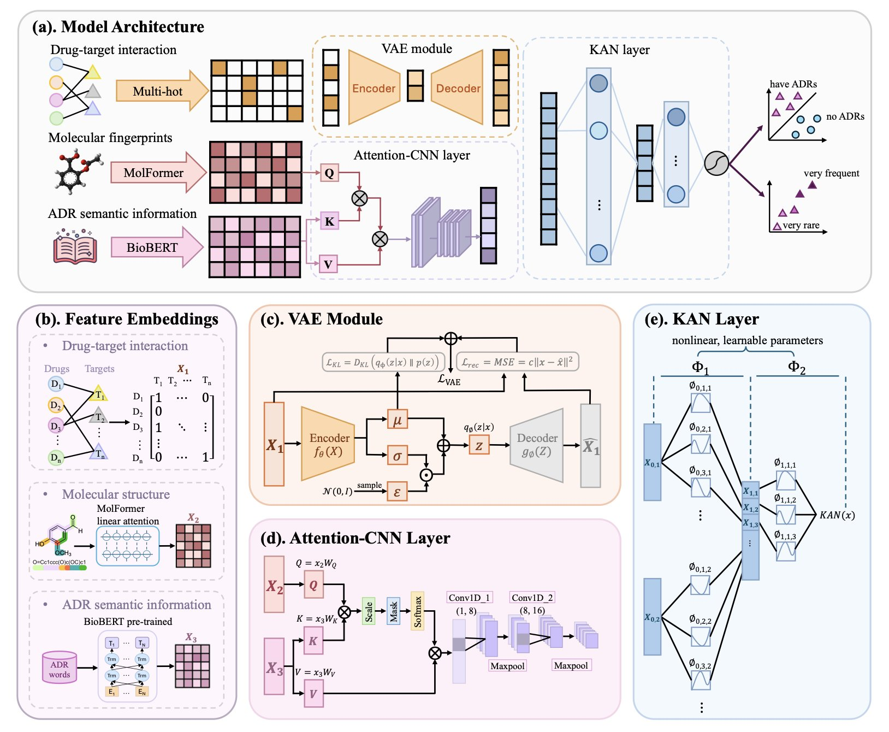
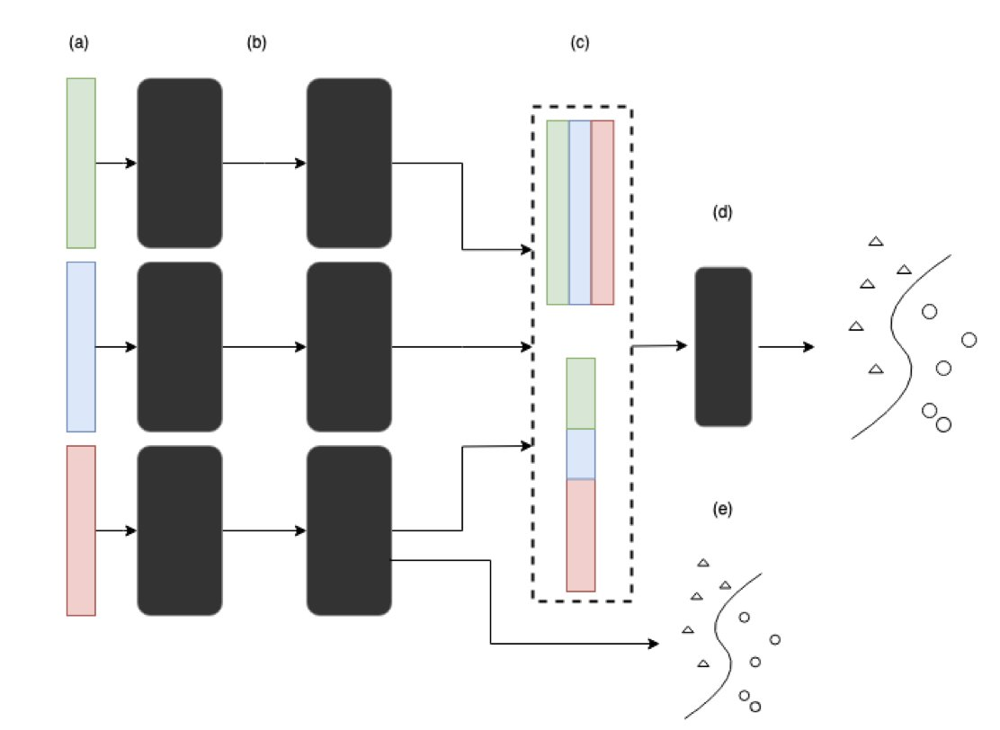
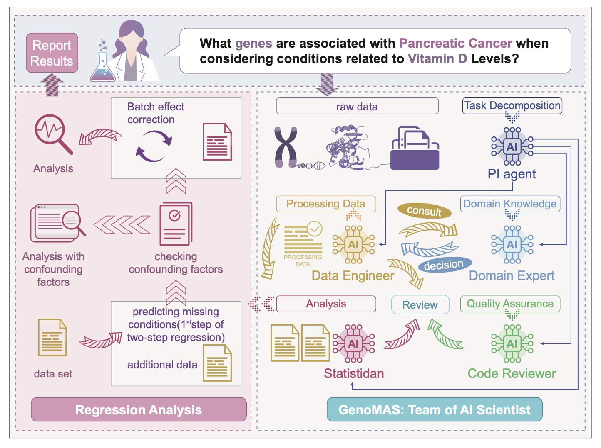

## Table of Contents
1. A new model called DeepADR uses the trendy KAN architecture to combine information on drug structure, targets, and side effect semantics, hoping to catch potential red flags early in drug development.
2. In multi-omics research, using SHAP to explain deep learning models can be like rolling the dice—the results are too random. Relying on it to pinpoint key biomolecules requires extra caution.
3. GenoMAS automates complex gene expression data analysis using a diverse team of AI agents. Its performance surpasses existing methods, showing breakthrough potential for bioinformatics.

## 1. DeepADR: Using KANs to Predict a Drug’s Risk of Failure

Predicting adverse drug reactions (ADRs) has always been a headache in drug development. ADRs can show up when you least expect them, derailing a promising candidate molecule or even pulling a blockbuster drug from the market. Countless projects fail for this reason every year.

Now, a new paper introduces the DeepADR model, which claims to offer a new solution to this old problem.

The researchers didn't rely on complex data. Instead, they used three common types of information: a molecule's 2D structure, its known biological targets, and text descriptions of side effects from databases like SIDER. The idea is straightforward. A molecule's chemical structure determines which proteins (targets) it interacts with, and these biological events ultimately lead to physiological or pathological effects (the side effects). The logic is clear.

The real highlight is the algorithm they used.

They didn't use a Transformer or a graph neural network. They used the recently popular Kolmogorov-Arnold Network, or KAN.

This is an interesting choice.

Many traditional deep learning models are like black boxes. You feed in data, and they spit out a result, but what happens inside is anyone's guess. KANs are different. You can think of a KAN as a flexible network made of many tiny, interpretable mathematical formulas, not a huge, rigid computing beast. This gives it a more systematic way to handle tangled, nonlinear relationships compared to models that rely on brute force.

Drug toxicity is a classic nonlinear problem.

A single molecule might hit a dozen off-targets. Each target can trigger a cascade of downstream biological responses. These responses can then overlap, amplify, or cancel each other out, finally manifesting as a specific side effect. Trying to map this with a simple linear model is impossible. The KAN architecture, in theory, is designed to sort out exactly this kind of complexity.

So, how were the results?

They look pretty good. The paper says DeepADR is not only more accurate than existing methods at predicting *if* a side effect will occur, but it can also predict the *frequency* of that side effect. This is critical. For doctors and regulators, a mild headache with a 50% incidence rate is completely different from a fatal cardiovascular event with a 0.1% incidence rate.

The model is also sensitive to rare side effects. This is a killer problem. Toxicities with a 1-in-1,000 or 1-in-10,000 probability are almost impossible to detect in clinical trials with a few hundred people. But once the drug hits the market and millions of patients, they can become a ticking time bomb. If AI can provide even a small early warning here, the value is immense.

Of course, let's not get ahead of ourselves.

This is a retrospective study using existing public data. In the real world, we face new chemical structures and countless unknown off-target effects every day. The model's ability to generalize to these new chemical entities (NCEs) has to be tested in real projects.

Also, the Achilles' heel of these models is always data quality. Public databases have inconsistent data, with labeling errors and missing information being common. Garbage in, garbage out—even the best algorithm can't fix that.

But DeepADR applies a new tool, KAN, to one of the toughest problems in drug discovery. It at least gives us a new perspective and a new tool that might help us avoid some pitfalls in the future.

📜Title: DeepADR: Multi-modal Prediction of Adverse Drug Reaction Frequency by Integrating Early-Stage Drug Discovery Information via Kolmogorov-Arnold Network...
📜Paper: <https://www.biorxiv.org/content/10.1101/2025.07.29.667409v1>
💻Code: <https://github.com/Wjt777/DeepADR>

## 2. Don't Trust SHAP Blindly! Deep Learning Explainability Might Be an Illusion

SHAP (Shapley Additive Explanations) claims it can open up the "black box" of deep learning and tell us which features a model really values. Sounds great, right? But a recent paper throws cold water on this idea, showing that in the complex world of multi-omics data analysis, SHAP can be far more fickle than you think.

Imagine you train two identical models on the exact same data. Just by changing the random seed for initialization, the top 10 most important genes (or proteins) identified by SHAP could be completely different. How are you supposed to work with that? In drug discovery, you want to find the "golden key" target, but the AI gives you a random set of numbers. It feels like a joke.

The researchers tested this directly on two real-world multi-omics datasets. They built deep learning models and trained them repeatedly. The result? The feature importance rankings fluctuated wildly. A gene that was #1 today could drop to #50 or lower tomorrow. They also added noise to the data to simulate less-than-perfect real-world conditions and found that SHAP's rankings became even more chaotic. Attempts to stabilize SHAP by dynamically adjusting network layer sizes didn't work well either.

Although the ranking of individual features was a rollercoaster, if you took the top N features selected by SHAP and fed them into a random forest model for classification or clustering, the performance was surprisingly stable.

What does this tell us?

SHAP might be picking up on a real signal in the features *as a group*, but it can't reliably tell you which specific feature is the most important. It’s like a team of detectives that always solves the case, but every time you ask who the MVP was, they give you a different answer. For drug discovery, which often requires hitting a single, precise target, this kind of "collective" correctness has limited use.

Next time your AI team excitedly shows you a SHAP plot and says they've found the key gene driving a disease, you should probably pause. Ask them: "How many times did you run this? Were the results consistent?" The hard lesson from this paper is to run it at least 10 times, average the results, and check the variance. If a feature consistently ranks near the top in every run, it might be the real deal.

Ultimately, AI explainability tools are not yet at a point where we can trust them blindly. Stay skeptical and verify everything. That’s fundamental to being a scientist, especially in the age of AI.

📜Title: Consistency of Feature Attribution in Deep Learning Architectures for Multi-Omics
📜Paper: https://arxiv.org/abs/2507.22877
💻Code: <If there is>

## 3. GenoMAS: A Team of AI Agents Creates a New Paradigm for Automated Gene Analysis

Handling gene expression data can feel like trying to groom a cat in a tornado—it's chaotic and hard to get a grip on. Anyone who has worked with genomics knows the feeling of being overwhelmed by massive datasets and complex procedures.

Researchers have tried to solve this by building a comprehensive **team of AI agents**. Think of it like a top-tier drug discovery group. You wouldn't want one person doing every job, right? You need bioinformaticians, statisticians, data engineers... GenoMAS does the same thing, but it builds its team using Large Language Models (LLMs).

It sets up an "AI team" of six members, each with a specialty—some are good at coding, some at logical reasoning, and others at reviewing and validating work. They collaborate on a shared "digital workbench."

The paper has an interesting finding: this heterogeneous team of different specialists works much more efficiently than a group of identical, "generalist" AIs. This isn't surprising. This is how top scientific research gets done.

But the real magic is how this team is managed.

The system gives them a high-level plan, like an experimental outline you'd sketch on a whiteboard, but it doesn't micromanage. These AI agents can improvise, writing their own code to solve immediate problems. They also learn from their mistakes. If a piece of code works well, it gets saved to a shared "toolbox" for future use. If it fails, they try a different approach. This ability to self-correct and iterate is crucial. It turns the system from a fragile script-runner into a resourceful "postdoc."

Let's look at the results.

On a gene identification task, its F1-score was 16.85% higher than the previous state-of-the-art, which is a massive leap. This means the gene-phenotype associations it finds are more likely to be biologically meaningful, not just statistical flukes. The researchers validated it on GenoTEX, a notoriously tricky industry benchmark, where GenoMAS came out on top across the entire workflow, from dataset filtering to final statistical analysis. This shows it's not a toy that only works in ideal conditions but a system with the potential to handle end-to-end research tasks.

We might be witnessing a shift where AI is becoming less of a "tool" and more of a "collaborator." For small labs or startups without a dedicated bioinformatics team, a system like GenoMAS could be a game-changer, potentially democratizing access to top-tier genomic analysis.

Of course, how will it perform on truly messy, noisy, real-world data? Can it reason about completely new biological pathways?

These are the next questions it needs to answer. But for now, GenoMAS is an exciting step in the right direction.

📜Title: GenoMAS: A Multi-Agent Framework for Scientific Discovery via Code-Driven Gene Expression Analysis
📜Paper: https://arxiv.org/abs/2507.21035
