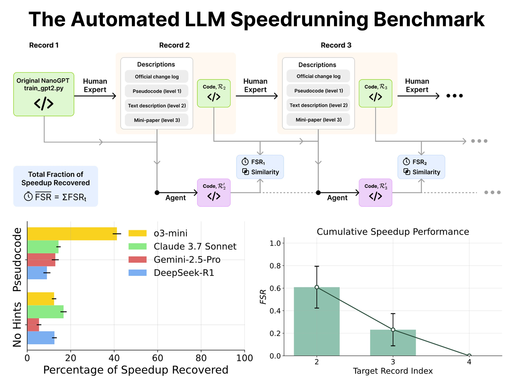
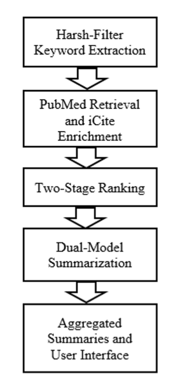
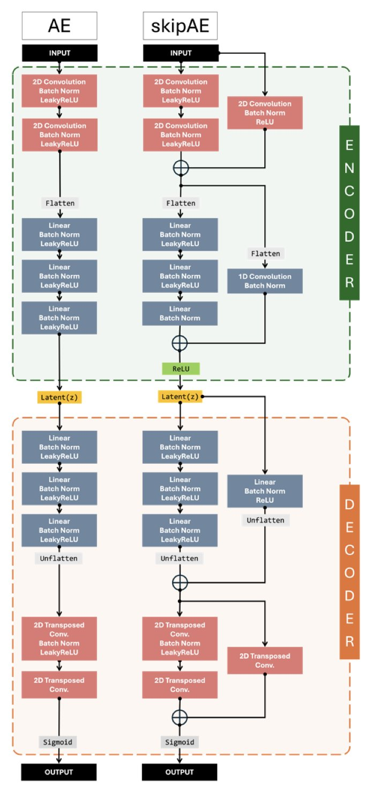

## 目录  
1. 用 nanoGPT 作为 AI 智能体优化代码的基准，这个想法很棒，但结果也给“AI 自我进化”的狂热泼了盆冷水：AI 目前还差得远。
2. 一个系统同时搞定文献的“影响力”和“相关性”，再用两个 AI 给你写摘要，文献综述的苦日子可能到头了。
3. MDZip 用神经网络实现了超过 95% 的分子动力学数据压缩，代价是物理保真度上的些许妥协，但这对于数据归档和共享而言，绝对是笔划算的买卖。

## 1. nanoGPT 基准：AI 写代码，离谱还是靠谱？  
  
  

如果你进场刷推，你可能已经听说或“体验”过 Andrej Karpathy 的 nanoGPT。该项目最初只是一个极简的 GPT 训练教程。然而，优质的项目往往能够自我发展，nanoGPT 自然也不例外。  
  
一开始，Karpathy 通过它向大家展示了如何从零开始训练 GPT。随后，他又使用 C 语言和 CUDA 对其进行了复刻，nanoGPT 因而成为新项目的基准。之后，社区中的专家们开始将其作为“研究沙盒”进行创新改进，把 GPT-2 (124M) 模型的训练时间，从最初的 45 分钟压缩至现今的 3 分钟！这一成就非常具体且可量化，是人类智慧的成果。  
  
现在，最精彩的部分来了。  
  
有了这么一个清晰的“人类记录”，nanoGPT 顺理成章地变成了一个完美的基准测试：既然人类能把代码优化到这个程度，那让现在最火的 LLM 智能体来试试怎么样？给它不同程度的提示，看它能把训练速度提高多少？  
  
这篇新论文就干了这个事。剧透一下：结果不太乐观。  
  
哪怕有明确的提示，AI 智能体的表现也只能说是差强人意。这就像你告诉一个机器人“把这辆车的百公里加速从 10 秒提升到 5 秒”，它顶多给你换个轮胎，而人类工程师已经把发动机、变速箱和空气动力学都重新设计了一遍。  
  
这自然就引出了那个经久不衰的话题：递归式自我改进（Recursive Self-improvement）。很多人一听到这个词，脑子里就浮现出“天网”或者“Llama 5 一夜之间造出 Llama 6”的科幻场景。  
  
Karpathy 的观点一向很实在：这种自我改进根本不是什么“开关一开，奇点降临”的玩意儿。它早就开始了，而且是以一种我们习以为常、平滑渐进的方式。  
  
想想看，你用的 IDE、代码补全工具、Google 搜索，甚至 Git，不都是在加速你构建下一个版本的软件吗？这些工具，就是“智能”在辅助我们迭代。现在，我们工具箱里多了个更强大的扳手——LLM，我们开始跟它协作完成更大块的功能，这种协作只会越来越深入。这才是现实。  
  
而且，我们必须对问题的复杂度有清醒的认知。nanoGPT 整个项目也就 750 行代码，还只涉及预训练阶段。这在真实世界里是什么概念？这就像是在一个标准卡丁车赛道上测试车辆性能。而我们工业界的生产级代码库，动辄几十上百万行，其复杂程度好比要跑完勒芒 24 小时耐力赛，还得自己处理各种突发状况。两者之间差了好几个数量级。  
  
把 nanoGPT 作为当前 AI 能力的一个标尺，是再合适不过了。它足够简单，让我们能在一个可控的环境里，戳一戳 AI 的真实水平；它又足够有挑战性，能暴露出 AI 在逻辑推理、规划和代码优化这些核心能力上的短板。  
  
📜Title: Can Large Language Models Automate Research? A Case Study on nanoGPT  
📜Paper: https://arxiv.org/abs/2405.17387  

## 2. 双 LLM 模型：你的下一个科研文献神器？  
  
  

我们每个人都清楚，在信息的汪洋里找几篇真正有用的文献是什么感觉——就像拿着一个漏勺想从消防水管里喝水。每周都有成千上万篇新论文冒出来，大部分你永远都不会读，剩下的那些，光是筛选和通读摘要就足以耗尽你的咖啡因储备。  
  
所以，当看到有人想用 AI 来正经解决这个问题时，我总是既期待又怀疑。这篇预印本里的系统，坦白说，有些想法还真挺对一线研发人员的胃口。  
  
首先，他们搞的这个排序算法有点意思。我们都用过 PubMed 或者 Google Scholar，要么是按引用数给你一堆“上古神文”，要么是按关键词匹配给你一堆不知所云的新东西。这个系统试图走中间路线，它把一个叫“相对引用率”（RCR）的指标和传统的“余弦相似度”结合起来。简单说，它不只关心这篇论文有多少人引用（学术影响力），还关心它的内容是不是真的跟你搜的东西八竿子打得着（主题相关性）。这个组合拳打得不错，理论上能帮你过滤掉那些“名气很大但与你无关”和“看似相关但毫无分量”的论文，让你拿到的列表质量更高。  
  
更有趣的是摘要部分。他们没押宝在任何一个大模型上，而是同时用了 Google 的 Gemini 2.0 和 OpenAI 的 GPT-4o-mini。这招很聪明。我们都知道，现在没有哪个 LLM 是完美的。有的擅长抓大放小，有的则在细节上抠得更准，但它们也都可能一本正经地胡说八道（也就是“幻觉”）。让两个模型同时上阵，就像是给你的实验数据找了两个人独立分析。结果相互印证，能极大地提高摘要的准确性和可靠性，还能减少单一模型犯傻的概率。对于需要从摘要里快速抓住方法学和关键结论的人来说，这简直是救命稻草。  
  
当然，光说不练假把式。他们跑了 20 个生物医学领域的查询，BERT-F1 分数平均有 0.86。这个分数不算惊为天人，但绝对是“优秀”级别了，说明机器判断的相关性跟人差不太多。不过，我更看重的是那 10 个用户的真人反馈。平均分超过 4.5/5，这可不是刷出来的。用户特别提到，这个系统生成的摘要能清晰地标出“研究方法”和“作者单位”，这可是我们行内人最关心的信息之一。它知道我们想看什么，这比单纯的文字压缩重要得多。  
  
作者们还提到，想把这套方法推广到其他领域，并且加入“自适应智能”和“隐私保护”。这听起来很宏大。不过，从生物医学跨到，比如说，高能物理或者有机化学，知识图谱和术语体系完全是两码事，挑战不小。至于隐私，当你把研究思路作为查询喂给商业公司的 API 时，谈隐私总是有点……乐观。  

📜Title: Multi-Model LLM Architectures for Personalized Summarization and Relevance Ranking in Biomedical Literature  
📜Paper: <https://www.biorxiv.org/content/10.1101/2025.07.29.667503v1>  

## 3. MDZip：给你的分子动力学模拟数据来一场终极瘦身  
  
  

做分子动力学（MD）模拟的，谁没有被数据存储搞得焦头烂额？一次模拟生成的轨迹文件轻易就占用几个 TB 的硬盘空间，让你在“删还是不删”的危机中苦苦挣扎。现在，有人想利用神经网络为你的数据进行一次“抽脂手术”。  
  
这篇论文中的 MDZip 正是这个概念的体现。  
  
简单来说，它是一个基于卷积自编码器（Convolutional Autoencoder）的压缩框架。你可以将其视为一个极其聪明的“速记员”。你不仅不需要记录蛋白质每时每刻的所有原子坐标，而是通过训练这个速记员，使其掌握一套针对特定体系的独特简写方法（即“紧凑的潜在表示”）。当需要回顾轨迹时，它可以将简写“翻译”为完整的原子坐标。  
  
结果怎么样？  
  
相当惊人。压缩率超过 95%！这意味着以前需要 20 块硬盘才能存下的数据，现在 1 块就够了。对于大规模模拟和数据共享来说，这简直是久旱逢甘霖。  
  
“听起来太美好了，代价是什么？”  
  
这个方法的精髓在于它是一个“残差自编码器”（Residual Autoencoder）。它儿比传统的自编码器要聪明一点。传统的自编码器是看着原始图像（或结构）从零开始画一幅复制品；而残差自编码器更像是先打个草稿，然后专门去学习和修正草稿与原图之间的“差值”。这种“专注于修正错误”的模式，让它在重建结构时精度更高，离谱的构象也更少。从结果来看，无论是 RMSD 涨落，还是距离分布这些我们常看的系综性质，MDZip 都保留得不错。  
  
但这里有个关键点，MDZip 是“物理不可知”（physics-agnostic）的。它的神经网络并不懂什么是范德华力，什么是键长键角。它只关心一件事：用最紧凑的方式编码坐标，并且能尽可能精确地解码回来。这既是优点也是缺点。优点是它通用性强，蛋白质、核酸、复合物都能用。缺点就是，它重建出来的构象可能“看起来很美”，但在能量上却不那么合理。比如，两个原子可能靠得太近，产生了不该有的碰撞。  
  
这就引出了最大的代价：**能量保真度的损失**。如果你想用解压后的轨迹去做结合自由能计算（比如 MM/PBSA），那你可得小心了。一个在能量上不合理的构象，可能会让你的计算结果错得离谱。  
  
研究者也意识到了这个问题，并给出了一个补救措施：对解压后的构象做一次短暂的能量最小化。这就像把一件在行李箱里压皱了的衣服拿出来用蒸汽熨斗过一遍。它能抚平那些最扎眼的“褶皱”（比如原子碰撞），让结构恢复到物理上比较合理的状态。但这终究是个“补丁”，它能让构象变得“合理”，但无法保证它就是模拟中那个“原始”的构象。  
  
所以，MDZip 到底是不是个好东西？  
  
看你怎么用。如果你只是想归档海量的模拟数据，或者把轨迹分享给合作者做一些宏观的结构分析（比如看蛋白是怎么运动的，或者某个 loop 区是不是很柔性），那它是神器。它用一点点能量保真度的牺牲，换来了存储便利。但如果你要做的分析对能量细节极其敏感，那最好还是老老实实地用原始轨迹。  
  
📜Title: MDZip: Neural Compression of Molecular Dynamics Trajectories for Scalable Storage and Ensemble Reconstruction  
📜Paper: <https://www.biorxiv.org/content/10.1101/2025.07.31.667955v1>
