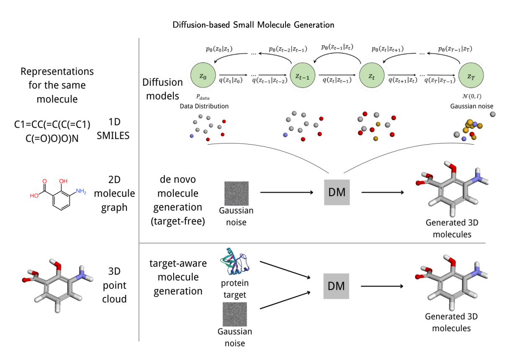
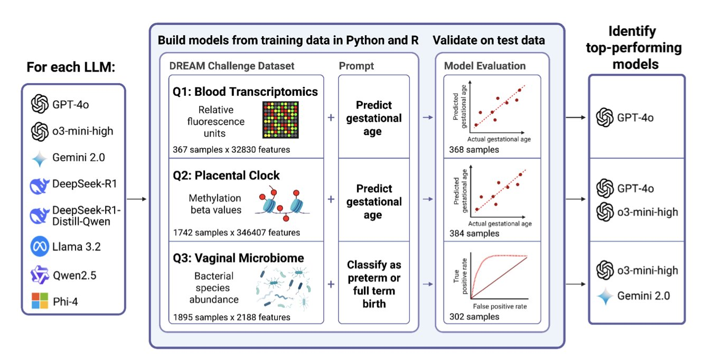
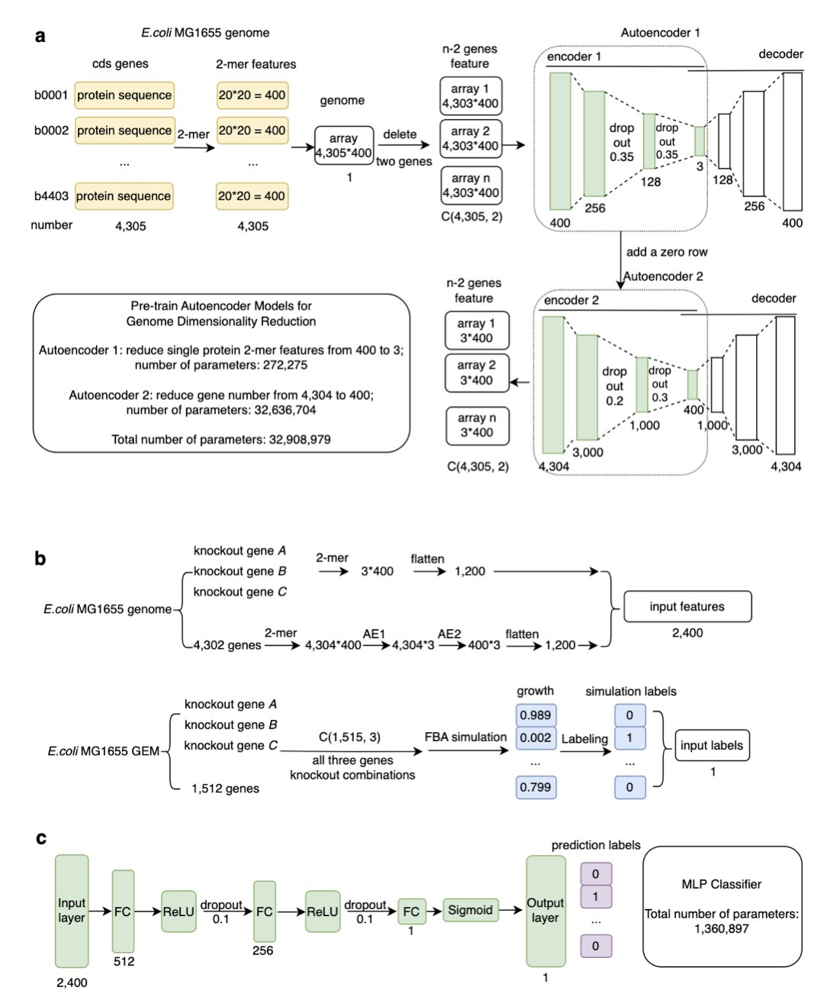
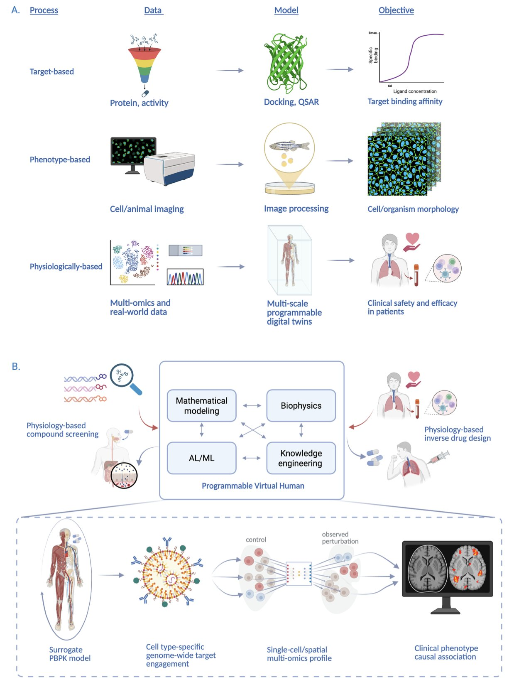
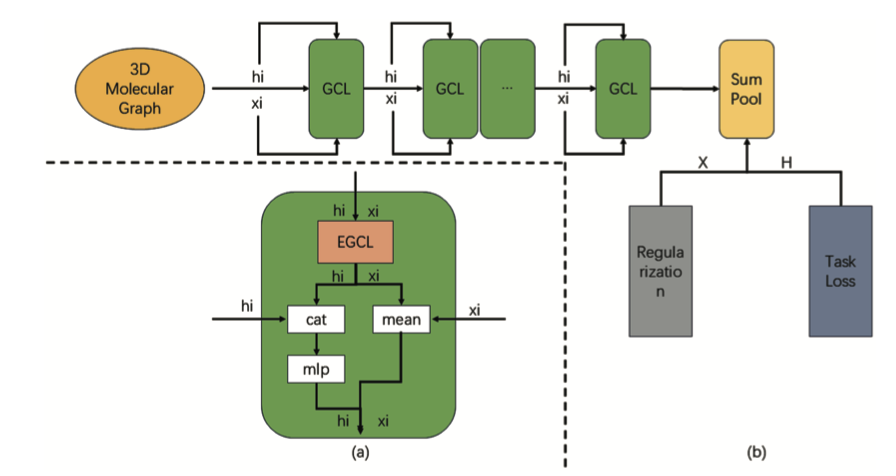

## 目录  
1. 扩散模型正在把分子生成带入三维时代，让 AI 不再是画化学图谱的"平面设计师"，而是直接在靶点里搞创作的"3D 雕塑家"。
2. 最新评测显示，顶尖大语言模型生成生物信息学分析代码的能力，已经可以媲美甚至超越人类顶尖竞赛团队，科研自动化的时代或许比我们想象的来得更快。
3. 这款名为 Tripleknock 的 AI 模型，通过暴力破解三基因组合的致死效应，绕开了传统代谢模型的速度瓶颈，为我们寻找多靶点抗生素开辟了一条全新的快车道。
4. 这篇论文描绘了一个宏大蓝图：用 AI 构建一个"可编程虚拟人"，在电脑里直接模拟药物从分子到人体的全过程，试图从根本上解决新药研发的转化难题。
5. PairReg 提出了一种巧妙的正则化方法，有效缓解了 EGNN 模型越深越"笨"的过平滑问题，让 AI 在分子模拟中看得更清楚。

## 1. 扩散模型：AI 造药，从 2D 涂鸦到 3D 雕塑  

现在，如果你在药物发现领域，没听说过"扩散模型"（Diffusion Models），那你可能是在一个与世隔绝的洞穴里做实验。这东西的热度，都快赶上当年的 CRISPR 了。每天都有新论文宣称用它生成了多么神奇的分子。但说实话，大部分人都是云里雾里。  

这篇综述像一位经验丰富的老向导，给我们画了一张关于"AI 分子生成"这片新大陆的地图。  

扩散模型到底是个啥？  

你可以把它想象成一个"分子雕塑家"。它从一团随机的"原子噪音"（就像一块混沌的大理石）开始，然后一步步地、精细地"凿掉"噪音，直到一个清晰、合理的分子结构浮现出来。这个过程，天然就适合处理三维空间信息。  

这为什么重要？  

因为过去我们很多 AI 模型，都是在"二维平面"上思考。它们生成的是 SMILES 字符串（一维）或者分子图（二维）。这就像给你一张汽车的设计图，而不是一个能开动的汽车模型。而药物发现，本质上是一个三维问题——一个三维的分子，要塞进一个三维的靶点口袋里。  

扩散模型，特别是那些带有"SE(3) 等变性"的，就是冲着解决这个问题来的。这个时髦的词，翻译成大白话就是：模型知道物理学。它知道你把一个分子旋转一下、平移一下，它还是同一个分子，它的化学性质不会变。这保证了它生成的 3D 结构是物理上靠谱的，而不是一些看着吓人的"克苏鲁"造物。  

这篇综述还给我们提供了一个非常有用的分类法，把这些模型分成了两大派：  
1.  "**无靶点"派（Target-free**）：这一派的 AI 就像个自由的探险家，它的目标是探索广阔的化学宇宙，发现全新的、有趣的化学骨架。  
2.  "**有靶点"派（Target-aware**）：这一派的 AI 是个目标明确的锁匠，你给它一个具体的靶点口袋（锁），它的任务就是设计出能完美插进去的钥匙（配体）。  

当然，这篇综述也很诚实地指出了现在的挑战。比如，生成一个大分子，计算成本依然高得吓人。而且，这种一步步"去噪"的过程，也可能导致错误的累积。  

但无论如何，这份综述是一份极其宝贵的指南。它告诉我们，扩散模型不只是又一个技术噱头，它代表着一个根本性的转变——从"画分子"到"造分子"的转变。对于天天和分子打交道的人来说，这太让人兴奋了。  

📜Paper: https://arxiv.org/abs/2507.08005  

## 2. AI 写代码做科研，比顶尖人类还强？  

  

在生物信息学领域，DREAM 挑战赛就像是奥林匹克。全世界最聪明的大脑汇聚一堂，处理那些最棘手、最真实的生物医学数据，看谁能构建出最精准的预测模型。获胜团队的代码，通常是智慧和汗水的结晶。  

现在，有人问了一个有趣的问题：如果让 AI 来参加这场考试，会发生什么？  

研究者们拿 DREAM 挑战赛中关于生殖健康的经典数据集——比如通过基因表达预测孕周、通过微生物组数据预测早产——作为考题，扔给了市面上八个主流的大语言模型（LLM），包括 OpenAI、谷歌和一些开源模型。  

考试内容很简单：不许耍赖，直接用自然语言下指令，让 LLM 生成能跑通的 R 或 Python 代码来完成分析任务。  

结果让人有点脊背发凉。  

表现最好的选手，OpenAI 的 GPT-4o-mini，在 8 项任务中成功完成了 7 项。更关键的是，它生成的代码跑出来的结果，在性能上足以和当年那些人类冠军团队掰手腕，有些甚至还略胜一筹。这可不是让 AI 写一首关于核糖体的诗，这是让它为一个出了名难搞的生物信息学问题，写出能获奖的、真正能用的代码。  

一个特别有意思的发现是 R 语言的"超常发挥"。LLM 生成 R 代码的成功率是 Python 的两倍多。  

为什么？这并不是说 LLM 天生就偏爱 R。真正的原因在于生态系统。  

R 语言的 Bioconductor 项目为处理基因组学和各种组学数据提供了一套极为强大、标准化的"军火库"。这些工具包接口统一、文档齐全，简直就是为 AI 学习和调用量身定做的。相比之下，Python 虽然强大，但在这个特定领域的工具链相对零散一些。这对我们是个重要的提醒：工具的标准化和易用性，在 AI 时代会变得前所未有的重要。  

这意味着什么？  

首先，它预示着一种工作模式的变革。过去，一个复杂的组学数据分析项目，可能需要一个专门的生物信息学家花上几周时间。现在，一个湿实验的生物学家，或许只需要花一个下午，通过和 LLM 的几次"对话"，就能完成初步的探索性分析。这之间的效率鸿沟是巨大的。  

其次，它可能解决了开源科学中的一个老大难问题：可重复性。我们都见过那种从 GitHub 上下载下来，但死活跑不通的代码。LLM 能够生成标准化的、可执行的分析流程，这有望让科研结果的验证和重复变得更加容易。  

当然，这东西还不是万能的。测试中依然有模型"交了白卷"，即便是最强的模型也有失手的时候。但方向已经非常明确了。那个能帮你处理数据、写分析脚本的 AI 实习生，已经上岗了。我们最好现在就开始学习如何跟它打交道。  

📜Title: Benchmarking Large Language Models for Predictive Modeling in Biomedical Research With a Focus on Reproductive Health  
📜Paper: https://www.biorxiv.org/content/10.1101/2025.07.07.663529v1  
💻Code: https://github.com/vtarca7/LLMDream  

## 3. Tripleknock: AI 精准狙击细菌三靶点  

  

抗生素研发的现状，用"惨淡"来形容一点也不过分。我们开发一个单靶点药物，细菌用不了多久就能进化出耐药性，仿佛在嘲笑我们的努力。所以，业内的共识是，得多管齐下，用"组合拳"——也就是多靶点药物——去攻击细菌，让它顾此失彼。  

想法很美好，但现实骨感。  

两个靶点的组合已经够复杂了，三个靶点的组合简直就是一场排列组合的噩梦。要在实验室里把所有可能性都试一遍？等你退休那天可能都筛不完一个物种。  

Tripleknock 干的就是预测**三个基因**同时被敲除后，细菌是死是活的事。  

研究者没用传统那套又慢又笨重的基因组尺度代谢模型（GEMs）。用 GEMs 做预测，就像拿着一张手绘的古董地图去导航，细节是多，但走起来能急死人。Tripleknock 另辟蹊径，它用一个自动编码器，把庞杂的全基因组数据狠狠地压缩了近 1000 倍——你可以把它想象成一个基因组的"超级压缩包"。然后，再用一个简单的多层感知器（MLP）在这个压缩包里去识别"致死模式"。整个过程不关心具体的代谢路径如何流动，只关心"这个组合看起来会不会搞死细菌"。简单、粗暴，但有效。  

结果相当不错。模型在大肠杆菌 K-12 上训练，然后在其他六种肠杆菌科的致病菌上测试，跨物种预测的平均 F1 分数达到了 0.77。这数字当然不是完美，但在这种复杂度堪称地狱级别的问题上，能做到接近 80% 的准确率，已经是一个了不起的开端。这就像派出去一个侦察兵，他有 77% 的把握告诉你，从哪三个方向同时突袭，能端掉敌人的老巢。这样的情报，我愿意用。  

更关键的是速度。它比传统的通量平衡分析（FBA）快了整整 20 倍。这意味着，过去需要几天甚至几周才能得到的计算结果，现在可能几个小时就搞定了。对于争分夺秒的药物研发来说，时间就是金钱，更是生命。  

当然，这个模型也不是万能灵药。研究者自己也坦诚，模型的泛化能力和特征分离的清晰度直接相关。说白了，如果致死的信号淹没在基因组的背景噪音里，AI 也会懵圈。这恰恰揭示了一个更深层次的科学问题：基因的致死效应，不仅仅取决于被敲掉的那几个基因，更取决于它们的缺失如何在整个基因组的复杂网络中引发连锁反应。  

所以，Tripleknock 更像一个强大的探针，帮助我们去窥探那个神秘的"基因 - 基因组"互动网络。它极大地缩小了我们的搜索范围，让湿实验的兄弟们可以把宝贵的资源集中在最有希望的少数几个靶点组合上。  

📜Title: Tripleknock: Predicting Lethal Effect of Three-Gene Knockout in Bacteria by Deep Learning  
📜Paper: https://www.biorxiv.org/content/10.1101/2025.07.31.667916v1  
💻Code: https://github.com/Peneapple/Tripleknock  

## 4. AI 虚拟人：新药研发的终极模拟器？  

  

说实话，如今关于 AI 制药的演示文稿层出不穷，往往是 AI 发现了新的靶点，或者设计了新的分子。听到这些，耳朵几乎要磨破了。然而，这篇关于"可编程虚拟人"（Programmable Virtual Humans, PVH）的论文其抱负在一个全新的层面。  

研究者的目标是什么？他们不满足于仅在分子层面"微不足道"的探索，而是希望在计算机中创造一个"人"——一个能够模拟药物从注射进入身体到最终产生表型效应整个过程的虚拟生理系统。这就如同为药物研发量身打造的终极版《模拟人生》，或者更确切地说，是为药物开发提供的"飞行模拟器"。  

做药的，心里最痛的是什么？就是那个"转化鸿沟"。一个分子，在细胞实验里效果拔群，在小鼠模型中力挽狂澜，结果一到人体临床试验，要么像泥牛入海，要么毒性爆表。无数的时间和金钱就这么打了水漂。这篇论文的核心，就是向这个行业最大的痛点发起了正面冲锋。  

他们的思路很有意思。传统的生理药代动力学（PBPK）和定量系统药理学（QSP）模型，我们用了几十年了，它们很有用，但就像是老旧的地图，只能描绘出大概轮廓。现在，研究者们打算用 AI，特别是像物理信息神经网络（PINNs）这样的"新式武器"来彻底改造它们。PINNs 的妙处在于，它不是一个纯粹的黑箱，它在学习数据规律的同时，还被"告知"了基本的生物学和物理学定律。这就好比一个学生，既会刷题，又懂原理，预测的准确性自然不可同日而语。  

他们要把单细胞和空间组学数据也整合进来。这意味着什么？我们不再是笼统地看药物对"肝脏"的影响，而是有可能具体到药物如何影响肝脏里的肝细胞、库普弗细胞，以及这些细胞之间是如何"窃窃私语"的。这种分辨率，能让我们对药物作用机制和潜在脱靶效应的理解，提升到一个全新的维度。想象一下，在给第一个病人用药之前，你就能在虚拟人身上看到药物可能在哪个组织的哪类细胞里"惹麻烦"，这简直是研发人员的梦想。  

当然，蓝图画得再美，现实总是骨感的。  

作者们列出了一堆挑战，比如怎么处理"分布外"预测（模型没见过的新情况），怎么量化不确定性，以及怎么把这些来自不同尺度、不同来源的数据和模型天衣无缝地粘合在一起。这就像要用乐高积木、橡皮泥和集成电路拼一个能正常运转的机器人，工程量和难度可想而知。  

短期内，我们离不开真实的生物学数据和人体试验。但这篇论文指明了一个极其诱人的方向。它或许无法在明天就交付一个能用的"虚拟人"，但它提出了一种思维框架，一种能让我们在给第一个真实病人用药之前，就在虚拟世界里进行成千上万次实验的可能。  

这是一个足够疯狂和大胆的愿景，我很期待看到它如何一步步变为现实。  

📜Title: Programmable Virtual Humans Toward Human Physiologically-Based Drug Discovery  
📜Paper: <https://arxiv.org/abs/2507.19568>  

## 5. PairReg：专治 GNN"脸盲症"，让 AI 看清分子 3D 结构  

  

图神经网络（GNN）在药物发现里火了好几年了，但它有个毛病——"过平滑"（Oversmoothing）。  

就像你把一张高清照片反复用"磨皮"功能处理，最后磨得连鼻子眼睛都分不清了。对于分子来说，每个原子的化学环境和空间位置就是它的"五官"，这些细节要是被模型自己"磨"没了，还怎么指望它去精准预测性质？  

所以，研究者们搞出了等变图神经网络（EGNN），想法很好，直接把 3D 坐标这种"等变信息"塞给模型，指望它能理解分子的三维结构。理论上，你旋转一下分子，预测的能量也应该保持不变，这很符合物理直觉。  

但问题来了，当网络堆深了之后，EGNN 也开始犯迷糊。传统的残差连接在这种模型里基本失灵，信息在层与层之间传递时，宝贵的 3D 坐标信息和原子本身的标量信息（比如电荷、原子类型）会搅和在一起，最后还是一锅粥。这就是"过平劳"的 2.0 版。  

这篇 PLOS ONE 的文章提出的 PairReg，没有去发明新的网络架构，而是从"正则化"这个老工具箱里拿出了一件新兵器。  

它的核心思路可以这么理解：在模型训练的时候，加一个"惩罚项"。这个惩罚项专门盯着成对原子间的距离。  

如果模型在更新节点特征时，把原来离得远的原子搞得在"特征"上很近，或者反过来，那就要被"罚款"。这相当于给模型上了一道紧箍咒，强迫它在学习抽象特征的同时，必须时刻记住"谁跟谁是邻居，谁跟谁离得远"这个最基本的空间事实。  

这为什么重要？  

在药物设计里，很多关键性质，比如分子与靶点的结合亲和力，就极度依赖于精确的三维构象和原子间的相互作用。一个官能团偏了零点几个埃，可能就从一个有效的抑制剂变成了一块废铁。如果你的 AI 模型连分子的基本形状都看不清，那用它来做虚拟筛选或者分子生成，不就是沙上建塔吗？  

从 QM9 和 rMD17 的数据来看，PairReg 确实管用，尤其是在层数增加时，性能衰减比其他方法要慢得多。这说明这个思路走对了。  

当然，这还只是在相对简单的数据集上验证。  

下一步，作者说要把它用到生物大分子结合和药物生成上，那才是真正的考验。  

📜Title: PairReg: A method for enhancing the learning of molecular structure representation in equivariant graph neural networks  
📜Paper: https://journals.plos.org/plosone/article?id=10.1371/journal.pone.0328501  
💻Code: https://github.com/76technician/PairReg
