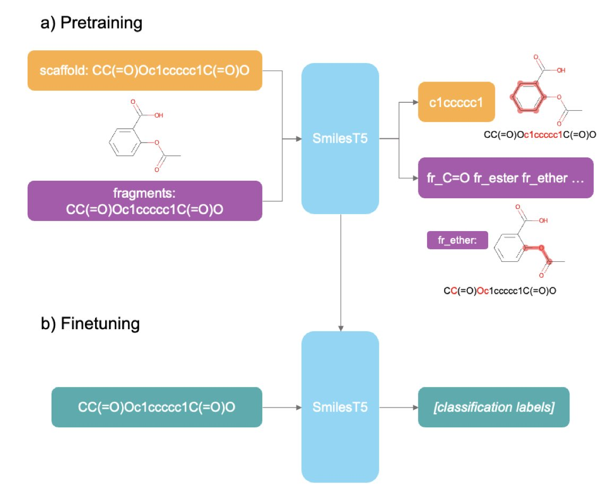
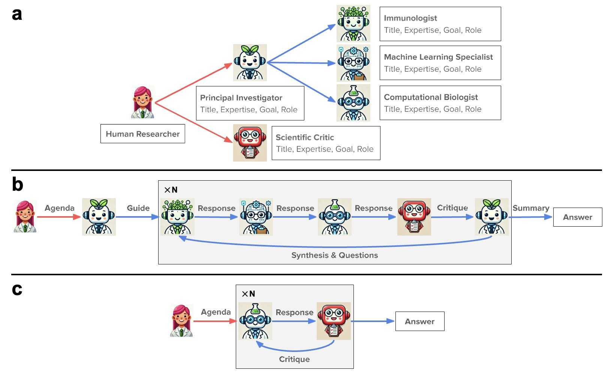
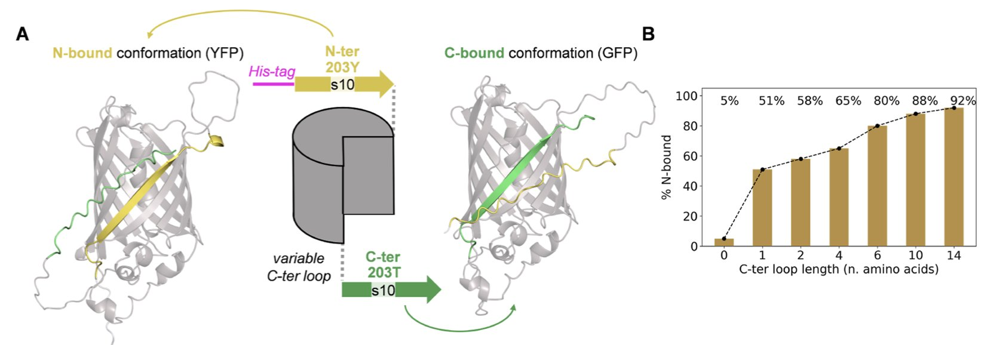
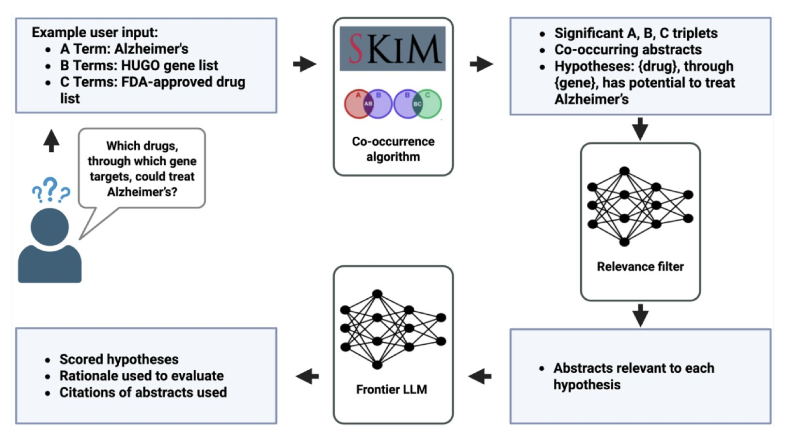
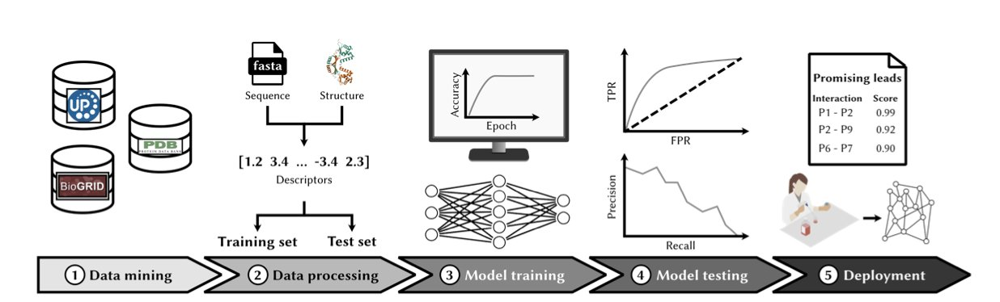

## Table of Contents
1. SmilesT5 uses pretraining tasks designed for chemists, proving that "smarter" training is far more effective than "bigger" datasets for molecular language models.
2. This Nature paper showcases a "virtual lab" framework led by AI agents and guided by human experts. It not only designed nanobodies against new COVID variants but also signals a new research paradigm that could upend traditional R&D collaboration.
3. When predicting a protein that can fold into two conformations, AlphaFold3 often forces both structures together, creating a physically impossible "stitched-together monster" and exposing its fundamental weakness in handling sequence ambiguity.
4. SKiM-GPT cleverly combines traditional literature co-occurrence search with a large language model (LLM), offering a surprisingly practical solution for rapidly screening and validating vast numbers of biomedical hypotheses.
5. Predicting protein-protein interactions (PPIs) from amino acid sequences alone is rapidly moving from a computational fantasy to a practical tool for drug discovery, and deep learning, especially Transformer models, is changing how we screen targets and design biologics.

## 1. SmilesT5: AI Pharma, Moving Past Brute Force

Honestly, whenever I see the words "new language model," my first thought is, do we really need another giant built by force-feeding it hundreds of millions of molecules? These models are like babies with nuclear weapons—immense power, but a laughably crude understanding of the world.

But this paper on SmilesT5 from Hothouse Therapeutics doesn't follow the "bigger is better" path. It asks a more fundamental question: how do we teach AI to speak like a chemist?

Traditional Masked Language Modeling is like tearing up an organic chemistry textbook, randomly covering a few words, and asking a layperson to guess what’s missing. They might learn some basic word pairings, but they'll have no idea about reaction mechanisms or the meaning of a molecular scaffold. SmilesT5's approach is much more clever; its pretraining tasks are designed by insiders.

For example, one task is "reconstruct the Murcko scaffold." You give it a full molecule's SMILES string and ask it to predict the core scaffold. This is brilliant. It’s essentially training the AI's "medicinal chemistry intuition." When an experienced chemist sees a new molecule, the first thing they look at is its core ring system and scaffold. This determines the molecule's basic conformation, physicochemical properties, and potential target affinity. SmilesT5 learns this from the start, focusing not on random atomic connections but on the "soul" of the molecule.

Another task is identifying molecular fragments from SMILES. This is what chemists do every day: break down a complex molecule into familiar building blocks—a benzene ring, an amide, a piperazine—to analyze its synthetic route and structure-activity relationship (SAR). By training this way, the model naturally learns which fragments are common "privileged scaffolds" and which are "toxicophores" to watch out for.

What really impressed me was its data efficiency. It was pretrained on just one million molecules, yet its performance rivals models that have consumed tens or even hundreds of millions. This shows that how you teach matters more than how much you feed it. For teams without access to the computing resources of Google or NVIDIA, this is great news. You don't need a supercomputing center; you can train a capable model on your own workstation.

The model's applications are also very practical. If you have the resources, you can fine-tune the entire model for a specific task, like predicting hERG inhibition or liver toxicity. But if your computational budget is limited, that's fine too. You can use SmilesT5 as a "feature extractor." Take the embeddings it generates for each molecule and use them to run familiar models like XGBoost or a random forest. The computational cost is much lower, but because these embeddings already contain rich chemical knowledge, the results can be surprisingly good. This significantly lowers the barrier to entry for AI-assisted drug discovery.

📜Title: SmilesT5: Domain-specific pretraining for molecular language models  
📜Paper: https://arxiv.org/abs/2507.22514v1  
💻Code: https://github.comcom/hothousetx/smiles_t5  

## 2. AI Agent Teams: The Next Boss in Drug Discovery?

This *Nature* paper reads like science fiction becoming reality. It's not about another "black box" algorithm for protein structure prediction. It's about building a "virtual lab" run by AI, where a team of AI agents meets, divides tasks, argues, and ultimately designs nanobodies that can neutralize the latest COVID variants. This is a much wilder idea than just running a model.

We all know the biggest headache in any project: communication.

Biologists, chemists, and computational scientists each speak their own jargon, often talking past one another. A simple idea can get debated back and forth for weeks. The authors of this paper seem to be trying to solve this problem at its root. They used a large language model (LLM) as a "general manager" and gave it a team of "AI expert" subordinates.

This team includes a "project lead AI" to define requirements, a "biologist AI" that understands protein design, and a "computational specialist AI" to run simulations.

And what do the human researchers do? They act as hands-off supervisors, issuing a single high-level directive: "Hey, design me some nanobodies that can take down the latest coronavirus."

Then, the AI team gets to work. They call upon familiar heavy-duty tools, using ESMFold and AlphaFold-Multimer to predict structures and Rosetta for docking and optimization.

It's like hiring a super-smart project manager who not only understands your strategic goals but can also recruit and manage a team of top technical experts. You just wait for the results. In this process, the human role shifts from "doing the work" to "defining the problem" and "making the final call."

Let's look at their report card. They came up with 92 new nanobody designs. That’s not the important part. The key is that in experimental validation, over 90% of the proteins could be expressed and remained soluble. Anyone who has done protein expression knows what this means—this is a success rate you can't ignore. Many PhD projects get stuck because a protein won't express or precipitates immediately. This shows that what the AI designed is, at the very least, feasible. Even better, two of the candidates showed unique binding modes, suggesting the AI might have found some opportunities that human experts could easily miss.

Of course, seeing this, a hundred questions pop into my head. How strong is the affinity of these designs? What are the KD values? Besides binding to COVID, will they randomly hit other proteins in the body, causing off-target toxicity? Druggability is about more than just good solubility—what about stability, half-life, and immunogenicity? These are the huge gaps between a nice computational model and a real drug. The paper doesn't go into detail, which is normal for a proof of concept.

But the real value of this paper is in demonstrating a new "organizational structure" for R&D.

In the past, when we talked about AI-assisted drug discovery, AI was a tool, like an advanced calculator. Now, AI has become a "collaborator," or even a "team leader." It connects the knowledge and tools of different disciplines, compressing a complex workflow that would have taken a team of humans months into a single human-computer interaction framework.

What does this mean? In the future, a brilliant biologist with little knowledge of computational chemistry could potentially lead an AI team like this to independently design and screen early-stage drug candidates. The walls between disciplines are being torn down by AI in a way we didn't expect.

So, will this put us out of a job? Not in the short term. The AI team still needs a human to ask the "great question." But the way we work will likely change. When building a project team in the future, besides finding the right people, we might also have to consider which "AI team" to use. Your next project collaborator might not have a PhD, but it will have the knowledge of the entire internet and be on call 24/7.

📜Title: The Virtual Lab of AI agents designs new SARS-CoV-2 nanobodies  
📜Paper: https://www.nature.com/articles/s41586-025-09442-9  

## 3. AlphaFold3 Stumbles: When AI Meets a Protein with a "Split Personality"

AlphaFold3 is undoubtedly the new star of structural biology. But what happens when we stop feeding it well-behaved proteins with a single stable conformation and instead give it a truly tricky problem—a protein designed to fold into two different structures? This new study did just that, and the results are interesting. They also serve as a reality check for people in R&D.

The researchers designed what are called "alternate frame folding" systems. You can think of it like an English sentence that can be read in two completely different ways just by shifting where the spaces are. These protein sequences are similar. A repeating segment within them can pair and fold in two different ways, forming two distinct 3D structures. This is the ultimate test for any structure prediction algorithm.

So what happened? AlphaFold3 often had a "breakdown."

Instead of choosing the most plausible of the two possibilities like a rational scientist, it tried to represent both conformations at once. The final model it generated was a "stitched-together monster" that forcibly superimposed the two structures.

You can see a beta-sheet strand piercing right through the middle of what should be a barrel structure, or amino acid side chains crammed into a physically impossible position. It's like asking an AI to draw a cat and a dog simultaneously, and instead of creating a "cat-dog" creature, it just overlays the line drawings of a cat and a dog, resulting in an unrecognizable mess.

What's more interesting is that this exposes a core difference between AlphaFold3 and AlphaFold2. Anyone who has used AF2 knows you can "trick" it by modifying the multiple sequence alignment (MSA) to make it explore different conformations. It’s like giving a detective different clues, which might lead him to different conclusions about the case. But AF3 reduces its reliance on MSAs, and this double-edged sword has cut itself here. It has become more of a "black box," making it difficult to guide from the outside. It saw the inherent ambiguity in the sequence itself, got stuck, and output an erroneous result that represented its "indecision."

The paper also mentions a detail that drug developers often overlook in their daily work: the His-tag. This little "tail" we use to purify proteins has no fixed structure, and it also became a troublemaker in AF3's predictions. The model tends to force a structure onto this flexible tail, which often leads to unreasonable steric clashes in the main protein region. This is another reminder that AI tools are far from "understanding" all of biochemistry. Every atom you input can become a variable that affects the outcome.

The researchers also confirmed this with a calmodulin-based conformational switch, finding that the problem is widespread and not just a quirk specific to GFP.

So, AlphaFold3 is a powerful tool, but it has its Achilles' heel: ambiguity.

When a sequence itself contains an internal conflict of "go left or go right," AF3's current architecture short-circuits. This work isn't meant to diminish AF3, but to map out the boundaries of its capabilities. For anyone trying to design new drugs, new proteins, or understand disease mechanisms, knowing the limitations of your tools is far more important than blindly trusting their power. It tells us when we can rely on AI, and when we must return to the lab and find answers with our own chemical intuition and a flask.

📜Title: Structure Prediction of Alternate Frame Folding Systems with AlphaFold3  
📜Paper: https://pubs.acs.org/doi/full/10.1021/acs.jcim.4c00420  

## 4. Stop Drowning in Literature: SKiM-GPT Intelligently Validates Hypotheses

Every morning we open PubMed to a flood of new papers, and the one thing we lack is time. As a result, all sorts of "AI-powered research" tools have appeared. Frankly, most of them are just talk. They are either overconfident "black boxes" or just simple keyword searches repackaged as "intelligence."

The cleverness of the SKiM-GPT system lies in its deep understanding of the strengths and fatal flaws of large language models (LLMs).

An LLM is like a brilliant but slightly unhinged intern. It's incredibly knowledgeable, but if you give it too open-ended a task, it's prone to "creative writing"—what we often call "hallucination." If you ask it directly, "Is there a link between this gene and this disease?" the answer you get might be half fact and half a story it made up based on language patterns.

SKiM-GPT’s process has two steps:

First, it uses a tool called SKiM (Serial KinderMiner) for a broad search. This tool is nothing fancy. It's a diligent bookkeeper that counts how often terms (like a gene name and a disease name) appear together in a massive database of PubMed abstracts, far more frequently than random chance would allow. It doesn't understand biology, but it understands statistics. This is like sifting through thousands of reports to find all documents that mention both "fire" and "Building X." This method is simple but highly effective at quickly identifying a highly relevant set of literature.

Second, the LLM is brought in for a close read. At this point, the LLM's task is no longer a boundless "exploration" but a very focused assignment: "Hey, here are 20 paper abstracts I've selected for you. Read them carefully and tell me if they support the hypothesis that 'Gene X causes Disease Y'."

This is the right way to manage an LLM. You turn it from a "creative director" into a "senior due diligence analyst." In a task with clear boundaries and a defined input source, the LLM's hallucination problem is greatly suppressed, while its powerful text comprehension and summarization abilities can shine.

And the results?

In a benchmark test involving 14 "disease-gene-drug" hypotheses, its judgments were highly consistent with those of human experts, achieving a Cohen’s kappa score of 0.84. In statistics, this typically means "strong agreement." In other words, the machine's performance was almost the same as asking another domain expert for a second opinion.

Crucially, it’s not an arrogant black box. It presents its score, conclusion, and the supporting paper abstracts right in front of you. You can personally check to see if its chain of logic holds up. This "glass box" design is an absolute necessity for people who have to spend real money and valuable time in the lab to validate hypotheses.

Of course, it currently focuses on paper abstracts, and we all know the devil is often in the details of the methods section or a corner of the supplementary materials. Getting AI to accurately understand full texts, especially figures and experimental data, is the next challenge. Moreover, its foundation is still published literature. If the literature itself is biased or wrong (which happens a lot), then it can only produce a high-quality summary of that garbage information.

Still, SKiM-GPT doesn't boast about replacing scientists. It instead sets out to solve one of the most frustrating bottlenecks: how to quickly and efficiently validate whether a new idea is worth investing resources in, amidst an information deluge.

The smartest AI applications are often not about using the flashiest technology to tackle the grandest problems, but about using the right combination of technologies to solve a specific, real, and painful problem.

📜Title: SKiM-GPT: Combining Biomedical Literature-Based Discovery with Large Language Model Hypothesis Evaluation  
📜Paper: <https://www.biorxiv.org/content/10.1101/2025.07.28.664797v1>  
💻Code: <https://github.com/stewart-lab/skimgpt>  

## 5. AI Predicts Protein Interactions: A New Rulebook for Drug Discovery?

For decades, developing drugs that target protein-protein interactions (PPIs) has been like trying to catch smoke with your hands—full of promise, but incredibly difficult. The interfaces of PPIs are often large and flat, a nightmare for traditional small-molecule drugs. So, we are increasingly turning our attention to biologics.

But here's the problem: out of the vast number of PPIs, which one should we target? And when designing a biologic, where do we even start?

This is where computational methods come in. Imagine you could feed the amino acid sequences of two proteins into a black box, and it would tell you the probability of them "clicking." It sounds a bit like science fiction, but we are getting closer to this goal.

Older methods were more like matchmaking based on resumes—looking for similarities in sequences or domains. They worked sometimes, but only to a certain extent.

Now, deep learning models based on Transformers are on a completely different level. They don't just compare "resumes"; they try to understand the unique language of proteins. By learning from massive amounts of sequence data, these models grasp the deep grammar and unwritten rules that govern the "chemical conversation" between proteins, determining if they are likely to physically connect.

Of course, the biggest headache is data. Our existing PPI databases are severely biased. There are mountains of research on celebrity molecules like p53, but for thousands of "ordinary" proteins, we know almost nothing. Training a model on this kind of data is like showing an AI only pictures of cats and dogs and then expecting it to recognize a platypus. It's bound to fail. Not to mention the persistent problem of class imbalance—after all, the vast majority of protein pairs in the universe do not interact. If a model gets lazy and always predicts "no interaction," it can achieve 99% accuracy, but that is obviously useless.

So, what can these tools actually do in the real world?

First is target discovery. Let's say you have a new cancer target and want to know who it "hangs out" with inside the cell. Instead of spending months doing yeast two-hybrid or co-immunoprecipitation experiments, you can now computationally screen the entire known proteome in an afternoon. This doesn't replace wet lab experiments, but it gives you a prioritized list of hypotheses, allowing you to focus your precious lab resources where they matter most.

Even more exciting is their application in biologic design. Want to design a peptide to block a specific PPI? These models can help you rapidly iterate through sequences and screen for candidates most likely to bind. This is a huge leap forward for the design process, freeing us from relying purely on brute-force screening. Whether designing therapeutic peptides or optimizing antibodies, this provides us with a powerful computational "co-pilot."

The pace of development in this field is astonishing. The entire academic community is calling for standardized benchmark datasets, and they are absolutely right. We need a fair playing field, not a situation where everyone is reporting scores on their own backyard racetracks. As protein language models (PLMs) get smarter, their ability to predict the complex "handshakes" between proteins will only improve.

📜Title: Sequence-based protein-protein interaction prediction and its applications in drug discovery  
📜Paper: <https://arxiv.org/abs/2507.19805>
