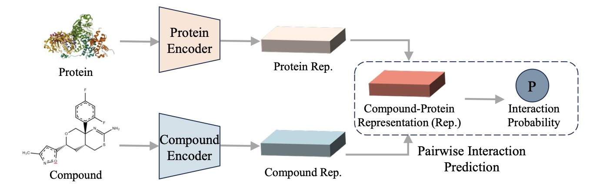
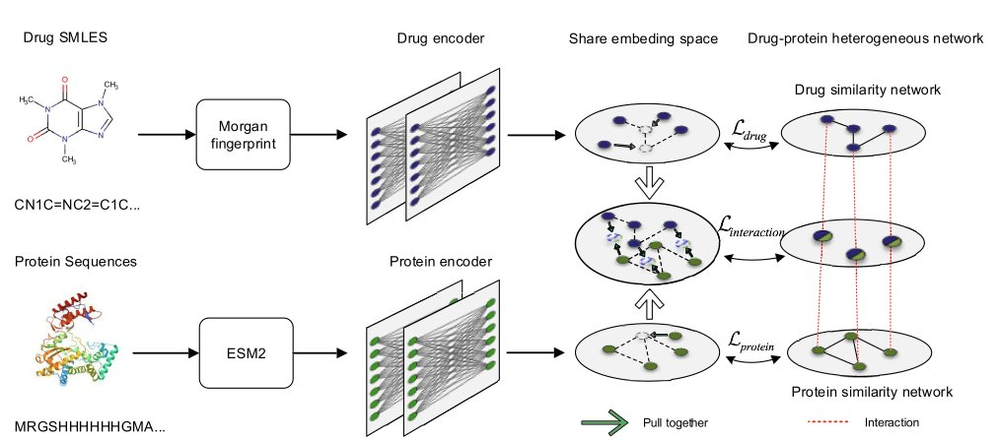
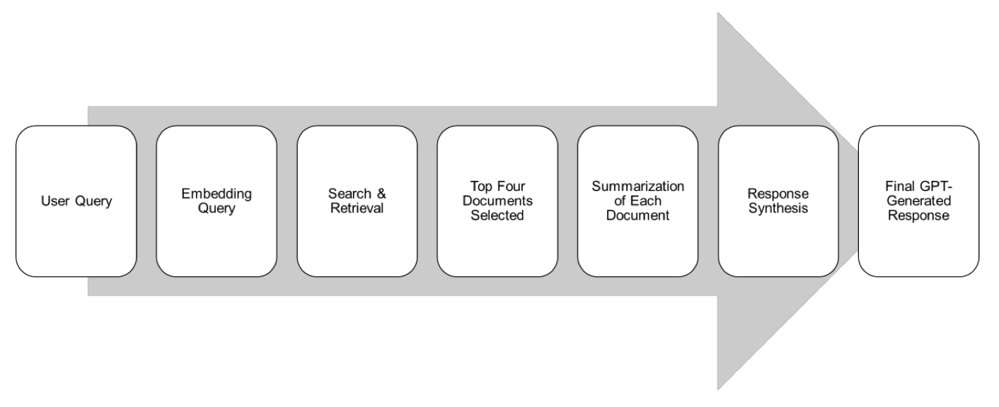

## 目录  
1. 通过强迫模型玩“蛋白序列拼图”游戏，研究者开发出一种高效的预训练方法，在全新药物和全新靶点的“双盲”预测中，展现了令人瞩目的潜力。
2. 这个 AI 模型最聪明的不是预测，而是它在学习时，被强迫尊重化学和生物学的“常识”，最终在浩如烟海的“无效”数据中，精准地找到了那些罕见的“有效”信号。
3. 通用大模型在专业领域就是个花架子，想让 AI 在药学上真正派上用场，还得靠 RAG 架构和高质量的专业数据库来“填喂”。

## 1. 蛋白序列拼图：AI 预测药物靶点新思路  
  
  

我们每天都在跟海量的可能性打交道。一边是数不清的化合物，另一边是望不到头的潜在蛋白靶点。如何大海捞针，找出那个对的“它”？这些年，AI 给了我们不少希望，但也带来了很多“黑箱”模型。大家都在卷数据量、卷模型大小，但今天这篇论文提供了一个不一样的思路。  
  
研究者们提出的这个 PSRP-CPI 模型，核心不在于用多大的数据去“喂”，而在于怎么“教”。他们设计了一种巧妙的预训练游戏：**子序列重排**。  
  
你可以把这想象成教一个机器理解蛋白质的“语法”。不是简单地让它逐字（氨基酸）阅读，而是把一条完整的蛋白质序列（一个句子）切成好几段，打乱顺序，然后让模型把它们拼回原来的样子。这事儿听起来简单，但要做到，模型就必须得理解哪些片段在三维空间中可能是邻近的，哪些片段之间有功能上的协同作用，哪怕它们在序列上隔着十万八千里。这不就是做药的人天天琢磨的变构位点和远程调控吗？通过这种方式，模型被迫学习蛋白质内部的长程依赖关系，而不是仅仅记住“A 后面大概率是 B”这种局部信息。  
  
威力在哪儿体现？在最严苛的测试场景里——**零样本学习**。  
  
特别是“Unseen-Both”，也就是化合物和蛋白质都是模型在训练中没见过的“陌生面孔”。这恰好模拟了我们探索全新靶点或全新化学骨架时的真实困境。大部分模型在这种情况下基本就是瞎猜，但 PSRP-CPI 的表现却异常出色，AUROC 和 AUPRC 这两个关键指标都甩开了对手。  
  
论文数据显示，它用比 ESM-2、ProtBert 这些大模型小得多的数据集进行训练，就能在下游的 CPI 预测任务上取得更好的结果。在这个算力就是金钱的时代，这意味着什么不言而喻。它告诉我们，聪明的学习策略，有时比单纯的算力堆砌更重要。  
  
当然，一个 *in silico* 的预测离真正的药物还有十万八千里。算法给出的高分“情侣”，到了湿实验里可能“八字不合”。但作为一种高通量筛选前的过滤工具，这种“序列拼图”的思路无疑是高效且聪明的。它至少表明，模型可能真的学到了一些关于蛋白质折叠和功能的底层逻辑，而不只是在做高级的模式匹配。接下来，就看它预测的那些“新组合”在试管里表现如何了。如果真能帮我们找到几个被传统方法忽略的苗头化合物，那它的价值就非同小可了。  
  
📜Title: Zero-Shot Learning with Subsequence Reordering Pretraining for Compound-Protein Interaction  
📜Paper: https://arxiv.org/abs/2507.20925  

## 2. AI 预测药物靶点，靠的是维护分子社交网络  
  
  

大多数模型就像是那种只会考选择题的学生，当 99.9% 的答案都是“C”（不结合）时，它就学会了无脑选 C，然后宣称自己准确率高达 99.9%。这在真实世界的药物发现中，屁用没有。因为我们关心的，恰恰是那 0.1% 的“非 C”答案。我们是在大海捞针，而这些模型只会告诉你“这里没有针”。  
  
好了，这篇论文里的这个叫 GLDPI 的模型，终于做了一件不一样的事情。它没有把重点放在提高那个虚假的“准确率”上，而是直接去攻击那个最根本的问题：数据不平衡。  
  
在学习的时候，必须维护原始分子之间的“拓扑关系”。这是什么意思？很简单，就是“近朱者赤，近墨者黑”或者说“物以类聚，人以群分”。如果两个药物分子在化学结构上是双胞胎，那么它们在 AI 的“大脑”（也就是嵌入空间）里，也必须是紧挨着的邻居。同理，如果两个蛋白质都属于激酶家族，那么它们在 AI 的地图上也应该被分在同一个街区。  
  
GLDPI 用了一个巧妙的“先验损失函数”来强制执行这条规则。你可以把它想象成一个严厉的图书管理员。当 AI 试图把一本关于“量子物理”的书（一个药物分子）放到“儿童绘本”的书架上（一个完全不相关的蛋白家族）时，这个管理员就会走过来，逼它把书放回正确的位置。通过这种方式，AI 不仅仅是在死记硬背“这个药结合这个蛋白”的孤立事实，而是在学习整个化学和生物空间的内在结构和逻辑。它在绘制一张有意义的、尊重物理现实的地图。  
  
结果如何？当你在一个“十万个分子里只有一个能结合”的真实场景里测试它时，它的表现（用 AUPR 这个更诚实的指标来衡量）把其他所有方法都甩开了几条街，性能提升超过 100%。这不是小修小补，这说明它的学习方式从根本上就是对的。  
  
更疯狂的是它的速度。它能在不到 10 小时内，预测大约 120 亿对药物 - 蛋白质的相互作用。这个数字意味着什么？这意味着你可以把一个像 Enamine REAL 那样包含了上百亿个分子的虚拟化合物库，拿去和你关心的整个蛋白质组做交叉筛选。这在以前是只有大型制药公司的超算集群才能考虑的事情，现在，它变成了一个可以在一个周末完成的任务。  
  
当然，我们得保持冷静。这个模型预测的，只是一个“可能”的相互作用。它不能告诉你这个分子是激动剂还是抑制剂，也无法告诉你结合口袋的具体细节。把一个 AI 预测的结果直接拿去做临床试验，那纯粹是疯了。但是，作为一个能以前所未有的规模和准确性，从无尽的化学可能性中筛选出第一批值得关注的“候选人”的工具，它无疑是突破性的。它不会取代药物化学家，但它会给我们一个好得多的起点，让我们能把宝贵的时间和资源，集中在那些最有希望的针上，而不是在整个草堆里乱翻。  
  
📜Title: Accurate prediction of drug-protein interactions by maintaining the original topological relationships among embeddings  
📜Paper: https://bmcbiol.biomedcentral.com/articles/10.1186/s12915-025-02338-0  

## 3. AI 药学落地，还得靠 RAG 喂养专家数据  
  
  

大家都在夸耀通用大模型的多功能性，似乎明天就能让人工智能开具处方。然而，当面临临床这样关乎生命的情境时，您真的敢让一个什么都略懂但无一精通的“万事通”来做出决策吗？这篇新论文为我们提供了重要的警示，并指明了一条清晰的方向。  
  
药物基因组学（PGx）的领域极其复杂，涉及遗传学、药理学与临床实践，相关的指南（如 CPIC）繁多且密集，稍有不慎便可能导致错误。让一个在互联网信息海洋中成长的通用 LLM 来处理这些问题，简直如同让一位博览群书的历史教授去修理您的汽车发动机。他可能能够与您讨论内燃机的发明历史，但绝对无法理解您的车辆为何会发出嘎嘎声。结果就是模型一本正经地发表不实言论，这也正是我们所称的“幻觉”。  
  
这篇研究的作者们非常清醒，他们没有打算从头开始构建一个“药学之神”的模型，而是采用了一种更为明智的方法：**检索增强生成（RAG）**。  
  
RAG 说白了就是给大模型配了个开卷考试的工具。你问它问题，它不是靠自己那包罗万象但良莠不齐的记忆库瞎猜，而是先去指定的、最权威的教科书（这里就是 CPIC 和 PharmGKB 这两个金标准数据库）里翻找最相关的章节，然后把找到的内容整理、总结再告诉你。这样一来，答案就有了明确的、可溯源的依据，胡说八道的概率自然就大大降低了。  
  
研究者们用这个方法打造了一个名为 Sherpa Rx 的 AI 助手，然后设计了 260 个贴近真实的药物基因组学问题，来了场“是骡子是马拉出来遛遛”的对决。结果怎么样？  
  
结果是，在准确性（4.9/5）和完整性（4.8/5）上，被专业知识库“喂饱”的 Sherpa Rx 把大名鼎鼎的通用模型 ChatGPT-4o mini 打得落花流水。  
  
这不仅仅是数字上的胜利，它证明了一个我们业内人士早就心知肚明的道理：在严肃的科学和医疗领域，**数据的“质”远比“量”重要**。你用整个互联网的嘈杂信息去训练模型，还不如用一小部分、但经过严格验证的黄金标准数据去做检索增强来得实在。  
  
当然，这也不是说我们明天就能在诊所里用上它儿了。研究的样本量不大，而且那 260 个测试问题也是研究者自己设计的，可能存在偏见。真正的考验，是把它扔到混乱、嘈杂的真实临床环境里，看看它能不能扛得住医生们提出的各种奇奇怪怪的问题，并且持续稳定地输出靠谱建议。  

📜Title: Validating Pharmacogenomics Generative Artificial Intelligence Query Prompts Using Retrieval-Augmented Generation (RAG)  
📜Paper: <https://arxiv.org/abs/2507.21453>
