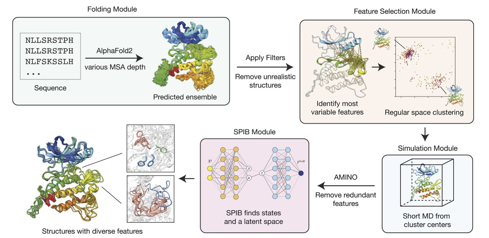
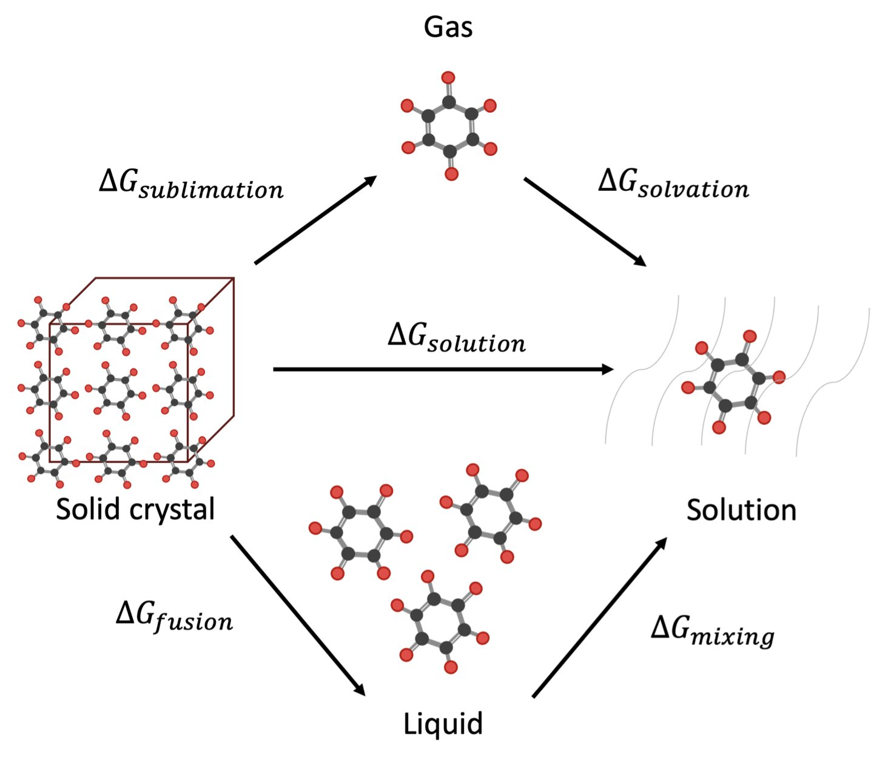
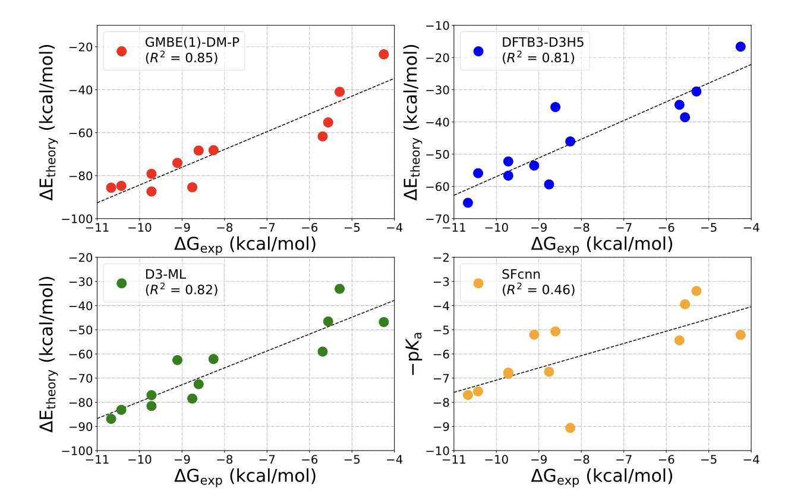

## 目录  
1. 这个开源工具巧妙地让 AlphaFold2 故意“犯错”来生成多个起点，再用物理模拟去探索，极大地加速了我们捕捉蛋白质动态“快照”的效率。
2. 通过将溶解度这个大难题拆解为更基本的物理过程，并用机器学习逐个击破，这个新方法为我们提供了一张迄今为止最清晰的溶解度预测路线图。
3. 这个新方法将量子化学大卸八块，再用机器学习修正关键的物理作用力，最终在 5 分钟内实现了极其准确的结合力排序，这是计算药物筛选的一大步。

## 1. AI 给分子模拟装上“传送门”，告别龟速  
  
  

在结构生物学的世界里，AlphaFold 给了我们蛋白质的静态“照片”，清晰、漂亮，像一本制作精美的产品目录。但这还不够。蛋白质在细胞里，可不是一动不动的雕塑。它们在扭动、在呼吸、在变形。一个药物分子，常常是结合在某个转瞬即逝的、在静态照片里根本看不到的“激活”或“失活”构象上。  
  
想看蛋白质“动”起来，我们就得求助于分子动力学（MD）模拟。  
  
MD 就像是一台能拍摄分子世界“电影”的超级计算机。问题是，这部电影的播放速度，慢得能让你怀疑人生。跑一个几百纳秒的模拟，可能就要耗掉一个计算集群好几周的时间。而且你常常会发现，你的蛋白质主角，在整个模拟过程中，就一直在某个能量最低的“舒适区”里打瞌睡，根本没挪过窝。而那个我们最想看的、能结合药物的“隐藏口袋”，可能就在隔壁那座需要巨大能量才能翻越的“山”后面。  
  
所以，我们一直被困在这个尴尬的境地：我们有能力拍电影，但我们拍不起，也等不起。  

这篇论文里的 `af2rave`，给电影摄制组配了一个极其聪明的场记和一堆传送门。  
  
它的逻辑是这样的：我们知道 AlphaFold2 预测结构很准，但那是我们给它提供了海量的“多重序列比对”（MSA）信息之后的结果。如果我们故意不给它那么多信息呢？如果我们只给它一小部分线索，让它去“猜”呢？这时候，AlphaFold2 就会变得有点不确定，它可能会给出好几个不同的、但看起来都还算合理的结构。  
  
这正是 `af2rave` 的精髓所在！它利用了 AI 的这种“不确定性”。它生成的这些不同的初始结构，就像是分布在蛋白质能量地貌图上不同“山谷”里的探险家。然后，`af2rave` 在每个山谷里，都开始一段相对较短的 MD 模拟。这就像是在地图上的好几个地方，同时开始探索。相比于只派一个探险家，让他从唯一的入口出发，花上一年时间去翻山越岭，这种“多点出发”的策略，显然能以快得多的速度，绘制出整个地图的全貌。  
  
他们在一个叫 DDR1 激酶的靶点上试了一下，这是一个我们知道有不同功能状态的蛋白。结果 `af2rave` 没费多大劲，就把那些已知的状态都给找到了。在新冠病毒的刺突蛋白上，它的采样效率也和那些需要耗费巨大计算资源的超长时程模拟不相上下。  
  
这个工具开源了，一些复杂的参数选择也自动化了。现在一个药物化学家或者生物学家，不再需要成为计算物理学博士，也能用上这个强大的工具，去看看他感兴趣的那个蛋白，除了我们天天在 PDB 数据库里看到的那个“标准照”之外，还有没有别的“生活照”。  
  
我们能靠它找到所有可能的蛋白构象吗？  
  
当然不能。它找到的起点，仍然受限于 AlphaFold2 的能力。如果某个极其罕见的构象，AI 连想都想不到，那它自然也模拟不出来。但我们正在从盲目地、长时间地等待，转向有策略地、高效地探索。  
  
💻Code:https://github.com/tiwarylab/af2rave  
📜Paper: https://pubs.rsc.org/en/content/articlelanding/2025/dd/d5dd00201j  

## 2. AI 预测溶解度：不再是玄学，而是物理学  
  
  

预测一个新分子在水或其他溶剂中的溶解度，其难度几乎与预测下周二的彩票中奖号码相当。尽管我们拥有多种计算模型，但大多数模型要么是粗略的经验法则，要么是难以理解的黑箱，您将分子输入其中，模型便输出一个数值，其准确性完全依赖于运气。  
  
作者们并未试图通过一个庞大且综合的人工智能模型直接解决“溶解度”这一方程。相反，他们的方法更类似于一位经验丰富的老技工，他不会直接用大锤，而是首先将机器拆解，以确定哪个部件出现了故障。  
  
他们把溶解度这个过程，还原成了它最本质的热力学斗争。一个分子要溶解，它必须做两个决定：第一，它得下定决心离开自己温暖舒适的晶体老家。这个“离家”的难度，就取决于它的熔点和熔融焓。一个熔点像钻石一样高的分子，说明它的晶体结构极其稳定，分子之间抱得特别紧，你想把它拆散，门儿都没有。第二，它得觉得外面的世界（也就是溶剂）足够吸引人。这种吸引力的大小，就是所谓的“活度系数”。  
  
这篇论文的漂亮之处就在于，它用机器学习模型，分别去预测这几个独立的物理量，然后再用一个经典的热力学循环公式，把它们组合起来，最终算出溶解度。这是一个无比聪明的“分而治之”策略。  
  
而这里面有一个叫做“参考系综”的技巧。简直是神来之笔。它的逻辑是这样的：假如我已经知道我的分子在“水”这个溶剂里的溶解度了，现在我想预测它在“乙醇”里的溶解度。传统的做法是完全重新算一遍。而这个新方法会说：“等等，我们已经有了一些关于这个分子的宝贵实验信息，别浪费了！”它会把在水里的那个已知数据作为一个强大的“锚点”，然后在这个基础上，去校准和预测在乙醇里的表现。这极大地提高了预测的鲁棒性和准确性，因为它利用了所有可用的信息。  
  
结果在一个包含了超过十万个实验数据点的巨大数据集上，这个方法的表现相当出色，尤其是在不同温度下的预测能力，这是很多老方法都做不好的地方。而且，它还能顺便预测油水分配系数（logP），而且是在没有专门用 logP 数据训练过的情况下。这强烈地暗示，这个模型可能不仅仅是在做曲线拟合，它可能真的学到了一些底层的、普适的物理化学规律。  
  
这个模型仍然依赖于高质量的训练数据，而熔点、熔融焓这些实验数据本身就可能不那么靠谱。它能处理我们日常工作中遇到的那些奇形怪状、带一堆电荷、柔性又特别大的“丑陋”分子吗？这还有待验证。  
  
📜Title: Accurately Predicting Solubility Curves via a Thermodynamic Cycle, Machine Learning, and Solvent Ensembles  
📜Paper: https://doi.org/10.26434/chemrxiv-2025-jd8zw  

## 3. AI 算药快准狠：5 分钟内搞定结合力排序  
  
  

如何从成千上万个候选分子中筛选出能够与我们靶点蛋白结合的唯一真命天子？为了避免无效的努力，我们借助计算化学的力量，希望电脑能够提前告知我们哪些分子更具潜力。然而，我们手头的工具，要么是迅速如闪电但几乎依赖于猜测的分子对接，要么是准确得令人震惊但缓慢到让人等到退休的自由能微扰（FEP）。我们一直渴望拥有一个既快速又准确的工具。  
  
Lao 和 Wang 的论文把一个复杂的问题拆分为两个部分。  
  
首先，他们用了一种叫做“密度矩阵碎片化”（GMBE-DM）的方法。这个名字听起来吓人，但它的核心思想非常简单粗暴，就是“把大象放进冰箱分几步？”。面对一个包含几千个原子的蛋白质 - 配体复合物，直接用高精度的量子化学去算，计算量能让超级计算机都哭出来。所以，他们就把这个大体系“大卸八块”，分解成无数个小的、可计算的片段，然后用一种聪明的方式把这些碎片化的计算结果再拼起来。这是一种典型的“分而治之”策略。  
  
但这还不是全部。仅仅把问题分解，还不足以保证准确性。药物分子和蛋白质之间的相互作用力，有一种极其重要但又特别难算的成分，叫做“范德华力”或者“色散力”。你可以把它想象成两个不带电的毛球靠在一起时，彼此之间产生的那种微弱的、模糊的吸引力。它无处不在，却又极难精确描述。很多计算方法的失败，都栽在了这个上面。  
  
而这篇论文的点睛之笔，就是他们用一个专门的、基于物理的机器学习模型（D3-ML），来给这个色散力的计算“打补丁”。这个 AI 模型看过海量数据，知道传统的计算方法在什么时候、什么地方会算错，然后它就精准地把这个错误给修正过来。这就像一个经验丰富的老技工，听一下引擎的声音，就知道是哪个螺丝松了，然后上去拧紧。  
  
结果怎么样？结果好得有点出人意料。在几个经典的激酶靶点上，这套组合拳下来，对一系列配体的结合力排序，和真实的实验数据达到了 0.87 的相关性（R²）。在我们的领域里，这是一个能让所有人从椅子上站起来的数字。而且，完成一个复合物的计算，只需要不到 5 分钟。这意味着，我们终于有了一个可以真正在项目中大规模使用的、而不是仅仅停留在学术论文里的中高精度工具。  
  
更有趣的是，他们发现，如果在计算时故意忽略掉那些晶体结构里烦人的水分子，甚至不去计算配体的去溶剂化能，排序的准确性反而**更高**了！这简直是在打做计算化学的脸。我们花了那么多年，小心翼翼地建模每一个水分子，试图搞清楚它们的作用，结果到头来，最好的策略居然是“眼不见为净”？这再次提醒我们，有时候，一个更简单的、抓住了问题主要矛盾的模型，要比一个试图面面俱到但却引入更多噪音的复杂模型要好得多。  
  
当然，我们得冷静。这个方法是在几个相当“乖巧”的体系上验证的。它能否处理那些柔性极高、构象变化剧烈的靶点？我们还不知道。但它指明了一条无比清晰的道路：将基于第一性原理的物理模型，和由数据驱动的机器学习巧妙地结合起来，才是计算辅助药物发现的未来。我们可能离真正的“设计”药物还很远，但至少，我们现在有了一个更好的筛子，来更快地淘出那些闪光的金子。  
  
📜Title: Accurate and Rapid Ranking of Protein–Ligand Binding Affinities Using Density Matrix Fragmentation and Physics-Informed Machine Learning Dispersion Potentials  
📜Paper: https://chemistry-europe.onlinelibrary.wiley.com/doi/10.1002/cphc.202500094
