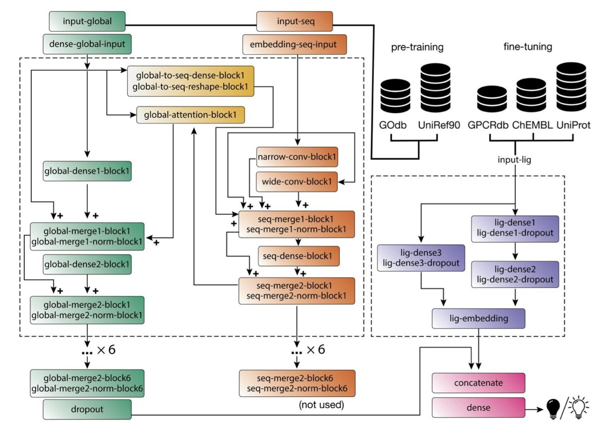
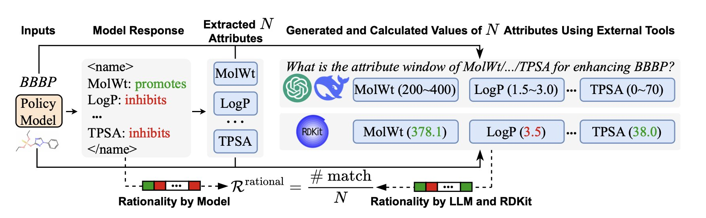
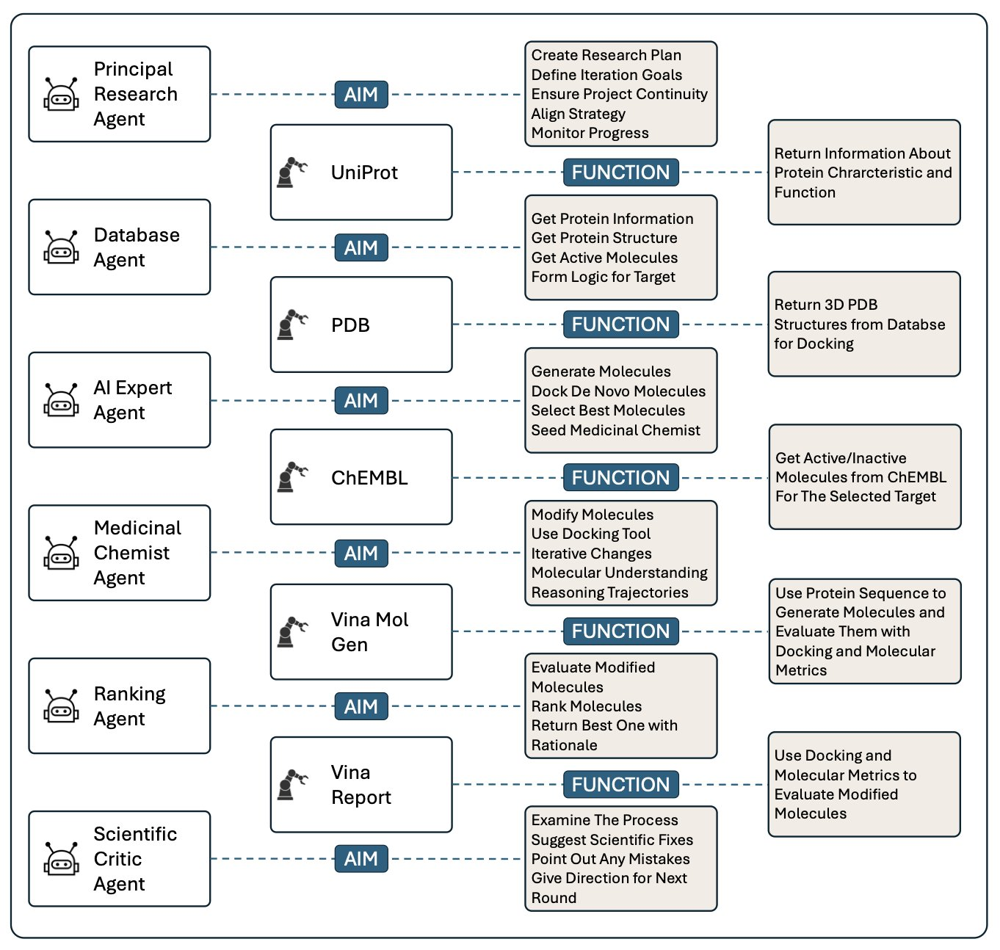

## 目录  
1. BOLD-GPCRs 最厉害的地方在于，它不只预测小分子活性，还能告诉你蛋白上的突变会如何改变功能，这对于攻克 GPCR 靶点价值连城。
2. AttriLens-Mol 用强化学习给 AI 戴上了“化学家眼镜”，迫使其在预测前先识别关键分子特征，让结果不仅准，还可解释。
3. AI 药物设计“梦之队”在猛攻单一目标时表现惊人，但会牺牲成药性，暴露出专家团队和全能通才之间的矛盾。

## 1. AI 解锁 GPCR：预测突变，指引药物开发  

  

GPCRs，A 类 GPCRs。对于药物研发人员而言，这几个字母代表着超过一半的上市药物，同时也意味着无尽的困扰。这些蛋白质宛如一缕柔软的意大利面，嵌入细胞膜中，构象变化丰富，还喜欢进行“偏向性激动”等复杂操作，使得针对它们的研究变得更加困难。  

现在市面上的 AI 预测模型，大多是让你输入一个分子，它吐出一个活性值。这当然有用，但对于 GPCR 来说远远不够。因为 GPCR 的功能和药物响应，与它自身的序列，特别是单个氨基酸的突变，密切相关。很多疾病就是因为 GPCR 上的一个点突变引起的。  

BOLD-GPCRs 的聪明之处就在于，它把蛋白质和配体这两个变量都放进了模型的核心。  

它用的方法：  

1.  **读懂蛋白质**：它用了一个叫 ProteinBERT 的 Transformer 模型来处理 GPCR 的序列。这和那些只把氨基酸当成独立字母的模型不一样。Transformer 能理解上下文，它知道一个残基在序列中的位置和周围的“邻居”会如何影响它的功能。它是在“阅读”蛋白质的语言。  
2.  **理解小分子**：对于配体，它没有走什么花里胡哨的路线，而是用了很经典的物理化学性质嵌入。这就像给分子画了一张精准的“化学身份证”，描述了它的大小、形状、电荷分布等。  

然后，它把这两部分信息融合在一起进行训练。这就好比让一个顶尖的结构生物学家（懂蛋白）和一个经验丰富的药物化学家（懂小分子）坐下来一起开会，而不是各说各话。  

这种设计带来了两个好处。  

首先，它能预测特定突变对药物活性的影响。这对我们来说意味着什么？我们可以直接在电脑上问：“如果病人的这个 GPCR 有了这个突变，我手头的这个候选药物还有用吗？活性会变强还是变弱？”这在开发针对特定基因型患者的精准药物时，简直是神器。  

其次，就是它的可解释性。通过模型的“注意力机制”，我们可以看到在做预测时，AI 到底在“看”蛋白质的哪些部分。如果它在预测一个激动剂活性时，注意力高度集中在已知的关键激活残基上，那我们对这个预测结果的信心就会大增。这对于药物化学家来说，就等于拿到了一张靶点结合口袋的“热力图”，指导我们下一步该如何修饰分子结构。  

当然，这终究是个计算模型，所有的预测最终都要回到湿实验室里去验证。而且，这个模型目前还没有整合三维结构信息，这无疑是未来可以提升的重要方向。  

📜Title: BOLD-GPCRs: A Transformer-Powered App for Predicting Ligand Bioactivity and Mutational Effects Across Class A GPCRs  
📜Paper: https://www.biorxiv.org/content/10.1101/2025.08.04.668547v1  

## 2. 让 AI 不再瞎猜：教它像化学家一样思考  

  

跟 AI 模型打交道，最头疼的是什么？是它们的“黑箱”属性。一个模型告诉你这个分子的溶解度是 -3.5，另一个说是 -4.2。谁对？为什么？天知道。它们就像个会算命但从不解释卦象的算命先生，你用着心里总发毛。  

这篇 AttriLens-Mol 的论文，就是冲着解决这个核心痛点来的：在让 AI 预测结果之前，先逼它“讲理由”。  

这个框架的精髓在于“属性引导强化学习”。就是你不能直接给我一个数字，你得先告诉我，你是基于分子上的哪些官能团、哪些结构片段，才得出这个结论的。比如，在预测一个分子的水溶性时，AI 必须先学会识别出分子里有几个羟基、几个羧基，或者有没有一大块油腻腻的芳香环。  

这听起来很棒，但怎么实现呢？  

靠的是强化学习里的奖励机制： 

1.  **格式和字数奖励**：这是基础。要求 AI 的回答得有条理，不能啰里啰嗦，直奔主题。  
2.  **理性奖励 (Rationality Reward)**：神来之笔。AI 提出一个它认为相关的分子特征后，系统会立刻“请外援”来做交叉验证。这个外援可能是 RDKit 这样的老牌化学信息学工具，也可能是 GPT-4o 这种更强大的“老师”模型。如果 AI 说的特征符合化学常识，就给奖励；如果它开始胡扯，比如把一个烷烃说成是亲水的，那就得挨罚。  

好比训练一个新手化学家。你不仅要看他实验做得对不对，还要听他解释为什么要这么做。如果他能说出个一二三，而且逻辑自洽，那他才是真的学会了。  

效果出人意料地好。一个只有 70 亿参数的“小”模型（比如 Qwen2.5 或 LLaMA3.1），经过 AttriLens-Mol 这么一调教，在分子属性预测任务上的表现，居然能跟 GPT-4o 和 DeepSeek-R1 这些庞然大物打个平手，甚至在某些数据集上反超。这对于没有无限计算资源预算的实验室来说，简直是天大的好消息。  

更重要的是，我们得到了梦寐以求的“可解释性”。因为 AI 输出的不仅仅是一个预测值，还附带了一份“推理报告”。我们可以清楚地看到，AI 是因为注意到了分子中的某个特定片段，才做出了相应的判断。研究者们甚至把这些 AI 提取出的特征，喂给一个简单的决策树模型，发现效果比传统方法生成的特征要好得多。  

📜Title: AttriLens-Mol: Attribute Guided Reinforcement Learning for Molecular Property Prediction with Large Language Models  
📜Paper: https://arxiv.org/abs/2508.04748v1  

## 3. AI 组团药物开发：人多力量大还是添乱？  

  

这篇论文探讨一个问题：怎么组织和管理这些 AI，让它们像一个高效的研发团队一样工作？  

研究者们搭建了一个相当豪华的“AI 委员会”。这里面有：  
*   **首席研究员 (Principal Researcher)**：项目经理，负责统筹全局。  
*   **数据库专员 (Database Agent)**：负责从文献库里挖信息。  
*   **AI 专家 (AI Expert)**：玩转各种生成模型，负责出点子。  
*   **药物化学家 (Medicinal Chemist)**：像我们一样，盯着分子结构，评估可行性。  
*   **排序专员 (Ranking Agent)**：负责给候选分子打分排队。  
*   **科学评论员 (Scientific Critic)**：一个永远在抬杠的角色，负责挑刺和质疑。  

这不就是我们每天开项目会时的场景吗？只不过这次，参会的都不是人。  

他们拿这套系统去死磕 AKT1 这个老靶点。结果呢？这个“AI 梦之队”确实给力，跟单个 AI 单打独斗相比，它把预测的结合亲和力硬生生提高了 31%。这说明，把一个复杂任务拆解开，让不同的“专家”Agent 去处理，确实能把一件事做到极致。  

但反转来了，这也是这篇工作最有趣的地方。当研究者们审视这些被优化出来的分子时，他们发现，“梦之队”的作品虽然结合力强，但在整体成药性上，反而不如那个“孤胆英雄”式的单 Agent 生成的分子。  

这简直是药物研发日常的复刻。一个团队里，做构效关系的化学家拼命把活性往上推，结果做 ADMET 的同事跳起来说：“你这分子溶解度差得像块砖头，根本没法成药！”这个 AI 系统恰恰暴露了这种“局部最优不等于全局最优”的困境。  

多 Agent 团队就像一群专家，每个人都想在自己的领域做到 100 分，结果合成了一个“科学怪人”。而那个单 Agent，就像一个经验丰富的老化学家，脑子里时刻有一杆秤，在活性、溶解度、代谢稳定性之间不断权衡。  

这个系统最大的价值可能不是那 31% 的提升，而是它那个“可审计性” (Auditable) 的设计。系统会把所有 Agent 之间的“对话”和决策过程全部记录下来。这简直太重要了！我们终于不用再对着一个 AI“黑箱”许愿了。我们可以像看项目会议纪要一样，回溯整个设计过程：AI 专家提出了哪个疯狂的想法？药物化学家 Agent 是基于哪条规则否决了它？这个功能让 AI 从一个猜谜游戏，变成了一个可以理解、可以信任、可以验证的科学工具。  

这套系统还需要进化。下一步是给它装上更多的“武器”，比如 ADMET 和选择性预测工具。  

📜Title: An Auditable Agent Platform for Automated Molecular Optimisation  
📜Paper: https://arxiv.org/abs/2508.03444
