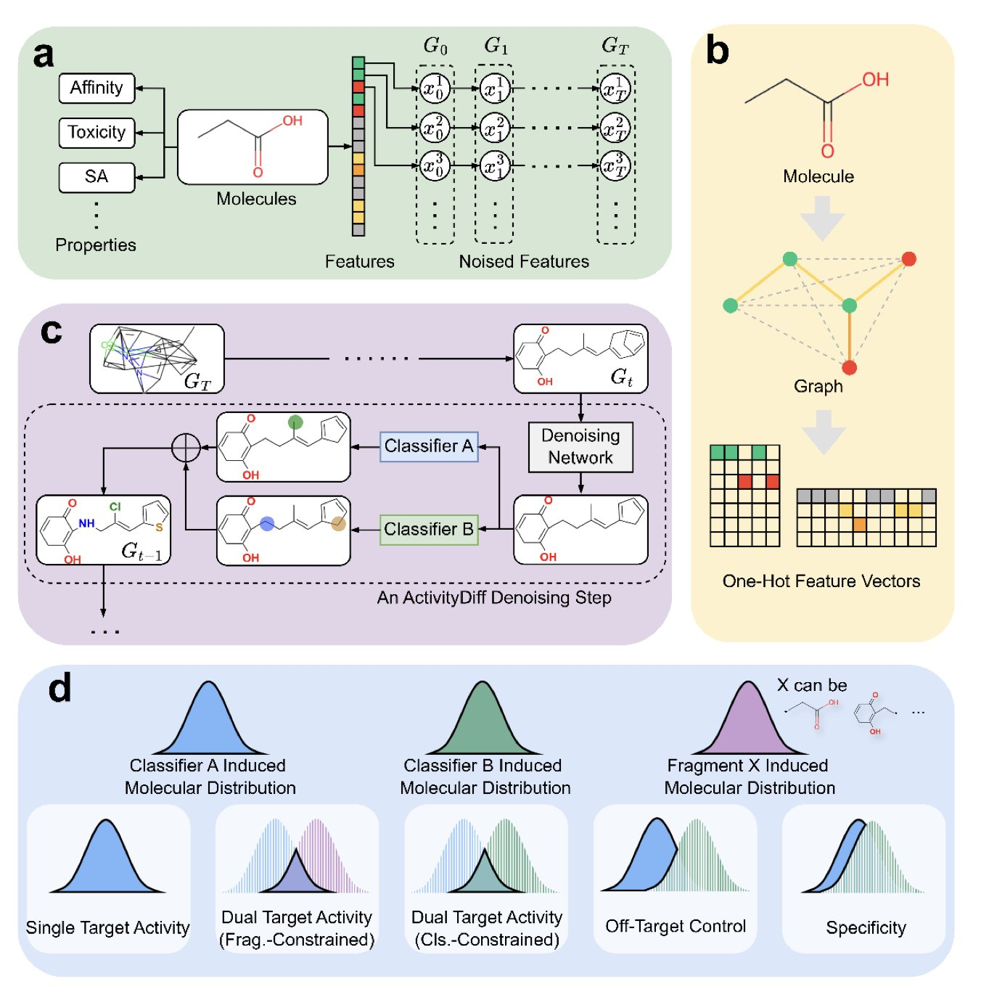
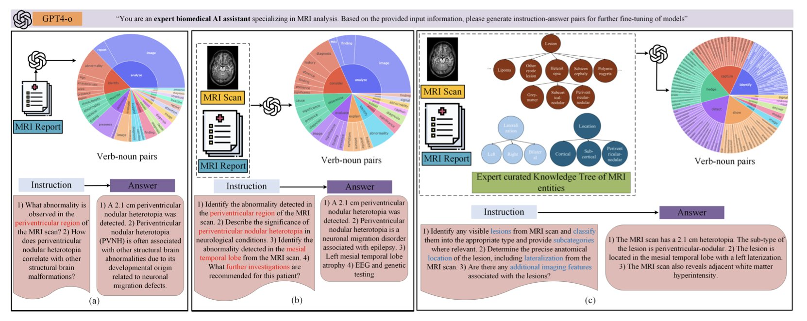
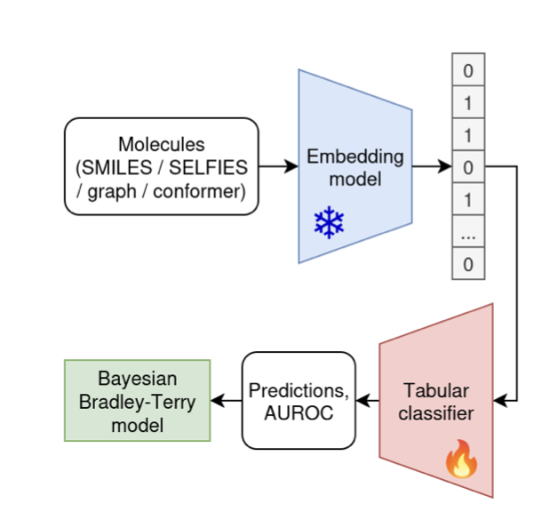

## 目录  
1. 这个 AI 模型通过「正向引导」和「负向引导」，像调酒师一样，一边加入想要的成分，一边减少不好的杂味，来设计更精准、更安全的药物分子。
2. 通过学习 MRI 影像中哪些「患者特征」对抗癫痫药物有反应，这个 AI 模型甚至能预测那些它从未见过的「新药」的治疗效果。
3. 尽管 AI 炒作不断，这项大规模基准测试表明，简单的老式化学指纹法在分子表征上，仍然优于几乎所有新的深度学习模型。

## 1. ActivityDiff：AI 像调酒师一样，精准调控药物活性  

  

我们想让一个分子对我们感兴趣的靶点（比如某个致病蛋白）有很强的活性，y 也就是「药效」；同时，我们又希望它别去招惹那些我们不想碰的靶点，因为那通常意味着「副作用」或「毒性」。  

过去，我们做这件事有点像「打地鼠」。你优化一个分子，增强了对 A 靶点的活性，结果它对 B 靶点的活性也意外地增强了，带来了不想要的副作用。然后你又去修饰分子，试图降低对 B 的活性，结果可能又影响了对 A 的活性。这个过程非常繁琐，而且充满了妥协。  

现在，扩散模型（diffusion model），给这件事带来了新思路。我们可以把扩散模型想象成一个技艺高超的雕塑家。你先给他一堆随机的「黏土」（一堆随机的原子），然后告诉他：「我想要一个看起来像大卫的雕像」。他就会一步一步地，把这堆随机的黏土塑造成你想要的样子。  

ActivityDiff 就是在这个「雕塑」过程中，给了雕塑家更精细的指令。它不只是说「我想要个大卫」，它还说「我想要个大卫，但他绝对不能看起来像个掷铁饼者」。  

它是怎么做到的呢？通过所谓的 **「正向引导」** 和 **「负向引导」** 。  

这背后其实是几个独立的、小型的 AI 模型（药物 - 靶点分类器）在协同工作。你可以把它们想象成几个专业的「艺术评论家」。  

这样一来，整个分子生成过程，就像是在一个多维空间里寻找一个最优点。正向引导把它往「高药效」的山峰上拉，负向引导把它从「高毒性」的悬崖边推开。  

这个方法最妙的地方在于它的**模块化**。那个负责雕刻的「雕塑家」（扩散模型本身）可以保持不变。如果你今天想设计一个同时激活 A 和 C 靶点，但避开 D 靶点的分子，你不需要重新训练那个庞大的雕塑家。你只需要训练几个新的、小巧的「艺术评论家」（针对 A、C、D 靶点的分类器），然后把它们组合起来，去指导同一个雕塑家工作就行了。这大大降低了计算成本和时间。  

作者们用实验证明了这套方法的有效性。他们不仅成功生成了高活性的单靶点和双靶点分子，还完成了一些更复杂的任务，比如在一个已有的分子片段上「长出」新的结构，同时保证新长出来的部分满足特定的活性要求。这就像是告诉你：「我这里有个雕塑的底座，你帮我在上面雕个大卫的头出来，但要保证他看起来不会去掷铁饼」。  

当然，分类器的准确性直接决定了引导的质量。如果你的「艺术评论家」自己眼神不好，那他也给不出什么好建议。还有，化学空间的广阔性意味着，AI 生成的全新分子，其真实活性最终还是要靠湿实验（wet lab）来验证。  

📜Title: ActivityDiff: A diffusion model with Positive and Negative Activity Guidance for De Novo Drug Design  
📜Paper: https://arxiv.org/abs/2508.06364  

## 2. AI 读脑 CT，帮你预测哪种癫痫药最有效  

  

在神经内科癫痫治疗领域，有一个让医生和患者都头疼不已的现实：选择抗癫痫药物（ASMs）很大程度上是一场「试错」之旅。  

我们有几十种药物，但没有一个可靠的方法能在用药前，就知道哪一种对特定患者最有效。于是，治疗过程就变成了：试一种药，观察几个月，没效果或者副作用太大，再换下一种。这个过程对患者来说，是身体和心理上的双重折磨。  

所以，任何能减少这种「试错」成本的方法，都值得我们认真看一看。这篇预印本论文就提出了一个很有意思的尝试：他们想用 AI，只通过患者的 MRI 脑部扫描和放射科医生的报告，来预测不同 ASMs 的治疗效果。  

想法本身不新，但他们的做法有几个巧妙之处。  

首先，他们用的不是普通的 AI 模型，而是一个**生物医学领域的「视觉 - 语言」基础模型**。这意味着这个模型在训练之初，就已经「见过」大量的医学影像和相关的文本报告。它天生就对医学术语和影像特征有感觉，而不是像一个通用模型那样，需要从头学起什么是「海马体硬化」。它能同时处理像素（MRI 影像）和文字（报告），并试图将两者联系起来。  

其次，也是这个研究最核心的创新点，是一种叫做**TREE-TUNE**的框架。直接把 MRI 报告扔给 AI 进行微调，效果并不理想，因为报告里信息繁杂，AI 很容易「迷路」，抓住一些无关紧要的关联。TREE-TUNE 就像是给了 AI 一个**「专家导航」**。研究者先根据神经科学专家的知识，构建了一棵关于癫痫 MRI 表现的「知识树」。这棵树定义了各种病灶、解剖位置和影像学特征之间的层级和逻辑关系。  

然后，在微调模型时，他们用这棵知识树来「指导」AI。AI 在阅读报告时，会被引导着去识别和理解这些在知识树中定义好的关键实体。这就像是给了学生一本带有详细注释和重点标记的教科书，而不是让他自己去图书馆里瞎翻。结果显示，用了 TREE-TUNE 之后，预测的准确性确实比常规的微调方法有了显著提升。  

真正让人眼前一亮的，是他们关于**「泛化到未见药物」**的实验。这是这个领域里一个很大的难题。如果一个模型只能预测它训练时见过的药物，那它的临床价值就大打折扣，因为新药总是在不断出现。  

这个团队的做法是，只用四种最常见的 ASMs（比如左乙拉西坦、拉莫三嗪等）和患者的 MRI 数据来训练模型。然后，他们用另外三种模型在训练中从未见过的 ASMs 来进行测试。从逻辑上讲，这怎么可能做到呢？  

我的理解是，这个模型学习到的，可能不是「MRI 影像 A 对应药物 X 有效」这种简单的映射。它学习到的，可能是一个更深层次的模式，比如**「具有某种特定脑部结构或病理特征（由 MRI 和报告共同反映）的患者亚群，对某一类作用机制的药物反应更好」**。因为不同的 ASMs 虽然是不同的分子，但它们的作用机制可能是有重叠的（比如都作用于钠离子通道）。所以，模型通过学习已知药物，掌握了这种「患者特征 - 药物机制」的关联，然后把它推广到了具有相似机制的未知药物上。  

当然，对于训练时见过的四种药物，模型的平均 AUC 达到了 71.39%，对于那三种未见过的药物，平均 AUC 是 63.03%。说实话，AUC 63% 在临床预测模型里算不上惊艳，它只是比随机猜测（AUC 50%）好一些。  

我们离「AI 精准开药」还很远。但是，对于一个它从未见过的药物，能做出比瞎猜有统计学意义上更好的预测，这本身就是一件非常了不起的**概念验证（proof-of-concept）**。它证明了这条路是可能走得通的。  

这篇论文提供了一个框架。它告诉我们，通过将多模态数据（影像 + 文本）和结构化的专家知识（知识树）相结合，AI 或许真的能帮助我们，在这场漫长而痛苦的「试错」游戏中，为患者找到那把正确的「钥匙」。  

📜Title: Adapting Biomedical Foundation Models for Predicting Outcomes of Anti Seizure Medications  
📜Paper: https://www.medrxiv.org/content/10.1101/2025.08.07.25333198v1  

## 3. AI 分子模型：老派指纹法仍胜过深度学习  

  

在药物发现的世界里，我们一直想找到一个能和计算机有效沟通的「分子语言」。我们怎么向一个只会处理 0 和 1 的机器，描述一个三维的、充满电子云和微妙相互作用的分子，才能让它理解这个分子的「性格」，并预测它在人体内会干些什么？这是一个困扰了化学信息学几十年的核心问题。  

最近几年，随着深度学习的浪潮，答案似乎已经显而易见：用庞大的、在数百万甚至数十亿分子上预训练过的神经网络模型。这些模型，就像是饱读了整个化学文献库的「博士生」，理论上，它们应该能比任何老方法都更深刻地理解分子的「语法」和「语义」，从而生成一种更通用、更强大的分子表征（embedding）。  

听起来很美，对吧？问题是，这是真的吗？  

这篇来自 arXiv 的新论文，干了一件「脏活」：他们搞了一场大规模的「笼中对决」。他们找来了 25 个这样的「AI 博士生」（预训练模型），让它们在 25 个不同的「考场」（数据集）里，和一位「老派工匠」（传统的 ECFP 分子指纹法）同场竞技。  

ECFP 是什么？你可以把它想象成一种给分子拍「快照」的方法。它不关心分子的深层语法，只是简单粗暴地列出分子中存在的各种局部化学环境和原子片段。这就像描述一个人，不是通过写一篇传记，而是直接列出一串标签：「戴眼镜、有胡子、穿蓝色衬衫、身高 180cm」。这个方法简单、快速，而且已经存在很多年了。  

结果出来后，我想很多人可能会感到有些尴尬。  

当硝烟散去，那位「老派工匠」ECFP，几乎毫发无损地站在场中央，而周围躺了一地的「AI 博士生」。数据显示，在这 25 个不同的任务中，将近所有花哨的、复杂的神经网络模型，其表现相比简单的 ECFP，**「几乎没有或完全没有提升」**。  

这就像是你花大价钱请来了一位米其林三星大厨，让他给你做个炒鸡蛋，结果发现味道还不如街角早餐店里那个干了三十年的老师傅。  

当然，事情总有例外。在这场对决中，有一个名为**CLAMP**的模型，确实稳定地表现出了比 ECFP 更好的性能。也许通往更好分子表征的道路并没有被完全堵死。但它也反衬出，其他二十多个模型的表现是多么平庸。  

那么，这意味着什么？  

首先，这是一个 humbling result（令人谦卑的结果）。它提醒我们，在化学信息学这个复杂的领域，不要轻易被模型的复杂性或训练数据的大小所迷惑。一个模型「见过」的分子多，不代表它就真的「理解」了分子。  

其次，对于所有在一线做药物发现的计算化学家和数据科学家来说，这是一个非常实用的教训。在你尝试任何一个新的、听起来很酷的分子表征模型之前，**请务必，务必先跑一遍 ECFP 作为基准**。如果你的新模型连 ECFP 都打不过，那你很可能只是在浪费宝贵的计算资源和时间，去追求一种「看起来很先进」的幻觉。  

这篇论文并没有宣判深度学习在分子表征领域的死刑。它像一次精准的「体检」，指出了我们当前的不足。未来的突破，可能不在于构建更庞大、更通用的模型，而在于如何将更多的化学和生物学知识，更巧妙地融入到模型的设计中，就像 CLAMP 可能做到的那样。  

📜Title: Benchmarking Pretrained Molecular Embedding Models For Molecular Representation Learning  
📜Paper: https://arxiv.org/abs/2508.06199v1
