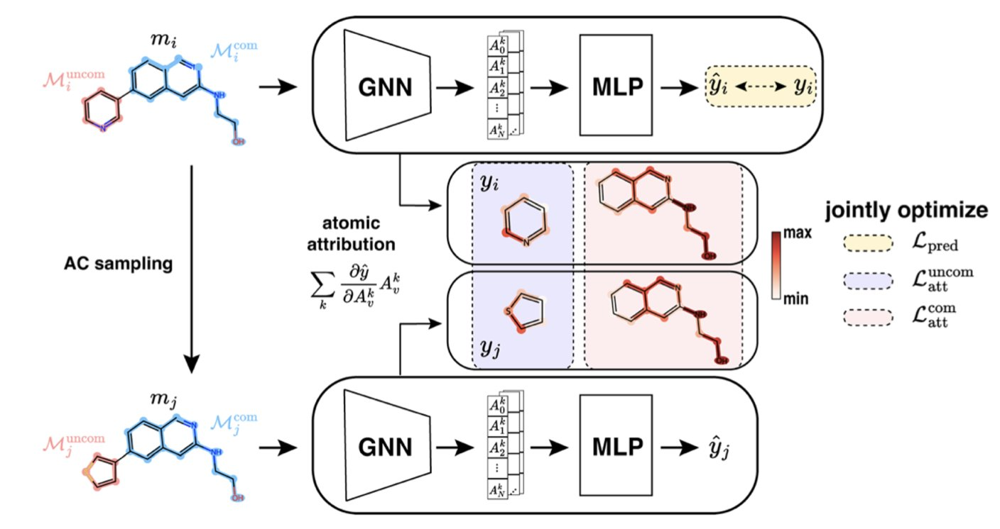
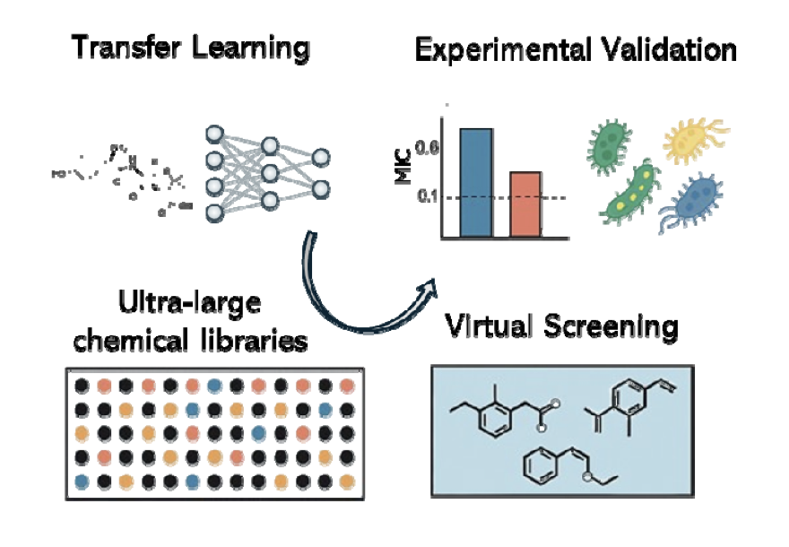
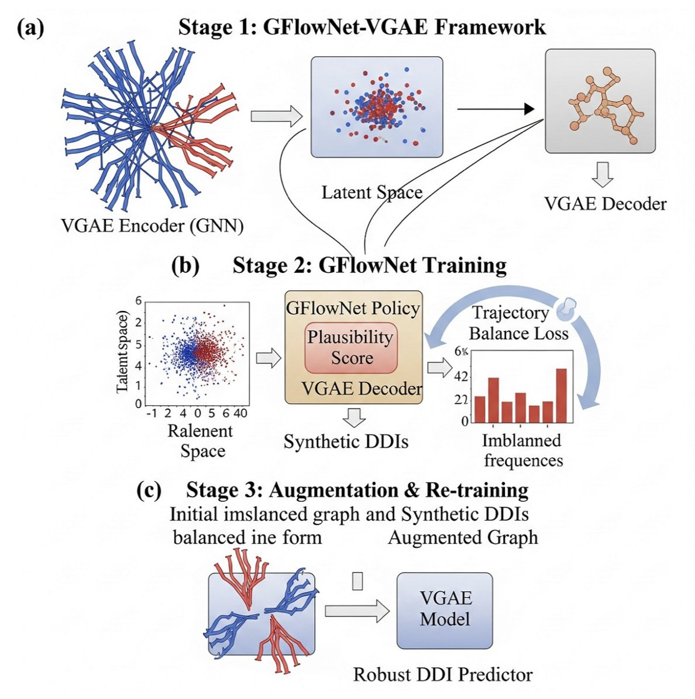

## 目录  
1. 这个 AI 不仅预测分子活性，它还被训练来解释我们最头疼的「活性悬崖」现象，这让它终于有点像个能沟通的同事了。
2. 通过先让 AI 学习「通用化学知识」，再在少量抗菌数据上「专科训练」，这个迁移学习框架成功地在超十亿分子库中，淘出了亚微摩尔级别的抗菌新药。
3. 这个 AI 框架通过 GFlowNets 生成罕见的药物相互作用（DDI）样本，来「平衡」训练数据，从而让预测模型不再只认识「大路货」。

## 1. AI 终于学会解释化学里最头疼的「悬崖」问题  

  

直接攻击药物化学中的「活性悬崖」——两个分子长得像双胞胎，活性却差了十万八千里——这是传统 AI 模型的噩梦。

你辛辛苦苦设计合成了一个分子，活性不错，10 纳摩尔。然后你信心满满地想：「如果我把这个甲基换成乙基，多一个碳，疏水性更好，活性肯定能翻倍！」结果呢？你花了两周时间做出新分子，一测活性，10 微摩尔，直接掉了 1000 倍。你的笑容凝固在脸上，完美的假设和理论，瞬间摔得粉碎。  

而我们现有的那些 AI 模型，在面对这种「悬崖」时，基本都废了。它们要么直接无视，要么给出一个错得离谱的预测，然后耸耸肩，给你留下一个无法解释的黑箱。一个不能告诉你「为什么」的 AI，在药物发现中，价值极其有限。我们需要的不是一个只会报数的算命先生，我们需要的是一个能和我们讨论、能告诉我们它思考过程的同事。  

ACES-GNN 试图去理解并解释「活性悬崖」的 AI。  

它在训练的时候，不只是给 AI 一堆分子和它们的活性数据，让它自己去「悟」。它还额外给了一份「标准答案」，这份答案就是化学家对这些「悬崖」的解释。比如，对于一对活性悬崖分子，化学家会指出：「你看，这两个分子唯一的区别，就是这个氯原子。很可能就是这个氯原子，和蛋白口袋里的某个氨基酸形成了关键的相互作用，才导致了活性的巨大差异。」  

ACES-GNN 就被强迫去学习这种「解释」。它的损失函数里，有一项专门惩罚那些「解释」得不对的预测。如果 AI 把注意力放在了分子中某个无关紧要的尾巴上，而不是那个关键的氯原子，它就会被「扣分」。这就像一个严格的老师，不只要求学生给出正确答案，还必须写出正确的、符合逻辑的解题步骤。  

这么做的结果是什么？  

首先，这个 AI 生成的「归因图」——也就是它认为分子中哪些部分对活性贡献最大——变得和化学家的直觉高度一致。它真的开始「说人话」了。  

当一个 AI 被训练得能更好地「解释」问题时，它「预测」问题的能力也跟着变强了。这篇论文的数据显示，ACES-GNN 在 30 个不同的药物靶点上，预测准确性和归因质量都稳定地优于那些没有经过「解释训练」的普通 GNN 模型。这说明，强迫 AI 去理解底层的因果关系，而不仅仅是学习表面的相关性，能让它变得更强大、更鲁棒。  

我们是不是马上就能拥有一个全知的 AI 化学家了？想得美。  

这个方法依赖于我们能提供高质量的、关于活性悬崖的「人类解释」作为训练数据，而这本身就不是一件容易的事。而且，它仍然是一个模型，它仍然会犯错。  

📜Title: ACES-GNN: Can Graph Neural Network Learn to Explain Activity Cliffs?  
📜Paper: https://pubs.rsc.org/en/content/articlelanding/2025/dd/d5dd00012b  
💻Code: https://github.com/Liu-group/XACs  

## 2. AI「借脑」筛药，在十亿分子中发现新抗生素  

  

寻找新的抗生素，是我们这个时代最紧迫的医学挑战之一。  

那些曾经的「超级细菌」（ESKAPE 病原体），正变得越来越耐药，而我们的新药研发管线，却干涸得像撒哈拉沙漠。一个主要的原因是，传统的筛选方法，就像是在大海捞针，效率极低。  

AI 虚拟筛选给了我们新的希望。理论上，我们可以在电脑里，快速评估数以十亿计的分子，找出那些最有潜力的候选者，再去实验室里验证。但这又带来一个新问题：训练一个好的 AI 预测模型，需要大量高质量的、已知的抗菌活性数据。而这类数据，恰恰是非常稀缺和宝贵的。  

这就成了一个「先有鸡还是先有蛋」的悖论：为了找到新药，你需要一个好模型；为了训练一个好模型，你需要大量已知药物的数据。  

这篇来自 bioRxiv 的新论文，就为我们展示了一种打破这个悖论的方法，它的名字叫做「**迁移学习」（transfer learning**）。  

这个概念，其实在我们的日常学习中很常见。一个学好了物理的学生，再去学化学，通常会比一个零基础的学生快得多。因为他已经掌握了很多底层的、可迁移的知识，比如原子、能量、相互作用等。他不需要从头学起。  

这个研究团队对他们的深度图神经网络（DGNN）模型，做的就是类似的事情。  

1.  **第一步：通识教育（Pre-training**）。  
    他们没有一开始就把模型扔到那个数据稀缺的「抗菌专业」里去。他们先找来了一些数据量巨大，但与抗菌活性**完全无关**的「通识教材」，比如：  
    -   大量分子的**对接分数**（docking scores）：这教会模型，什么样的分子形状，更容易「塞」进蛋白质的口袋里。  
    -   大量分子的**结合亲和力**（binding affinities）：这教会模型，什么样的化学基团，更容易和蛋白质产生相互作用。  
    在这个阶段，模型学习到的，不是「如何杀死细菌」，而是更底层的、更通用的「**化学语言**」和「**分子相互作用的物理规律**」。它成了一个博学的「化学通才」。  
  
2.  **第二步：专业课集训（Fine-tuning**）。  
    当模型完成了「通识教育」后，他们才把它送到那个数据量虽小，但专业性极强的「抗菌专业」里去深造。他们用那些来之不易的、真实的抗菌筛选数据，对这个已经很「博学」的模型进行**微调**。  
    因为模型已经有了坚实的化学基础，所以它不再需要成千上万个样本，才能学会识别抗菌分子的特征。它只需要几十、几百个例子，就能迅速地将它的通用知识，「迁移」和「适配」到这个特定的新任务上来。  

这个「先通识，后专业」的策略，效果如何？  

他们用这个训练好的模型，去「检阅」了 ChemDiv 和 Enamine 这两个商业化合物库中，**超过十亿个**虚拟分子。模型从中挑选出了它认为最有希望的 156 个候选者。  

然后，激动人心的时刻到来了：他们真的去实验室里，合成了或者购买了这些分子，并在大肠杆菌上进行了测试。结果，**命中率高达 54%**！这意味着，模型挑出来的化合物里，超过一半都真的有抗菌活性。这在传统的药物筛选中，是难以想象的。  

更重要的是，这些被发现的化合物中，有很多都表现出了**亚微摩尔级别（sub-micromolar**）的强效活性，而且其中一些还具有广谱抗菌效果。从化学结构上看，它们也包含了一些新颖的骨架，这意味着 AI 成功地带领我们，航行到了未曾探索过的「化学宇宙」的新区域。  

这我们如何在一个「数据贫瘠」的领域，利用 AI 进行药物发现，提供了一个强有力的范例。有时候，最有效的方法，不是在一个小池塘里反复打捞，而是先让你的 AI 学会「游泳」的通用技能，然后再把它扔进任何一个你感兴趣的池塘里。  

📜Title: Transfer Learning Enables Discovery of Submicromolar Antibacterials for ESKAPE Pathogens from Ultra-Large Chemical Spaces  
📜Paper: https://www.biorxiv.org/content/10.1101/2025.08.07.669197v1  

## 3. AI 左右互搏，专攻罕见药物相互作用  

  

在临床药理学中，药物 - 药物相互作用（DDI）是个永恒的难题。当一个病人同时服用多种药物时（这在老年患者中非常普遍），这些药物在体内可能会相互「打架」，导致药效降低，甚至产生严重的毒副作用。能够准确预测哪些药物组合是「危险品」，对用药安全至关重要。  

我们当然想用 AI 来干这件事。但这里有一个障碍，叫做「**类别不平衡」（class imbalance**） 。  

想象一下，你要训练一个 AI 来识别动物。你给它看了一百万张猫的照片，十万张狗的照片，但只给它看了一张水豚的照片。结果可想而知，这个 AI 会变成一个顶级的「猫咪识别器」，一个还不错的「狗狗识别器」，但它很可能会把任何长得有点像啮齿动物的东西都当成猫，因为它见过的水豚实在太少了。  

DDI 数据集就是这个样子。某些类型的相互作用，比如通过 CYP3A4 酶代谢的药物，数据多如牛毛。而另一些罕见但可能致命的相互作用，比如某些药物对转运蛋白的抑制，相关的数据可能就那么几条。用这种偏科严重的数据训练出来的模型，自然也就成了「偏科生」，对那些罕见但重要的风险「视而不见」。  

这篇来自 arXiv 的论文，就提出了一个很聪明的解决方案，来纠正模型的「偏科」问题。他们的核心思想，不是去现实世界里辛辛苦苦地找更多的「水豚」照片，而是**用 AI 自己，去画出成千上万张逼真的「假水豚」照片**。  

他们用的「画家」，是一种叫做**Generative Flow Networks (GFlowNets**) 的生成模型。  

整个过程可以分成三步，像一场精心编排的「左右互搏」：  

1.  **第一阶段：初学乍练**。  
    他们先用一个变分图自动编码器（VGAE），在现有的、不平衡的 DDI 数据上进行预训练。VGAE 的作用，是学习如何将每个药物分子，编码成一个浓缩了其化学特征的「数字指纹」（embedding）。这个阶段，模型学会了对药物的基本「相面」之术，但因为它看的数据是偏的，所以它对罕见相互作用的理解还很肤浅。  
  
2.  **第二阶段：创造性练习**。  
    这是最关键的一步。他们把第一阶段学到的「数字指纹」，交给了 GFlowNets 这个「画家」。GFlowNets 的任务，就是生成新的、合成的 DDI 样本。但它不是瞎画，而是有一个非常明确的目标，这个目标由一个巧妙的「**奖励函数**」来定义。  
    这个奖励函数的设计是：**你生成的 DDI 样本，所属的类别越罕见，你得到的奖励就越高**。这就像是告诉画家：「别再画猫了，画一只水豚，我给你双倍的钱！」  
    这个机制，驱使着 GFlowNets 不断地去探索和生成那些在原始数据集中数量稀少的 DDI 类型的样本。它不仅要保证生成的样本看起来「合理」（plausible），还要保证它们是「稀有品」。  
  
3.  **第三阶段：融会贯通**。  
    最后，他们把 GFlowNets 生成的这些高质量的「假水豚」照片，和原始数据集中所有的「真猫」、「真狗」、「真水豚」照片混合在一起，形成了一个**数据更平衡、更多样化的增强数据集**。然后，他们用这个新的、更丰富的数据集，去**重新训练**第一阶段的那个 VGAE 模型。  
    经过这番「补课」，VGAE 模型就不再是那个只认识猫的「偏科生」了。它对那些罕见的相互作用类型，有了更深刻的理解，预测性能自然也就水涨船高。  

实验结果也证明了这一点。经过 GFlowNets 增强后，数据集的多样性指标（如香农熵）显著提升，最终的 DDI 预测模型在所有相互作用类型上，特别是那些罕见类型上，都表现出了更好的性能。  

无论是预测罕见病、基因组变异，还是药物不良事件，这种「用 AI 创造数据来教 AI」的思路，都可能成为我们未来工具箱里的一件利器。  

📜Title: GFlowNets for Learning Better Drug-Drug Interaction Representations  
📜Paper: https://arxiv.org/abs/2508.06576
