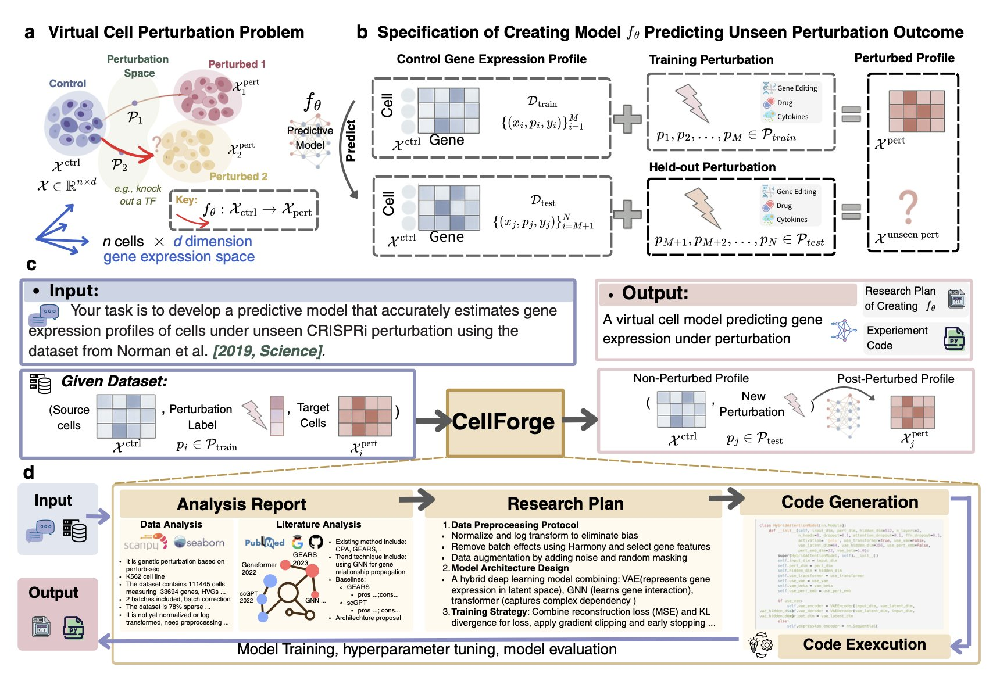
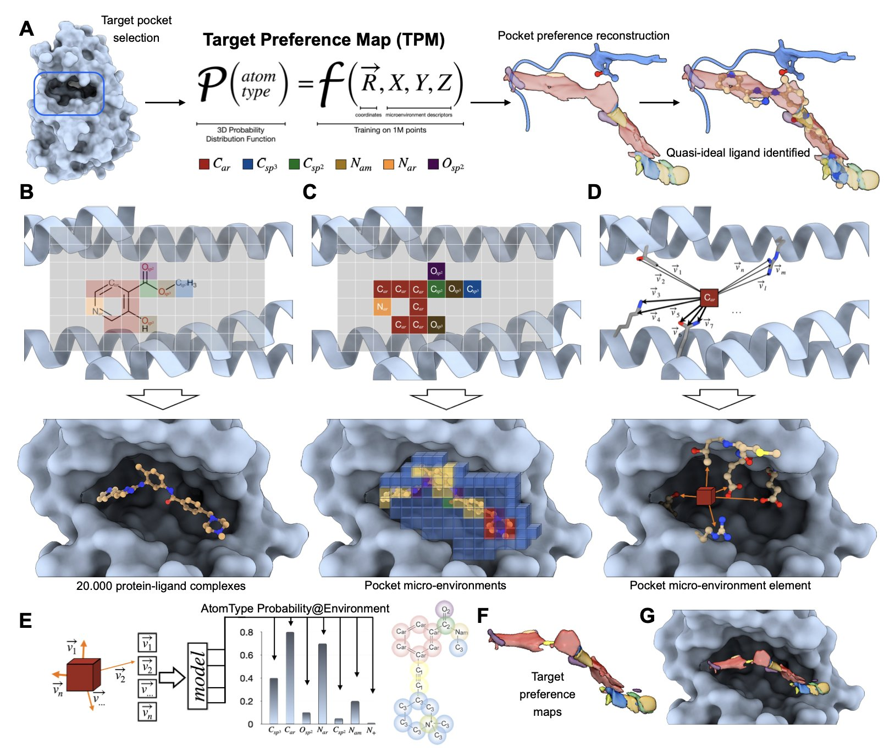
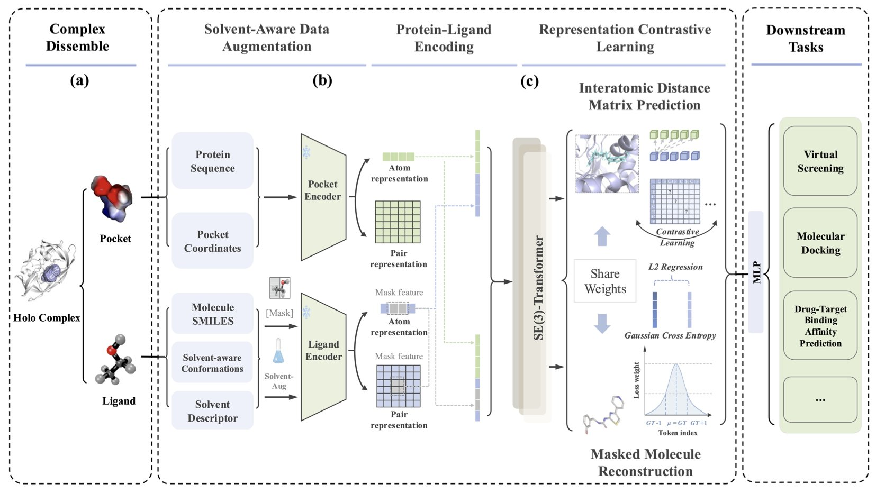

## Table of Contents
1. CellForge isn't just a prediction tool; it's an automated pipeline that turns biological questions into efficient computational models, potentially freeing scientists from tedious modeling work.
2. An AI model draws a "preference map" for protein pockets, telling medicinal chemists where to place different atoms for the best binding.
3. This model finally starts to address the long-ignored elephant in the room of drug discovery—solvent effects—by forcing AI to acknowledge that molecules live in "water," not a vacuum.

## 1. CellForge: An AI-Powered Assembly Line for Virtual Cells

The field of computational biology dreams of a "virtual cell"—a model that can perfectly simulate the behavior of a real cell inside a computer. But building one is a painful process. You need a unicorn scientist who understands biology, machine learning, and programming, and then they spend months, or longer, struggling with countless model architectures and parameters.

Now, CellForge, from the labs of heavyweights like Mark Gerstein and Fabian Theis, seems to want to end this manual, workshop-style approach to modeling.

CellForge doesn't just make small improvements; it builds a fully automated production line for virtual cell models. The system is incredibly ambitious, trying to handle everything from start to finish. You just give it your scientific question (like, "I want to know how this drug affects cancer cells") and your dataset (like single-cell sequencing data), and it takes care of the rest.

At its core is a multi-agent system, much like the molecular design platforms we've discussed before, but the complexity of its application is an order of magnitude higher. This AI team has agents responsible for "analyzing tasks," "designing methods," and "executing experiments." The best part is that they don't just divide the labor; they use a "graph-based discussion" architecture. This means a model plan proposed by the "method designer" is immediately criticized and reviewed by other agents from different angles, then refined and improved. Isn't this just like our daily project meetings? Except it's thousands of times more efficient and works 24/7 without getting tired.

The results from this collaborative reasoning are stunning. In single-cell perturbation prediction, a core area of drug development, CellForge's performance is formidable. It reduced the error rate in predicting cellular transcriptomic changes after gene knockouts, drug treatments, or cytokine stimulation by 40%. This means we can more accurately determine early on whether a drug target is worth pursuing or if a drug candidate might have unexpected off-target effects.

For researchers, if a tool like CellForge becomes mature and widely available, it would be a huge shift. It would completely change how computational biologists work. We would no longer need to waste vast amounts of time tuning parameters and writing PyTorch code. Instead, we could return to the essence of science: asking more insightful biological questions and designing more clever experiments. AI would handle the heavy engineering, while humans focus on the science.

Of course, this paper was just posted on arXiv, so we'll have to see how it performs on more diverse and complex real-world datasets.

📜Paper: https://arxiv.org/abs/2508.02276

## 2. AI Draws a "Treasure Map" for Proteins, Showing Us Where to Put the Drug

For a long time, medicinal chemistry has been like a 3D game of Pictionary. We stare at a protein's active pocket on a computer screen—a messy jumble of helices and folds—and start guessing based on intuition and experience: "Hmm... this looks like a hydrophobic region, I should probably stick a benzene ring in there. Oh, and there's a glutamine in that corner, maybe I can add a group to my molecule that forms a hydrogen bond with it?" This process is full of "maybes," "possiblies," and "let's try its," feeling more like art than rigorous engineering.

Now, imagine a tool that takes your protein structure and generates a high-definition 3D "preference map." The map clearly marks: this red area desperately wants a hydrogen bond acceptor; that blue area really likes positively charged groups; and for this green patch, you'd better put something hydrophobic, nothing else. This map is what the paper calls "Target Preference Maps" (TPMs). It translates the obscure structural language of a protein pocket into a straightforward description of "chemical preferences" that chemists can understand.

How does it work?

It doesn't learn the binding patterns of whole drug molecules and proteins. That approach is full of historical bias, because chemists tend to make familiar and easy-to-synthesize scaffolds. What the AI might learn is just "human chemists' synthetic preferences," not the true principles of physical chemistry.

So, the authors took a different path. They broke down over a million known ligand-protein interactions into countless tiny "atomic microenvironments." The model learns something more fundamental than "how this molecule called imatinib binds." It learns things like, "What kind of atom is most likely to appear around a carbonyl oxygen that's sandwiched between two aromatic rings in a hydrophobic environment?" By learning these underlying, universal physical rules, the model gains impressive generalization ability.

Of course, a computational model is just a pile of pretty but useless code if it can't prove itself in the real world. This paper performed a prospective validation.

They chose a tough nut to crack: the PEX14-PEX5 protein-protein interaction interface. This type of target surface is large, flat, and featureless—a medicinal chemist's nightmare. They used TPMs to guide the design of a new generation of inhibitors, then went into the lab, synthesized them, and tested their activity.

The result? The new molecules showed a significant improvement in activity.

The model does have a weak spot right now: it knows nothing about chemical bonds. It can tell you "put a carbon here and a nitrogen next to it," but it doesn't know if you can actually form a stable bond between them with real-world chemistry. It's like an architectural AI that designs a very cool floating castle without considering gravity or material strength. In the end, it's still up to the "foreman" smelling of chemical reagents to figure out how to turn the blueprint into reality.

Also, it relies on static crystal structures, but we all know that proteins in our body fluids are not motionless sculptures. They are constantly wiggling and breathing.

📜Title: A Universal Model for Drug-Receptor Interactions
📜Paper: https://www.biorxiv.org/content/10.1101/2025.08.01.668090v1

## 3. A New Idea in AI for Drug Discovery: Stop Pretending Molecules Live in a Vacuum

For decades, many of our computational models have shared a fundamental flaw: they pretend molecules exist in a perfect, empty vacuum. We draw beautiful binding pockets, place small molecules inside, calculate various electrostatic and van der Waals forces, and arrive at a binding energy. But we all know that in a real cell, all of this happens in a crowded "soup" dominated by water molecules.

Water molecules are everywhere. They pull, push, and surround your drug molecule, completely changing its "mood" and "conformation." A hydrogen bond that looks perfect in a vacuum might have no advantage in an aqueous solution because water itself can form better hydrogen bonds. This cost of "desolvation" is a ghost that we can never escape in drug design.

The core weapon in this paper is called "solvent-aware data augmentation."

The name sounds intimidating, but the idea is straightforward. Instead of just showing the AI a single "standard photo" of a molecule, it throws the molecule into various "solvent baths," lets it get tossed around, and then takes a series of snapshots of the different conformations it might adopt. Through this "special training," the AI learns to recognize a molecule's essence, not just its single image in some ideal state. It finally starts to understand that a molecule's flexibility and its interaction with the environment are part of its identity.

The framework also uses contrastive learning and multi-task learning. This means it doesn't just learn to identify molecules; it also has to complete multiple tasks like molecular reconstruction and predicting inter-atomic distances. It's like training a detective not just to recognize faces, but also to draw a portrait and estimate height from fragmented clues. This comprehensive training gives the model a deeper understanding of molecules.

The data is impressive. On PoseBusters, the "driver's license test" of the docking field, the success rate reached 82%. In virtual screening tasks, the AUC was 97.1%. In one case study, the docking RMSD error was as low as 0.157 angstroms. This is sub-angstrom territory, enough to make any computational chemist's heart race.

Of course, these are all "closed-book exam" scores run on standard datasets. The real test is to throw it into our own ongoing drug discovery projects, to face new and unknown targets and molecules, and see if it can still perform so well.

💻Code: https://github.com/1anj/SolvCLIP
📜Paper: https://arxiv.org/abs/2508.01799
