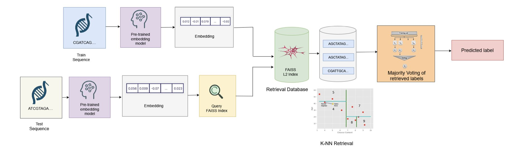
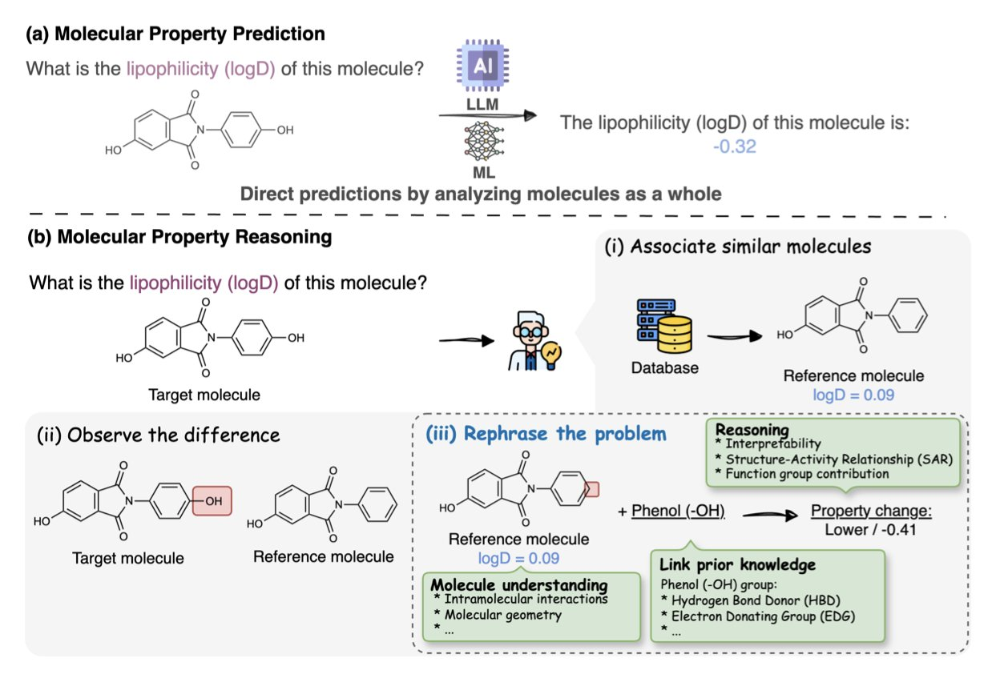
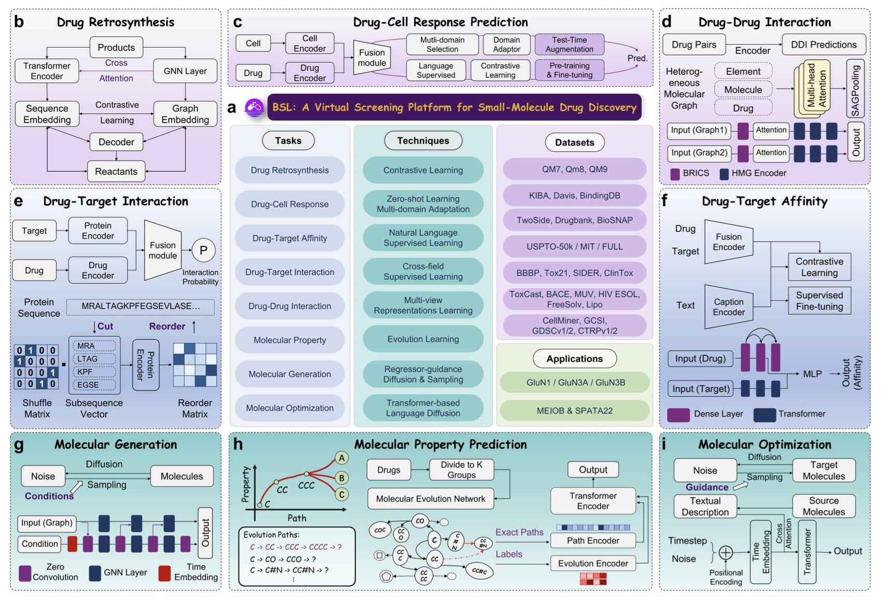

## 目录  
1. 这篇论文是一次精彩的「降维打击」，它证明了在基因组预测任务中，粗暴地微调大模型就像用核动力航母来送外卖，而简单地提取其「嵌入」特征，往往同样有效，且快得多、便宜得多。
2. FGBench 这个新基准无情地证明，当前最强大的 AI 在理解化学家最基本的语言——官能团——方面，表现得像个不及格的本科生。
3. 「百神来」（BSL）这个 AI 平台最值得关注的不是它集成了多少功能，而是它真的在实验室里找到了全新的、有活性的分子，这让它从 99% 的 AI 炼药故事中脱颖而出。

## 1. 基因组 AI：嵌入为王，何须微调？  
  
  

论文的标题，「Embedding is (Almost) All You Need」，简直是写满了挑衅。它显然是在致敬（或者说调侃）那篇开创了 Transformer 时代的「Attention is All You Need」。这篇论文，就是基因组 AI 领域的一场「节约运动宣言」。  
  
我们现在都陷入了一个怪圈：拿到一个基因组问题，第一反应就是找一个最大的预训练 DNA 模型，然后用我们自己的数据去「微调」（fine-tuning）它。  
  
这个过程，就像你为了让一位诺贝尔物理学奖得主去教你孩子的小学数学，而决定对他进行长达数月的、全方位的「小学教学法」再培训。这不仅荒谬、昂贵，而且速度慢得让人抓狂。每一次遇到新问题，你都得把这位可怜的教授再折腾一遍。  
  
而这篇论文提出的方法，则像个务实的项目经理。它说，我们根本不需要去重新培训那个诺奖得主。我们只需要去问他：「教授，根据您的毕生所学，请用几句话总结一下这个物理问题的核心要点。」这几句话，就是「嵌入」（Embedding）。然后，我们把这些宝贵的「核心要点」，交给一个大学生（一个轻量级的分类器），让他去批改那些小学生的数学卷子。  
  
结果这位大学生干得又快又好。  
  
数据显示，这种「嵌入 + 轻量分类器」的组合拳，不仅在性能上与兴师动众的「微调」打得有来有回，在效率上更是实现了屠杀级别的碾压。推理时间减少 88%，碳排放降低超过 8 倍。对每天都在跟计算资源和项目截止日期作斗争的人来说，这意味着我们可以在一天之内完成过去需要一周才能跑完的实验，而且花的钱还更少。  
  
更重要的是它的「通用性」。一套从 HyenaDNA 模型里抽取的嵌入，居然能通吃增强子分类、物种鉴定等九个风马牛不相及的任务，而且表现都还不错。这说明这些预训练模型，确实学到了一些关于 DNA 语言的、具有普适性的「知识」。我们以前只是不知道，原来直接把这些「知识」本身拿来用，就足够强大了。  
  
微调在某些需要极致性能的、数据量极大的任务上，微调依然有其价值。但这篇论文设立了一个廉价的基线。从今往后，任何一个声称需要微调的模型，都必须先回答一个问题：「你的结果，比直接用嵌入好多少？好出来的那一点点性能，值得我们多花十倍的成本吗？」  

📜Title: Embedding is (Almost) All You-Need: Retrieval-Augmented Inference for Generalizable Genomic Prediction Tasks  
📜Paper: https://arxiv.org/abs/2508.04757v1  

## 2. AI 懂化学？FGBench 考卷让大模型集体挂科  
  
  

对于化学家来说，官能团就是我们的字母表。我们看到一个分子，不会只看到一堆原子和键的连接图，我们会立刻看到羟基、羧酸、酰胺、迈克尔受体……这些官能团的组合，决定了一个分子的性格、反应性和它能否成为一个药物。  
  
然而，现在的大语言模型（LLMs），即便强大如 GPT-4，在「阅读」分子时，很大程度上还是个「睁眼瞎」。它们能处理 SMILES 字符串或者分子图，能记住大量的分子和它们对应的性质，但你问它一个真正化学家会问的问题：「如果我把这个酯基水解成羧酸，分子的水溶性会怎么变？」——它很可能就开始一本正经地胡说八道了。  
  
FGBench 这个新基准的出现，就是为了把这些「伪化学家」揪出来。  
  
它干的不是简单地收集更多的分子和性质数据。它创造了一个包含 62.5 万个「化学推理题」的庞大题库。每一道题都是关于官能团的。比如，「分子 A 和分子 B 的区别是 A 的硝基被换成了氨基，请问它们的亲脂性谁更高？」这才是对化学理解能力的真正考验。  
  
为了保证这些「考题」的质量，研究者们还用了一个的「拆了再装」的验证策略。他们确保每次修改官能团后，得到的仍然是一个化学上合理的、结构完整的分子。这就像出题老师自己先把所有题目都做了一遍，确保没有错题和歧义。  
  
那么，AI 考得怎么样呢？  
  
结果惨不忍睹。基准测试显示，即便是最顶尖的 LLM，在这些官能团级别的推理任务上也表现挣扎。这说明了什么？说明它们所谓的「理解」，更多的是基于表面相关性的模式匹配，而不是基于底层化学原理的因果推理。它们学会了背字典，但还没学会用单词造句和写文章。  
  
这对药物发现意味着什么？我们迫切需要的是一个能和我们对话的 AI 伙伴，一个能告诉我们「我认为应该在这里引入一个氢键供体来增强活性」的 AI，而不是一个只会吐出数字的黑箱。FGBench 就是强迫 AI 发展的下一阶段必须走向「可解释性」和「结构感知」的那个驱动力。  
  
它不仅仅是一个数据集，它是一套全新的、更严格的课程标准。有了它，我们终于可以开始训练和挑选那些真正能用我们的语言思考的 AI 模型了。  
  
📜Title: FGBench: A Dataset and Benchmark for Molecular Property Reasoning at Functional Group-Level in Large Language Models  
📜Paper: https://arxiv.org/abs/2508.01055v2  

## 3. AI 炼药一体机：这次真找到了活性分子  
  
  

百神来（Baishenglai, BSL）号称整合了七大功能的宏伟蓝图时，这七大功能包括了从头生成分子、结构优化、ADMET 预测、药物 - 靶点相互作用……基本上，你能在药物发现流程图上想到的所有计算环节，它都想包了。  
  
论文里最关键的部分：一个真实的、有实验结果支撑的案例研究。  
  
大多数 AI 平台的论文，结尾都是一张张漂亮的 ROC 曲线图，告诉你它的模型在某个公开数据集上的 AUC 分数有多高。这很好，但这就像一个只在模拟器上开赛车的车手，你永远不知道把他扔到真实的、下着雨的斯帕赛道上会发生什么。  
  
BSL 的研究者们把自己扔进了真实的赛道。他们选择了一个硬骨头——GluN1/GluN3A NMDA 受体。这是一个结构信息有限、很难搞的靶点。然后，他们用 BSL 去设计新的调节剂。  
  
最关键的一步来了：他们真的去合成了这些 AI 设计的分子，然后拿到湿实验室里去做了体外生物活性测试。  
  
结果他们找到了三个有明确活性的化合物。  
  
这一步，是区分英雄和嘴炮的分水岭。这意味着 BSL 不仅仅是一个更数据库搜索引擎，它真的具备了某种「化学直觉」，能够探索未知的化学空间，并提出靠谱的、能被实验验证的假设。  
  
而这种能力的根源，很可能来自于它对 OOD（分布外）泛化问题的重视。药物发现的本质，就是去寻找那些我们从未见过的、但又恰好能解决问题的分子。一个只会对自己「题库」里的东西举一反三的 AI，对我们来说价值有限。BSL 从一开始就奔着解决这个「题库外」的问题去，这才是正确的、虽然也更难走的路。  
  
📜Title: Empowering Drug Discovery through Intelligent, Multitask Learning and OOD Generalization  
📜Paper: https://arxiv.org/abs/2508.01195
