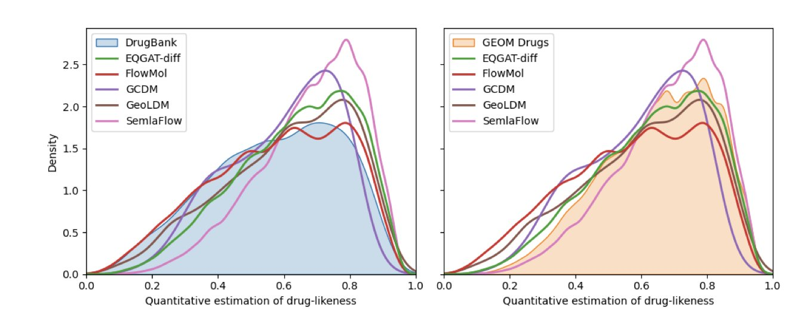
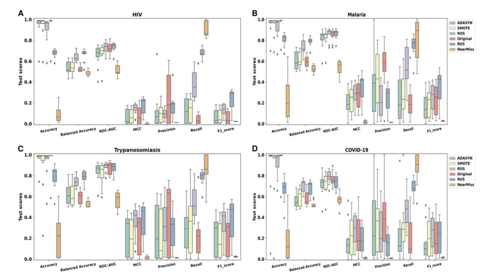
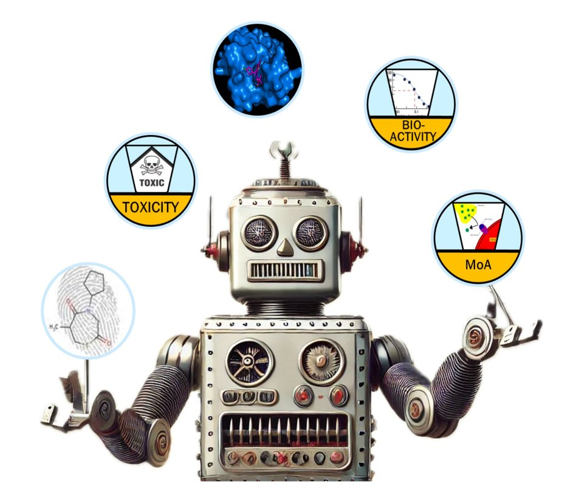
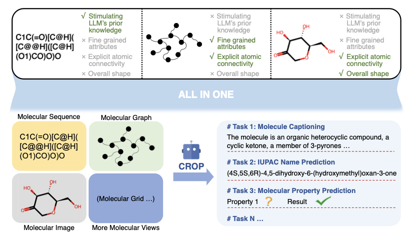
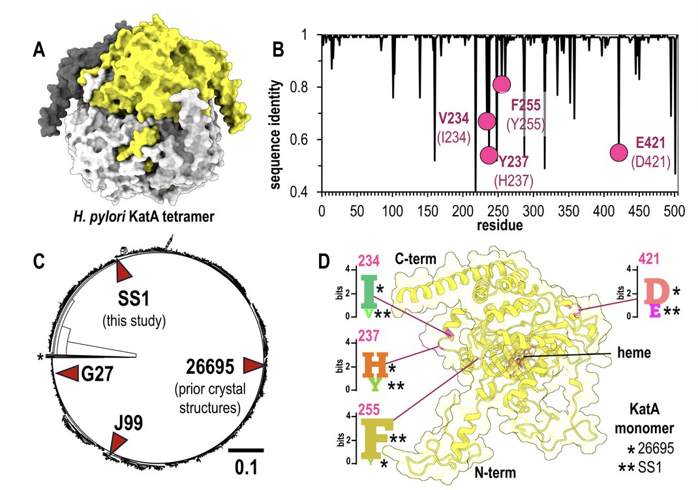

## Table of Contents
1. The latest AI models have made great strides in generating 3D molecules from scratch. But they are still like enthusiastic yet inexperienced architects, designing molecules that look good on paper but often defy basic laws of physics and chemistry, requiring a lot of "post-renovation" to be usable.
2. In drug screening data, which is full of "inactive" compounds, adjusting the ratio of active to inactive compounds to 1:10 can significantly improve an AI model's predictive power, helping it find real signals in the noise.
3. The use of AI in drug discovery is moving beyond the "one-size-fits-all" hype and evolving into a mature toolbox with specialized instruments. These tools are built to solve specific problems, from target identification and molecular docking to drug-likeness prediction and chemical synthesis.
4. CROP uses a "prefix" mechanism that lets a Large Language Model "see" a molecule's 2D topology and 3D conformation while "reading" its sequence. This greatly enhances its understanding of the chemical world.
5. AlphaFold 3 is an amazing structure prediction tool. But this study makes it clear that it's a precision instrument that needs to be given the right biological context, not a magic box that can read your mind.

## 1. AI Molecular Design: Looks Good, Physics Disagrees

Can you get an AI program to act like a chemist with endless inspiration and just "imagine" new, drug-like small molecules from nothing?

This is what's known as unconditional generation. You don't give it a target or any constraints. You just say, "Go, create a drug-like molecule for me," and then wait for the magic to happen.

This paper, presented at an ICLR workshop, put five of the most advanced "dream machines" (EQGAT-diff, FlowMol, GCDM, GeoLDM, and SemlaFlow) to a rigorous test.

The good news is, we've definitely made progress.

A few years ago, the things these programs produced were mostly random collections of atoms and bonds that would make any organic chemist want to smash their computer. Now, the best performer, SemlaFlow, can generate molecules that are 87% "valid" without any human intervention.

"Valid" here basically means that, at least on a 2D drawing, it looks like a proper molecule with correct atom valencies and no messed-up bonds.

The core contribution of this paper is a very strict quality control process. It doesn't just check if the 2D drawings are reasonable. It uses tools like RDKit and PoseBusters to check the physical reality of the 3D structures: Are bond lengths too long or too short? Are bond angles twisted into impossible positions? Are two atoms jammed together, creating a steric clash?

It's like reviewing an architect's blueprints. You don't just look at the floor plan to see if the rooms and windows are in the right place (2D validity). You also have to check the 3D model to see if the stairs are so steep you could fall down them, or if the load-bearing walls are as thin as paper (3D physical plausibility).

Under this tough inspection, the AIs' "first drafts" revealed a lot of problems. This also explains why post-processing is so important. Post-processing is basically having an expert—like using RDKit for energy minimization—take the AI's wild designs and bend them back into a physically plausible state. After this "renovation," the success rate for almost all models went up. For example, GCDM's success rate jumped from a so-so level to 95.2%. But this just shows how rough its initial work was.

Another interesting finding is that while these AIs have learned a lot of statistics about what drugs "should" look like (like Lipinski's Rule of Five), they seem a bit timid. The molecules they generate look a lot like the ones in the training set (the GEOM Drugs dataset). They don't dare to explore broader, more novel chemical spaces. They are like artists who can only imitate the masters, not ones who can create their own school of art.

Unconditional 3D molecular generation is developing fast, but we're still a long way from a "one-click-to-perfect-drug-candidate" button. For now, AI is a powerful idea generator. It can give you a lot of seemingly good ideas. But to turn those ideas into reality, you still need an experienced chemist, with a healthy respect for the laws of physics, to review, revise, and ultimately decide which ideas are worth spending months of time and effort to actually make in a lab.

📜Title: An Evaluation of Unconditional 3D Molecular Generation Methods
📜Paper: https://openreview.net/forum?id=ZU1m9Y4tYy

## 2. AIDD: The 1:10 Data Ratio is the Sweet Spot

We have a love-hate relationship with high-throughput screening (HTS) data. We love that we finally have massive amounts of data points, making it feel like we're in the "big data" era. We hate that most of this data is junk. After screening hundreds of thousands of compounds, you're lucky if you find a few decent hits. It's like panning for gold in a river full of mud. Most of what you find is mud (inactive compounds), and the real gold (active compounds) is extremely rare.

Everyone is talking about using AI to speed up this gold-panning process. But what happens if you feed this raw, muddy data directly to a machine learning model?

The model will learn a very simple but completely useless strategy: predict that everything it sees is "mud." By doing this, it can easily achieve 99.9% accuracy, because it's correct most of the time. But for someone looking for gold, this model is worthless.

We need to figure out how to adjust the ratio of "gold" to "mud" in the training data.

The researchers used a method called "K-ratio random undersampling."

Simply put, they kept all the precious active compounds and then randomly sampled different proportions of the massive number of inactive compounds to create the training set. They tested various ratios, from 1:1 (completely balanced) to 1:1000 (close to the original data).

The results showed that when the ratio was set to 1:10—one active compound for every ten inactive compounds—the performance of almost all models peaked.

If there were too many inactive compounds (like 1:1000), the model was overwhelmed and couldn't learn the fine features of active molecules. If there were too few inactive compounds (like 1:1), the model lost a lot of valuable negative information about "what we don't want," causing it to mistake a lot of brass for gold (false positives). The 1:10 ratio gives the model just enough negative examples to learn the boundaries without getting misled by the noise.

The researchers also looked deeper into why the models made mistakes. They found that when an active molecule and an inactive molecule were very similar chemically (what we call an "activity cliff"), the model was easily confused. This isn't the algorithm's fault; it's the reality of medicinal chemistry. A tiny structural change can turn a drug from a "miracle cure" into a "dud."

Data balancing isn't a cure-all. The diversity of your compound library itself is crucial. If your library is stuffed with thousands of similar-looking analogs, you're just making the AI's job harder.

📜Title: Adjusted Imbalance Ratio Leads to Effective AI-Based Drug Discovery Against Infectious Disease
📜Paper: https://www.nature.com/articles/s41598-025-15265-5

## 3. AI Drug Design: Evolving from a Black Box to a Toolbox

Our feelings about artificial intelligence (AI) right now are pretty mixed. On one hand, we see its disruptive potential. On the other, we've seen too much hype. Every few years, a new computational method claims it will make medicinal chemists obsolete, but the next day, we're back at the fume hood, dealing with sticky, uncooperative chemical reactions.

This special issue on "AI in Drug Discovery" from the *Journal of Cheminformatics* feels different. It's not another grand narrative about "AI will rule the world." Instead, it's more like a group of experienced engineers showing you the specialized tools they've built to solve specific problems.

AI is changing from a mysterious "black box" into a "toolbox" that we can understand and use.

#### **The First Drawer: Redefining How We Look at Targets**

Traditionally, structure-based drug design (SBDD) requires a 3D structure of a protein, preferably a crystal structure with a ligand bound. Without it, most computational tools are blind. But the CLAPE-SMB method mentioned in this issue tries to get around that. It can predict DNA binding sites using only a protein's amino acid sequence. It's like figuring out where the keyhole is on a lock just by looking at its blueprint (the sequence), without ever seeing the lock itself. This opens up new doors for targets that are hard to crystallize.

In the more familiar field of molecular docking, the tools are also getting better. We all know how unreliable traditional docking scoring functions can be. Gnina v1.3 applies a convolutional neural network (CNN) to this step. It's like going from using a ruler to crudely measure the fit between a ligand and a pocket to having an experienced carpenter (the CNN) use their feel and experience to judge if the joint fits perfectly. It even has a scoring function for covalent docking, which used to be a major challenge.

Tools like PoLiGenX are even more interesting, reflecting a new philosophy of collaboration. It lets you give the AI a "reference molecule" and say, "I know molecules that look like this fit well in this pocket. Can you build on this and come up with some better new molecules for me?" This acknowledges that computers are not all-knowing and that the intuition and experience of human chemists are still valuable. AI is no longer the all-powerful "designer" but more like a tireless "senior assistant" that can build on existing ideas.

#### **The Second Drawer: From Fortune-Telling to Weather Forecasting**

ADMET (Absorption, Distribution, Metabolism, Excretion, Toxicity) prediction was one of the first areas where AI really shined, but there's always been a problem: the model gives you an answer but doesn't tell you how confident it is.

One model says a molecule is "non-toxic," and another says it's "toxic." Which one do you believe?

New models in this issue like AttenhERG and CardioGenAI are tackling this. They don't just predict hERG toxicity or cardiotoxicity; more importantly, they are starting to include uncertainty quantification. It's like the weather forecast evolving from a simple "It will be sunny tomorrow" to "It will be sunny tomorrow with a 10% chance of rain." The second one is obviously more useful because it tells you the level of risk. By using methods like Bayesian approaches, these models can tell you, "I predict this molecule is non-toxic, and I'm 95% confident in that prediction." A prediction with a confidence level is worth a lot when you're deciding whether to invest millions of dollars in a project.

#### **The Third Drawer: AI is Finally Thinking About How to Make the Dish**

This has been the biggest weakness of all AI design software in the past. An AI could design a molecule that, in theory, could cure cancer and look beautiful, but when you show it to a synthetic chemist, they might throw the design back in your face because it's impossible to make on Earth.

Now, AI is finally starting to address the issue of synthetic feasibility. The special issue discusses new reaction prediction benchmarks and strategies. But that's not all. Some research is starting to use Large Language Models (LLMs) to "read" massive amounts of chemical patents and literature. It's like having AI study all the "recipes" in human history, not just learning how to follow them but understanding the "cooking principles" behind them. This allows it to plan a realistic "cooking route" for the new molecules it designs.

AI drug discovery is shedding its flashy exterior and becoming more grounded. It's no longer trying to be an all-powerful god, but instead breaking itself down into a series of tools that can solve real-world problems.

📜Title: Advanced machine learning for innovative drug discovery
📜Paper: https://jcheminf.biomedcentral.com/articles/10.1186/s13321-025-01061-w

## 4. AI Molecular Models Get Eyes

Over the past few years, Large Language Models (LLMs) have taken over almost every field. In chemistry, we naturally want these "linguists" to help us understand the language of molecules. The molecular language we use most often is the SMILES string—a line of text that describes a molecule's structure.

But there's always been a fundamental problem. Using SMILES is like trying to describe Van Gogh's *The Starry Night* to a blind person using only text. You can tell them, "There are lots of yellow swirls in the painting, and the background is dark blue." But they can never truly "see" the composition, brushstrokes, and spatial sense of the painting.

Similarly, an LLM that only reads SMILES knows which atoms are connected to which, but it has no idea what the molecule actually looks like in 3D space, which group points up, and which points down.

The CROP architecture is an attempt to give this "blind linguist" a pair of eyes.

The idea is, before the LLM reads the text description of *The Starry Night* (SMILES), what if we first show it a sketch of the painting (the molecule's 2D topological graph) and then let it feel a 3D relief version of it (the molecule's 3D spatial conformation)?

The real challenge, of course, is in the engineering.

An LLM's "working memory" (its context window) is limited. You can't just shove a high-resolution image and a complex network graph into a program that's used to handling text.

CROP designed a very efficient "preprocessor" called the "SMILES-guided resampler." What this does is intelligently compress the sketch and the relief into a very short summary containing the most critical information, which we call a "prefix." Then, it places this "summary" in front of the SMILES string and feeds them both to the LLM.

This way, before the LLM starts reading the dry text description, it already has a general sense of the painting's overall composition and spatial layout. This compression process is also "guided" by the SMILES itself. This means the LLM uses its initial understanding of the text to tell the preprocessor, "Hey, I think that big swirl in the top left corner is important. Give it a little more attention in your summary." It's a very elegant feedback loop.

So, how does an LLM with eyes perform?

The result is that it becomes a better chemist in almost every task.

For example, in "molecule captioning," where the model looks at a molecule and describes its features in natural language, CROP performed far better than other models. This shows that when it sees both the molecule's connectivity and its shape, it can understand the molecule's "personality" more deeply and describe it more accurately.

The authors also did "ablation studies" to test their idea. They tried giving the model just the sketch or just letting it feel the relief. They found that neither worked as well as giving it both. This proves that the 2D topology and 3D space are like the left and right eyes. They provide complementary information that is essential. Only when combined can they form a complete, three-dimensional understanding.

📜Title: CROP: Integrating Topological and Spatial Structures via Cross-View Prefixes for Molecular LLMs
📜Paper: https://arxiv.org/abs/2508.06917v1

## 5. A Reality Check for AlphaFold 3: It's Not Magic

Since AlphaFold first appeared, people in structural biology and drug discovery have felt like they've jumped from the Stone Age to the Space Age. Protein structures that used to take years of work, huge amounts of money, and the mental energy of PhD students to solve can now, it seems, be obtained by just plugging a sequence into a computer and grabbing a cup of coffee, resulting in a "scarily good" model. The release of AlphaFold 3 has extended this capability to interactions between proteins and other molecules.

But there's always been a nagging question: these models predict the most standard, pure proteins you'd find in a textbook. The real world is messy. The same protein can have small amino acid differences between different strains, species, or even individuals. We call these "natural variants."

So, can AlphaFold 3 handle this real-world complexity? Can it tell how a single amino acid change subtly affects a protein's local conformation?

This study tried to answer that question. They chose a well-studied old friend: catalase KatA from *Helicobacter pylori*. We already have a high-resolution crystal structure of KatA from strain 26695. The researchers then went to the trouble of solving the crystal structure of KatA from another strain (SS1), which has a few amino acid differences from the old version.

This created a perfect experimental setup. They had a brand new "test question" that wasn't in AlphaFold 3's training set. More importantly, they had a 100% correct "answer key" from their experiment.

Then, they started the test.

When they fed the sequence of the SS1 strain into the model along with the correct biological information—"Hey AlphaFold, this thing is a tetramer in the cell"—the results were impressive. The predicted structure matched their hard-won crystal structure very well, both overall and in most details. This once again proved how powerful AlphaFold 3 is.

But the real show was yet to come.

They then did a small "destructive" test. They deliberately "tricked" AlphaFold 3 by telling it that KatA was a monomer, not a tetramer. This is like giving an architect the blueprints for a four-sided courtyard house but telling him you only want to build a small hut.

The model's overall predicted fold still looked about right. But when you zoomed in on the key areas where the mutations occurred and where the tetramer interface should have been, everything was a mess. The orientations of the amino acid side chains were off by just a little, but it made all the difference.

This is the core contribution of the study. It's not saying AlphaFold 3 is bad. On the contrary, it's teaching us how to use this powerful tool correctly. It shows with direct evidence that AI hasn't made biologists obsolete. In fact, it has made deep biological knowledge more important than ever. You first need to know what your protein is actually doing inside the cell—is it working alone, or is it teaming up with three buddies?—before you can ask the AI a meaningful question.

This work also serves as a validation for traditional experimental structural biology. Without the new SS1 crystal structure that the researchers solved to serve as "ground truth," the entire paper's discussion would have been built on sand. We still need people in the lab, day in and day out, doing the seemingly tedious work of purification, crystallization, and X-ray diffraction. Because it's this experimental data that forms the foundation for training and validating AI models.

📜Title: AlphaFold 3 accurately models natural variants of Helicobacter pylori catalase KatA
📜Paper: https://journals.asm.org/doi/10.1128/spectrum.00670-25
