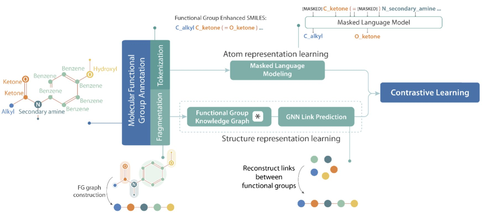
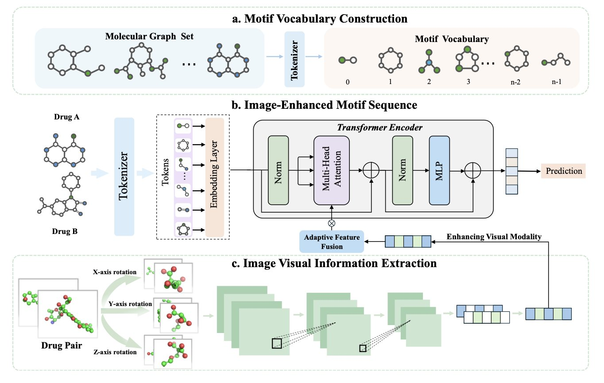
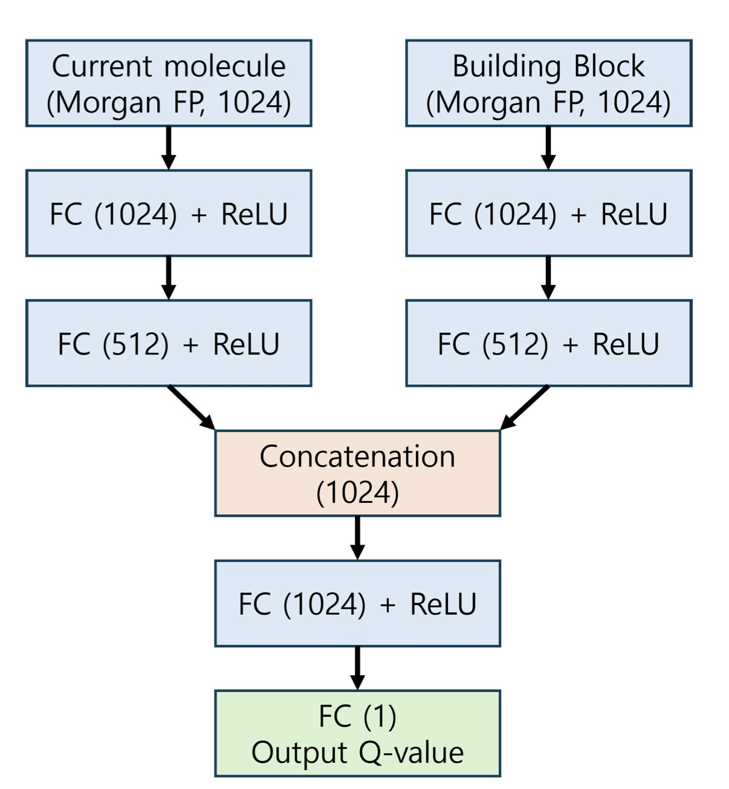

---
---
title: "Teaching AI to Speak Chemistry, See the Big Picture, and Play by the Rules"
description: |
  The FARM model forces AI to learn the fundamental language of chemists—functional groups—by modifying the SMILES language. ImageDDI significantly improves drug-drug interaction (DDI) prediction accuracy by introducing a global "portrait" of the molecule. Finally, the FragDockRL framework turns molecular design into a reinforcement learning "chess game," ensuring every molecule the AI generates is realistically synthesizable.
date: "2025-05-19"
categories: ["AI Drug Discovery", "Explainable AI", "Molecular Generation", "Reinforcement Learning"]
image: "post_all_image/functional_group_awa_2025_08_10_image_1.jpg"
image-alt: |
  A concept diagram of the FARM model, showing how it refines SMILES strings (e.g., distinguishing 'O' into 'O_ketone', 'O_hydroxyl', etc.) and aligns them with molecular graph structures using contrastive learning. This enables the AI model to truly understand functional groups and think like a chemist.
toc-depth: 3
---

## Table of Contents
1. FARM forces AI to wear a chemist's glasses, making it recognize functional groups instead of treating all atoms equally. This is a big step toward true chemical reasoning.
2. By letting AI see a molecule's overall "portrait" while analyzing its local chemical "motifs," ImageDDI greatly improves the accuracy of drug-drug interaction (DDI) prediction.
3. FragDockRL turns molecular design into a reinforcement learning "chess game." The AI makes moves by simulating real chemical reactions and uses docking scores as rewards, ensuring every "game" it plays results in a synthesizable molecule from the start.

## 1. AI Finally Learns a Chemist's Language: Functional Groups

Talking to an AI about molecules can feel like you're speaking different languages. We "translate" molecules for AI using SMILES strings, but this language is flawed, almost like it's chemically illiterate. For example, `COC` (dimethyl ether) and `CCO` (ethanol) both contain the letter `O`. But we know the oxygen in an ether bond and the oxygen in a hydroxyl group have completely different personalities and reactivities. To most AI models, however, an `O` is just an `O`.

This is why so many AI property prediction models feel like they're just guessing. They've learned to memorize patterns, but they don't really understand the underlying logic of chemistry.

The FARM paper aims to fix this. The idea is simple: if the letter `O` is too vague, let's add qualifiers to create new words. So, in FARM's world, a SMILES string no longer just has `O`. It has `O_ketone`, `O_hydroxyl`, `O_ether`, and so on.

This small change forces the AI to learn the most basic language of chemists: functional groups. The AI finally understands that different "oxygens" cannot be treated the same.

But that's not all. Just changing the string isn't enough.

FARM did a second thing: it used contrastive learning to "align" this new, functional group-aware SMILES language with the molecule's graph structure. It's like teaching a child to read. You don't just show them the word "apple"; you show them a picture of an apple at the same time and tell them, "These two things mean the same thing." This forces the AI to connect abstract symbols with concrete structural topology, creating a much richer and more accurate molecular representation.

So, how does this more chemically-savvy AI perform?

The researchers tested it on MoleculeNet, a standard benchmark for chemistry AI. FARM came out on top in 11 out of 13 tasks.

For drug discovery, this means an AI can not only predict a molecule's activity but also explain its "thinking" like a junior medicinal chemist: "I think this molecule will have poor activity because its ester group is easily hydrolyzed, and it lacks a group that can form a hydrogen bond with the aspartate at position 235."

📜Title: Functional Group-Aware Representations for Small Molecules (FARM): A Novel Foundation Model Bridging SMILES, Natural Language, and Molecular Graphs
📜Paper: https://arxiv.org/abs/2410.02082v3

## 2. AI Drug Interaction Prediction: Introducing a Global View

In drug development and clinical practice, predicting drug-drug interactions (DDI) is a critical but difficult problem.

When a patient takes two or more drugs, unexpected chemical reactions can occur. Some might just reduce a drug's effectiveness, while others could cause fatal side effects. We want to foresee these potential conflicts before a drug hits the market, or even during its design phase.

In the past, AI approaches often broke down molecules into a collection of local "chemical motifs"—like a benzene ring, a carboxyl group, or an amide bond. The model would then learn which motifs tend to "clash" when they appear together. This method is intuitive and has had some success. But it's like trying to tell if two Lego models will fit together by only analyzing the types of bricks they use, while completely ignoring what the models look like as a whole.

ImageDDI tries to solve this "can't see the forest for the trees" problem.

The core idea is to first show the AI a "full-body portrait" of the two drug molecules before it starts analyzing their local chemical motifs. This "portrait" is just the familiar 2D or 3D structural image of the molecule.

Of course, you can't just feed an image to a model that's used to handling sequences and graphs.

The key technology here is an "adaptive feature fusion" module. Think of it as an art critic. The critic first looks at the portrait of Drug A and distills some key visual impressions: "This molecule looks long and flat, with a large hydrophobic region on the left." Then, as the AI begins to analyze Drug A's local motifs one by one, the critic constantly reminds it: "Hey, the benzene ring you're looking at isn't isolated; it's part of that large hydrophobic region."

This way, ImageDDI combines local details with a global perspective. When the model judges the role of a specific motif, it's no longer making an isolated guess. It has a spatial context.

So, does adding this "art critic" help?

ImageDDI outperformed older models that only look at local motifs across several standard DDI prediction tasks. This shows that a molecule's global shape and spatial layout are essential for understanding the complex interactions between them.

The authors also used visualization techniques to let us "see" the AI's thought process. By generating heatmaps, they can clearly highlight which key chemical motifs the model focused on when predicting an interaction between a pair of drugs. This turns ImageDDI from an accurate but unexplainable "black box" into a transparent "white box" that can offer chemical insights.

When using AI to solve complex scientific problems, fusing information from multiple modalities is often the path to better performance.

📜Title: ImageDDI: Image-enhanced Molecular Motif Sequence Representation for Drug-Drug Interaction Prediction
📜Paper: https://arxiv.org/abs/2508.08338

## 3. AIDD: Synthesizability Is No Longer Just Talk

FragDockRL turns molecular design into a reinforcement learning "chess game." The AI makes moves by simulating real chemical reactions and uses docking scores as rewards, ensuring every "game" it plays results in a synthesizable molecule from the start.

It reframes the entire problem as a game we all understand: chess.

**The AI is the player**.

**The board is the binding pocket of the target protein**.

**The pieces are a pre-selected set of commercially available "building blocks**."

**The rules are a set of reliable chemical reactions that we know work in the lab**.

Now, the game begins.

First, we place a known "core fragment" that weakly binds to the target on the board. Then, it's the AI's turn to move. Each "move" isn't imagined from scratch. Instead, the AI chooses a reaction from its "rulebook" and picks a building block to attach to the existing molecule. For instance, it might decide to make a "Suzuki reaction" move, selecting a suitable boronic acid from its box of pieces and attaching it to a bromine atom on the core fragment.

After each move, we need to judge whether it was good or bad. This is where the "docking score" comes in. With every move, the program quickly calculates how well the newly generated molecule binds to the protein pocket. This score is the "reward" for the AI. If the score increases, the AI learns, "Okay, that was a good move. I should consider this move more often in similar situations." If the score decreases, it knows, "That was a bad move, I should avoid it next time."

This process is the essence of reinforcement learning. The AI starts like a novice player, perhaps making random moves. But after playing thousands of games, it gradually learns which lines of play are most effective for conquering the specific "board" (the protein pocket) through this feedback loop of rewards and penalties.

To make this reward signal more reliable, the authors use a technique called "tethered docking." When calculating the docking score, they temporarily "nail" the initial core fragment in place within the pocket. This is like securing the paper to a drawing board for a beginner artist. It prevents the AI from losing the entire molecule's starting position while exploring new fragments, allowing it to focus on optimizing the newly added "arms" and "legs."

This work acknowledges that AI is not yet an all-powerful "chemistry god." But it can be a powerful, tireless apprentice that strictly follows the rules. Every molecule it generates has a clear, logically sound synthetic route behind it. It will no longer present synthetic chemists with molecular "monsters" that make them want to retire.

Of course, it has its limitations. For example, the AI can sometimes get stuck in a rut, repeatedly trying moves it already knows are good, rather than venturing out to explore the vast unknown.

📜Title: FragDockRL: A Reinforcement Learning Framework for Fragment-Based Ligand Design via Building Block Assembly and Tethered Docking
📜Paper: https://www.biorxiv.org/content/10.1101/2025.08.12.670002v1
