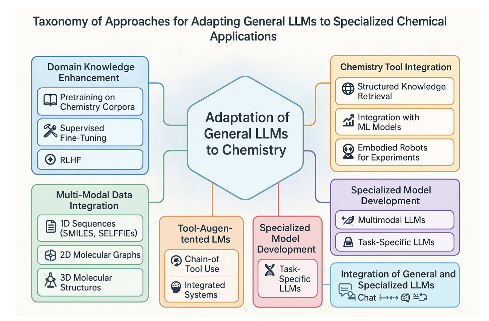
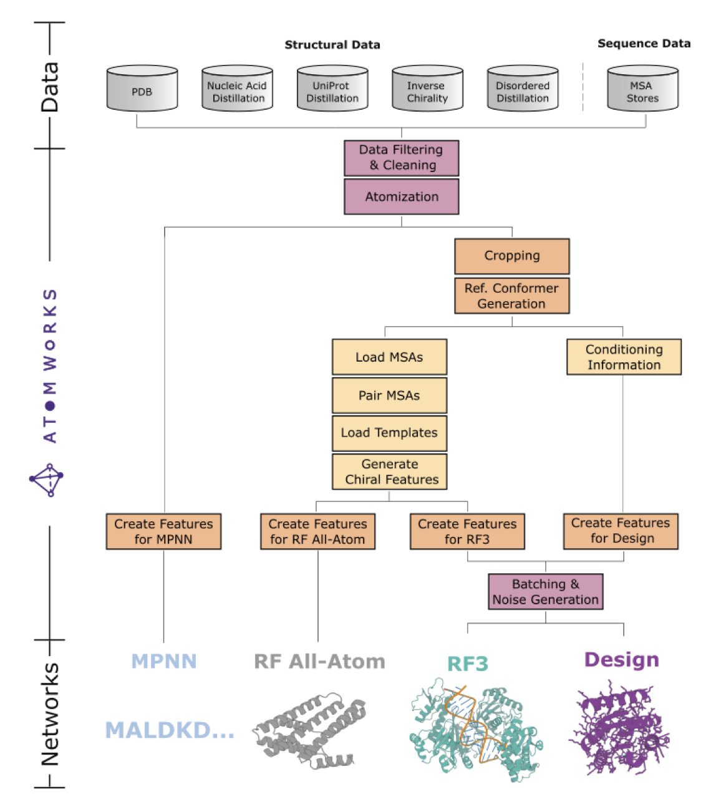
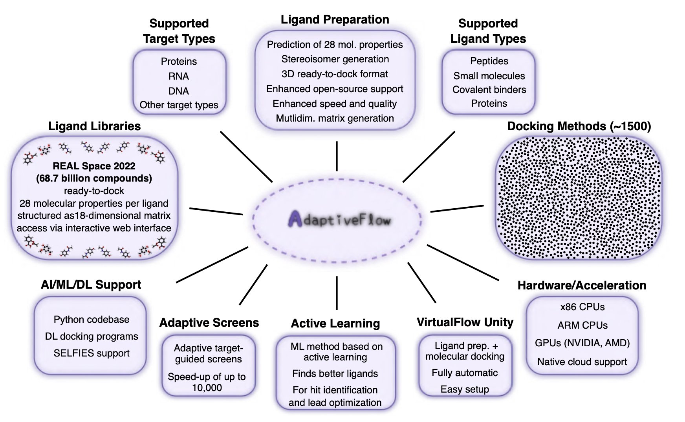

## 目录  
1. 大型语言模型正在从一个只会纸上谈兵的「化学顾问」，进化成一个能亲自动手、在机器人实验室里规划、执行并优化化学反应的「自主研究员」。
2. David Baker 团队的 AtomWorks 框架和 RF3 模型，不仅在性能上紧追 AlphaFold3，更重要的是通过一个模块化的开源生态系统，为整个领域提供了加速创新的底层工具。
3. 一个名为 AdaptiveFlow 的新开源平台，通过高效筛选 690 亿分子库，不仅发现了针对 FSP1 的纳摩尔级抑制剂，还首次解析了其共晶结构，为这个困难靶点提供了实在的起点。

## 1. AI 入主通风橱：从预测到自主合成  
  
  

有机合成一直以来都存在着一道巨大的鸿沟。一边，是画在纸上或电脑屏幕上的、完美无瑕、产率 100% 的反应路线图。另一边，是在通风橱里，那个颜色可疑、拒绝反应、或者干脆变成一锅棕色粘稠物的烧瓶。我们一直梦想着能有一个工具，来弥合这道鸿沟。  
  
大型语言模型（LLMs）的出现，一开始看起来像是又一个华而不实的计算工具。它们能看着一个反应，然后根据它从海量文献里学到的知识，给你预测一个产率。这很酷，但对于一个经验丰富的化学家来说，这有点像是一个只会背菜谱的机器人，它并不能真正地帮你做饭。  
  
但这篇综述，给我们描绘了一幅截然不同的、也令人无比兴奋的未来图景。AI，正在走出电脑屏幕，穿上实验服，走进通风橱。  
  
**第一阶段的进化：从「算命先生」到「战略家」**  
  
过去的 AI，你给它反应物 A 和 B，它告诉你得到产物 C 的可能性有多大。这就像个算命先生。而现在的 LLMs，你直接给它看最终的目标分子——一个复杂的药物候选物——然后问它：「我们该怎么从那些便宜的、买得到的原料，一步步把它做出来？」模型会开始进行「逆合成分析」，像一个经验丰富的战略家一样，把这个复杂的目标，拆解成一步步可行的、逻辑上连贯的化学反应。它正在学习我们这个行当里，最核心的、也最具创造性的那部分技能。  
  
**第二阶段的进化：从「战略家」到「现场总指挥」**  
  
但这还不是最激动人心的。真正让这一切从理论变成现实的，是将 LLMs，与那些我们已经很熟悉的实验室机器人、自动加料器和实时分析仪器（比如核磁、质谱、红外）连接起来。  
  
这，就创造出了一个「闭环」。  
  
你可以想象这样一个场景：  
1.  **规划** ：LLM 为目标分子，规划出了一条它认为最优的合成路线。  
2.  **执行** ：它把指令发送给实验室里的机器人。机器人手臂开始精确地移取溶剂、称量原料、控制温度。  
3.  **监控** ：反应开始后，流通池里的实时光谱仪，每隔几秒钟，就把反应体系的「快照」，传回给 LLM。  
4.  **学习与优化** ：LLM 看着这些实时数据，发现反应似乎比预想的要慢。于是，它做出一个判断：「嗯，也许我们应该把温度再升高 5 度，或者再补加一点催化剂。」然后，它就向机器人，发出了新的指令。  
  
这就像是拥有了一个不知疲倦、无需睡眠、而且能同时照看上百个反应的、顶级的化学家。它不再是仅仅在实验开始前给你一个静态的方案，而是在实验过程中，进行动态的、实时的、基于数据的优化。  
  
**现实是我们还没到高枕无忧的时候**  
  
当然，在我们把实验室的钥匙完全交给 AI 之前，还有几个非常棘手的问题需要解决。  
  
首先，是「垃圾进，垃圾出」的问题。LLMs 学习的是公开发表的化学文献。而化学文献，存在着巨大的「发表偏见」——我们只会发表那些成功的、产率漂亮的反应。那成千上万次失败的、只得到一堆焦油的尝试，是不会出现在 AI 的训练集里的。这就像是教一个新手司机开车，却只让他看 F1 赛车夺冠的录像，而不告诉他任何关于撞车和抛锚的事。  
  
其次，是「黑箱」问题。AI 可能会给你一条天才般的合成路线，但当你问它「你为什么这么想」的时候，它无法回答。它无法像一个人类化学家一样，跟你讨论反应机理、过渡态和电子效应。这种「知其然，而不知其所以然」，在科学探索中，是一个很大的问题。  
  
最后，也是最重要的，是安全问题。一个不受约束的 LLM，会不会在它的优化过程中，「发明」出一条会产生爆炸性中间体，或者剧毒副产物的路线？我们必须为它设计出严格的「安全护栏」，确保它的所有操作，都在已知的、安全的化学空间内进行。  
  
LLMs 不会在短期内取代有机化学家。但它正在成为一个前所未有的、强大的合作伙伴。它会把我们从那些重复性的、劳动密集型的优化工作中解放出来，让我们能去思考那些更宏大、更具创造性的、AI 目前还无法触及的化学难题。  
  
📜Title: Large Language Models Transform Organic Synthesis From Reaction Prediction to Automation  
📜Paper: https://arxiv.org/abs/2508.05427  

## 2. RF3 与 AtomWorks：不止是又一个 AlphaFold3 竞品  
  
  

David Baker 实验室又出了一篇预印本。看到标题里的 RosettaFold-3 (RF3)，你的第一反应可能是：又一个追赶 AlphaFold3 的模型？  
  
是的，但又不完全是。  
  
在我看来，这篇工作的真正主角，其实是那个 `AtomWorks` 框架。  
  
任何花哨的算法最终都建立在数据之上。处理生物分子数据，尤其是从 PDB 里扒下来的原始数据，就像是在打扫一个尘封多年的阁楼。键级不对、电荷缺失、原子坐标丢失……这些琐碎但致命的问题能让最高明的模型也栽跟头。  
  
`AtomWorks` 干的就是这个「脏活累活」，它建立了一套标准化的数据处理流水线，把这些乱七八糟的输入文件，变成了干净、规整、可以直接喂给模型的「食材」。这套框架就像是为生物分子建模打造的乐高积木，各个模块（数据处理、特征化）可以随意拆分和组合，让研究者能快速验证新想法，而不是每次都从和泥巴开始。  
  
RF3 就是用这套「乐高」搭出来的第一个明星产品。它的性能确实很强，在很多任务上都缩小了与 AlphaFold3 的差距，这本身就证明了 `AtomWorks` 框架的成功。  
  
但对于做药来说有几个点特别值得关注。  
  
首先是手性。机器能分清左手和右手吗？  
  
这在小分子药物设计里是生死攸关的问题。一个错误的对映异构体，可能就从良药变成了毒药。RF3 在这一点上做得非常漂亮，它对配体手性中心的预测准确率达到了 88%，略高于 AlphaFold3 的 84%。这个看似微小的优势，在实际项目中可能意味着巨大的价值。  
  
其次是灵活性。RF3 允许用户进行「原子级别的条件约束」。这是什么意思？打个比方，你通过实验（比如 NMR）知道蛋白上的某个原子和配体上的某个原子距离很近，你可以把这个信息直接「告诉」RF3，让它在预测结构时把这个约束考虑进去。这让模型不再是一个封闭的黑箱，而是一个可以与实验数据互动的工具。无论是做对接，还是根据特定构象折叠蛋白，这个功能都让 RF3 变得异常实用。  
  
所以，RF3 不止是提供了一个 AlphaFold3 的开源替代品。更重要的是，Baker 团队把整个「厨房」——`AtomWorks` 框架、训练好的模型、甚至处理过的数据集——都开放了出来。他们不只是给了我们一条鱼（RF3），更是把渔具和捕鱼方法（AtomWorks）都公之于众。  
  
📜Title: Accelerating Biomolecular Modeling with AtomWorks and RF3  
📜Paper: https://www.biorxiv.org/content/10.1101/2025.08.14.670328v1  
💻Code: https://github.com/RosettaCommons/atomworks  

## 3. AdaptiveFlow: 690 亿分子库中淘金 FSP1 抑制剂  
  
  

做药一直是个数字游戏，但现在的数字已经大到有些离谱了。我们理论上可以合成的类药分子数量比宇宙中的原子还多，而我们实际能接触到的，不过是其中的沧海一粟。  
  
AdaptiveFlow 可以在一个包含 690 亿个分子的库里进行虚拟筛选？ 
  
做超大库虚拟筛选（ULVS）最大的拦路虎就是计算成本。如果你想用传统的对接方法把几十亿个分子挨个往靶点口袋里「试」，那计算资源和时间的消耗足以让任何一个项目负责人望而却步。AdaptiveFlow 走了一条更路。研究者们没有直接开始「蛮力」对接，而是先用一个多维度的分子属性网格（a multi-dimensional grid of molecular properties）对整个化学空间进行了一次快速「摸底」。  
  
这就像要在整个国家找一个符合特定条件的人。你是挨家挨户地敲门问，还是先调出地图，用年龄、职业、地区等几个关键维度筛选出几个重点城市，甚至几个重点社区，再去实地走访？AdaptiveFlow 做的就是后者。通过这种预筛选，它能把计算量集中在最有希望的化学空间区域，直接把成本砍掉了大约 1000 倍。  
  
而且，整个平台架构在云上，可以调用数百万个 CPU 核心并行计算，这工程实现本身就相当了不起。最关键的是，它开源。这意味着学术界和小型生物技术公司的研究者们也能用上这种曾经只有大型药企才能负担得起的「重武器」。  
  
当然，一个平台说得再好，也得看它能不能抓到「鱼」。这次他们瞄准了两个靶点：PARP-1 和 FSP1。  
  
PARP-1 算是老朋友了，已经有上市药物。而 FSP1（ferroptosis suppressor protein 1）则是一个更棘手、也更前沿的靶点。它是铁死亡通路上的一个关键蛋白，在癌症等疾病中扮演重要角色，但一直缺少好的小分子工具和药物起点。  
  
结果 AdaptiveFlow 不仅为这两个靶点都找到了纳摩尔级的抑制剂——这对于一个纯虚拟筛选项目来说，已经是相当出色的成绩了——更重要的是 FSP1 的后续进展。研究者们成功地解析了他们找到的 FSP1 抑制剂与靶点蛋白的共晶结构。  
  
这才是整个故事里最让人兴奋的部分。一个没有结构支持的「hit」（苗头化合物）就像一张只有个模糊标记的藏宝图，你只知道宝藏大概在「那片林子里」，接下来怎么挖，往哪挖，很大程度靠猜。而一个共晶结构，就是一张精确到厘米的工程蓝图。它清清楚楚地告诉你，你的分子是怎么嵌在蛋白口袋里的，哪个基团和哪个氨基酸形成了氢键，哪个部分还有空间可以优化。这一下就把药物发现从「瞎蒙」变成了「精确制导」。  
  
这是历史上第一次有人拿到 FSP1 和小分子抑制剂的共晶结构，它不仅验证了 AdaptiveFlow 筛选结果的可靠性，也为全世界所有想做 FSP1 靶点的人，点亮了一盏灯塔。  
  
📜Title: AI-Enhanced Adaptive Virtual Screening Platform Enabling Exploration of 69 Billion Molecules Discovers Structurally Validated FSP1 Inhibitors  
📜Paper: https://www.biorxiv.org/content/10.1101/2023.04.25.537981v2
