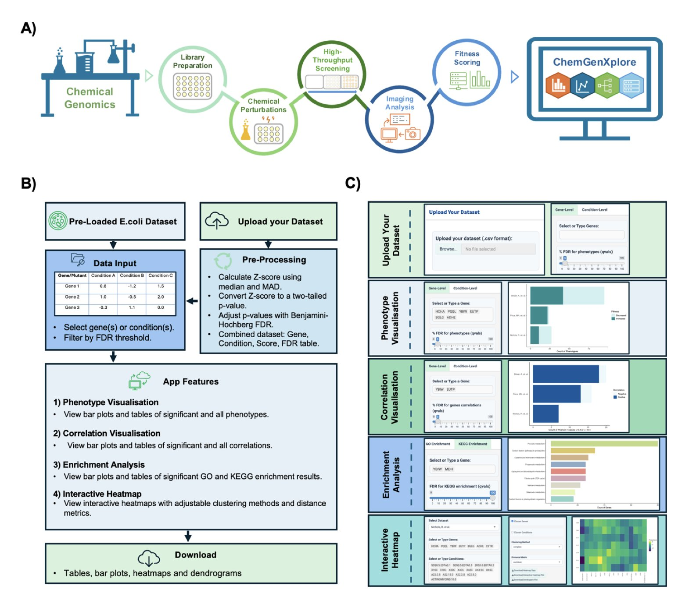
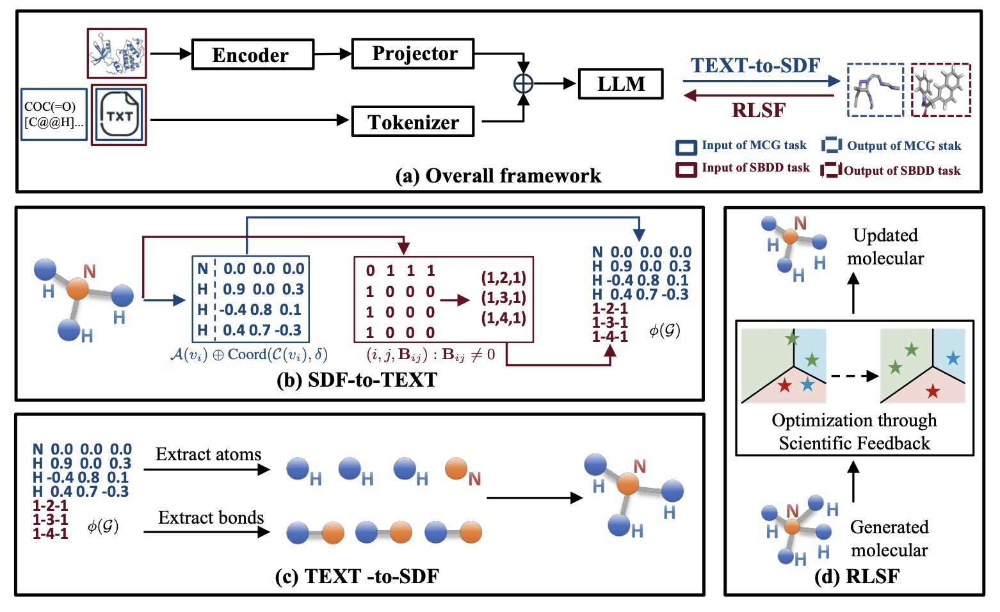
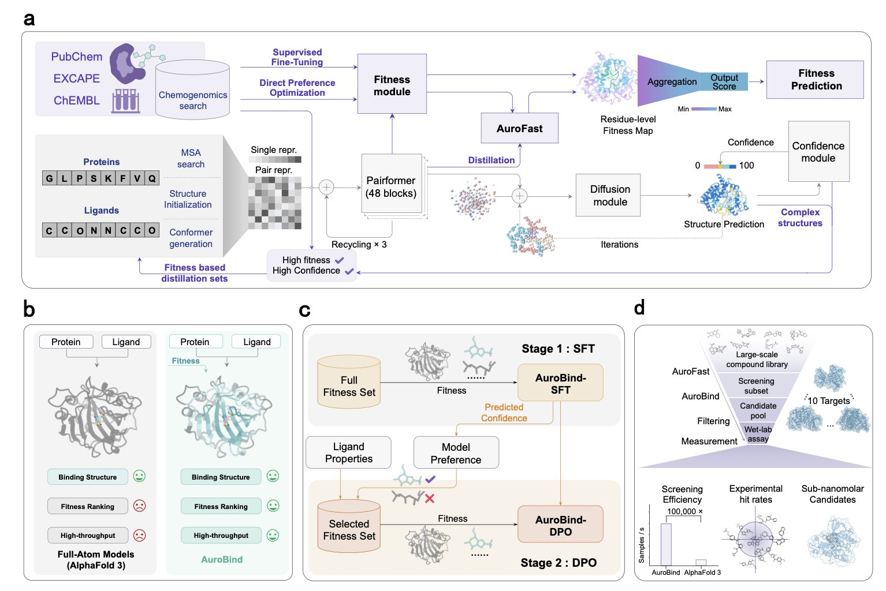

## Table of Contents
1. ChemGenXplore bundles multiple complex chemogenomic analysis functions into an interactive web platform that’s extremely friendly for experimental scientists.
2. Chem3DLLM uses a clever reversible compression encoding to successfully "translate" 3D molecular structures into text that LLMs can understand, opening a new, end-to-end path for structure-based drug design.
3. AuroBind truly aligns structural predictions with large-scale bioactivity data and has found picomolar-level active molecules for orphan targets with no structural information. This is what virtual screening should look like.

## 1. ChemGenXplore: A New Tool for Exploring Chemogenomic Data

Anyone who does high-throughput screening knows that getting the data is just the first step. The real headache is dealing with the mountain of complex, high-dimensional data that follows.

A single chemogenomic screen can involve thousands of genes and dozens of treatment conditions, resulting in a frighteningly large data matrix. Usually, this data has to be handed off to a bioinformatician. The back-and-forth means there’s often a significant delay between generating data and gaining insights.

Now, researchers have developed a tool called ChemGenXplore, which is essentially a Shiny app. For those familiar with R, Shiny can turn an analysis script into an interactive webpage, allowing people who don't know how to code to use it directly. This is the core value of ChemGenXplore: it packages a standard chemogenomic analysis pipeline into a graphical interface that anyone can use with a few clicks.

Let's look at what it can do.

First is **phenotype visualization**. Say you've treated a yeast gene-knockout library with a compound library and want to quickly see which gene deletions make the yeast particularly sensitive to your "star molecule." In the past, you might have struggled with spreadsheets. Now, you just enter a gene name or treatment condition into ChemGenXplore, and an interactive bar chart pops up. You can even filter by an FDR (False Discovery Rate) threshold to make sure you're looking at statistically sound results. This greatly speeds up the initial screening for "hits."

Next is **correlation analysis**, which is key to uncovering biological stories. If two genes have very similar fitness profiles across all compound treatments, they are likely working in the same biological pathway. Conversely, if two compounds produce similar "kill profiles" across the entire gene library, their mechanisms of action might be similar. The tool helps you calculate these correlations and displays them clearly in charts. By setting a correlation threshold, like ±0.4, you can quickly lock onto gene or compound pairs worth investigating further, avoiding getting lost in noisy data.

Then there's **functional enrichment analysis**. You've found dozens of sensitive genes, what's next? What do they do? ChemGenXplore integrates GO and KEGG enrichment analysis. You feed it your gene list, and it automatically tells you if these genes are clustered in specific pathways, like DNA damage repair, the mitochondrial respiratory chain, or a particular metabolic pathway. For drug development, this provides direct clues about a compound's mechanism of action, making it a powerful tool for hypothesis generation.

Finally, **interactive heatmaps**. Heatmaps are a classic way to display this kind of high-dimensional data, giving you a clear overview at a glance. You can instantly see which genes are sensitive to which class of compounds and what the clustering patterns in the data look like. The heatmaps in this tool not only allow for custom clustering algorithms but are also interactive—you can zoom, pan, and hover to see specific values. This is much more powerful than looking at a static image.

ChemGenXplore's strengths are "integration" and "ease of use." It turns a bioinformatician's command-line tools into something an experimental scientist can play with in a browser. This significantly shortens the distance from data to insight, allowing the people doing the experiments to explore their own data and test ideas quickly.

📜Paper: https://www.biorxiv.org/content/10.1101/2025.08.13.670066v1

## 2. Can LLMs Finally "See" 3D Molecules? A Look at Chem3DLLM

Who wouldn't want a tool where you could just say, "Hey, here's my target's pocket, design me a high-activity molecule," and it would give you a solid 3D structure? We've been working toward this, but the rise of Large Language Models (LLMs) has made things a bit awkward. LLMs are great at processing text, but a molecule, especially its 3D conformation, is something else entirely. You can't just feed a bunch of atomic coordinates to a token-based model. It's like asking a Shakespeare scholar to read a protein crystal diffraction pattern—they're two different worlds.

The core of Chem3DLLM is what the researchers call "Reversible Compression Molecular Tokenization" (RCMT).

It sounds a bit technical, but think of it as a translator. It can take a complex 3D molecular sculpture and accurately convert it into a thin, text-only "assembly manual." The LLM can't understand the sculpture, but it can read the manual.

The key is "reversible," which means the process is lossless. You can use the manual to reconstruct the original 3D sculpture perfectly, without a single atom or bond out of place. This technique also compresses the molecular data size by a factor of three, which is a significant engineering improvement for those of us who deal with massive datasets.

With the input problem solved, the next step is to make the model work.

In structure-based drug design (SBDD), we care about two things: the protein pocket and the ligand.

Past methods often handled these separately or used complex graph models. The clever thing about Chem3DLLM is that it addresses both within a unified LLM architecture. It uses a lightweight projection module to "translate" the 3D features of the protein pocket and align them into a semantic space the LLM can understand. This way, the model can simultaneously "see" what the pocket looks like and what its own generated molecule looks like, allowing for end-to-end learning within a single framework.

Of course, if you let an LLM run free, it might generate some chemically impossible monsters. This brings us to another highlight: Reinforcement Learning from Scientific Feedback (RLSF). This part is like giving the model a strict chemistry and physics teacher. Every time the model generates a conformation, this "teacher" scores it based on fundamental principles like chemical bond stability and energy levels. It gets a reward for generating stable, low-energy molecules and a penalty for creating bizarre, high-energy structures. This way, the model learns not just to imitate data but to create according to real physical and chemical laws.

What are the results?

📜Paper: https://arxiv.org/abs/2508.10696v1

## 3. AuroBind: From Virtual Screening to Picomolar Hits

In recent years, various "breakthrough" virtual screening (VS) tools have claimed their AI can predict molecular docking with unprecedented accuracy. They are indeed good at generating pretty pictures—a small molecule fits perfectly into a protein's binding pocket, with every hydrogen bond just right. The problem is, half of the molecules in those pictures might have a binding affinity no better than a wet noodle in an actual experiment.

This is the most painful reality in our field: there's a huge gap between a perfect docking pose and an active molecule.

The creators of AuroBind clearly understand this pain. Instead of building another model that just "describes pictures," they tackled the problem at its root.

They took a two-step approach:
1.  **Learn the rules**: First, they trained the model on a massive amount of high-quality crystal structure data of protein-ligand complexes. This is the foundation, teaching the AI the correct "geometric rules" so it knows what a reasonable conformation for a molecule in a pocket looks like.
2.  **Learn good taste**: This is the real masterstroke. Building on the first step, they "fine-tuned" the model using a huge database containing millions of compound-target activity data points. This step isn't about teaching the AI "how to place" but "what to place." The model is forced to learn which structural features and interactions truly correspond to strong biological activity. It learns to distinguish between what "looks good" and what "is good."

The results across ten completely different protein targets showed experimentally validated hit rates from 7% to 69%. In the world of virtual screening, these are very, very impressive numbers. What's more, the compounds they found include potent sub-nanomolar and even picomolar-level molecules.

But that's not even the most impressive part.

The real "wow moment" in this paper is their prospective screening on "orphan" GPCR targets. Take GPR151, for example, a target with no known crystal structure, not even a known binder. For traditional VS methods, this is like searching for a specific needle in a dark, unmapped forest. Under these extreme conditions, AuroBind successfully identified and validated entirely new, active molecules.

This proves it’s not just a tool that's better at "interpolation"; it has a real capacity for "extrapolation"—to explore chemical spaces we've never been to before.

Finally, to make all this practical, they also created a "student model" called AuroFast. Through knowledge distillation, this lightweight model boosts screening speed by 100,000 times while maintaining accuracy. This means a task that used to take a computing cluster months to run can now potentially be done in a few hours.

📜Paper: https://arxiv.org/abs/2508.02137
