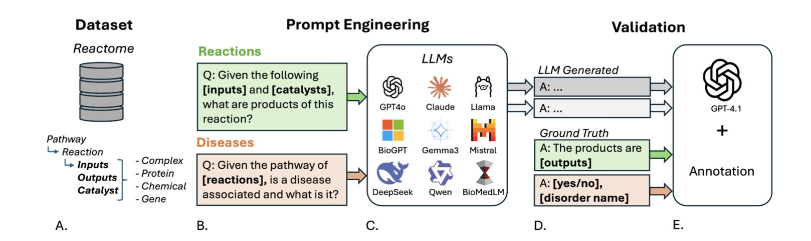
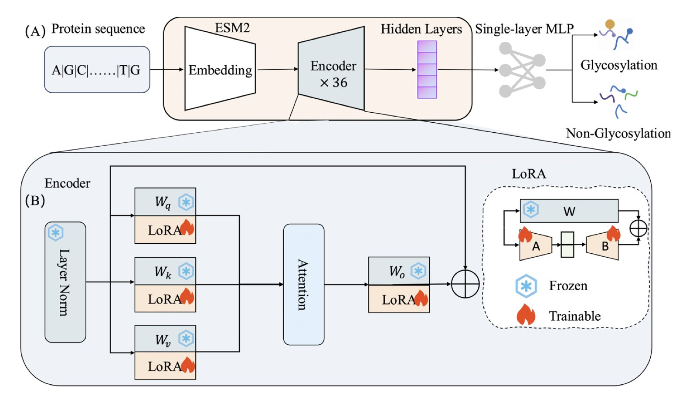
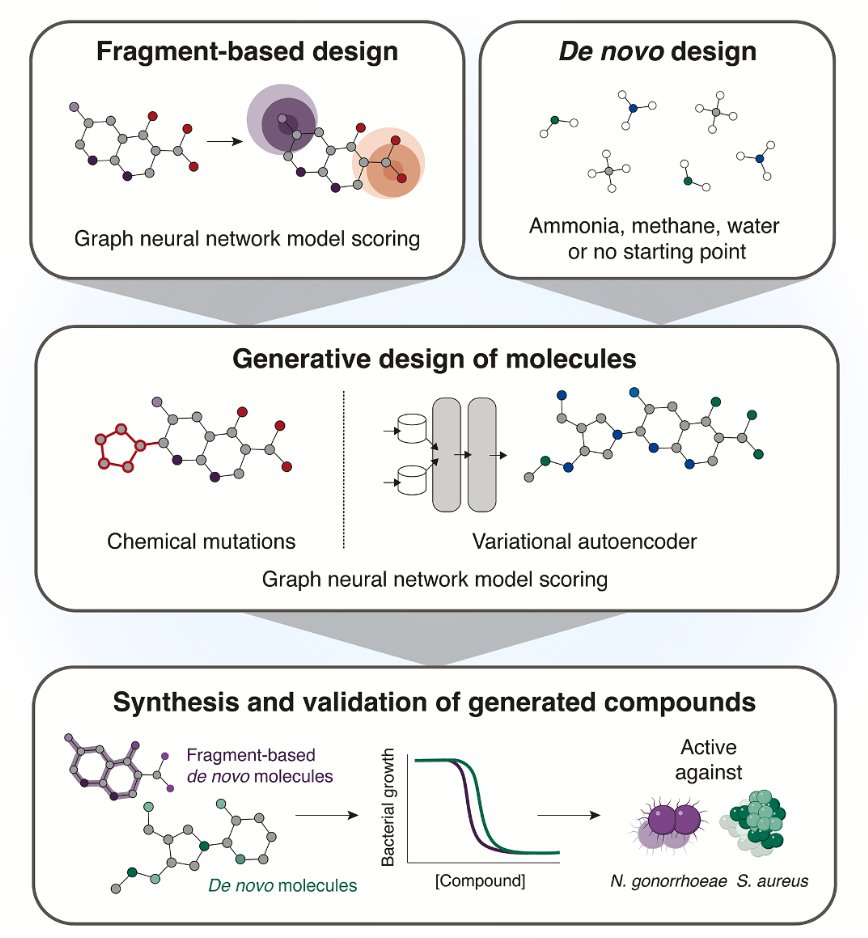

## 目录  
1. 尽管大语言模型（LLM）来势汹汹，但在理解复杂的生化反应网络方面，它们还像个刚入门的实习生，离真正的化学直觉差得很远。
2. 通过 LoRA 技术对大型蛋白语言模型进行「轻量化」微调，ESM-LoRA-Gly 在大幅提升糖基化位点预测精度的同时，显著降低了计算成本，让规模化分析成为可能。
3. 研究者用生成式 AI 框架，成功设计出全新的、对多重耐药菌在动物模型上有效的抗生素，证明 AI 有能力探索未知化学空间来解决棘手的耐药性问题。

## 1. 大模型不懂蛋白质通路？最新评测揭示 AI 短板  
  
  

我们每天都在和各种信号通路打交道，某个激酶被抑制了，下游会发生什么？这个蛋白突变了，会影响哪个代谢途径？我们心里都有一张复杂的网络图。自然而然，大家会想，能不能让 AI 来帮我们理清这些头绪，甚至预测一些我们没想到的连接？  
  
最近，有团队直接把市面上九个主流的 LLM 拉到生化考场上遛了遛。  
  
为了让考试足够专业、公平，他们基于权威的 Reactome 数据库，打造了一个全新的基准测试集——PathwayQA。  
  
这个「考纲」就考两件事：预测反应产物，以及连接通路与疾病。  
  
第一门考试是「化学反应推理」，也就是给你反应物，让你预测产物。结果呢？几乎全军覆没。即便是表现最好的模型，中位恢复分数也只有 0.6667，在及格线边缘疯狂试探。这就像一个学生认识字典里所有的字，但你让他用这些字写一篇逻辑通顺的文章，他就彻底蒙了。LLM 似乎能记住海量孤立的实体（比如蛋白 A、分子 B），但对于它们之间如何动态地、遵循化学和物理规律地相互作用，理解得一塌糊涂。  
  
第二门是「生物学关联分析」，把信号通路和相关疾病对应起来。这块儿的成绩稍微好看点，但平均准确率也才 0.5980，算不上优秀。不过，这里面有个非常有意思的发现：那些通用的、参数量巨大的 LLM，表现居然超过了专门用生物医学文献「喂养」过的模型。这事儿就值得玩味了。是不是说，对于这种需要跨领域知识整合的推理任务，「大力出奇迹」——也就是更大的参数量和更广泛的通识知识——比狭窄的专业知识灌输更重要？这给做模型训练的提了个醒。  
  
研究者还发现了一个现象：如果一个蛋白质是个「交际花」，参与的反应特别多，那模型预测的准确率就明显下降。这太好理解了。对付这种网络中的「中心节点」，需要对复杂的调控网络有全局性的理解，而不是简单的模式匹配。显然，现在的模型还没到这个火候。  

📜Paper: https://www.biorxiv.org/content/10.1101/2025.08.12.669911v1  

## 2. LoRA+ 蛋白大模型：糖基化预测的「轻量级」突破  
  
  

在生物学里，糖基化修饰就像是给蛋白质穿上各式各样的「衣服」，决定了它的功能、稳定性和在细胞里的位置。搞清楚这些「衣服」穿在哪里，对理解疾病机理和开发新药，尤其是抗体这类生物药，至关重要。但问题是，预测这些位点，特别是 O-联糖基化，一直是个难题，有点像大海捞针。  
  
现在，蛋白质领域也有了自己的「GPT」——像 ESM2 这样的大型语言模型。这些模型通过学习海量的蛋白质序列，已经对蛋白质的「语言规则」有了深刻的理解。理论上，我们可以让它来做预测糖基化位点这种下游任务。  
  
但直接上手会遇到一个很现实的麻烦：ESM2-3B 模型有 30 亿个参数，想让它针对一个小任务做全量微调，就像为了拧一颗螺丝而买下一整个五金厂，对计算资源的要求高得离谱。  
  
这篇工作里的 ESM-LoRA-Gly 提供了一个解法。作者没有去调整那 30 亿个参数，而是用了 LoRA（Low-Rank Adaptation）技术。这技术不去改变原有模型庞大的参数矩阵，而是在旁边加了两个小得多的「补丁」矩阵。训练的时候，我们只更新这两个小补丁。这就像你不想重写一本厚厚的参考书，于是只在关键页面上贴了几张便签。效果惊人地好，既能让模型学会新任务，又几乎不增加计算负担。  
  
结果在 notoriously hard 的 O-联糖基化预测上，新方法的 MCC 值（一个衡量分类模型性能的综合指标）直接翻了一倍多，把以前的 SOTA 方法甩在了身后。N-联预测的 AUC-PR 也达到了 0.983，可以说是可靠了。  
  
这意味着我们终于有了一个既准又快的工具，可以在蛋白质组的尺度上进行大规模的糖基化分析。无论是筛选新的药物靶点，还是优化抗体药物的糖基工程以提升药效、延长半衰期，这个工具都能派上大用场。  
  
📜Title: ESM-LoRA-Gly: Improved prediction of N- and O-linked glycosylation sites by tuning protein language models with low-rank adaptation (LoRA)  
📜Paper: https://www.biorxiv.org/content/10.1101/2025.08.12.669850v1  

## 3. AI 从头设计抗生素，动物模型验证有效  
  
  

抗生素的研发管线枯竭，这已经不是什么新闻了。我们几十年里翻来覆去地修饰那些经典骨架，能摘的「低垂之果」早就没了。  
  
这篇论文说他们用 AI 从头（*de novo*）设计出了全新的、而且在动物身上有效的抗生素：真的假的？  
  
作者们用了两种不同的生成式 AI 策略。  
  
第一种是「片段生长法」。这在药物化学里不算新概念，就是从一个已知的、有点活性的「小碎片」（fragment）开始，像搭乐高一样，把它扩展成一个完整的药物分子。但这里的关键是，他们不是让化学家来搭，而是让遗传算法和变分自编码器（VAE）这些 AI 工具去干这个活。这就像给 AI 一小块拼图，让它不仅要补完整个画面，还要保证这幅画「有意义」——也就是有抗菌活性。  
  
第二种方法就更野心勃勃了，叫「无约束从头生成」。这等于给了 AI 一张白纸，让它自由发挥，画出它认为能抗菌的分子。这正是 AI 最激动人心的地方——它有可能跳出人类化学家的思维定势，创造出我们从未想过的化学结构。当然，这也最容易翻车，AI「画」出来的东西很多时候要么合成不出来，要么根本没用。  
  
结果他们从计算机设计的分子里挑了 24 个去合成，其中 7 个表现出了选择性的抗菌活性。这个命中率对于探索全新化学空间来说，相当不错了。  
  
最让人印象深刻的是两个明星分子：NG1 和 DN1。  
  
NG1 专门对付淋病奈瑟菌——一种让我们公共卫生部门头疼不已的耐药菌。它的作用机制很直接，就是去搞乱细菌的细胞膜，降低膜的流动性，最后让整个膜失去完整性。你可以把它想象成是去戳破气球，而不是费劲地去拆解气球内部的复杂机械。  
  
这种攻击细胞膜的策略，挑战永远在于选择性：怎么保证只戳破细菌的气球，而不伤到我们自己的人体细胞？论文里的数据显示 NG1 毒性很低，这开了个好头。更重要的是，它在一个模拟感染的小鼠模型里确实起作用了。  
  
另一个分子 DN1，则表现出对包括 MRSA 在内的革兰氏阳性菌的广谱活性。这证明了 AI 平台不是只能碰运气找到一个管用的分子，而是有能力针对不同目标产出不同的解决方案。  
  
所以，这事意味着什么？  
  
这首先是一个强有力的概念验证（proof of concept）。它告诉我们，现在的 AI 工具已经不只是纸上谈兵，它们能实实在在地走通「从算法到动物模型有效」的全过程。这是从 0 到 1 的突破。  
  
当然，这只是先导化合物，离真正的药物上市还有十万八千里。接下来的药代动力学、毒理学研究，以及漫长又昂贵的临床试验，每一步都是雷区。但这项工作最有价值的地方在于这个 AI 平台本身。  
  
📜Title: A Generative Deep Learning Approach to De Novo Antibiotic Design  
📜Paper: https://www.cell.com/cell/abstract/S0092-8674(25)00855-4
