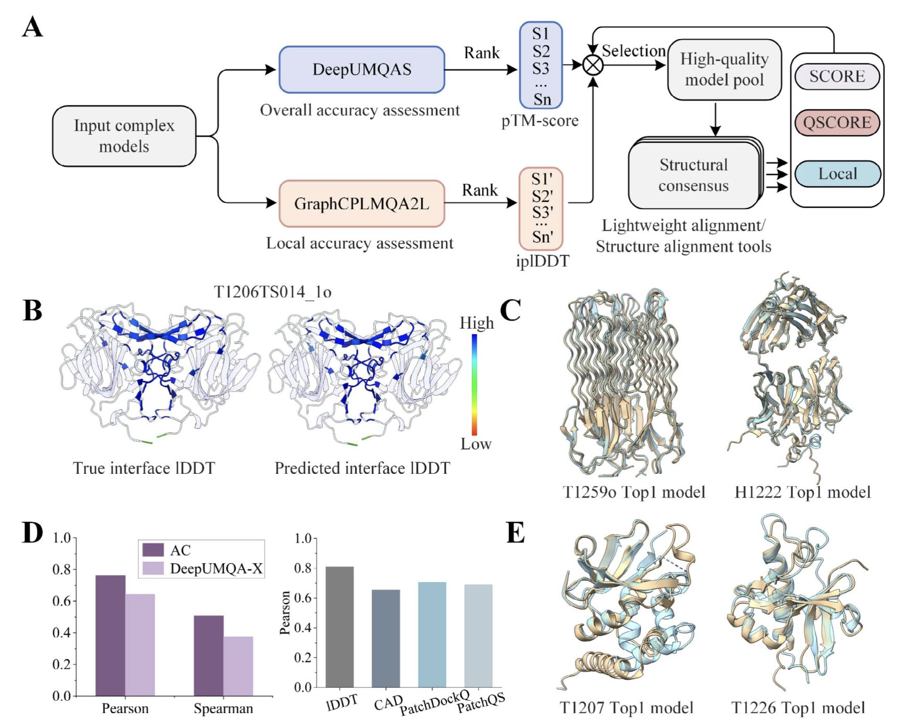
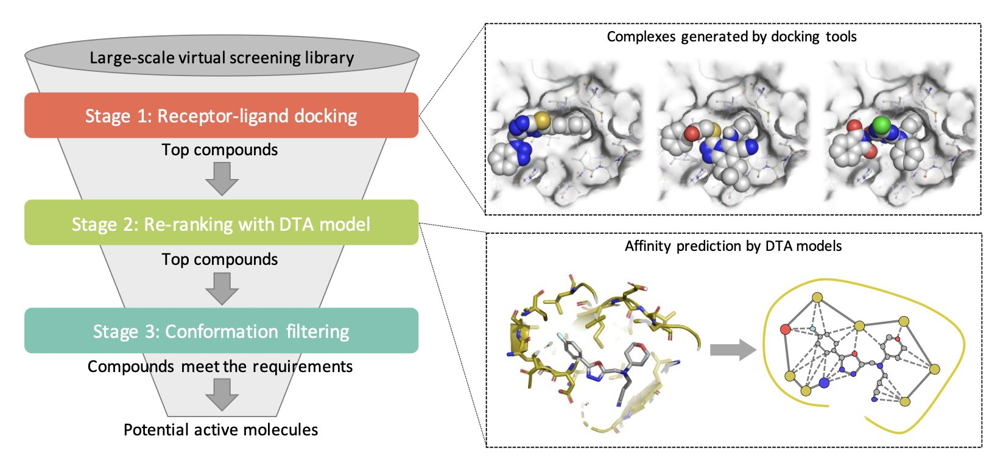
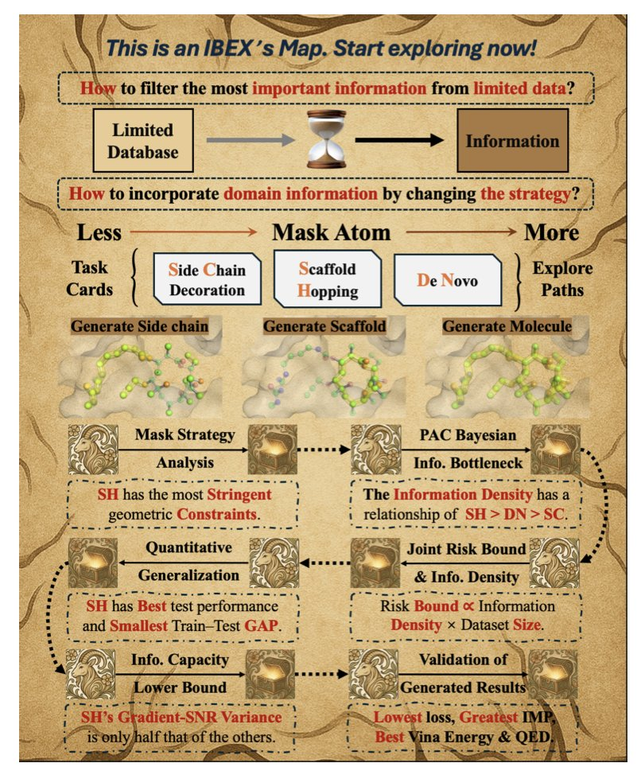

## 目录  
1. CASP16 的模型质量评估（MQA）竞赛表明，在 AI 预测出海量高质量结构后，真正的挑战已经从「预测」转向「精选」——如何从万千相似模型中挑出那个最接近真实世界的构象。
2. HelixVS 巧妙地将深度学习模型嵌入传统分子对接流程，通过精准重打分来解决「姿势对，分不对」的老大难问题，显著提升了苗头化合物的发现效率。
3. IBEX 巧妙地将信息论和物理优化结合，解决了药物发现中老大难的数据稀缺问题，让 AI 在几乎「空手」的情况下也能生成靠谱的分子。

## 1. CASP16 模型评估：AlphaFold 之后，我们如何去伪存真？  

  

自从 AlphaFold 把蛋白质结构预测的难度从「几乎不可能」拉到「日常操作」后，做药的就进入了一个甜蜜的烦恼期：结构模型多得看不完。  

这些模型哪个才是真正能指导我们设计分子的「真身」？  

CASP16 的模型质量评估（EMA）环节，就是想回答这个问题。它就像是整个结构预测领域的质检部门。  

今年的比赛搞了个新花样，叫 QMODE3。规则很简单：给参赛者数千个由 MassiveFold 生成的、看起来大同小异的蛋白模型，然后让他们挑出最好的五个。这一下就把难度拉满了。这不再是简单的「对」或「错」的判断题，而是变成了精细的鉴赏题。说白了，这就像让你从一堆高仿的艺术品里找出最接近原作的那几件，极其考验眼力。这恰恰模拟了我们在真实研发中面临的窘境：拿到一堆 AI 模型，到底信哪个？  

这次的竞赛，各家拿出的看家本领也很有意思。  

MIEnsembles-Server 团队拿下了折叠准确度评分的头名。他们的方法 StrMQA，思路：先用自家的 DMFold 生成一批高质量的「参考答案」，然后让机器学习模型来比较候选模型和这些参考答案有多像。这是一种很实用的策略，相当于请了一位经验丰富的老师傅，让他对着标杆来评判新学徒的作品。  

而 ModFOLDdock2 则在界面准确性上独占鳌头。这对药物发现尤其重要，因为药物作用的地方往往就是蛋白 - 蛋白相互作用（PPI）的界面。他们的方法像一个工具箱，集成了好几种新的评分函数，针对不同的任务（比如排序、打分）还有专门优化的版本。这表明，一个单一的评价指标可能已经不够用了，需要一个组合拳。  

MULTICOM 和 GuijunLab 算是主流 AI 方法的代表。他们用了图神经网络、Transformer 这类时髦的架构，试图从模型自身的特征和模型之间的两两比较中，挖掘出质量高低的线索。比如 MULTICOM_GATE 就用了一个图转换器来同时处理单个模型的特征和模型间的相似性，而 GuijunLab 则开发了一个统一的框架 DeepUMQA-X，把单模型方法和共识策略结合起来。这些方法代表了用更复杂、更强大的算法来解决问题的方向。  

不过个人觉得最有启发性的，是 Shortle 小组的思路。他们的方法听起来有点「返璞归真」。他们不搞复杂的机器学习，而是直接把 AI 预测的模型，拿去和高分辨率的 X 射线晶体结构数据库做对比，检查那些最基本的结构参数——比如化学键长、键角、氨基酸侧链的构象分布等等——是不是符合真实世界蛋白质的统计规律。  

这就像一个资深结构生物学家在审视一个新结构时，会下意识地检查：「这个苯环的位置是不是有点别扭？」「这里的扭转角在 Ramachandran 图里是不是处于一个很罕见的区域？」。这种方法虽然在这次比赛中不是最强的，但它提供了一个至关重要的视角：无论 AI 模型多么精巧，它最终必须服从物理和化学的基本法则。这为我们提供了一种独立于 AI 黑箱的、基于第一性原理的「理智检查」（sanity check）。  

所以，CASP16 的这场评估赛看下来，一方面，大家在机器学习的道路上越走越深，模型越来越复杂；另一方面，也有人开始回归本源，试图用生物物理和化学的尺子来衡量 AI 的产出。  

📜Title: Highlights of Model Quality Assessment in CASP16  
📜Paper: https://onlinelibrary.wiley.com/doi/full/10.1002/prot.70035  

## 2. HelixVS: AI 为传统分子对接装上新引擎  

  

做虚拟筛选（Virtual Screening）是个体力与脑力的双重考验。  

我们用分子对接软件，比如经典的 Vina，一口气筛几百万甚至上亿的分子，试图从中找到那么几个能跟靶点结合的「天选之子」。  

但结果往往让人头疼：软件给出的结合构象看起来挺像那么回事，可打分却一塌糊涂，真正有活性的分子常常被埋没在成千上万的「高分低能儿」里。这就像大海捞针，捞了半天，结果发现手里的磁铁吸力不够。  

HelixVS 这个平台似乎想给我们换一块更强的磁铁。  

研究者们很清楚，像 Vina 这类工具，在快速生成大量合理结合构象（pose）方面，依然是高效的「老黄牛」。它们的短板在于打分函数（scoring function），这个函数试图用一个简单的数学公式去模拟复杂的分子间相互作用力，结果自然是差强人意。  

HelixVS 的做法是「让专业的人做专业的事」。  

它把整个筛选过程拆成了几步：  

第一步，还是用 Vina 这样的老工具去干粗活，快速生成一大堆化合物和靶点的结合构象。不求精准，但求全面。  

第二步，就是这个平台的核心了。它用一个深度学习训练出来的打分模型，来重新评估第一步生成的所有构象。这就像请来一位经验丰富的老专家，对机器筛选出的结果进行二次审核。深度学习模型看过的数据远比任何物理公式要复杂，它能从数据中「悟」出一些更微妙的结合模式，因此它的打分理论上会更接近真实的结合亲和力。这个「重打分」的策略，直接命中了传统对接的要害。  

第三步，还有一个可选的构象过滤步骤。这对于做药化的人来说非常有用。比如，我们根据已知的活性分子，推断某个氢键是活性的关键。那就可以在这里加一个筛选条件，只保留那些形成了关键氢键的构象。这相当于把化学家的经验和直觉也整合进了筛选流程。  

那么，效果如何？  

在 DUD-E 这个行业标准「考场」上，HelixVS 的成绩单很亮眼，富集因子（enrichment factor）平均提升了 2.6 倍，速度还快了十几倍。但说实话，基准测试跑得好不代表一切。真正让我觉得这个工具有点意思的，是研究者们把它用在了四个真实的研发管线上，靶点覆盖了 CDK4/6、TLR4/MD-2、cGAS 和 NIK 这几个不同类型、且有一定挑战性的蛋白。  

结果，它们在每个项目里都找到了有活性的化合物，活性从微摩尔（μM）到纳摩尔（nM）级别。这就不是纸上谈兵了，这证明了这套「经典对接 + AI 重打分」的组合拳，在真实世界里是能打的。它能从庞大的分子库里，实实在在地「捞」出好东西。  

这个团队还考虑到了工具的落地问题。他们提供了一个算力有限的免费公网版本，方便学术界的试用。  

对于在工业界、数据安全是第一位的公司，他们也支持私有化部署。这种设计思路，显然是懂行的。  

📜Title: HelixVS: Deep Learning Enhanced Structure-Based Virtual Screening Platform for Hit Discovery  
📜Paper: https://arxiv.org/abs/2508.10262v1  

## 3. AI 制药新突破：IBEX 用小数据生成高分子的秘密  

  

做新药研发，尤其是针对新靶点，我们永远都在和「数据不足」作斗争。  

好不容易解析出一个蛋白 - 配体的晶体结构，整个团队都得开香槟庆祝，但这不过是茫茫化学空间里的一个点。想用这一个或几个数据点就让 AI 模型学会创造新分子，这无异于让一个只读了一句唐诗的人去写一首七言律诗，太难了。  

最近一篇叫 IBEX 的文章，思考了在数据极度稀缺的情况下，我们到底该怎么做。  

作者们的思路是一个「从粗到精」的两步生成过程。这事儿其实很符合化学家的直觉。第一步，模型先「粗略」地生成一个能塞进蛋白结合口袋的分子。这一步不要求尽善尽美，关键是把分子的基本拓扑和三维形状搞对，确保它和口袋「八字相合」。这就像雕刻家先用斧子砍出石像的大致轮廓。  

第二步，也是点睛之笔，是「精修」。模型会调用经典的物理优化算法（L-BFGS）来微调分子的构象。这一步的意义在于，它把物理化学的规则重新请回了谈判桌。AI 生成的原子位置可能在几何上合理，但不一定符合能量最低、最稳定的原则。物理优化就像雕刻家换上小刻刀，精雕细琢每一个细节，确保最终的分子不仅「放得进去」，而且在口袋里的姿态还是舒服的、能量有利的。  

光有流程还不够，IBEX 还引入了信息瓶颈理论，试图从根本上解释为什么这么做会有效。这个理论听起来有点绕，但核心观点很朴素：不是所有的数据都生而平等。在数据量极少时，每一个样本都极其珍贵。作者发现，像「骨架跃迁」这种任务——保持核心骨架不变，只替换周边的 R 基团——因为有很强的几何约束，所以每个样本携带的「信息密度」特别高。相比之下，漫无目的地「从头生成」一个分子，模型需要学习的东西太多，有限的数据根本不够看。这为我们今后如何设计小样本学习任务提供了很重要的理论指导。  

当然，最终还是要看结果。IBEX 把零样本对接的成功率从 53% 提升到了 64%，Vina score 也从 -7.41 优化到了 -8.07 kcal/mol。这些数字的提升背后，是计算资源的节省和更高质量候选分子的产出。  

更有意思的是，药物相似性 QED 提升了 25%，这意味着它生成的分子不光结合得好，还越来越像个「药」了，而不是那些合成不出来或者代谢稳定性一塌糊涂的怪胎。  

AI 制药的出路，可能不在于无尽地堆砌数据和算力，而在于将机器学习的模式发现能力与经典的物理化学原理、信息论进行更深度的融合。  

📜Title: IBEX: Information-Bottleneck-Explored Coarse-to-Fine Molecular Generation under Limited Data  
📜Paper: https://arxiv.org/abs/2508.10775
