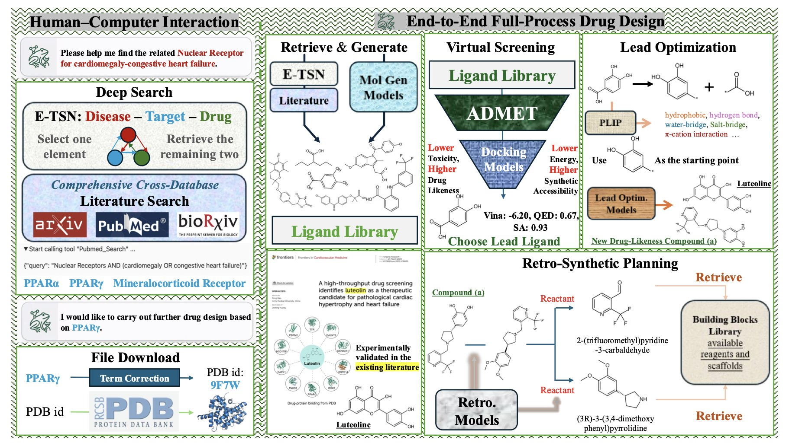
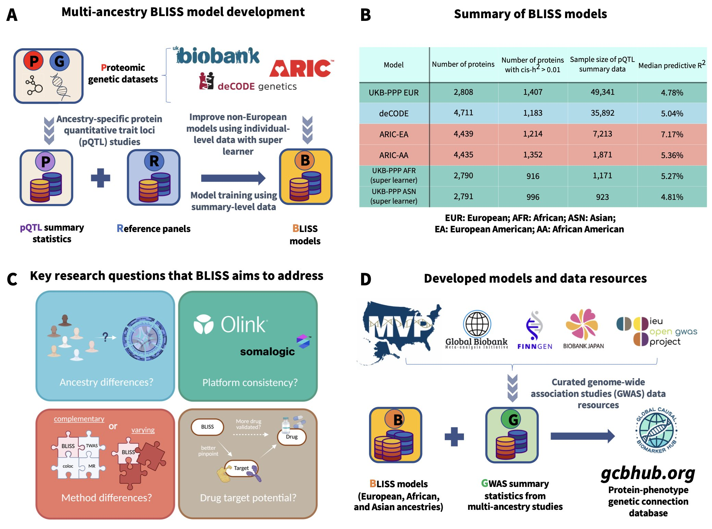
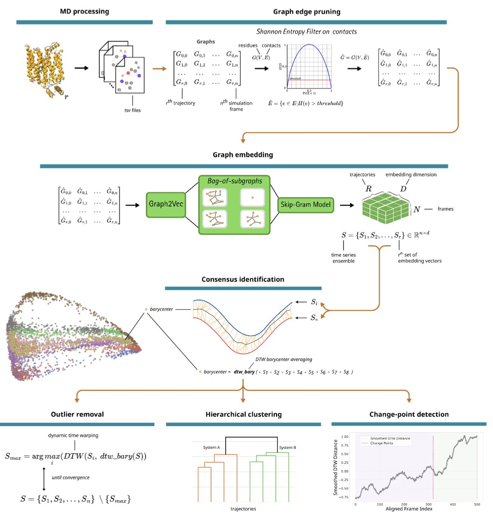

## 目录  
1. FROGENT 将药物发现的碎片化工具整合成一个自动化的 AI 智能体，不仅在多项基准测试中表现出色，还通过具体案例展示了从靶点发现到分子设计的实际潜力。
2. BLISS 框架巧妙地绕过了蛋白质组学研究中个体数据的获取瓶颈，利用易于获取的 pQTL 摘要数据，构建了强大的多族裔蛋白预测模型，为药物靶点发现提供了新利器。
3. NetMD 将图论和时间规整巧妙结合，为我们提供了一种无需预设的、能够自动对齐并比较多条分子动力学轨迹的强大新工具。

## 1. FROGENT: AI 智能体打通药物发现全流程，真能一步到位？  
  
  

做药的日常工作就是一场漫长的接力赛。  
  
搞生物的找到靶点，递给做化学的；化学的合成一批化合物，再递给做药理药代测试的。中间任何一环脱节，整个项目都得停滞。  
  
这么多年，AI 工具也出了不少，但大多是「单点工具」，这边帮你预测个蛋白结构，那边帮你设计个分子片段，用起来还是零散得很。  
  
现在，FROGENT 这个 AI 智能体想把整个流程自动化。那么，它葫芦里卖的什么药？  
  
FROGENT 的架构设计得像个层次分明的工具箱。底层是**数据库层**，相当于一个无所不知的图书馆员，把浩如烟海的文献和结构化的生化数据都整合好了。中间是**工具层**，这里放着各种做计算化学的「硬核工具」，比如分子对接、性质预测这些我们天天都要用的程序库。最上层是**模型层**，这里有一群「专家模型」，每个都精通一项特定任务，比如预测 ADMET、评估合成可行性等。一个大语言模型（LLM）则扮演着总指挥的角色，根据你的需求，动态地调用这些数据库、工具和模型，组织起一个完整的工作流。  
  
听起来很美好，但行不行，还得看数据。  
  
研究者们让 FROGENT 在八个覆盖药物发现全流程的基准测试上跑了一遍。结果是，在「苗头化合物发现」这个环节，它的性能是之前最佳基线的**三倍**；在「相互作用分析」上，性能翻了一番。这些数字超过了不少我们熟知的开源乃至商业化模型。当然，基准测试终归是基准测试，但这个成绩至少说明它的基本功是扎实的。  
  
这个系统里一个很设计是所谓的**模型上下文协议（MCP）**。MCP 你可以把它理解成一个「通用电源插座」。它制定了一套标准，让 AI 模型和外部工具可以顺畅地对话。这意味着 FROGENT 不挑食，你可以把任何遵循这套标准的 LLM 或者新的计算工具接上去。这让它不容易过时，因为 AI 和计算化学的工具总在飞速发展，有了这个协议，FROGENT 就能随时「升级换代」。  
  
当然，最关键的还是看它能不能干点实事。论文里给了两个案例。  
  
第一个案例，他们直接给 FROGENT 一个疾病——心肌肥大和充血性心力衰竭。FROGENT 自己去文献库里挖掘，最终把目标锁定在 PPARγ这个靶点上。接着，它开始从头设计候选分子，经过一系列筛选和评估，最终提出了一个全新的化合物，预测的各项性质都优于已知分子。这个过程，从靶点识别到分子生成，完全是自主完成的。  
  
第二个案例更贴近日常的优化工作。他们拿一个已知的碳酸酐酶 II 抑制剂扔给 FROGENT，任务是「让它变得更好」。FROGENT 对这个分子进行了分析和改造，最后拿出的新分子，不仅预测的结合亲和力更高，ADMET 性质也得到了改善。  
  
FROGENT 是一个雄心勃勃的尝试，想把药物发现这个复杂、碎片化的流程，用一个 AI 智能体给整合起来。它不是要取代科学家，更像是一个超级强大的研究助理，能帮你处理大量繁琐的计算和信息检索工作，让你把精力集中在最关键的决策上。这种模式如果真能跑通，无疑会大大降低计算辅助药物发现的门槛，让更多实验室有能力参与到创新药的早期发现中来。  
  
📜Paper: https://arxiv.org/abs/2508.10760  

## 2. BLISS 框架：用 pQTL 摘要数据解锁多族裔药物靶点  
  
  

在药物研发领域，我们总是在寻找连接基因与疾病的那个关键蛋白。  
  
蛋白质组学关联研究（PWAS）是做这件事的利器，但它有一个问题：极度依赖大规模、包含个体遗传和蛋白表达数据的队列。获取这样的数据，尤其是涉及敏感的个人信息，是个不小的挑战，常常让研究卡在起点。  
  
BLISS 框架看起来像是一个解法。作者们没有去硬磕那些难以获取的个体数据，而是另辟蹊径，把目光投向了更容易获得的 pQTL 摘要数据。  
  
就像你不需要拿到每个厨师的私房菜谱，只要分析足够多的餐厅菜单和食客评价，就能反推出哪些食材组合最受欢迎。BLISS 做的就是类似的事情，它利用 UK Biobank、deCODE 这些大型研究公布的「菜谱摘要」——也就是基因变异与蛋白水平的关联强度——来构建预测模型。  
  
这个方法的厉害之处在于，它不仅解决了数据可及性的问题，还把规模做到了极致。研究者整合了多个数据库，覆盖了近 6000 种蛋白质，建立了一套规模庞大的欧洲人群模型。  
  
更重要的是，他们没有止步于此。我们都知道，药物研发长期被「欧洲中心主义」的数据所困扰，一个在欧洲人群中看起来完美的靶点，在其他族裔中可能效果平平甚至带来副作用。BLISS 框架通过整合规模相对较小的亚洲和非洲人群数据集，成功将模型拓展到了多族裔。  
  
结果模型不仅跑得通，而且表现好得出人意料。在与那些基于个体数据训练的传统模型对比时，BLISS 的预测准确性不相上下，甚至在遗传度较高的蛋白上表现更优。这有点反直觉，但或许说明，超大规模的摘要数据在信噪比上本身就具备某种优势。  
  
当然，我们最关心的还是它到底能不能找到靠谱的靶点。  
  
答案是肯定的。通过对超过 2500 种表型进行分析，BLISS 不仅发现了大量已知的蛋白 - 疾病关联，还挖出了许多具有明显族裔特异性的新线索。比如，在欧洲和非洲人群中，很多关联信号的强度和方向都有显著差异。这意味着，未来的药物开发必须更加重视人群多样性。更让人兴奋的是，与 TWAS、孟德尔随机化（MR）等其他计算方法相比，BLISS 找到的潜在靶点与已上市药物靶点或临床验证靶点的重合度更高。这就像一个探矿工具，不仅能发现矿藏，还能告诉你哪些矿更容易开采，商业价值更高。  
  
作者还做了一个业内人士很关心的横向比较：Olink 和 SomaScan 两大蛋白质检测平台的数据。结果显示，两个平台的数据各有侧重，整合使用能提供互补的生物学信息。这再次印证了在「大数据」时代，多源数据的整合才是王道。  
  
作者将所有模型和资源都公开了。这无疑为整个社区提供了一个强大的工具，让更多没有权限接触大型生物样本库的研究者，也能站在巨人的肩膀上，探索蛋白、基因与疾病的复杂关系。  
  
📜Title: Large-scale imputation models for multi-ancestry proteome-wide association analysis  
📜Paper: https://www.biorxiv.org/content/10.1101/2023.10.05.561120v2  

## 3. NetMD: 用图嵌入驯服分子动力学轨迹  
  
  

做分子动力学（MD）模拟跑了一堆独立的模拟，每条轨迹都像一个讲着方言的叙述者，时间线对不齐，关键事件发生的先后顺序也乱七八糟。想从这一堆「故事」里拼凑出一条清晰的主线，简直是场噩梦。传统方法通常依赖于预先定义好的反应坐标，但这本身就带入了偏见——你只能看到你想看到的东西。  
  
NetMD 方法，给这个问题提供了一个解法。  
  
作者们的想法是，别再纠结于原子坐标的直接比较了。他们换了个角度，把蛋白质的每一帧构象看成一个「社交网络」。在这个网络里，每个氨基酸残基是一个节点，如果两个残基离得够近，它们之间就有一条边。这样一来，复杂的蛋白质三维运动就被转换成了一系列随时间变化的「关系图」。  
  
这还没完。接着，他们用图嵌入技术，把每一张复杂的「关系图」压缩成一个低维向量——你可以把它想象成这张图的唯一「指纹」。现在，原本一条包含数万帧、混乱不堪的 MD 轨迹，就变成了一串清爽的、按时间顺序排列的「指纹」序列。  
  
有了这个序列，真正的魔法才开始。作者们引入了动态时间规整（Dynamic Time Warping）算法。这个算法很擅长对齐两个速度不一的序列，就像音频识别软件能识别出你哼唱的、节拍不准的歌曲一样。NetMD 用它来拉伸或压缩不同模拟轨迹的「指"纹」序列的时间轴，直到它们完美对齐。  
  
通过这个过程，NetMD 不仅能计算出一条「共识轨迹」——也就是所有模拟共同讲述的故事，还能精准地揪出那些「不合群」的模拟，或者在某个时间点上，某条轨迹开始「跑偏」的瞬间。  
  
研究者们在几个很有挑战性的体系上验证了 NetMD 的威力，比如葡萄糖转运蛋白 GLUT1 和赖氨酸特异性去甲基化酶 KDM6A。结果很漂亮。这个方法能自动识别出野生型和突变体蛋白在动态行为上的关键差异窗口，而这些窗口恰好对应了已知的、影响功能的构象变化。  
  
整个过程是「无监督」的。你不需要给它任何提示，告诉它该关注哪个口袋的开放，或者哪条 loop 的运动。它自己就能从数据中发现最重要的动态事件。这对于药物发现来说价值巨大，它既能帮助我们验证一个已有的机理假设，也能在我们毫无头绪时，为我们指出新的方向。  
  
这个工具已经开源，对于计算驱动的药物研发来说，它有潜力成为一个分析 MD 数据的标准流程。它把我们从繁琐的轨迹比对中解放出来，让我们能更专注于理解分子背后的生物学故事。  
  
📜Title: NetMD: Unsupervised Synchronization of Molecular Dynamics Trajectories via Graph Embedding and Time Warping  
📜Paper: https://www.biorxiv.org/content/10.1101/2025.08.12.669871v2  
💻Code: https://github.com/mazzalab/NetMD
