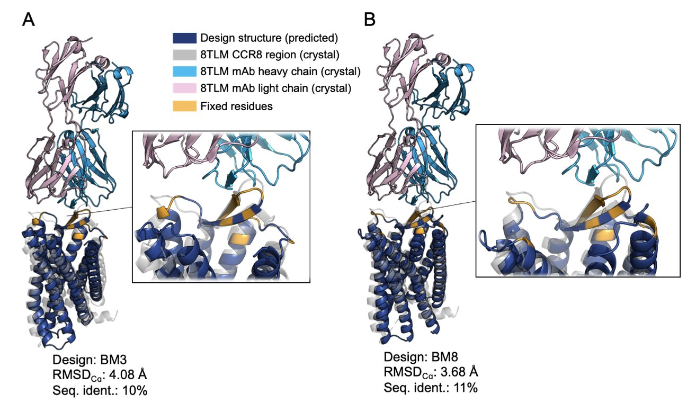
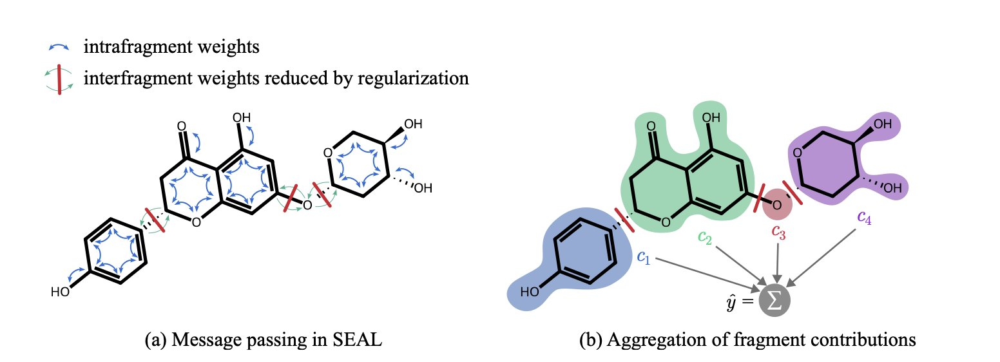
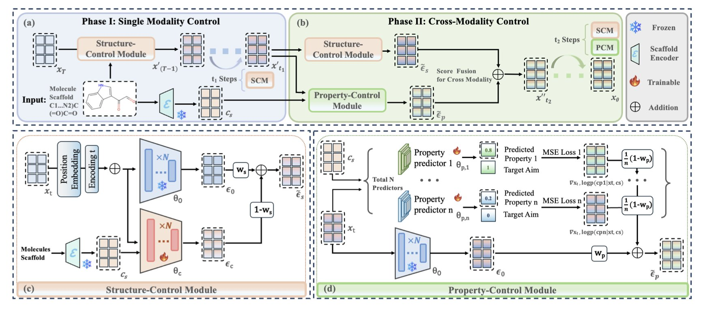

## 目录  
1. 通过从头计算设计，研究者成功将难搞的膜蛋白 CCR8 改造为水溶性蛋白，同时保留了关键的抗体结合位点，为 GPCR 药物研发扫清了一大障碍。
2. SEAL 通过将分子拆解为化学基团并独立分析其贡献，让图神经网络的预测结果变得直观可信，解决了 AI 模型的「黑箱」问题。
3. 通过即插即用的结构和属性控制模块，CMCM-DLM 让 AI 分子生成模型学会了「戴着镣铐跳舞」，在不重新训练的条件下实现精准的定制化分子设计。

## 1. 计算设计可溶性 GPCR，攻克 CCR8 成药难题  
  
  

GPCR（G 蛋白偶联受体）家族就像一座巨大的金矿，超过三分之一的已上市药物都靶向它们。但同时，它也是出了名的难开发。因为它是膜蛋白。  
  
你可以把膜蛋白想象成一块镶嵌在肥皂泡（细胞膜）上的油腻的石头。它天生就喜欢待在油性环境里。一旦你试图把它从细胞膜里拽出来，放到水溶液里，它就会变得极不稳定，像受惊的猫一样蜷缩成一团，失去原有的结构和功能。这就给我们后续的工作，比如筛选抗体、做生化实验、解析结构，带来了无穷无尽的麻烦。  
  
这篇论文要处理的就是这个问题，他们选了一个当下非常热门的免疫肿瘤学靶点——CCR8。CCR8 主要在肿瘤浸润的调节性 T 细胞（Tregs）上高表达，是清除肿瘤微环境中「叛徒」T 细胞的理想靶点，各大药厂都在布局。  
  
#### 怎么把「疏水」变成「亲水」？  
  
研究者们没有用传统的试错法去修修补补，而是直接用计算设计的方法，釜底抽薪，给 CCR8 做了一次「脱胎换骨」的大手术。  
  
他们的思路是这样的：  
1.  **保留核心功能区** ：首先，他们明确了目标。他们不指望这个改造后的蛋白还能传递信号，他们只需要它能被特异性的抗体（mAb1）识别就行。这意味着，只要保留住抗体结合的那个关键表面区域（表位）的正确构象就可以了。  
2.  **全面替换其他部分** ：对于蛋白的其他部分，特别是那些原来深埋在细胞膜里的「油腻」区域，他们用上了像 ProteinMPNN 这样的 AI 模型。这个模型干的活儿，就是把那些疏水的氨基酸，大规模地替换成亲水的氨基酸。  
3.  **确保结构稳定** ：当然，不能瞎换。整个替换过程需要 AlphaFold 这样的结构预测模型全程「监工」，确保新的氨基酸序列还能折叠成我们想要的那个三维结构，而不是一堆废品。  
  
这就好比，我们要复制一把能开特定锁的钥匙。我们不需要用和原版完全一样的金属材料，我们只需要保证钥匙上「齿」的形状和排列是完全正确的就行了。其他部分，我们可以用更稳定、更容易加工的材料来替代。  
  
#### 结果怎么样？  
  
结果他们设计并成功表达了 13 个 CCR8 的水溶性类似物。这些新蛋白的氨基酸序列和天然的 CCR8 相比，相似度只有 10-13%！这基本上等于是一个全新的蛋白质了。  
  
但就是这样一个「面目全非」的蛋白，通过表面等离子共振（SPR）技术检测，它与目标抗体 mAb1 的结合能力（KD 值在 77-857 nM 之间）和野生型 CCR8（KD 值约 190 nM）基本在同一个水平。这证明「钥匙的齿」被完美地保留了下来。  
  
更重要的是，这些蛋白的表达产量能达到 70 mg/L以上。这是一个非常实在的数字，意味着我们可以轻松地获得足够量的、性质稳定的蛋白，用来做各种下游应用。  

📜Paper: https://www.biorxiv.org/content/10.1101/2025.08.18.670068v1  

## 2. SEAL 模型：让 GNN 的分子预测不再是黑箱  
  
  

现在谁的项目里没几个 AI 模型在跑。其中，图神经网络（GNN）因为能直接处理分子图结构，成了预测分子性质的香饽饽。  
  
但我们都遇到过同一个尴尬的场景：  
  
项目会上，计算化学家展示了一个模型预测活性超强的分子。作为药物化学家，肯定会问：「为什么？是分子哪个部分让它这么厉害？我下一步该优化哪里？」这时，计算化学家往往只能耸耸肩，说：「模型就是这么说的。」  
  
这就是 GNN 最大的问题——它是个黑箱。  
  
它能给你一个结果，但通常给不了令人信服的理由。这对于需要做出「下一步合成哪个分子」这种关键决策的我们来说，帮助有限。  
  
这篇论文介绍的 SEAL 模型，就是为了模型可解释性而来。  
  
#### SEAL 是怎么做的？  
  
过去的可解释性方法，很多是在模型预测完之后，再用一些事后归因的方法去「猜」是哪个原子或化学键最重要。这种方法有时会给出一些反直觉的结果。  
  
SEAL 的做法从模型的设计之初就奔着「可解释性」去的。  
  
它的工作原理可以这么理解：一个常规的 GNN 在处理分子时，信息会在整个分子图里传来传去，像一锅粥。一个原子的信息，经过几轮传递，可能会影响到离它很远的另一个原子。这导致很难分清谁是谁的功劳。  
  
SEAL 则像一个城市规划师。它首先把一个大分子，按照化学家熟悉的官能团、环系等规则，切分成几个有意义的「街区」（化学基团）。然后，它在模型里给这些「街区」之间建起了「防火墙」。它的 GNN 层被特殊设计过，会优先让信息在「街区」内部流通，严格限制信息跨区传播。  
  
这样一来，模型在做预测时，实际上是先独立地评估每一个「街区」（化学基团）对最终性质的贡献，然后再把这些贡献值加起来得到总分。  
  
#### 这在实践中意味着什么？  
  
当 SEAL 告诉你一个分子的溶解度不好时，它还能附上一份「责任清单」：苯环，贡献 -10 分；羧基，贡献 +20 分；这个新接上去的哌啶环，贡献 -30 分。  
  
药物化学家的任务就明确了：看来问题就出在这个哌啶环上，下一轮我们把它换掉试试。  
  
他们不只是在数学上证明了方法的优越性。他们还组织了一场由领域专家参与的用户研究。他们把 SEAL 和其他方法给出的解释，匿名地展示给化学家们看，结果化学家们普遍认为 SEAL 给出的解释更符合他们的化学直 - 觉，也更能帮助他们做出决策。  
  
📜Paper: https://arxiv.org/abs/2508.15015v1  
💻Code: https://github.com/gmum/SEAL  

## 3. AI 分子设计：结构和属性终于能兼得了  
  
  

目前药物研发公司现在手里都或多或少有几个 AI 分子生成模型。这些模型像个灵感无限的初级化学家，能给你画出一大堆新奇的分子结构。  
  
但问题也随之而来，有时候，我们让它围绕一个特定的骨架（scaffold）做优化，结果它画出来的分子虽然性质看着不错（比如溶解度、脂水分配系数都很好），但核心骨架早就被它改得面目全非了。另一些时候，我们强制它必须保留骨架，它倒是听话了，但生成的分子的其他性质又变得一塌糊涂，像块「板砖」，根本没法成药。  
  
这种「结构」和「性质」无法兼得的尴尬，是目前 SMILES 语言基础上的扩散模型的一大痛点。这篇论文提出的 CMCM-DLM，就是来解决这个问题的。  
  
#### 怎么做到既要...又要...？  
  
作者把一个复杂任务拆解成了两个更简单的子任务，并且在生成过程的不同阶段分步执行。你可以把它想象成盖房子：  
  
**第一阶段：搭框架（结构控制模块 SCM）**  
在分子生成的早期阶段，整个结构还很模糊，像一团混沌的电子云。这时候，SCM 模块就介入了。它的任务很简单，就是确保这栋房子的承重墙和主体结构（也就是我们想要的分子骨架）必须先立起来，而且位置要对。它在早期就给生成过程上了一个「紧箍咒」，防止结构跑偏。  
  
**第二阶段：精装修（性质控制模块 PCM）**  
当房子的主体框架基本稳定下来后，PCM 模块开始接手。它负责「精装修」，也就是在不破坏承重墙的前提下，去调整细节，比如选择什么样的窗户、铺什么样的地板、用什么颜色的涂料。这些细节，对应的就是分子的各种化学性质，比如 QED（类药性）、PLogP（脂溶性）和 SAS（合成可及性）。PCM 会引导着生成的后期步骤，让最终的分子在满足结构要求的同时，各项性质也达到我们的标准。  
  
#### 即插即用  
  
CMCM-DLM 的这两个控制模块（SCM 和 PCM），被设计成了「即插即用」的插件。这意味着什么？意味着我们不需要为了用这个新功能，而去费时费力地重新训练一个庞大的底层扩散模型。我们可以直接把它俩，像 USB 设备一样，「插」到任何一个已经训练好的模型上。这大大降低了技术转化的门槛，让这个新方法能被快速应用到实际的项目中。  
  
论文里的数据也很有说服力。在多个数据集上，CMCM-DLM 能让生成分子的骨架相似度平均达到 55%，同时目标性质的满足度提升 16%。特别是当需要同时优化多个性质时，它的相对改进能达到 52%。这些都不是小打小闹的提升，对于药物化学家来说，这意味着 AI 给出的建议，废品率更低了，可用的「好点子」更多了。  
  
CMCM-DLM 让我们在做先导化合物优化时，有了一个更听话、也更 AI 助手。它能在我们划定的「规则」（保留核心骨架）内，最大限度地发挥它的创造力，去寻找那个结构和性质都完美的「理想分子」。  
  
📜Paper: https://arxiv.org/abs/2508.14748
