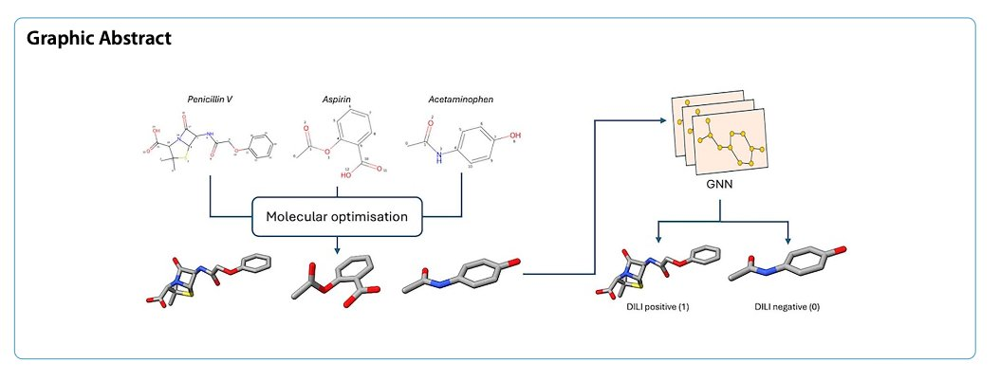
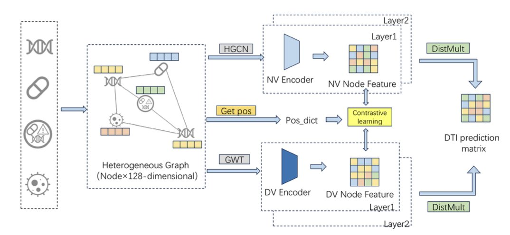
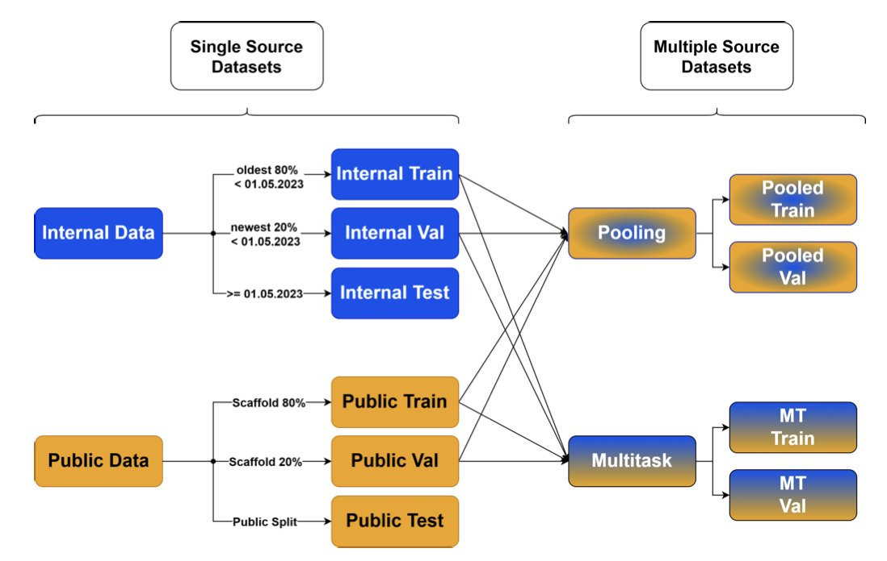

## 目录  
1. 通过在图神经网络中加入基于 3D 优化结构的精细化学特征，DILIGeNN 模型在预测药物性肝损伤（DILI）方面取得了当前最优的性能。
2. GHCDTI 通过融合图小波变换和对比学习，不仅提升了药物 - 靶点相互作用预测的准确性，还首次在模型中考虑了蛋白质的动态柔性。
3. 默沙东的这项研究证明，将高质量的公共数据与公司内部数据巧妙结合，尤其是通过多任务学习，可以显著提升 ADME 预测模型的准确性和泛化能力。

## 1. DILIGeNN：用更精细的 3D 特征预测肝损伤  

  

药物性肝损伤（DILI）是药物研发中令人头疼的「拦路虎」。它常常在临床试验后期甚至药物上市后才暴露出来，导致经济损失和严重的公共健康问题。如果我们能在药物研发的早期，就用 AI 模型把那些有 DILI 风险的分子给筛出来，那将是巨大的提升。  

现在的图神经网络（GNN）在预测分子性质方面很流行。但大多数 GNN 模型，吃的「原料」都比较粗糙。它们通常只看分子的 2D 连接关系，也就是哪个原子和哪个原子连在一起。这就好比看一张简笔画，虽然能看出大概轮廓，但丢失了很多细节。  

#### DILIGeNN 的创新：从「简笔画」到「工笔画」  

这篇论文的 DILIGeNN 模型，就是想给 GNN 喂更精细的「工笔画」。  

它的思路是：在把一个分子喂给 GNN 之前，先对它进行一次「精加工」。  
1.  **3D 结构优化** ：研究者们首先用计算化学的方法，为每个分子生成一个能量最低、最接近其真实状态的 3D 构象。  
2.  **提取精细特征** ：然后，他们从这个优化后的 3D 结构里，提取出了一系列传统 GNN 模型不会用到的信息，比如：  
    *   **更精确的键长** ：双键就是比单键短，这个几何信息现在被明确地告诉了模型。  
    *   **部分电荷** ：分子中哪个原子带正电荷，哪个带负电荷，电荷分布情况如何。  
    *   **原子轨道杂化类型**等。  

把这些更丰富、更符合化学现实的特征，作为图的节点和边的属性，再输入到 GNN 中去训练。这就相当于，我们给模型的「原料」里，加入了更多有价值的信息。  

#### 效果如何？  

结果证明，吃「精加工」原料的模型，确实比吃「粗粮」的模型更聪明。  

在最关键的 FDA DILI 数据集上，DILIGeNN 的 AUC 达到了 0.897，这是一个非常高的水平，超过了以往报道的其他模型。  

这种方法的优势并不仅仅局限于 DILI 预测。研究者们把同样的方法，用在了其他几个公开的基准数据集上，包括：  

在所有这些任务上，DILIGeNN 都取得了当前最优或接近最优的性能。这证明了，提供更精细的化学特征，是一种具有普适性的、能够提升 GNN 模型性能的有效策略。  

在 AI 药物发现领域，我们不应该仅仅满足于算法层面的创新。回归到化学本身，思考如何为模型提供更高质量、更具信息量的输入，同样是提升模型性能的关键。  

DILIGeNN 仅仅依赖于分子的化学结构特征，就能做出如此准确的预测，这对于在药物发现早期阶段快速筛选和评估候选化合物，非常有价值。  

📜Paper: https://jcheminf.biomedcentral.com/articles/10.1186/s13321-025-01068-3  
💻Code: https://github.com/tlee23-ic/GNN_DILI  

## 2. GHCDTI：一个更懂蛋白动态的 DTI 预测模型  

  

预测一个新的小分子会和人体内哪个蛋白质靶点结合（DTI 预测），是药物发现的起点。现在的 AI 模型，尤其是图神经网络，已经能在这方面做得不错。但它们大多都有几个共同的软肋：  

1.  **把蛋白质当成刚体** ：很多模型只看蛋白质的静态三维结构，但我们都知道，蛋白质在体内是柔软的、会动的。它的构象变化，往往是和药物结合的关键。  
2.  **数据不平衡** ：已知的药物 - 靶点结合数据，相对于茫茫的化学和蛋白空间，只是沧海一粟。正样本（会结合）极少，负样本（不会结合）海量。这会让模型倾向于「躺平」，直接猜「不结合」，准确率还挺高，但对我们没用。  
3.  **黑箱问题** ：模型说这个分子能结合，但为什么能结合？哪个部分起了关键作用？很多模型答不上来。  

这篇论文的 GHCDTI 模型，就试图一次性解决这三个难题。  

#### 怎么让模型看到「动态」的蛋白质？  

GHCDTI 用了一种叫「图小波变换」的数学工具。  

你可以这么理解：一张图片，我们可以把它分解成高频信号（轮廓、细节）和低频信号（背景、色块）。同样，一个蛋白质的结构图，也可以通过图小波变换，分解成不同的「频率」成分。  

GHCDTI 通过同时学习这两个部分的信息，就得到了一个更全面的蛋白质表征。它既知道这个蛋白长什么样，也知道它哪些地方喜欢「动」。这对于理解药物如何与动态的结合口袋相互作用，至关重要。  

#### 用对比学习对抗数据不平衡  

为了不让模型在数据不平衡问题上「躺平」，GHCDTI 用了「对比学习」的策略。  

它为每个节点（药物或蛋白）生成了两个不同的「视图」：一个是从拓扑结构来的，一个是从上面说的小波变换来的。然后，它强制模型去学习，让同一个节点在这两个不同视图里的表示尽可能地相似，而与其他节点的表示尽可能地不同。  

这就好比，我们让一个学生同时看一篇文章的原文和译文，然后要求他能认出这两篇文章讲的是同一个故事。通过这种方式，模型被迫去学习更本质、更鲁棒的特征，而不是仅仅记住一些表面现象。  

#### 融合多源信息，提升可解释性  

GHCDTI 还把药物的 2D 结构、蛋白质的 3D 结构以及已知的生物活性数据，通过一个跨图注意力机制融合在一起。这个注意力机制，就像给模型配了一副「透视眼镜」，它能告诉我们，在做预测时，模型主要「看」了药物的哪个基团和蛋白质的哪个区域。这就为我们理解和优化分子提供了直接的线索。  

从结果来看，GHCDTI 在多个基准数据集上都取得了当前最优的性能，而且在「冷启动」（预测全新的药物或靶点）场景下表现也很好。  

📜Paper: https://www.nature.com/articles/s41598-025-16098-y  

## 3. 默沙东经验：公共 + 私有数据可改善 ADME 预测  

  

每个大型药企（Big Pharma）都坐拥一个金矿——几十年来积累的内部化合物和 ADME（吸收、分布、代谢、排泄）数据。用这些数据来训练 AI 模型预测新分子的 ADME 性质，是研发人员日常工作的一部分。  

但我们一直面临一个问题：我们用自己家数据训练出来的模型，去预测一个化学结构和我们以往项目完全不同的外部化合物，还准吗？反过来，一个用公共数据库训练的模型，能准确预测我们内部那些结构独特的在研分子吗？  

答案往往是：不一定。  

模型很可能会「偏科」，只对自己熟悉的数据类型表现良好。这就是所谓的「适用域」（Applicability Domain）问题。  

默沙东的这篇研究，就对这个问题做了一次非常系统和坦诚的探讨。  

#### 怎么解决模型的「偏科」问题？  

他们的思路是：既然只吃一种食谱会营养不良，那就让模型「兼收并蓄」，把公共数据和公司内部数据这两盘「大餐」都给它吃。  

但怎么「吃」是有讲究的。  
1.  **简单混合（Pooled Single-Task**） ：最简单的办法，就是把两个数据集直接倒在一起，训练一个模型。这样做有时候管用，但如果两个数据集的分布差异很大，或者数据质量参差不齐，可能会适得其反，把模型「带偏」。  
2.  **多任务学习（Multi-Task Learning**） ：这是这项研究中表现最好的方法。你可以把它想象成，我们让一个学生同时学习两个既有联系又有区别的科目，比如物理和化学。在学习的过程中，他会发现一些底层的通用规律（比如能量守恒），这些规律在两个科目里都适用。  

多任务学习就是这样。模型在底层共享一部分网络参数，用来学习所有数据共有的化学规律。而在上层，它又为每个数据集（公共和私有）保留了各自独立的「专家」模块，用来学习各自独特的 SAR。通过这种方式，模型既学到了「共性」，又保留了「个性」，最终在预测两个数据集时都能表现得更好。  

#### 数据说了算  

默沙东的研究人员用他们内部的海量数据，结合像 Biogen 报告里公开的高质量数据集，对六个关键的药代动力学终点（比如清除率、生物利用度等）进行了建模。  

结果在几乎所有的测试中，使用混合数据训练的模型，特别是多任务模型，其性能都优于只使用单一来源数据训练的模型。无论是在预测内部测试集，还是在预测外部公共测试集上，准确率和可靠性都有了实打实的提升。  

所以第一，不要固步自封。即使是像默沙东这样拥有海量高质量内部数据的公司，积极拥抱和整合外部公共数据，依然能带来巨大的价值。这扩大了模型的视野，让它能更好地应对未来项目中可能出现的全新化学骨架。  

第二，多任务学习是处理异源数据的一个强大工具。它提供了一种更优雅的方式来融合信息，而不是简单粗暴地把数据堆在一起。  

📜Paper: https://doi.org/10.26434/chemrxiv-2025-7sbr0
