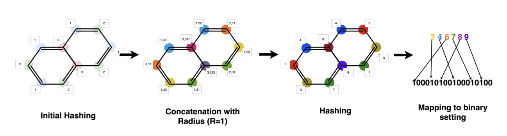
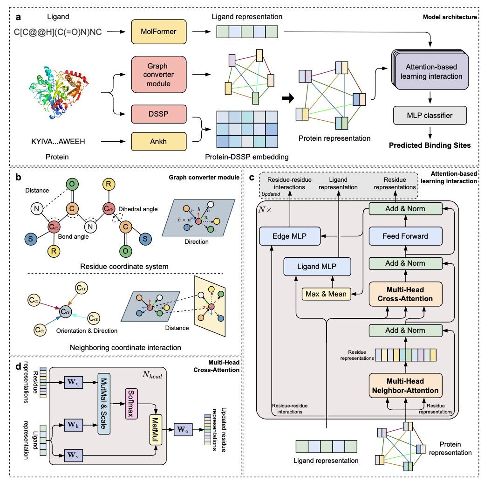
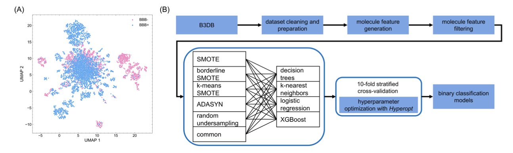

## Table of Contents
1. GP-MOBO uses Gaussian processes and a Tanimoto kernel to perform efficient multi-objective Bayesian optimization without sacrificing the integrity of molecular fingerprints, giving medicinal chemists a more reliable guide for molecular design.
2. LABind's new method for predicting protein binding pockets takes ligand information into account. This turns prediction from a "blind guess" into a process that finds the most suitable "seat" for each ligand's specific features.
3. B3clf addresses the common data imbalance problem in blood-brain barrier prediction by integrating resampling techniques. The final result is a ready-to-use tool that offers practical help for central nervous system drug development.

## 1. GP-MOBO: Multi-Objective Molecular Optimization That Thinks Like a Chemist

In drug discovery, molecular optimization is a constant balancing act. We want high activity, good solubility, low toxicity, and stable metabolism, but these goals often conflict. Make a molecule more lipophilic, and its activity might increase, but its solubility will drop.

Bayesian optimization (BO) is a powerful tool for solving these multi-objective problems. Think of it like a prospector. Instead of digging up an entire mountain, the prospector drills a few sample holes. Based on these samples, it creates a "probability map" (a Gaussian process model) of where the treasure is likely buried. Then, it uses this map to predict the next best spot to dig.

But when traditional Bayesian optimization is applied to chemistry, it often runs into a problem: it doesn't "understand" chemistry.

#### The Root of the Problem: Gaussian Processes Are "Chemically Blind"

The most common way to describe a molecule is with a "molecular fingerprint." It's like a long barcode of 0s and 1s that records the molecule's chemical groups and structural features. This representation is high-dimensional (thousands of dimensions) and extremely sparse (mostly 0s).

Traditional Gaussian process models don't perform well with high-dimensional, sparse data. They struggle to grasp the "chemical similarity" between two molecules. To them, two molecules whose fingerprints differ by only a few bits might seem just as different as two molecules that are vastly dissimilar. This leads to an inaccurate "probability map" and unreliable recommendations for what to do next.

#### GP-MOBO's Solution: Teaching Gaussian Processes to Think Chemically

The GP-MOBO algorithm from this paper gives the Gaussian process a new brain that understands chemistry: the **Tanimoto kernel**.

The Tanimoto coefficient is the gold standard for measuring molecular similarity in chemoinformatics. By turning the idea behind the Tanimoto coefficient into a "kernel function" and integrating it into the Gaussian process, the algorithm essentially teaches the prospector to see molecules through the eyes of a chemist.

Now, when the model sees two molecules with high Tanimoto similarity, it infers that their properties should also be similar. This makes its "probability map" far more accurate. It can better understand structure-activity relationships (SAR) and provide more reliable directions for optimization.

#### How Does It Perform in Practice?

The authors compared GP-MOBO with traditional GP-BO methods on DockSTRING, a real-world molecular docking dataset. The results showed that after just 20 rounds of optimization, the molecules found by GP-MOBO on the "Pareto front" were significantly better in both quality and diversity.

What is the "Pareto front"? You can think of it as the set of all candidate molecules that are not completely dominated by any other. For any molecule in this set, you can't find another one that is better across all optimization objectives. For medicinal chemists, we don't need a single champion in one category. We need a series of versatile all-rounders from this front, so we can make our final decision based on other factors we can't quantify, like how hard it is to synthesize.

GP-MOBO provides a richer, higher-quality list of candidates. That is its greatest value. It doesn't use a complex deep learning model. Instead, it returns to classic statistical methods and solves a key pain point in molecular optimization with a clever kernel function that aligns better with chemical principles.

📜Paper: https://arxiv.org/abs/2508.14072

## 2. LABind: A Binding Pocket Prediction AI That Reads the Ligand

Finding the binding pocket where a small-molecule ligand attaches to a target protein is the first step in drug discovery. In the past, many methods for predicting these pockets were ligand-agnostic. They only analyzed the protein's surface, looking for "pits" or "cavities" with shapes and physicochemical properties suitable for a small molecule.

This approach works much of the time, but it has a fundamental problem: it doesn't consider that different ligands might prefer different spots on the same protein. A large, greasy molecule and a small, charged molecule will likely favor completely different "seats." Looking only at the protein without considering the ligand is like a restaurant host seating a guest without asking about their preferences.

#### How Does LABind Know What to Look For?

At the core of LABind is something called a "cross-attention mechanism." You can think of it as the host's eyes.

Here's the key step. The cross-attention mechanism makes the model repeatedly compare these two "encodings." It learns to find the "matching patterns" between them. For instance, the model gradually learns that "when a ligand has a negatively charged carboxyl group, the area near a positively charged lysine on the protein is a great binding site."

By learning from thousands of known protein-ligand complex structures, LABind develops an intuition for dynamically adjusting its pocket predictions based on the ligand.

#### Generalization Is What Matters

A model that performs well on its training data isn't surprising. The real test is whether it can still make reliable predictions when given a protein it has never seen or a ligand with a completely new chemical scaffold. This is what we call "generalization ability."

LABind performs very well in this area. In tests on multiple benchmark datasets, it outperformed existing methods, especially when predicting binding sites for entirely new ligands.

More practically, we currently lack experimentally determined 3D structures for many proteins. LABind can use protein structures predicted by AI tools like ESMFold and still maintain good prediction accuracy. This greatly expands its range of applications, allowing us to explore many more unknown targets.

The paper also presents a timely case study: predicting the binding pockets of the COVID-19 virus's NSP3 protein with different inhibitors. Even for new inhibitors the model had never seen during training, LABind provided accurate predictions.

LABind transforms pocket prediction from a static game of finding cavities into a dynamic matching problem. It allows us to answer the question, "Where is this specific molecule most likely to bind on this protein?" with much greater precision. This is a powerful new tool for virtual screening, molecular docking, and understanding drug mechanisms of action.

📜Paper: https://www.nature.com/articles/s41467-025-62899-0
💻Code: https://github.com/ljquanlab/LABind

## 3. B3clf: A More Reliable Open-Source Tool for Blood-Brain Barrier Prediction

If you're developing drugs for the central nervous system (CNS), you can't avoid the blood-brain barrier (BBB). When you synthesize a new molecule, besides checking its activity against the target, the most pressing question is, "Can it even get into the brain?" If you don't have a good answer to that, all your later work could be for nothing.

For years, we've relied on various computational models for this prediction. But anyone who has used them knows their accuracy can be inconsistent. Sometimes, the gut feeling of an experienced medicinal chemist seems more reliable.

Why is this? Are the algorithms not good enough? Not entirely. A more fundamental problem lies in the data used to train the models.

#### The Root of the Problem: An Unbalanced Data Scale

Think about it: in public databases, molecules that successfully cross the blood-brain barrier are in the minority. Most are blocked. This creates a classic "class imbalance" problem.

What does this mean? If a machine learning model wants to be lazy, it can learn a simple strategy: predict "cannot cross" for every molecule. By doing this, its overall accuracy might be quite high, maybe 80% or even 90%, because it guessed the majority case correctly. But such a model is useless to researchers. We are looking for the few "chosen ones" that can get in, and the model has given up on learning how to identify them.

This paper confronts this difficult data problem head-on.

#### How Does B3clf Do It?

Their idea is direct: if the scale is tilted, find a way to balance it. The method they use is called "resampling."

Here's a way to understand it. For the minority class (molecules that can cross the BBB), we can't just duplicate them. The model wouldn't learn anything new. Smarter oversampling techniques like ADASYN or SMOTE create new "virtual samples" around the existing "good students" that also look like "good students." This gives the model richer, more balanced material to learn from. It can then better understand what chemical features a molecule needs—like the right lipophilicity, molecular weight, or number of hydrogen bonds—to get a "pass" into the brain.

#### Letting the Results Speak for Themselves

The authors didn't just assume one model was the best. They held a "model competition." They selected 24 different machine learning models, from simple decision trees to complex XGBoost, and paired them with different resampling techniques. Then they had them all compete on the same dataset.

The results showed that XGBoost (a gradient boosting tree model) was the top performer, especially when combined with oversampling techniques. It led the pack in accuracy, sensitivity, and other key metrics. XGBoost is already known as a top student in the machine learning field—stable and powerful—so this result isn't a surprise. But the systematic comparison makes the conclusion more convincing.

#### The Proof Is in the Pudding

They didn't just stop at theory. They compiled an external test set of 175 compounds from the literature to go head-to-head with other published BBB prediction models. The results showed that the model trained with B3clf performed as well as or better than some existing methods.

They packaged their trained model into an open-source Python library and a web tool. This means we don't have to struggle with code and data ourselves. During a project meeting, we can just paste the SMILES strings of our newly designed molecules into the tool and get a probability of BBB penetration in seconds. This probability can help us decide which molecule to prioritize for synthesis next.

📜Paper: https://doi.org/10.26434/chemrxiv-2025-xschc
💻Code: https://github.com/theochem/B3clf
