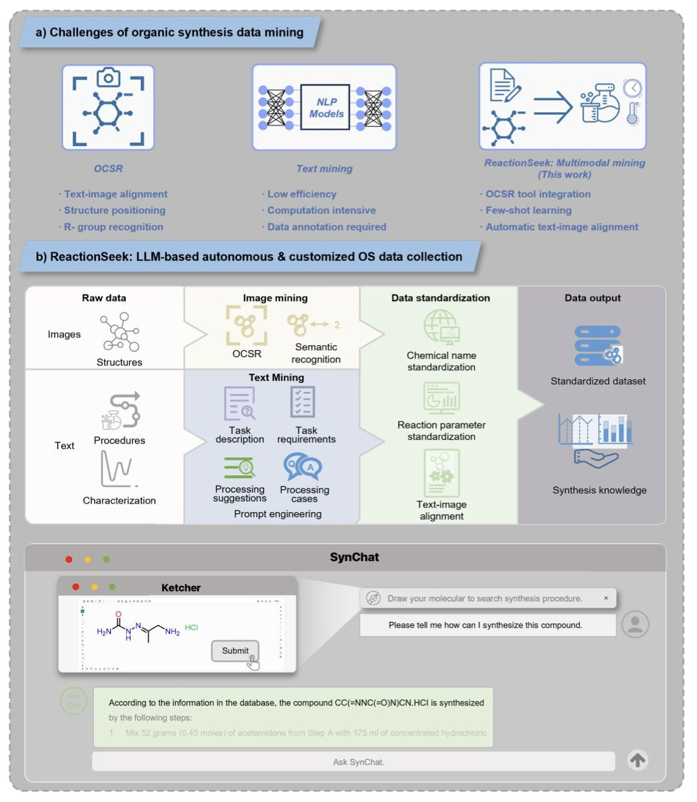
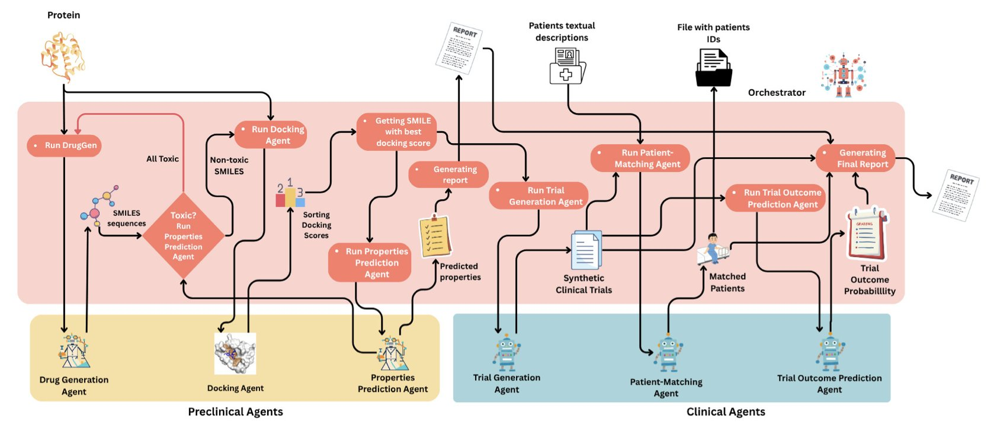
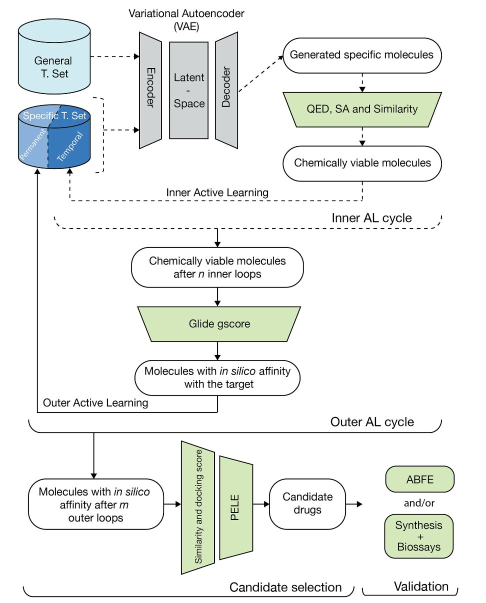

## Table of Contents
1. The ReactionSeek framework, through clever prompt engineering, enables a general-purpose Large Language Model (LLM) to automatically extract key information like reactants, yields, and solvents from chemistry literature with over 95% accuracy, solving a core bottleneck in chemical data digitization.
2. The "Prompt-to-Pill" framework uses a centrally coordinated group of AI agents to try to integrate the long, fragmented process from molecular design to virtual clinical trials into a single automated pipeline.
3. Through a nested learning loop, this framework allows a creative generative AI to receive continuous guidance from a rigorous, physics-based "fact-checker," ultimately designing novel, synthesizable, and genuinely effective drug molecules verified in wet-lab experiments.

## 1. ReactionSeek: Using Large Models to Automatically "Read" Organic Synthesis Literature

The field of organic chemistry has accumulated a century's worth of knowledge. But most of this knowledge is locked away in academic papers and patents, existing as unstructured text, images, and tables.

A medicinal chemist might want to know, "For this specific Suzuki coupling reaction, which catalyst, ligand, and solvent give the highest yield?" Answering this could take days of manually sifting through dozens of papers, copying key information into a spreadsheet one by one. The process is tedious, inefficient, and prone to error.

If we could get an AI to automatically "read" all the literature and extract the key information into a structured database for machine querying and analysis, it would greatly speed up chemical research.

The ReactionSeek framework is a solid step toward that goal.

#### How do you teach an LLM to read a chemistry textbook?

Getting a general-purpose large model like GLM-4 to understand the experimental sections of chemistry papers, full of jargon and implicit expressions, is a big challenge. In the past, this might have required fine-tuning the model with large amounts of labeled data, which is expensive.

ReactionSeek relies mainly on a set of well-designed "Prompt Engineering" techniques.

When giving instructions to the AI, instead of just saying "read this paper," it provides a very detailed "reading comprehension guide." This guide tells it:

This way, even without specialized fine-tuning, a general-purpose large model can be guided to complete the task of chemical information extraction efficiently and accurately.

#### Reading both text and images

In a chemistry paper, the reaction scheme often contains the most information. ReactionSeek also includes an image mining module. It can identify the molecules in a reaction diagram and determine which are reactants, products, or catalysts. This combination of "image reading" and "text reading" makes the information extraction more complete and accurate.

#### From data to knowledge

When ReactionSeek finished "reading" over 3,000 papers from the classic journal *Organic Syntheses* and stored the results in a database, something interesting happened.
1.  **The birth of SynChat**: They built a chatbot called SynChat based on this database. Now, chemists no longer need to write SQL queries. They can just ask in plain language: "I want to see examples of XX reaction using XX catalyst. Please give me a detailed experimental procedure."
2.  **Discovering historical trends**: By analyzing the entire database, they clearly revealed the historical evolution of asymmetric catalysis and the use of metal catalysts over the past few decades. This shows that when scattered knowledge is organized into structured data, we can see macroscopic patterns that were previously difficult to spot.

ReactionSeek provides a powerful and scalable framework. It's helping to move chemistry from a craft reliant on manual experience to a new era driven by data and AI.

📜Paper: https://doi.org/10.26434/chemrxiv-2025-t110q
💻Code: https://github.com/DeepSynthesis/ReactionSeek.git

## 2. Prompt-to-Pill: Can AI Agents Handle the Entire Drug R&D Process?

In AI drug discovery, we've seen all sorts of "point solutions": some can generate new molecules, others can predict ADMET, and still others can analyze clinical data. Each does its own job well. But this work, called "Prompt-to-Pill," doesn't just want to be a tool. It wants to be a complete pipeline—or a virtual pharmaceutical company powered by AI.

Looking at the flowchart, the entire system is divided into preclinical and clinical stages, each packed with specialized AI agents. It's like a project team, with agents dedicated to chemical synthesis, pharmacology and toxicology, and clinical development. The soul of the project is a central coordinating LLM called the "Orchestrator."

This "Orchestrator" is interesting. It acts like an experienced project manager. When a researcher inputs a command, like "develop a new drug for the DPP4 target," the manager starts assigning tasks. It tells the "molecule generation" agent, "Hey, design some promising new scaffolds for me." Then, it passes the generated molecules to the "ADMET screening" and "molecular docking" agents to evaluate their drug-likeness and target-binding ability.

This isn't a one-way process. If a molecule has a poor ADMET prediction or a low docking score, the "Orchestrator" gets this feedback and tells the "molecule generation" agent, "This direction isn't working. Try a different approach, like optimizing that heterocycle to reduce lipophilicity." This kind of iterative loop is exactly what real medicinal chemists do every day.

The system doesn't stop at the preclinical stage. When a candidate molecule looks promising enough, the "Orchestrator" moves it to the "clinical" stage. Then, the "clinical trial design" agent gets to work, planning Phase I, II, and III protocols. There's even a "patient recruitment" agent to find suitable subjects from a virtual patient population.

The researchers ran the entire process for the DPP4 target, which served as a good proof of concept. Choosing a well-understood target with plenty of data was a smart move, as it allowed them to test whether the pipeline itself was viable.

Of course, this is still a highly complex simulation. Can an AI-designed clinical protocol truly handle the complexity and variability of real-world patients? Is the "virtual patient" a digital twin based on real-world data, or just a parameterized statistical model? The details here determine whether this system is an advanced simulation or a tool that can genuinely guide decisions.

The authors are well aware of this, mentioning issues of "reasoning transparency" and evaluation criteria. And they're right. If the AI project manager makes a final "Go/No-Go" decision, we need to be able to open up its "brain" and see the basis for that judgment. We can't just trust it because it's called "AI."

"Prompt-to-Pill" is not yet a magic machine that turns ideas into pills. It's more of a blueprint, showing one possible future for the drug R&D workflow. It connects previously separate computational tools with an intelligent coordination core. It won't replace scientists, but it might completely change how they work—from personally executing every experiment and calculation to supervising and guiding a virtual team of AI agents.

📜Title: Prompt-to-Pill: Multi-Agent Drug Discovery and Clinical Simulation Pipeline
📜Paper: <https://www.biorxiv.org/content/10.1101/2025.08.12.669861v1>

## 3. AI Drug Design: A Reality Check from Physics

We are almost drowning in generative models that can produce pretty pictures of molecules. Most of them are like an architect with infinite inspiration but no engineering knowledge. They can sketch beautiful buildings that float in the air with Möbius strip staircases. If you ask how to build it, they don't know. If you ask if it will collapse, they haven't thought about it.

People in drug discovery deal with the harsh realities of physics and chemistry every day. We don't need an artist; we need a real architectural engineer who can draw plans that are beautiful, stable, and can actually be built by a construction crew.

This study, published in *Communications Chemistry*, designs a workflow that acknowledges AI is both a genius and an idiot. So, they created a "nested" active learning loop that pairs this genius-idiot with a strict supervisor who only trusts the laws of physics.

**Inner Loop: The AI's "Brainstorm**"

In the inner loop, the AI (a variational autoencoder) can let its imagination run wild. Its job is to generate a huge number of diverse, drug-like molecules. This loop also includes some relatively "cheap" filters to check if these molecules have, at least in theory, a plausible synthetic route. It's like having a junior engineer standing by while the architect sketches, reminding them, "Hey, that cantilever beam might be a bit too long. We should probably add a column."

**Outer Loop: The "Final Judgment" of Physics**

The best "sketches" from the inner loop are submitted to the outer loop. This is where the supervisor takes over. This supervisor is the set of physics-based simulation methods that we both love and hate—computationally expensive but incredibly close to ground truth—like PELE simulations and absolute binding free energy (ABFE) calculations.

This step is like taking the architect's sketch and putting it through wind tunnel tests and structural analysis. It will tell you, without mercy, whether the design will work in the real physical world. The result of this "judgment" is fed back to the AI in the inner loop as the most critical "reward" or "punishment" signal.

This layered, nested structure is a well-considered trade-off between creativity and reality. You don't use expensive physics simulations to stifle every one of the AI's "wild ideas." You just use them to give the top ideas a final "reality check."

So, how did the system perform?

This is where the paper goes beyond reporting nice computational metrics. They actually **made** the molecules the AI designed.

They applied this process to CDK2, a familiar kinase target. The AI designed a batch of new molecules for them. They selected nine of these and synthesized them in the lab. The result: eight of the nine showed inhibitory activity against CDK2 in vitro. The best one had an IC50 value in the nanomolar range.

They also applied the process to KRAS, a notoriously difficult target. Although they didn't synthesize these molecules, the *in silico* validation results were also very promising.

📜Title: Optimizing Drug Design by Merging Generative AI with a Physics-Based Active Learning Framework
📜Paper: https://www.nature.com/articles/s42004-025-01635-7
💻Code: https://github.com/IFilella/ALGen-1
