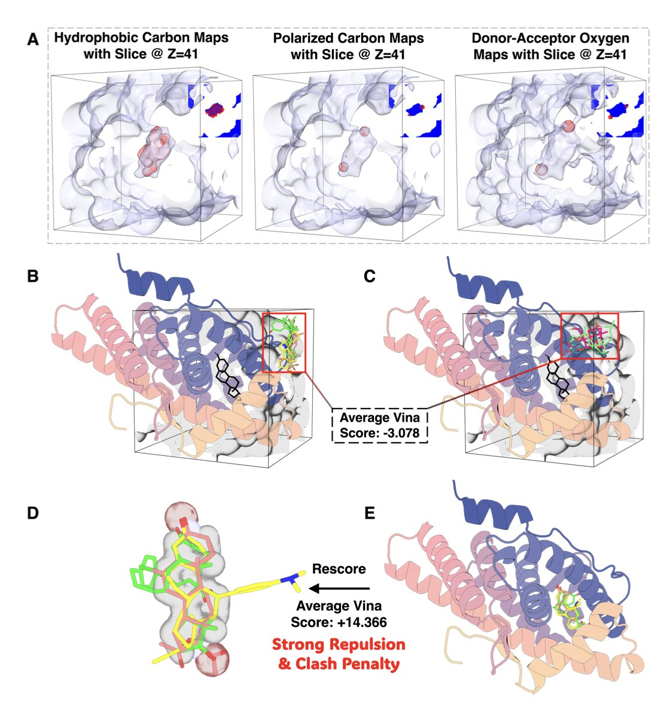
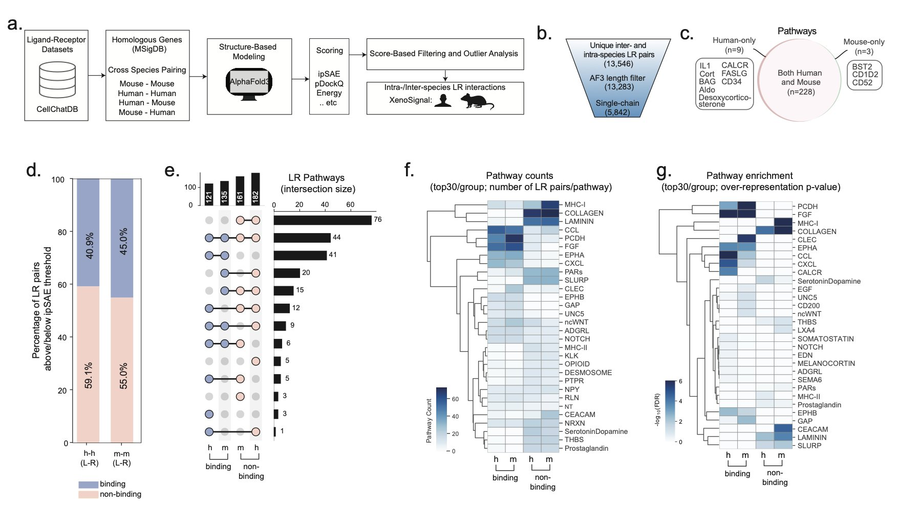
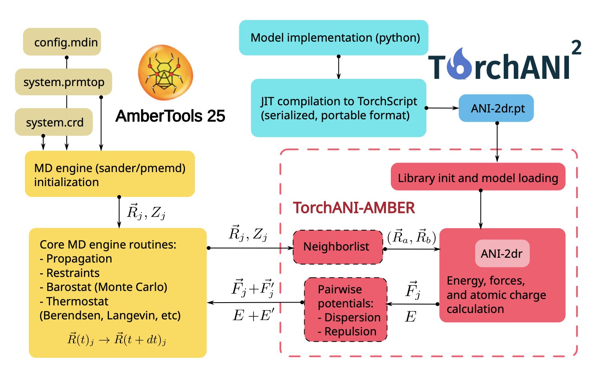

## Table of Contents
1. UniDock-Pro integrates structure-based, ligand-based, and an innovative hybrid virtual screening method on a single, GPU-accelerated platform. It can screen over a million molecules per day on a single GPU, significantly improving enrichment efficiency.
2. XenoSignal uses AlphaFold3 to predict human-mouse cell interactions in xenograft models with atomic-level accuracy. This reveals previously overlooked species-specific differences and will profoundly impact the interpretation of preclinical studies.
3. TorchANI-Amber uses a clever interface to let the widely used molecular dynamics software, Amber, seamlessly call on ANI series neural network force fields. This enables large-scale biomolecular simulations with "quantum accuracy" within a classical software framework.

## 1. UniDock-Pro: A "Three-in-One" Virtual Screening Platform on GPUs

In the early stages of drug discovery, virtual screening is one of the most important tools for exploration. The goal is to quickly sift through large compound libraries of millions or even billions of molecules to find a few promising drug candidates.

Traditionally, virtual screening has two main approaches:
1.  **Structure-Based Virtual Screening (SBVS**): This is like having a "lock" (the target protein structure) and trying thousands of "keys" (small molecules) to see which ones fit. Classic tools like AutoDock and Glide do this. It’s intuitive, but you need a high-quality "lock" to start with.
2.  **Ligand-Based Virtual Screening (LBVS**): This is more like finding similar-looking objects. If we already know a few "keys" that open the lock, we look for other keys that resemble those good ones. A classic tool for this is ROCS. It’s fast, but you need a few "good keys" first.

These two approaches have their pros and cons and are usually implemented on different software platforms. We often have to run them separately and then combine the results, which is a cumbersome process.

UniDock-Pro aims to break down this barrier and put the whole process in the fast lane.

#### UniDock-Pro's Three Key Features

1.  **A Unified, GPU-Accelerated Platform**: It integrates both SBVS and LBVS into a single, GPU-based framework. By maximizing the parallel computing power of GPUs, it boosts screening speed by several orders of magnitude. In LBVS mode, it's 43 times faster than AutoDock-GPU. Processing over a million molecules a day on a single GPU is now a reality.
2.  **Better LBVS**: Traditional LBVS methods often use energy functions for shape matching that are not smooth, which makes it hard to search for conformations efficiently. UniDock-Pro implements a smoother, Lennard-Jones-like potential. This allows gradient-based optimization algorithms to run more effectively. On the DUDE-Z benchmark, its early enrichment factor (EF1%) was 2.45 times higher than traditional tools.
3.  **Hybrid Mode**: This is UniDock-Pro's most significant feature. It doesn't let SBVS and LBVS work in isolation. Instead, it makes them work together.

#### How Does the Hybrid Mode Work?

Think of it as an advanced treasure hunt.

UniDock-Pro's hybrid mode consults both "treasure maps" at every step of the molecular docking process. It looks for molecules that both fit well into the binding pocket and have a shape similar to known active compounds.

This method takes full advantage of the orthogonal and complementary nature of the two types of information. It achieved the highest enrichment efficiency in almost all benchmark tests. It can more effectively pick out true active molecules from a large pool of inactive ones.

UniDock-Pro offers a more accurate and efficient paradigm for virtual screening. For drug developers who need to quickly find gold in a vast chemical space, this is a powerful tool.

📜Paper: https://doi.org/10.26434/chemrxiv-2025-bf5g7

## 2. XenoSignal: Using AlphaFold3 to Reshape Drug Development with Xenograft Models

In preclinical research, especially in oncology, xenograft models are indispensable.

We implant human tumor cells into immunodeficient mice, administer a drug, and see what happens. This process has been used for decades, but there's always been a nagging question: can human tumor cells really "talk" to the surrounding mouse microenvironment? We've always assumed that if human and mouse ligand-receptor protein sequences are similar enough, they can recognize and bind to each other. But this assumption is risky, like deciding two people will work well together just by looking at their resumes.

In the past, we assessed cross-species interactions mostly by comparing sequence homology. If the homology is over 90%, they can probably bind. This method is simple but ignores a fundamental point: a protein's function is determined by its 3D structure, not its 1D sequence. A tiny difference of one amino acid could create a major steric clash at a critical binding interface.

XenoSignal uses AlphaFold3 (AlphaFold 3) to compute the atomic-level structures of thousands of human-mouse ligand-receptor complexes. This is like upgrading from reading resumes to watching a video of the two interacting. The researchers found that many protein pairs we assumed could interact across species actually bind poorly, or not at all.

Suppose you develop a drug targeting a signaling pathway in the human tumor microenvironment. It works by blocking the binding of a ligand (from the tumor cell) to a receptor (on a mouse stromal cell). In the mouse model, you see impressive tumor inhibition. But XenoSignal's analysis might tell you that the affinity of the human-mouse protein pair your drug targets is much lower than the human-human affinity. This means your drug's effectiveness in the mouse model might be a coincidence, or its true mechanism is different from what you thought. When it gets to a clinical setting with a purely human environment, the drug's effect could be greatly diminished.

The framework's power doesn't stop there. It also considers more complex factors like the stoichiometry of protein complexes and post-translational modifications. For example, some receptors need two subunits to function. If the human and mouse subunits can't assemble correctly, downstream signaling can't happen.

In the end, XenoSignal provides not a vague "likely to bind" conclusion, but a high-confidence interaction list rigorously calculated with a physical model. This is very valuable for drug developers. Before investing in expensive animal experiments, we can perform a computational screen to filter out the least plausible cross-species targets and focus our resources on the most promising directions.

📜Title: XenoSignal: Investigating Intra- and Inter-Species Ligand-Receptor Interactions Using AlphaFold3
📜Paper: <https://www.biorxiv.org/content/10.1101/2025.08.13.670200v1>
💻Code: <https://github.com/MorrissyLab/XenoSignal>

## 3. TorchANI-Amber: Letting Classical Simulation Software Use an AI Force Field

In computational biology and drug design, Amber is a household name. For decades, countless important molecular dynamics (MD) simulations have been performed on this powerful software platform. But like many classical MD programs, Amber relies on empirical classical force fields. These force fields are fast, but their accuracy can be lacking, especially when dealing with subtle chemical reactions or complex interactions.

On the other hand, a new generation of neural network (NN) force fields, like ANI (ANAKIN-ME), is making waves in computational chemistry with its near-quantum-chemical accuracy. But these new AI tools often exist in their own Python ecosystems and are difficult to integrate into large, complex systems like Amber, which are built with Fortran and C++.

This creates a frustrating situation: we have simulation software with the most comprehensive features and a mature ecosystem, and we also have force fields with the highest accuracy, but the two can't be combined.

TorchANI-Amber is here to break down that wall.

#### The Core Idea: Build a Bridge, Don't Rebuild the System

The authors didn't rewrite Amber's underlying code, which would have been a massive undertaking. Instead, they **built an external interface**.

Here's how the interface works:
1.  In Amber's input file, the user makes a simple setting that tells Amber: "For this simulation, don't use your built-in force field. Instead, ask an external program called TorchANI."
2.  When the simulation starts, at each step, Amber sends the coordinates of all atoms in the current system to TorchANI through this interface.
3.  TorchANI, a high-performance neural network engine powered by PyTorch, receives the coordinates and uses a pre-trained ANI model to quickly calculate the energy and forces for each atom.
4.  It then sends these calculated energies and forces back to Amber through the interface.
5.  Amber takes these "outsourced" results and uses them to update the atoms' velocities and positions, then proceeds to the next simulation step.

Throughout this process, Amber remains the same familiar program. It handles all the MD simulation chores like integration, temperature and pressure control, and periodic boundary conditions. The core task of calculating energy and forces, which is the most time-consuming part, is outsourced to a more specialized and accurate AI model.

#### How Well Does It Work?

The authors demonstrated that this hybrid system not only runs but runs well on a series of realistic and complex biomolecular systems.

The work on TorchANI-Amber provides a great example for researchers who want to use advanced AI force fields to study real biological problems. By cleverly "grafting" new technology onto a classic, well-tested software framework, we can create powerful new capabilities.

📜Paper: https://doi.org/10.26434/chemrxiv-2025-j0b7s
