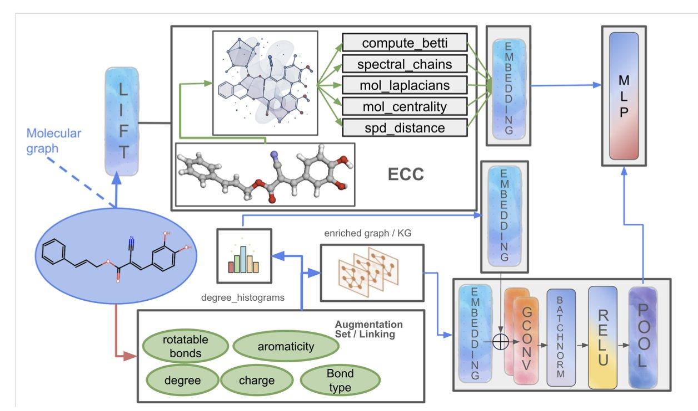
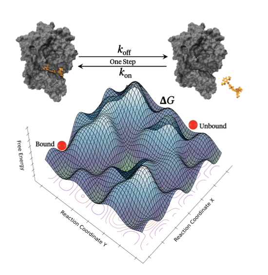
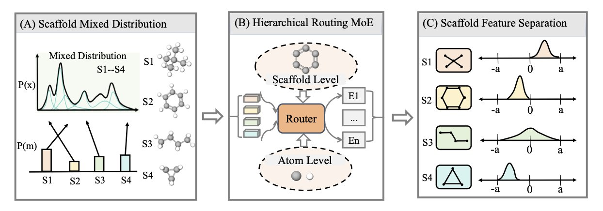

## 目录  
1. 通过给 AI 装上一双能看见分子整体「拓扑形状」的眼睛，PACTNET 显著提升了图神经网络预测分子性质的准确性，解决了其长期存在的「只见树木，不见森林」的短板。
2. Seekrflow 平台将机器学习力场与增强采样方法无缝整合，实现了端到端的药物 - 靶点结合动力学与热力学参数的自动化、高通量预测。
3. 通过创建一套「企业化」的 AI 架构，H-MoE 将不同的分子，智能地分派给各自的「专家部门」进行处理，从而以一种更接近人类化学家直觉的方式，解决了表征广阔化学空间多样性的难题。

## 1. AI 分子模型学会看拓扑几何  
  
  

多年以来试图教会计算机理解化学的人，一直都在跟图神经网络（GNNs）作斗争。  
  
GNN 学会了像一个化学家一样，去看一个分子的「连接图」，它知道这个碳连着三个氢和一个氮，那个氮又连着一个羰基。在理解这种局部的、原子级别的「邻里关系」上，它已经做得相当不错了。  
  
但它一直有个巨大的盲点。它就像是一个只能低着头、用手指一寸一寸地去追踪一张城市地图的人。他能非常精确地告诉你，A 街道和 B 街道，在 C 路口相交。但他对这座城市的整体「地貌」，一无所知。他不知道，这座城市是建在一片平原上，还是建在一座陡峭的山上。他不知道，城市里有没有湖泊，有没有贯穿全城的隧道。  
  
而我们知道，一个分子的性质不仅仅取决于它局部的化学键。它的整体形状、它的柔性、它内部有没有「空腔」，这些全局的、我们称之为「拓扑」的特征，同样至关重要。  
  
PACTNET 走了一条务实的「混合」路线。  
  
它的核心，是一个叫做「高效蜂窝压缩」（ECC）的算法。在让 GNN 开始它那传统的「看图连线」工作之前，ECC 会先像一个拓扑学家一样，去审视这个分子的三维结构，然后，把所有那些关于「洞」、「隧道」和「空腔」的、复杂的、高阶的几何信息，给「压缩」成一个非常紧凑的、GNN 能看得懂的「数学指纹」。  
  
就像是在把那张城市街道图，交给那个「低头看路的人」之前，你先给了他一张额外的高度浓缩的「地形图摘要」。这张摘要上，可能只有几个关键信息：「城西有座山」，「市中心有个湖」。  
  
当那个 GNN，再去分析那个 A 街道和 B 街道的交叉口时，它的大脑里，就不再只有一个孤零零的、二维的交叉口了。它同时还拥有了一个来自「地形图摘要」的、全局的「语境」。它会知道：「哦，这个交叉口，它是在山坡上。」  
  
看似简单的、额外的信息维度，带来的回报是巨大的。  
  
在多个标准的分子性质预测任务上，这个被赋予了「地形图视野」的 PACTNET，其表现全面超越了那些还在「盲人摸象」的、传统的 GNN 架构。它不仅更准，而且因为那个压缩算法，它的参数效率还很高，并没有变成一个计算上难以负担的「巨无霸」。  
  
所以 PACTNET 价值在于，它为我们指明了一条如何将我们人类化学家那种对三维形状的、宝贵的、直觉式的理解，以一种计算上高效、且数学上严谨的方式，「翻译」给 AI 听的、全新的道路。  
  
📜Title: Topological Feature Compression for Molecular Graph Neural Networks  
📜Paper: https://arxiv.org/abs/2508.07807v1  

## 2. Seekrflow：AI 力场解锁药物结合动力学预测  
  
  

在药物发现中有两个我们始终追求的目标：一个是结合亲和力（thermodynamics），另一个是结合动力学（kinetics）。  
  
算亲和力，比如 ΔG，我们已经有了像 FEP 这样相对成熟的工具，虽然耗费计算资源，但结果还算靠谱。可一旦谈到动力学，特别是解离速率常数 k_off，事情就变得棘手起来。k_off 决定的药物停留时间（residence time）在很多时候比亲和力本身更能预测体内的药效，但要用计算模拟来复现一个可能长达数小时的解离过程，几乎是不可能的。  
  
Seekrflow：把当下两个最热门的技术——机器学习力场（ML-FF）和增强采样工作流——巧妙地打包在了一起，而且是全自动的。  
  
我们先来看看它的第一个杀手锏：机器学习力场。  
  
传统的力场，比如 AMBER 或 CHARMM，是整个分子模拟的基石。但它们依赖一套预先定义好的原子类型和相应的参数，这套规则在面对一些「非主流」的化学结构时，常常会显得力不从心。  
  
Seekrflow 里的研究者用了一个基于图神经网络（GNN）的力场。这东西的好处在于不再需要我们去手动定义原子类型，而是让网络自己从分子的连接关系（也就是「图」）中学习化学环境，然后直接预测能量和力。这就像是从死记硬背的学霸，进化成了能举一反三的学神，对于处理药物化学家天马行空设计出的新分子，理论上泛化能力会强得多。  
  
有了更准的力场，只是解决了「看得准」的问题，还没解决「跑得动」的难题。  
  
药物分子和靶蛋白的结合或解离，在模拟的时间尺度上是极其罕见的事件。硬要用常规的分子动力学模拟去等，无异于守株待兔。所以，他们用了增强采样，具体来说是「里程碑法」（milestoning）。  
  
与其从头跑到尾模拟一次完整的旅程，不如把整个路径拆分成一小段一小段的「里程碑」。然后，我们只需要大量地、并行地模拟分子从一个里程碑跑到下一个需要花多长时间，最后再把这些时间片段拼起来，就能得到全程的时间。Seekrflow 把设置里程碑、启动并行模拟、收集数据、分析结果这一整套烦琐的手工活，全部自动化了。  
  
研究者们把它用在了几个大家熟知的体系上，包括 HSP90、TTK 和胰蛋白酶的抑制剂。从结果来看，他们计算出的 k_on 和 k_off 与实验值的吻合度相当不错。  
  
我们或许离那个「在先导优化阶段就能常规性预测药物停留时间」的梦想又近了一步。如果这个工具足够稳定和高效，我们就可以在合成一个分子之前，就对它的动力学特性有个大致的判断，从而指导我们进行更理性的分子设计。  
  
当然，挑战依然存在：这个机器学习力场在面对全新的靶点家族或者更复杂的变构抑制剂时，表现会如何？真实的计算成本能否支撑起高通量的筛选？  
  
📜Title: Seekrflow: Towards End-to-End Automated Simulation Pipeline with Machine-Learned Force Fields for Accelerated Drug-Target Kinetic and Thermodynamic Predictions  
📜Paper: https://www.biorxiv.org/content/10.1101/2025.08.13.669965v2  

## 3. AI 分子模型：告别一刀切，走向部门专精  
  
  

AIDD 一直以来有点像是在试图打造一把能解决所有问题的、终极的「瑞士军刀」。  
  
我们把我们能找到的所有分子——从刚性的类固醇到柔性的多肽，从带电荷的氨基酸到油腻腻的烷基链——全都扔进一个巨大的、单一的神经网络里，然后期望它能奇迹般的学会化学的所有规则。  
  
但我们都清楚，化学它不是这样的。一把用来拧螺丝的工具，和一把用来切东西的工具，它们的设计哲学，从根本上就是不同的。你试图用一把瑞士军刀去完成所有事，最终的结果，就是它在任何一件事上，都做得不怎么样。  
  
H-MoE 做的是为 AI 建立了一家分工明确的「大公司」。  
  
这个想法，就是从自然语言处理领域借来的「专家混合」（Mixture-of-Experts, MoE）模型。而这个新模型 H-MoE，则为它，加上了一套非常符合化学家直觉的「企业组织架构」。  
  
你可以把 H-MoE，想象成一家拥有高效前台和多个专业部门的公司。当一个新分子「走进」这家公司时，它会先被送到「前台接待处」。  
  
这个「前台」，就是那个分层的「调度」系统。它做的第一件事，不是去仔细看这个分子的每一个原子和化学键。它只看这个分子的「身份证」——也就是它的核心化学骨架（scaffold）。  
  
「你是个吲哚衍生物？好的，请去三楼的‘芳香杂环部’。」  
「你是个青霉素骨架？请去四楼的‘β-内酰胺抗生素部’。」  
  
只有当这个分子，被分派到了正确的「部门」之后，那个部门里的「专家」（也就是专门负责处理这类骨架的 AI 子模型），才会开始对它进行精细的分析，去研究它上面的每一个取代基，每一个手性中心。  
  
那么这个「前台接待」是如何学会变得如此精明的呢？  
  
这就要归功于一个叫做「对比学习」的、「岗前培训」了。  
  
在训练阶段，你会不断地给这个「前台」，看成对的分子。你给它看两个不同的吲哚，然后告诉它：「这两个，是亲戚，你应该把它们送到同一个部门去。」然后，你再给它看一个吲哚和一个哌啶，告诉它：「这两个，八竿子打不着，你应该把它们分开。」经过数百万次这样的「认亲」练习，这个「前台」，就成了一个顶级的、能凭骨架识分子的化学分类专家。  
  
这套「企业化」的 AI 架构表现如何？  
  
它几乎在所有方面，都把那些「个体户」式的、单一的「瑞士军刀」模型，给比了下去。它在处理多样化的分子库时，表现得更好；它在面对从未见过的新分子时，泛化能力也更强。甚至，这个只看了二维信息的「公司」，其表现，比一些已经看了三维结构的「个体户」，还要好。  
  
这说明一个更好的组织架构，有时候比单纯的堆砌更多的信息，要重要得多。  
  
这项工作可能代表了我们思考和构建分子表征模型的方式的一次根本性转变。AIDD 走向一个更务实的、更模块化的、也更接近我们人类知识组织方式的、真正的「工程学」时代。  
  
📜Title: Scaling Molecular Representation Learning with Hierarchical Mixture-of-Experts  
📜Paper: https://www.biorxiv.org/content/10.1101/2025.08.09.669511v1
