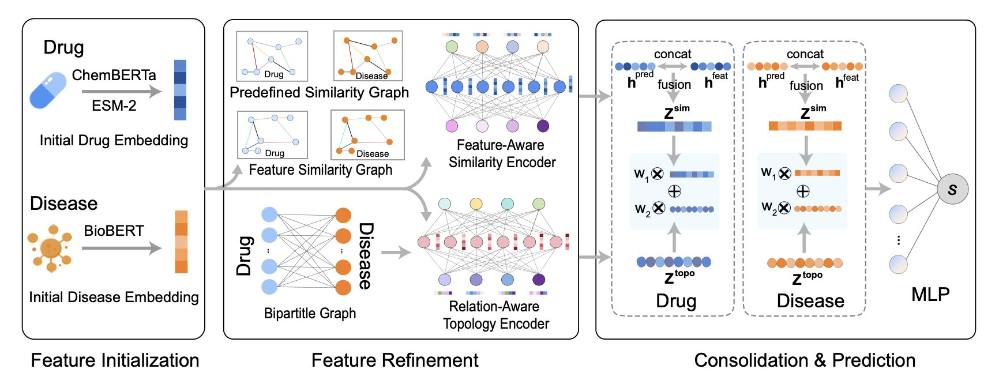
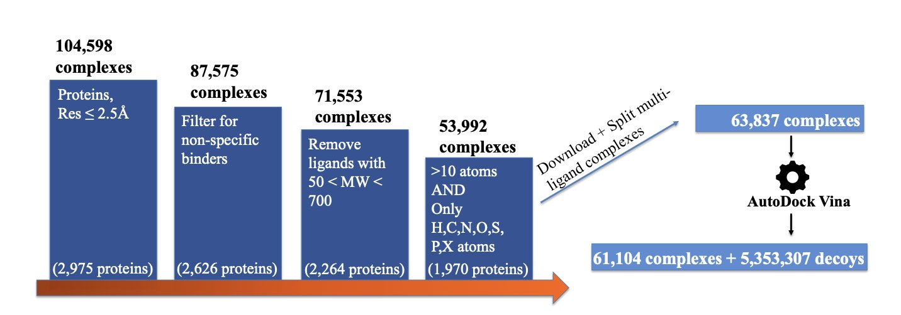
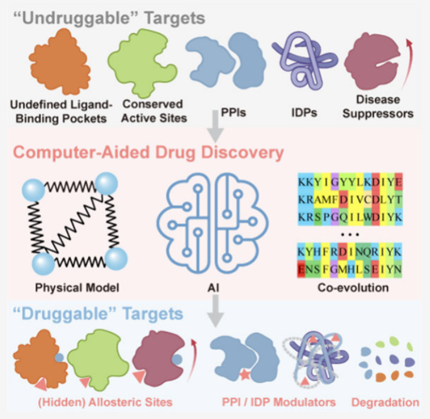

## 目录  
1. DREAM-GNN 通过一个双通道架构，同时分析药物 - 疾病的已知关系网和它们各自的内在特征，极大地提升了老药新用预测的准确性和可靠性。
2. DecoyDB 创造了一个包含数百万个「错误答案」的庞大数据集，让 AI 通过对比学习，真正理解了分子结合的「正确姿势」，极大地提升了亲和力预测的准确性。
3. 计算和 AI 正在为那些曾被判死刑的「不可成药」靶点带来新武器，从变构调节到蛋白降解，游戏规则已经改变。

## 1. DREAM-GNN：老药新用的双通道高速公路  
  
  

老药新用，这个概念听起来就像是炼金术士的梦想：用已经证明安全的旧药，去治疗一个全新的疾病。省钱，省时，简直完美。  
  
但实际操作起来，这活儿跟大海捞针差不多。计算方法喊了很多年，但很多模型要么太天真，要么太偏科。  
  
有的模型只看关系网，比如 A 药治 X 病，B 药治 Y 病，那么和 A 药结构相似的 C 药是不是也能治 X 病？有的模型只看特征，比如 D 药和 E 药都能抑制某个激酶，那么它们可能治疗同一种癌症。这两种思路都有道理，但都只看到了一半的真相。  
  
DREAM-GNN 的方法很简单直接：小孩子才做选择，成年人全都要。  
  
它设计了一个「双通道」架构，这简直是神来之笔。  
  
**第一条通道**，是个关系专家。它构建一个巨大的图谱，上面是所有已知的药物 - 疾病关联，它专门学习这个网络拓扑结构里的门道，像个社交网络分析师一样，研究「谁和谁有关系」。  
  
**第二条通道**，是个特征专家。它不看已知的治疗关系，而是深入研究药物和疾病的内在属性。它怎么研究？它不是自己从头瞎琢磨，而是请来了一帮「外援」：用 ChemBERTa 来读懂小分子的化学语言，用 ESM-2 来理解靶点蛋白的生物学功能，用 BioBERT 来解析疾病的医学文本描述。这些都是在各自领域身经百战的预训练模型。DREAM-GNN 把这些专家的见解整合起来，去判断哪些药物「长得像」，哪些疾病「病理相似」。  
  
最后，这两条高速公路上跑出来的信息，在一个交叉路口汇合。模型综合了「关系网」和「相似性」两方面的情报，给出的预测自然就比那些「独眼龙」模型要靠谱得多。  
  
数据也证明了这一点。在多个标准数据集上，DREAM-GNN 的性能都名列前茅。更重要的是，它在 AUPRC 这个指标上表现突出。这个指标对于搞实际应用的人来说至关重要，因为它能真实反映模型在数据极度不平衡（绝大多数药物和疾病没关系）的情况下，找到那几个真正「金子般」的阳性配对的能力。  

📜Paper: https://www.biorxiv.org/content/10.1101/2025.07.07.663530v1  

## 2. DecoyDB：给 AI 一本高质量「错题集」  
  
  

在药物发现的计算世界里，预测一个小分子和蛋白的结合亲和力，是我们永恒的痛。  
  
我们有各种花哨的图神经网络（GNN）模型，但它们大多都营养不良——因为高质量的、带标记的训练数据实在是太少了。这就像你想训练一个顶级的艺术品鉴赏家，却只给他看了三幅画。  
  
对比学习（Contrastive Learning）是一个很时髦的解决方案。它不用告诉模型「正确答案」是什么，而是给它看一对东西，让它判断「它俩像不像」。对于分子结合，就是让模型学会区分「好的结合模式」和「差的结合模式」。  
  
问题来了，我们有「好的」（晶体结构），但从哪找那么多「差的」来给它作对比呢？  
  
过去的做法很粗暴：把正确的结构拿过来，随机晃一晃、扭一扭，造一个「假的」出来。  
  
这方法的问题是，你造出来的很多构象在生物化学上根本就是胡闹，能量高得离谱。用这种「垃圾」负样本训练模型，就像教一个孩子识别猫，是通过给他看一张猫和一张被打碎的马赛克图片。孩子最后学会的不是识别猫，而是识别马赛克。  
  
DecoyDB 尝试解决这个问题。  
  
他们用计算方法，生成了超过 500 万个「诱饵」（Decoy）结构。这些诱饵，都是看起来「似乎有道理」，但实际上是次优的结合模式。就像教孩子识别猫时，我们不给他看马赛克，而是给他看狗、老虎和狐狸。这些都是更高级、更有意义的「错误答案」。  
  
他们还给每一个「错误答案」都打上了一个标签：RMSD，也就是它和标准答案（真实结构）的偏差程度。这就不仅仅是告诉模型「这是错的」，而是告诉它「这个错得比较离谱，那个错得只有一点点」。这一下子就把训练信息的含金量，提升了好几个数量级。一个粗糙的二元判断题，变成了一道信息量丰富的问答题。  
  
光有好的「教材」还不够，还得有好的「教法」。研究者们配套开发了一个新的对比学习框架。它有一个「双轨制」的损失函数，既能让模型在「对」和「错」之间做宏观判断，也能在「错」和「更错」之间做细微辨析。更妙的是，他们还加入了一个基于物理的约束（去噪分数匹配），这等于在旁边站了个物理老师，不断提醒模型：「你给出的答案，不仅要长得好看，还得符合能量最低原理，得稳定才行！」  
  
结果怎么样？  
  
用 DecoyDB 预训练过的模型，在亲和力预测任务上，无论从准确性、泛化能力还是数据效率上，都把之前的模型打得落花流水。  
  
DecoyDB 为整个领域提供了一套宝贵的基础设施，一个高质量的、开放的「错题集」。有了它，我们终于可以训练出真正「懂行」的 AI 鉴赏家，而不只是一个「找茬」专家。  
  
📜Title: DecoyDB: A Dataset for Graph Contrastive Learning in Protein-Ligand Binding Affinity Prediction  
📜Paper: https://arxiv.org/abs/2507.06366  
💻Code: https://github.com/spatialdatasciencegroup/DecoyDB  

## 3. AI 正在抹除「不可成药」这个词  
  
  

「不可成药」（undruggable）这个词就像是一纸判决书。一旦一个和疾病高度相关的蛋白靶点被贴上这个标签，基本上就意味着它会被打入冷宫，成为无数项目坟场里的一块墓碑。  
  
为什么？  
  
因为它们要么没有一个可供小分子「安家」的漂亮口袋，要么像一碗煮烂的意大利面条一样毫无固定形状（本质上是本质无序蛋白，IDP），要么就是和其他蛋白的结合面又大又平，像一堵墙，让小分子无处下手（蛋白 - 蛋白相互作用，PPI）。  
  
几十年来，我们只能眼巴巴地看着这些靶点——比如 c-Myc——在疾病中兴风作浪，却束手无策。  
  
但这篇综述告诉我们，时代变了。计算生物学和 AI，正在把这份判决书一张一张地撕掉。  
  
首先，我们改变了攻击的思路。  
  
对于那些像面条一样的**IDP**，过去的我们认为没法搞，因为它没有稳定的「锁孔」。现在的计算方法，比如基于系综的筛选，不再试图去捕捉一个静止的构象，而是去理解它整个「舞蹈」的过程，在它动态变化中找到可以下手的脆弱瞬间。c-Myc 的抑制剂（比如 Omomyc）能进入临床，就是最好的证明。  
  
对于那些像墙一样的**PPI**界面，我们不再幻想用一个「小石子」去堵住一整面墙。计算工具能帮我们在这面墙上进行「地质勘探」，找到那些微小的、通常被忽略的「裂缝」或「热点」，然后设计出能精准楔入其中的分子。  
  
其次，我们开发了全新的武器。  
  
如果正门（活性位点）堵不上，我们就找后门。**变构调节**就是这个思路。计算模拟可以帮助我们预测蛋白上那些远离活性位点，但又能远程遥控其功能的「电路开关」。找到它，然后用一个小分子去拨动它，就能四两拨千斤。  
  
如果连后门都找不到呢？那就用最狠的一招：**靶向蛋白降解（TPD**）。PROTACs 和分子胶水就是这类武器的代表。我们不再想着去「抑制」这个坏蛋白，而是直接把它「干掉」。我们设计一个双头分子，一头抓住靶蛋白，另一头抓住细胞里负责清理垃圾的 E3 连接酶，像一个「分子手铐」把两者铐在一起，然后让细胞自己的「垃圾焚烧炉」把它彻底清除。而设计这个「分子手铐」的长度、角度和化学性质，计算模拟在其中扮演了至关重要的角色。  
  
这篇综述清晰地表明，我们正处在一个范式转移的关口。「不可成药」这个词，正在慢慢变成一个历史术语。它反映的不是靶点本身的属性，而是我们过去工具箱的局限性。现在，有了计算和 AI 这些新工具，那份长长的「不可成药」清单，正在变成一份充满机遇的「尚待成药」（yet-to-be-drugged）的项目清单。  
  
📜Paper: https://pubs.acs.org/doi/10.1021/acs.chemrev.4c00969
