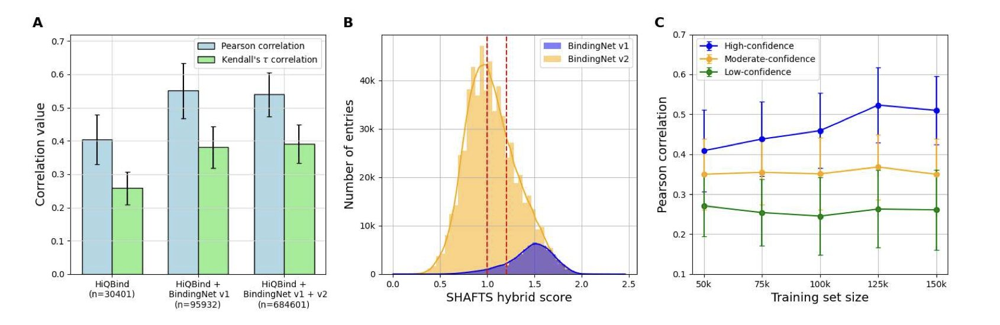
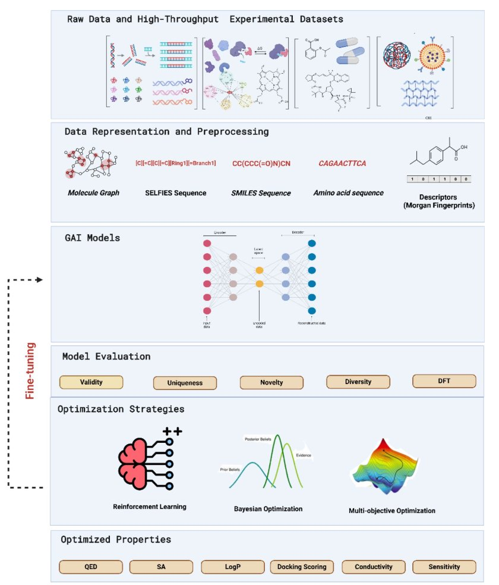
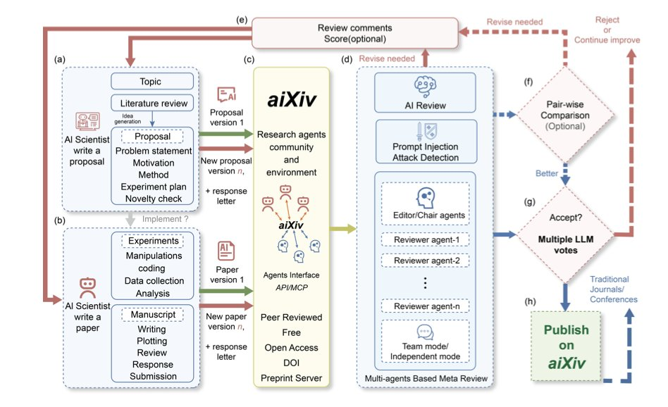

## AI in Drug Discovery: Three Trends in Synthetic Data, Reinforcement Learning, and Automated Peer Review

Explore the latest advances in AI for drug development. This article breaks down how affinity models trained on rigorously screened AI-predicted structures can perform as well as those trained on real experimental data. It also dives into how strategies like reinforcement learning can guide generative AI to design genuinely useful drug molecules. Finally, it introduces aiXiv, a new concept for automated science where AI agents handle the entire peer-review and publication process.

---

## Table of Contents
1. When rigorously screened, "fake" structural data predicted by AI can train binding affinity models just as well as precious "real" experimental data. This opens a new door for drug discovery.
2. Generative AI is like an intern with a wild imagination but no discipline. This review explains how we can use reinforcement learning and other constraints to force it to stop doodling and start designing truly useful drug molecules.
3. The `aiXiv` platform tries to solve the problem of AI-generated research not fitting into the traditional publishing system by building a closed loop where AIs submit, review, and revise papers themselves. For now, it's a proof-of-concept in a simulated environment.

## 1. AI Making Data to Feed AI: A New Paradigm in Drug Discovery?

In structure-based drug discovery (SBDD), we all share a common pain point: there just aren't enough high-quality crystal structures of protein-ligand complexes with affinity data. Many of our machine learning models are like hungry babies, starved by this data famine.

So, a tempting idea emerged: since AI models like AlphaFold can predict structures, can't we just get them to "make" some data for us? Call it "synthetic data" or "fake data"—as long as there's enough of it. It sounds like a perfect solution, right? Infinite data, infinite possibilities.

But there's a huge trap here: "garbage in, garbage out."

A bad binding pose is far more destructive to an affinity model than no data at all. It will completely mislead the model, teaching it all the wrong things about physical chemistry.

This paper answers a key question: can we actually use this AI-generated data? And if so, how?

The researchers used a co-folding model called Boltz-1x to generate a large number of protein-ligand complex structures. They then used these structures to train a binding affinity scoring function. They found that just throwing all the AI-generated structures into the training mix without any thought gave poor results. The model's performance barely improved.

The real magic happened in the "screening" step.

They set up a few simple but effective screening rules:
1.  Prioritize single-chain complexes (these are often simpler systems, which AI can predict more reliably).
2.  Only keep predictions that the model itself was "very confident" about—specifically, those with a Boltz-1x confidence score above 0.9.
3.  Ensure some similarity between the training and test sets to prevent the model from predicting in completely unknown chemical spaces.

When they trained a model on this "carefully selected" set of high-quality synthetic data, something remarkable happened. The new model's performance was nearly identical to a model trained only on precious experimental data from PDBbind.

We finally have a viable process for building reliable scoring functions for target families that lack experimental data, like many orphan receptors and GPCRs. We are no longer entirely dependent on the output speed of crystallographers. We can proactively generate usable training data for any target we're interested in.

This doesn't mean experimental data is no longer important. On the contrary, it remains the gold standard. But this work gives us a powerful "data amplifier." It shows us how to use a small amount of "real" knowledge to guide AI in generating a large amount of trustworthy "derived knowledge."

📜**Title**: Can AI-predicted complexes teach machine learning to compute drug binding affinity?
📜**Paper**: https://arxiv.org/abs/2507.07882
💻**Code**: https://github.com/wehs7661/AEV-PLIG-refined

## 2. AI Drug Design: Imagination Needs a Leash

In drug discovery, generative AI (GenAI) is like an intern with boundless energy and a wild imagination. Show it a few million molecules, and it will pull an all-nighter to draw you a few hundred million new ones. Sounds great, right? The problem is, without any guidance, 99% of what it draws will be useless—or even chemically impossible—doodles.

This review from Khater et al. is a comprehensive training manual for this "intern." It systematically shows us how to tame this creative beast.

Early generative models, like VAEs and GANs, were mostly about "imitation." They were good at learning patterns from training data and then generating new things that looked similar. But that's not nearly enough. We don't need more molecules that look like aspirin; we need new ones that can solve unmet clinical needs.

The real breakthrough came with the introduction of "optimization strategies." This review focuses on two key constraints:
1.  **Reinforcement Learning**: This technique is incredibly effective. Instead of just asking the AI to imitate, we play a "reward" game with it. Every time it generates a molecule we like—say, one with high predicted activity, good solubility, and a non-nightmarish synthesis route—we give it a high score. Over time, the intern learns to please, designing specifically in the direction we want.
2.  **Multi-objective Optimization**: This is the essence of medicinal chemistry. A good drug is never a one-trick pony. Nanomolar activity is useless if the compound is as toxic as cyanide or won't dissolve in water. Multi-objective optimization forces the AI to be an "all-rounder," finding that delicate, sweet spot between activity, toxicity, ADME properties, and novelty. Advanced frameworks like REINVENT 4 are leaders in this area.

The review provides a thorough overview of these technologies, but it also points out the challenges we still face.

First is the iron law of "garbage in, garbage out." The AI learns from our data. If our databases are full of "dirty data"—compounds with unknown properties or inconsistent assay methods—we are just training the AI to produce garbage more efficiently.

Second, and a major headache for chemists, is "interpretability." The AI gives you what it thinks is a perfect molecule, and you go to report it to your project lead. Your boss asks, "Why is this molecule good?" You can't just say, "Because my computer said so." We need a rational, chemistry-based hypothesis to guide our next steps in synthesis and testing. And right now, most AIs can't give us that.

📜**Title**: Generative Artificial Intelligence Models Optimization Towards Molecule Design Enhancement
📜**Paper**: https://jcheminf.biomedcentral.com/articles/10.1186/s13321-025-01059-4

## 3. An arXiv Built by AI? aiXiv Lets AI Review and Publish Its Own Papers

AI writing papers is nothing new, but figuring out what to do with these AI-generated manuscripts has been a constant headache.

Try submitting an AI-written paper to *J. Med. Chem.* The editor would most likely reject it outright. The reason is simple: Who ensures the quality? Who reviews it? The entire process could be overwhelmed.

Someone proposed a new approach: if the existing system won't accept them, let's create a separate server just for AIs. This is what the paper on `aiXiv` introduces.

#### How does `aiXiv` work?

Think of `aiXiv` as an automated factory designed specifically for AI researchers. The factory has different assembly-line workers, or "multi-agents," where each AI has a specific job.

The workflow looks something like this:
1.  A "Researcher AI" submits a research proposal or a first draft of a paper.
2.  A "Reviewer AI" steps in to evaluate the draft. This is the crucial part. The reviewer AI doesn't just make things up; it uses a technique called "retrieval-augmented evaluation." In simple terms, it first searches existing literature databases for information and then uses that evidence to judge whether the claims in the draft are sound. This largely prevents the AI reviewer from spouting confident nonsense.
3.  After the review is complete, the original "Researcher AI" revises its manuscript based on the feedback.

This entire process forms a closed loop that can go back and forth several times, much like how we get put through the wringer by reviewers after submitting a paper. The difference is that this process is compressed into hours or even minutes. The data presented in the paper shows that after a few rounds of this self-contained review and revision, the quality of the AI-generated papers does visibly improve.

#### What's the take for R&D scientists?

First, and most importantly: **this entire system has only been demonstrated in a simulated environment**. The AI isn't actually designing experiments, running instruments, or analyzing raw data. It's more like a super-powered research assistant whose main job is to organize, summarize, and write based on existing knowledge. It can write a decent-looking literature review, but can it discover a new target like PCSK9 from scratch? Clearly not.

Second, **the ethical risks are unavoidable**. In drug development, authenticity is everything. A single wrong data point or a misleading conclusion could cause a team to waste years and millions of dollars chasing a phantom target or molecule. If misused, a system like `aiXiv` could become a breeding ground for "scientific garbage," producing a flood of papers that look plausible but have no factual basis. The authors acknowledge this risk and propose adding clear labels to AI-generated content, but whether that can be effectively regulated is an open question.

So, is this thing completely useless? Not necessarily.

It could be useful in the early, exploratory stages of drug R&D. For example, we could have it quickly screen massive amounts of genomics and proteomics data to automatically generate preliminary reports on the feasibility of a particular target. Or, in the compound design phase, we could have it generate new molecular structure hypotheses based on existing SAR data and compile them into internal reports.

These tasks are repetitive and time-consuming. Handing the first draft over to an AI, with humans then reviewing and guiding the process, could save a lot of time. It can be an efficiency tool, but it cannot replace a scientist's judgment and intuition.

📜**Paper**: https://arxiv.org/abs/2508.15126
