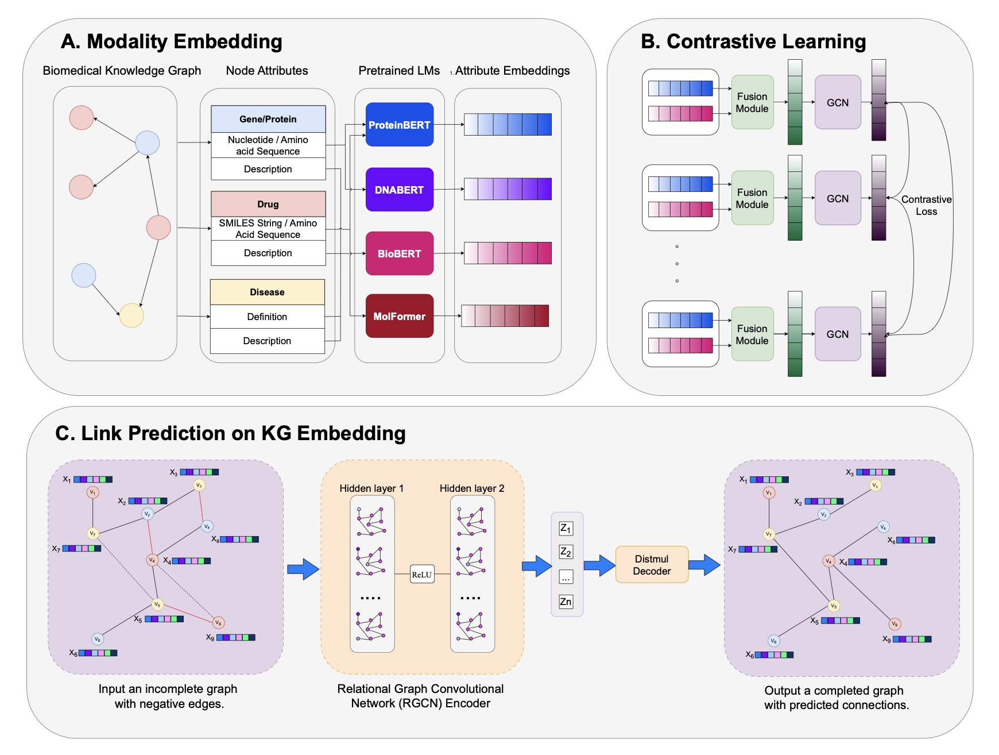
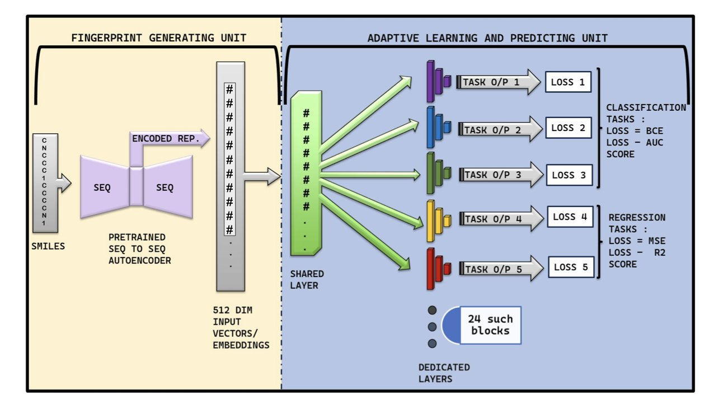
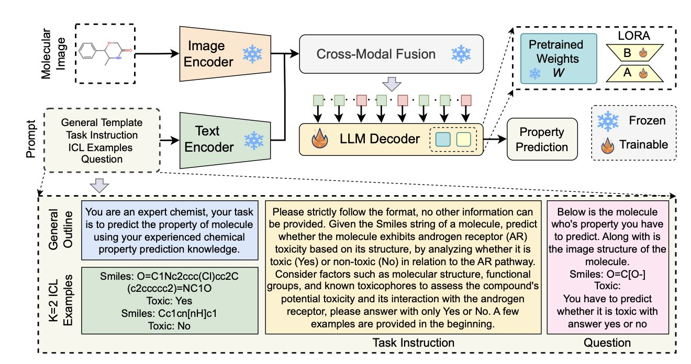
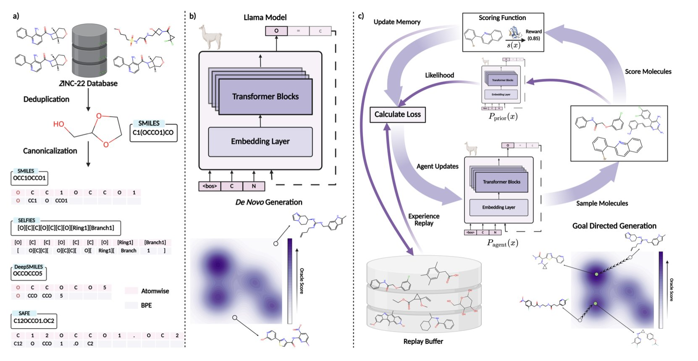
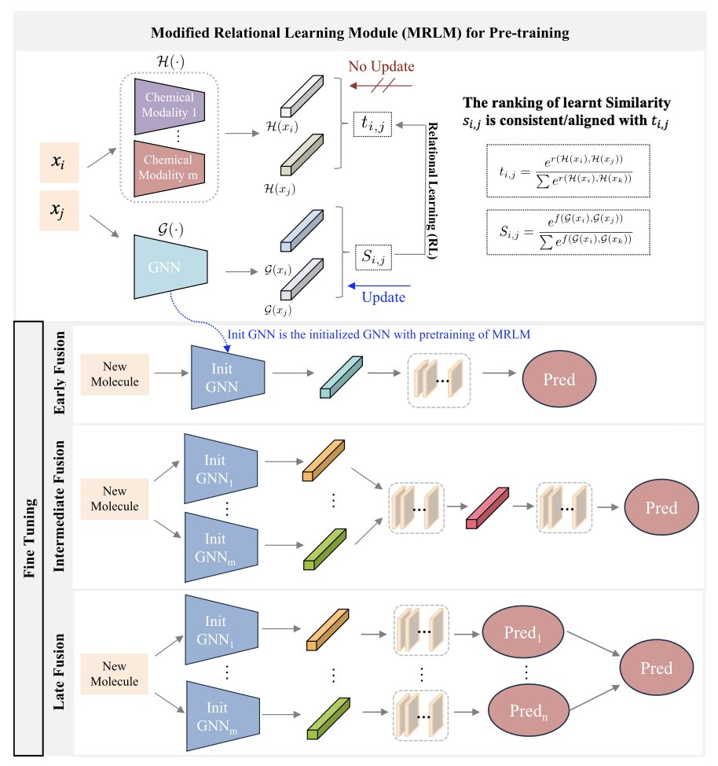

## Table of Contents
1. By combining multimodal information like text and sequences with graph contrastive learning, this study offers a promising solution for building more powerful and generalizable biomedical knowledge graphs.
2. MTAN-ADMET tackles the persistent problem of data scarcity in drug discovery by forcing a single AI model to learn 24 different ADMET properties simultaneously.
3. Feeding molecular structure images to a vision-language model, along with SMILES text, does improve the accuracy of molecular property prediction. But the real magic is in how you fine-tune it.
4. NovoMolGen, the largest study on molecular language models to date, found little correlation between pre-training metrics and downstream task performance. A small model with only 32 million parameters performed just as well as much larger ones.
5. A new framework called MMFRL uses a clever "pre-training cheat" and more refined relationship learning to make multiple types of molecular data work together, improving both the accuracy and stability of property prediction.

## 1. Upgrading Knowledge Graphs: Multimodal Fusion is the Future

Knowledge graphs (KGs) are not new. They try to connect messy dots like drugs, diseases, and genes into a network, which sounds great. But in reality, most knowledge graphs are too "flat."

A node called "Imatinib" might just be a name in the graph. But to a drug developer, it's a SMILES chemical formula, a pile of literature describing its kinase inhibition profile, and tons of clinical data. Using just a name loses too much information.

This new paper "charges up" each node in the knowledge graph by injecting it with multimodal information.

What did they do?

First, they created an enhanced knowledge graph called PrimeKG++. In this graph, a drug node has not only its name but also its SMILES sequence and a detailed text description. Similarly, a protein target is linked to its amino acid sequence and functional annotations. It's like upgrading from a black-and-white sketch to a 4K color picture.

With such rich data, how do you use it?

Their process has a few steps. First, they use various pre-trained language models (LMs) to "read" the text and sequence information, translating it all into mathematical vectors (embeddings) that a machine can understand.

The second and most crucial step is "fusion." They use an attention fusion module (like ReDAF) to combine the vectors from different modalities into a single, more information-rich node representation.

But rich nodes aren't enough; the relationships between them are the essence of a graph. So they used graph contrastive learning (GCL) as a "carving knife" to refine these relationships. The technique sounds complicated, but the principle is simple. It tells the model: "Look, this drug and this target interact in the real world, so their vectors should be closer in mathematical space. That drug and this target have no relationship, so push them apart." After thousands of these "push-pull" adjustments, the entire graph's structure becomes exceptionally clear and logical.

As a result, the method's performance on key tasks like predicting drug-target and drug-disease interactions was very solid. It performed particularly well in tough test scenarios, like when many irrelevant "negative samples" were deliberately mixed in, where it could still identify true associations. More importantly, it works on new drugs and targets it has never seen before. This is a critical step for an AI model to move from the lab to industrial application.

The authors honestly state at the end that their goal wasn't just to bump up a score on some leaderboard by a few tenths of a percent. I completely agree that the value of this work lies in providing us with a more robust and interpretable tool.

When the model predicts a new drug target, we might be able to trace back its reasoning: was the judgment based mainly on chemical structure similarity, or on a hidden clue from a research paper?

📜Title: Multimodal Contrastive Representation Learning in Augmented Biomedical Knowledge Graphs
📜Paper: https://arxiv.org/abs/2501.01644v2
💻Code: https://github.com/HySonLab/BioMedKG

## 2. MTAN-ADMET: AI Learns to Multitask

ADMET (Absorption, Distribution, Metabolism, Excretion, Toxicity) prediction has always been a battle against "data famine."

We have dozens of different ADMET endpoints to predict, but for most of them, the amount of high-quality experimental data we have is pitifully small. For some properties, there might only be a few hundred data points, and the number of "toxic" or "problematic" molecules is even smaller.

In this situation, trying to train an AI model specifically to predict hERG toxicity is like trying to teach a child what a "cat" is by showing them only three photos. They are likely to learn strange, incorrect rules, like "a cat is a white, fluffy thing."

MTAN-ADMET offers a solution: **If you want a child to truly understand 'cat,' you should also teach them about 'dog,' 'bird,' and 'fish' at the same time**.

This approach is "Multi-Task Learning."

Instead of training 24 separate "expert" models for 24 different ADMET properties, the authors trained just **one** model. But they forced this single model to learn all 24 things at once.

The logic is that while hERG toxicity and P450 inhibition are biologically distinct, they might share some underlying physicochemical principles about "how a molecule should behave properly in a complex biological system." By forcing the model to understand both things simultaneously, it is compelled to learn more general, fundamental chemical knowledge instead of memorizing statistical quirks in a specific dataset.

Of course, getting one model to learn 24 different things at the same time—some requiring a "yes/no" answer (classification, like toxicity) and others a specific number (regression, like solubility)—is technically like asking one person to compete in 24 different Olympic events with different rules.

This is where MTAN-ADMET is clever. Its architecture includes some very "adaptive" mechanisms.

So how did this "generalist" model perform?

It beat existing "expert" models on 14 out of the 24 ADMET properties. It performed especially well on notoriously difficult problems with sparse, skewed data, like cardiotoxicity prediction. And it achieved all this by simply "reading" the most basic SMILES molecular strings, without needing computationally expensive and complex graph structures.

The value of MTAN-ADMET isn't just that it's another good prediction tool. It points to an important path for anyone struggling with sparse, messy, and imbalanced biological data: sometimes, to become a better expert, you need to learn things that seem unrelated.

📜Title: MTAN-ADMET: A Multi-Task Adaptive Network for Efficient and Accurate Prediction of ADMET Properties
📜Paper: https://doi.org/10.26434/chemrxiv-2025-zhrsk
💻Code: https://github.com/TeamSuman/MTAN-ADMET

## 3. MolVision: A New Way for AI to Predict Chemistry by Looking at Pictures

Using SMILES strings to teach AI about molecules feels a bit like we're fooling ourselves.

Any organic chemist knows that a simple text string can't capture the full essence of a molecule—the subtle stereochemistry, ring strain, or the spatial orientation of a functional group. We chemists grasp these things instantly just by looking at a 2D structure diagram. It's how we think.

MolVision feels like AI is finally starting to speak our language, or at least a chemist's language. The researchers' idea was: if images are so important, why not just let the model look at them? They packaged molecular structure images and SMILES text together and fed them to a state-of-the-art vision-language model (VLM).

But it's not that simple. Just having the images isn't enough. Using a pre-trained VLM directly would likely produce terrible results because these models were trained on cats, dogs, and landscapes. They don't "understand" chemical bonds and atoms.

The key step here is fine-tuning.

The authors found that a technique called LoRA (Low-Rank Adaptation) was perfect for the job. It efficiently teaches the model how to interpret chemical structures without altering the entire massive model. It's like giving a language genius a picture dictionary of chemistry for a quick start. Combined with a contrastive learning strategy—essentially making the model compare molecules repeatedly, like "these two look similar because they both have a benzene ring" or "these two are different, one has a chiral center"—the visual encoder truly learns to see.

The results were expected, but logical.

The combination of images and text performed better than text alone in predicting a range of properties like toxicity, solubility, and bioactivity. More importantly, the model's ability to generalize improved. This means when faced with a molecule with a completely new scaffold, it's less likely to get confused and can make a more reliable inference based on the visual patterns it has learned.

This doesn't mean we can throw out all our physical chemistry calculations just yet. But this work provides a solid benchmark, proving that integrating a chemist's most intuitive tool—the 2D structure diagram—into AI models is a viable path forward.

📜Title: MolVision: Molecular Property Prediction with Vision Language Models
📜Paper: https://arxiv.org/abs/2507.03283v1
💻Code: https://molvision.github.io/MolVision/

## 4. NovoMolGen: For Molecular Models, Small Can Be Good

We seem to have accepted the belief that bigger models and more data lead to better results. From GPT-3 to GPT-4, parameter counts have soared, and everyone is chasing brute force success.

This trend has also reached cheminformatics. Molecular Large Language Models (Mol-LLMs) are getting bigger and bigger.

But in the unique world of molecules, governed by clear physicochemical rules, is "bigger" always "better"?

The NovoMolGen study in this paper conducted the largest and most systematic investigation of this question to date.

The researchers trained a series of Transformer models of different sizes on a massive dataset of 1.5 billion molecules to understand the behavior of molecular language models.

Their results produced several "counter-intuitive" but highly insightful conclusions.

#### Finding 1: Pre-training "Final Exam Scores" Are Not Very Useful

When we train a language model, we usually look at metrics like perplexity to gauge how well it's learning. It's like a student's final exam score.

But the NovoMolGen study found that a model's score during pre-training has a **surprisingly weak correlation** with its performance on real-world jobs (downstream molecular generation tasks).

This means we might have spent huge computational resources pushing a model's "test score" from 95 to 96, with little to no real benefit for its problem-solving ability. This is very different from the general Natural Language Processing (NLP) field and reminds us not to blindly apply NLP experience to the molecular world.

#### Finding 2: Performance Saturates Quickly

Even more surprisingly, the model's performance basically hit a ceiling very early in the training process. Pouring more money and time into further training yielded minimal improvement.

It's like an athlete who improves their 100-meter time from 12 to 10.5 seconds in the first three months of intensive training. Another year of training might only shave off another 0.1 seconds. For drug discovery projects focused on cost-effectiveness, we need to seriously consider if that extra investment is worthwhile.

#### Finding 3: The "Little Guy" Can Be a Top Performer

The most valuable result of this work is the NovoMolGen model family they introduced, especially the "little guy" with only 32 million parameters.

In multiple molecular generation benchmarks, this small model's performance was just as good as models several or even tens of times larger. It even outperformed them on some tasks.

This means we don't necessarily need an A100 cluster. We might be able to deploy a powerful molecular generation model capable of solving real problems on a decent single machine. This significantly lowers the technical and cost barriers for AI-assisted drug discovery.

The NovoMolGen study gives us a clearer understanding of the true capabilities and training dynamics of molecular language models. In the field of molecular design, instead of blindly chasing "big," it's smarter to pursue "good" and "clever."

📜Paper: https://arxiv.org/abs/2508.13408v1
💻Code: http://github.com/chandar-lab/NovoMolGen

## 5. MMFRL Model: What's New in AI Molecular Prediction?

The molecular data we have is never one-dimensional. You have 2D structure diagrams, SMILES sequences, 3D conformations, and maybe a bunch of scattered experimental data. It's like having beef, potatoes, carrots, and red wine. The question is, how do you turn them into a Beef Bourguignon instead of a random stew?

This is the challenge of "multimodal fusion." Simply throwing all the data into a model at once? That usually works poorly.

The MMFRL framework handles this problem pragmatically. The researchers systematically compared "early fusion" (throwing all ingredients in the pot at the start), "mid-level fusion" (processing each ingredient a bit before combining), and "late fusion" (cooking each part separately and plating them together). They found that "mid-level fusion" performed best on most tasks. This isn't surprising, but systematically proving it is valuable in itself.

What does "using auxiliary modalities during pre-training" mean? Think of it like a medical student who not only learns the core curriculum but also reads countless case studies and watches many surgery videos (these are the auxiliary modalities). When they graduate and become a doctor (the inference stage), even without the textbooks and videos, the experience and intuition they gained are internalized, allowing them to make more accurate diagnoses.

MMFRL does just that: during its "schooling" phase, it trains itself on as many data types as possible, even if that data won't be available when it's "on the job." This is an extremely effective way to squeeze out precious information and pack it into the model's "brain" without increasing the computational cost of the final prediction.

Another core idea is what's called "relational learning." Traditional models look at molecules either in isolation or by comparing pairs to see how "similar" they are. MMFRL goes a step further by learning "relationships of relationships." It's not just interested in the relationship between A and B, but also whether the "relationship between A and B" is similar to the "relationship between C and D." It's like understanding a person not just by their resume, but by looking at their social network and how they interact with their friends. This higher-dimensional perspective can obviously capture more complex and subtle chemical patterns.

Of course, as is tradition, the paper reports that it outperformed all state-of-the-art (SOTA) models on the MoleculeNet benchmark. That's great; it shows the combination of techniques really works.

But in industry, the bigger question is: is it another black box? Fortunately, the authors considered this and provided interpretability analysis. It allows us to see which part of the molecule the model is focusing on when making a prediction, which is crucial for designing new molecules. What's the difference between an unexplainable prediction and a random number generator?

So, MMFRL is a nice piece of engineering. It directly confronts the messy and often incomplete reality of molecular data, and the idea of "borrowing future data for training" is particularly effective. Now, we'll see if it can step out of the comfort zone of benchmarks and help us find something in a real drug discovery project.

📜Title: Multimodal fusion with relational learning for molecular property prediction
📜Paper: https://www.nature.com/articles/s42004-025-01586-z
💻Code: https://github.com/zhengyjo/MMFRL
