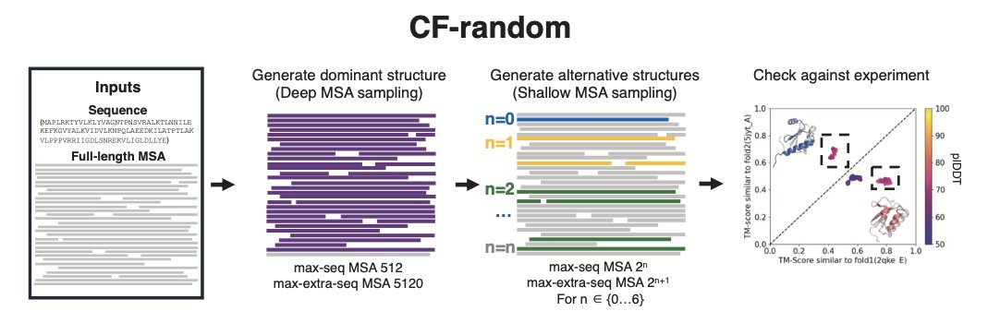
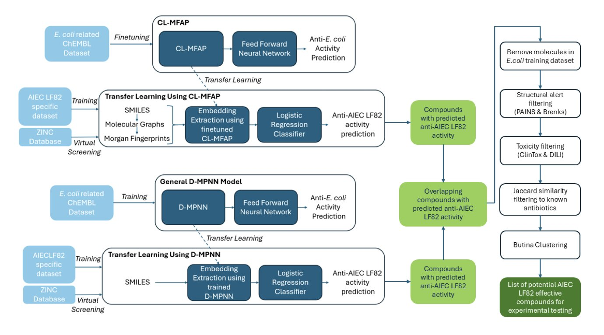
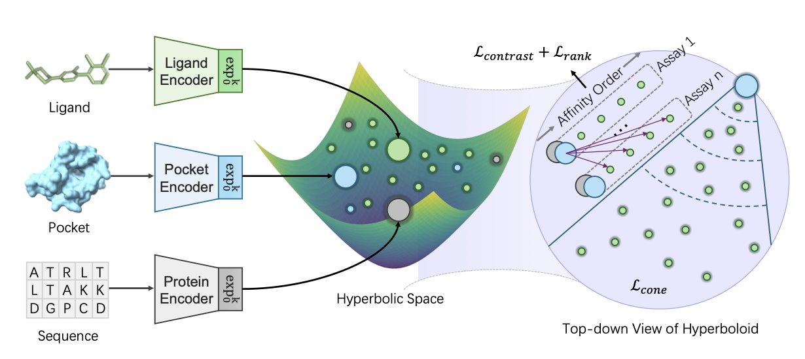

## 目录  
1. 通过巧妙地「饿死」AlphaFold2 的输入序列，一个新方法 CF-random 成功揭示了蛋白质隐藏的多种构象，暗示蛋白质世界可能远比我们想象的更加动态。
2. 通过「借用」大数据训练的模型，研究者们为数据稀缺的特定细菌菌株高效筛选出了潜在的新型抗生素，这为解决老大难的耐药性问题提供了新思路。
3. HypSeek 模型创新地在双曲空间中学习蛋白 - 配体相互作用，利用其指数增长的几何特性，有效解决了虚拟筛选中「活性悬崖」这一问题。

## 1. 反向操作 AlphaFold2，解锁蛋白质隐藏构象  
  
  

AlphaFold2 给出的静态结构很完美，但现实世界的蛋白质可不是这么「安分」的。很多蛋白像变形金刚一样，拥有多种构象，而抓住这些动态变化，对理解功能和设计药物来说，简直是命脉所在。AlphaFold2 通常只给你最稳定的那一个构象，其他的呢？基本靠猜。  
  
研究者开发了一个叫 CF-random 的方法：我们都知道 AlphaFold2 的强大威力来自海量的多重序列比对（MSA），它从进化亲缘关系中学习氨基酸之间的「共谋」。但这些研究者偏不，他们故意给 AlphaFold2「节食」，只喂给它极少的序列，有时候甚至少到 3 条。  
  
这么做，其实是绕开了对共进化信号的依赖。当信息不足时，AlphaFold2 被迫更多地依赖它在训练过程中学到的、深植于模型内部的结构知识。研究者管这个叫「序列关联」（sequence association），说白了，这有点像一种超级增强版的同源建模。模型不再是死板地根据序列共进化拼凑结构，而是在其庞大的「结构知识库」里，根据你给的一点点线索，去寻找最合理的几种可能折叠方式。  
  
效果怎么样？在一组 92 个已知的折叠开关蛋白上，老方法吭哧吭哧也就能搞定 7-20%，而 CF-random 直接把成功率干到了 35%，并且计算量还小得多。它不光能找这种「大变脸」的构象，对付那些局部摆动或者像剪刀一样开合的刚体运动，准确率也高达 95%，把 AFSample2 这些新方法也甩在了后面。  
  
这还不算完。研究者用这个工具对大肠杆菌的 2126 个蛋白进行了一次盲筛，结果挖出了 52 个全新的、可能具有折叠转换能力的蛋白。如果这个比例能推广，意味着整个蛋白质组里，可能有高达 5% 的成员都是「变形大师」。很多都跟转录调控、结构维持这些核心功能有关。想一想，如果一个药物靶点有两种构象，一种致病，一种无害，那我们的目标就不再是简单地抑制它，而是设计一个分子把它「锁」在无害的构象上。CF-random 给了我们找到这两种构象的钥匙。  
  
当然，它可能会因为误解链间相互作用而报假警，而且如果一个蛋白质的构象在 AlphaFold2 的训练数据里闻所未闻，那它也无能为力。所以，拿到预测结果后，用共进化分析或者，最好是，用实验来交叉验证一下，还是非常有必要的。  
  
但无论如何，这项工作告诉我们，AlphaFold2 这个「黑箱」里，可能藏着比我们想象中多得多的关于蛋白质动态学的秘密。  
  
📜Title: Large-scale predictions of alternative protein conformations by AlphaFold2-based sequence association  
📜Paper: https://www.nature.com/articles/s41467-025-60759-5  
💻Code: https://github.com/ncbi/CF-random_software  

## 2. AI 对抗超级细菌：少数据也能炼出新抗生素？  
  
  

大部分时候，AI 模型就像嗷嗷待哺的巨兽，你得拿海量的数据去喂它，它才能吐出点有用的东西。可问题是，如果你要对付的是一种比较「小众」但同样致命的细菌，比如导致克罗恩病的 AIEC LF82 菌株，哪来那么多数据给它吃？  
  
答案：迁移学习。  
  
就像你不会让一个医学生直接上手术台，而是先让他学完基础解剖学一样。研究者们先用一个庞大的、通用的抗菌活性数据库，把他们的深度学习模型（一个叫 CL-MFAP 的基础模型和一个叫 D-MPNN 的图神经网络）训练成一个「通才」。这个「通才」模型对什么是「像抗生素的分子」已经有了基本概念。  
  
然后，他们再用手头那点儿可怜的、针对 AIEC LF82 的专有数据对模型进行「微调」和「校准」。这么一来，模型就从一个「通才」变成了专攻 AIEC LF82 的「专家」。  
  
这套组合拳打得怎么样？他们拿这套系统去筛了将近 1100 万个市面上能买到的化合物。这可不是简单地跑个分就完事了。一个真正懂行的人会看你的筛选流程有多「讲究」。  
  
首先，他们用了 CL-MFAP 这个多模态模型。这意味着模型不只是看分子的一个侧面，而是把 SMILES 序列、摩根指纹、分子图谱这些不同维度的信息全塞进去一起看，力求对分子有个 360 度的立体理解。这有点像一个老练的化学家，会从不同角度审视一个分子。  
  
然后就是残酷的过滤环节。  
  
最后，通过 Butina 聚类，他们从幸存者中挑出了 100 个结构最多样化的候选分子。结果显示，这 100 个分子竟然分属于 82 个不同的 Bemis-Murcko 骨架。  
  
当然，现在这一切还停留在计算机里。这 100 个分子还得拉到湿实验室里去溜溜。MIC 实验、杀菌曲线、动物模型……真正的挑战才刚刚开始。  
  
📜Paper: https://openreview.net/forum?id=QI0Wx8LY8D  

## 3. 双曲空间里的药物发现：AI 更懂「活性悬崖」  
  
  

在做药物发现，特别是先导化合物优化时，最让人抓狂的情况，莫过于「活性悬崖」（activity cliffs）。  
  
什么意思？  
  
就是你费尽心力，在分子上只改动了一个小小的基团，比如把一个甲基换成了乙基，结果发现，新分子的活性不是高了一点或低了一点，而是断崖式地下降了上千倍。这种现象，对我们预测构效关系（SAR）造成了巨大的困扰。  
  
传统的机器学习模型，尤其是那些在欧几里得空间（我们熟悉的三维空间）里工作的模型，在这种问题上常常会栽跟头。在它们眼里，两个结构高度相似的分子，距离就应该很近，性质也应该差不多。它们很难理解，为什么「失之毫厘」，就能「谬以千里」。  
  
这篇论文的 HypSeek 模型，就为我们提供了一个新颖的视角来解决这个问题。  
  
#### 武器升级：从欧几里得空间到双曲空间  
  
作者们认为，问题不出在模型本身，而出在我们用来表示分子的「空间」选错了。他们大胆地把分子、蛋白口袋和序列，都嵌入到了一个叫「双曲空间」的非欧几何空间里。  
  
双曲空间有什么神奇之处？  
  
你可以把它想象成一个边缘被无限拉伸的碗。在这个空间里，距离的计算方式和我们平时不一样。  
  
这意味着什么？两个在结构上只有细微差异的点（比如那对活性悬崖分子），在双曲空间里，它们的距离可以被极大地拉开。这个空间，天然地就具备了一种「放大」微小差异的能力。  
  
这就给了模型一个强大的「归纳偏置」（inductive bias）。模型不再需要费力地去学习如何区分活性悬崖，双曲空间本身的几何特性，就已经帮它完成了大部分工作。  
  
#### 效果如何？是骡子是马，拉出来遛遛  
  
HypSeek 在多个基准测试中都取得了显著的提升：  
1.  **虚拟筛选** ：在经典的 DUD-E 数据集上，早期富集率从 42.63% 提高到了 51.44%。这意味着，在筛选排名前列的分子中，找到真活性分子的概率更高了。  
2.  **亲和力排序** ：在一个亲和力排序任务中，相关性系数从 0.5774 提升到了 0.7239。这表明它对亲和力变化的预测更准了。  
3.  **直面活性悬崖** ：当专门用活性悬崖分子对来测试时，HypSeek 给出的分数差异，比基于欧氏空间的模型要大一个数量级。这证明它确实能更清晰地把「好分子」和「坏分子」区分开。  
  
论文里提到，在某些连计算成本极高的自由能微扰（FEP）方法都预测错亲和力变化方向的案例中，HypSeek 的双曲分数，依然能给出和实验一致的正确排序。  
  
有时候，解决一个难题，需要的不是更复杂的模型，而是换一个更合适的数学框架。将双曲几何引入到药物发现中，为我们理解和预测复杂的蛋白 - 配体相互作用，打开了一扇全新的大门。  
  
📜Paper: https://arxiv.org/abs/2508.15480
