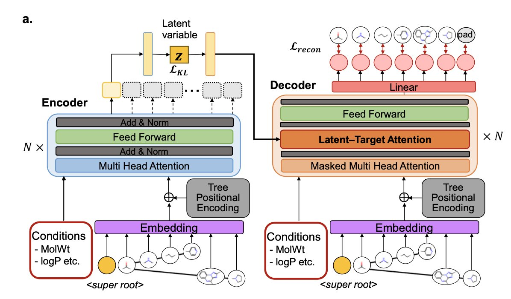
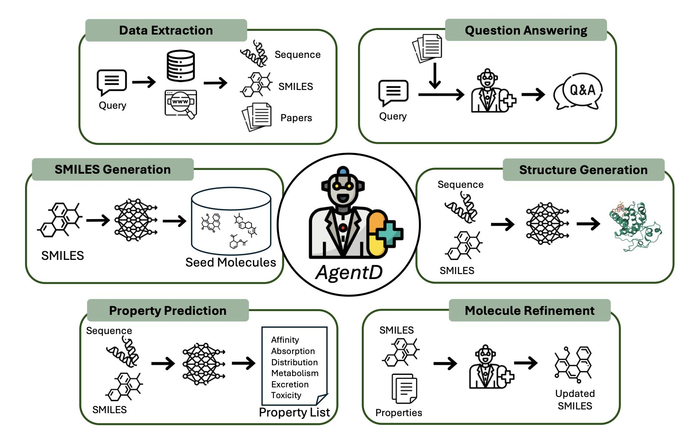
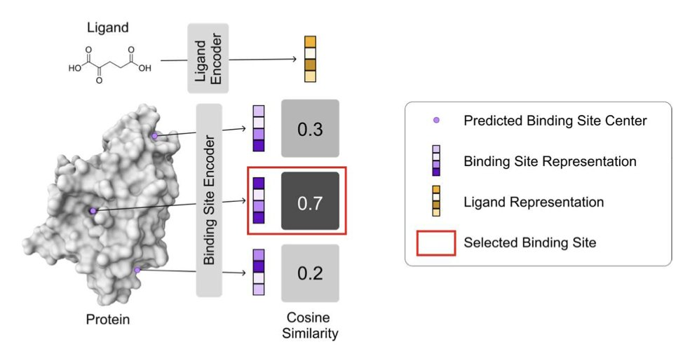

## 目录  
1. FRATTVAE 抛弃了原子或图的视角，强迫 AI 像化学家一样用「片段」思考并用树状结构组织它们，这让它在处理大分子和复杂分子时，表现得既聪明又高效。
2. AgentD 试图将早期药物发现的繁杂计算工作打包成一个 LLM 驱动的自动化流程，想法很酷，但真正的考验在于每个模块的独立性能和组合后的化学直觉。
3. 这款叫 VN-EGNNrank 的新方法，利用配体信息来反向定位蛋白上的结合位点。

## 1. AI 用化学家的方式拼分子：像搭乐高一样  
  
  

分子生成模型大多是在两个极端之间摇摆。一端是基于 SMILES 字符串的模型，它们把分子看成一行文本，简单快速，但经常生成一些化学上不合理的「乱码」。另一端是基于图神经网络的模型，它们把分子看成原子和键的图谱，更严谨，但处理起大分子或复杂环系时，计算量大得能让你等到下一个冰河世纪。  
  
FRATTVAE 试图走出第三条路。它看问题的角度，非常像一个有机化学家。  
  
当我们看到一个复杂的天然产物时，我们不会去一个一个地数碳原子和氢原子。我们会立刻看到一个吲哚环、一个糖基、一个内酯环……我们看到的是「官能团」和「骨架片段」这些有意义的「积木块」。FRATTVAE 干的就是这个。它先把分子拆解成这些化学家熟悉的片段，然后，也是最妙的一步，它把这些片段之间的关系，组织成一个「树状结构」。  
  
因为树状结构天然就包含了层级关系。AI 不仅知道了分子里有哪些积木块，还知道了哪个是主干，哪个是分支，它们是如何一步步「长」出来的。为了让 AI 理解这棵「分子树」，研究者们用了 Transformer 架构，这东西最擅长的就是处理序列和它们之间的复杂依赖关系。  
  
那么，这个用化学家思维武装起来的 AI，表现如何？  
  
首先是规模。研究者们用了一个包含 1200 万个分子的「航母级」数据集来训练它，最终得到了一个有 10 亿参数的庞大模型。这在学术界是相当罕见的。你用这种规模的数据去喂养一个模型，它学到的就不仅仅是几个特定的分子家族，而是对广阔化学空间的一种深刻的、统计学上的「直觉」。  
  
其次是性能。在各种基准测试中，无论是模仿已知分子的分布（distribution learning），还是在给定条件下优化分子性质，FRATTVAE 都把之前的「SOTA」（state-of-the-art）模型打得落花流水。特别是在处理大分子和聚合物时，它的优势尤为明显。  
  
对于做药意味着我们终于有了一个工具，能更可靠地去探索那些传统小分子之外的、更复杂的化学空间，比如天然产物、大环化合物、甚至是多肽。而且，它还更快。这让高通量地生成和评估这些复杂分子，第一次变得真正可行。FRATTVAE 不是又一个 VAE 模型，它可能是一种全新的、更强大的思考化学的方式。  
  
💻Code: https://github.com/slab-it/FRATTVAE  
📜Paper: https://www.nature.com/articles/s42004-025-01640-w  

## 2. AgentD：AI 药研流水线，真能一键炼丹吗？  
  
  

每天在各种数据库和软件之间来回切换，是不是感觉自己像个数据搬运工？一会儿查 FASTA 序列，一会儿找 SMILES，再打开另一个软件跑预测……这套操作，每个计算化学家都懂。  
  
如果用一个大语言模型（LLM）把这些事儿全包了呢？  
  
这个框架 AgentD 想成为一个药物发现早期阶段的「总指挥」，从文献检索、靶点信息查询，到全新分子的从头设计、性质预测、一轮轮的优化，最后连 3D 结合模式都给你生成好。  
  
AgentD 的核心是一个 LLM 大脑，但它不直接干活，而是指挥一堆「专家」工具。它用上 RAG（检索增强生成）技术，当被问到专业问题时，它会先去指定的生物医学数据库里「查资料」再回答，所以给出的答案，比那些会「一本正经胡说八道」的通用 LLM 要靠谱一些。  
  
尤其是它的分子生成和优化能力。研究者让它针对淋巴瘤里的 BCL-2 靶点干活。它先用 REINVENT 和 Mol2Mol 这类模型生成一批种子分子，然后开始预测多达 67 种 ADMET 性质和结合亲和力。最关键的一步来了：迭代优化。  
  
在他们的案例里，经过两轮优化，一个包含 194 个分子的虚拟库里，QED（定量类药性评估）分数高于 0.6 的分子从 34 个增加到了 55 个，满足「五规则」中至少四条的分子从 29 个增加到了 52 个。这个数字提升看起来还不错。但这更像是一个高效的「过滤器」和「微调师」，而不是一个能凭空创造出惊天动地分子的「炼金术士」。它能把一堆石头磨得更圆润，但能不能从石头里直接点出金子，还得打个问号。  
  
最后再整合 Boltz-2 这类工具，生成蛋白 - 配体的 3D 复合物结构，给你一个快速的结合亲和力评估。这对于在成百上千个分子里快速筛选和排定优先级很有用，但别指望它能替代精细的计算或者晶体结构。  
  
AgentD 最大的卖点就是这个「模块化」。这个框架好不好，完全取决于它集成的那些「专家」工具的水平。如果工具本身不行，那 AgentD 也就是个花架子。不过，这种「插拔式」的设计确实很明智，随时可以换上更强的工具，与时俱进。  
  
AgentD 是个很有趣的尝试，它把 AI 药研的「工具箱」整理得井井有条。  
  
📜Paper: <https://www.biorxiv.org/content/10.1101/2025.07.02.662875v1>  

## 3. AI 找靶点新姿势：给分子导航，精准落袋  
  
  

传统的口袋预测算法就像是没头苍蝇，在蛋白质表面乱撞，告诉你「这儿有个坑，那儿有个缝」，但压根儿不管你的分子长啥样、塞不塞得进去。这效率，跟大海捞针有什么区别？  
  
VN-EGNNrank 打算给这只没头苍蝇装上 GPS。它的核心想法简单粗暴但极其有效：你不是要为这个*特定*的分子找口袋吗？那我干嘛不直接把分子的信息告诉模型？  
  
研究者们拿来一个很能打的几何深度学习架构（VN-EGNN）来「阅读」蛋白质的 3D 结构，这相当于一个经验丰富的建筑勘探员。同时，他们用一个简单的网络给配体分子也画了个像。  
  
然后用了一种叫「对比学习」（Contrastive Learning）的训练策略。它会拼命拉近正确的「分子 - 口袋」CP，同时把那些八字不合的错误组合推得远远的。经过这么一番调教，模型就学会了什么样子的分子喜欢什么样子的口袋，拥有了我们化学家梦寐以求的「化学直觉」。  
  
结果在好几个标准数据集上，这个只有 300 万参数的小家伙，居然能和那个拥有 2500 万参数的重量级选手 DiffDock 打得有来有回，有时甚至还更胜一筹。这就像一辆卡丁车跑出了 F1 的圈速。对于天天跑大规模虚拟筛选的人来说，这意味着我们可以在几天甚至几小时内完成以前需要几周才能筛完的库，而且结果还很靠谱。  
  
我们都知道，现在大部分 AI 模型在预测口袋时，都有个「路径依赖」——它们特别擅长找那些位于活性中心、又深又大的「经典」正构位点（orthosteric sites）。但药物研发的未来，很大程度上寄希望于那些更隐蔽、更难搞的变构位点（allosteric sites），因为它们往往能带来更精细的调控和更低的副作用。  
  
研究者发现，当一个蛋白上有多个配体时（往往包含变构调节剂），传统模型的表现就会跳水。而 VN-EGNNrank 因为考虑了配体本身，所以在这方面有了天然的优势。它不是在盲猜，而是在为特定的「钥匙」找最合适的「锁」，这把「钥匙」既可以是开正门的，也可以是开侧窗的。  
  
当然，作者也坦言，模型还不能很好地处理一个配体对应多个口袋的情况，而且训练数据里变构位点还是太少了。  
  
📜Title: LIGAND-CONDITIONED BINDING SITE PREDICTION USING CONTRASTIVE GEOMETRIC LEARNING  
📜Paper: https://openreview.net/forum?id=86TgAWEkaD
