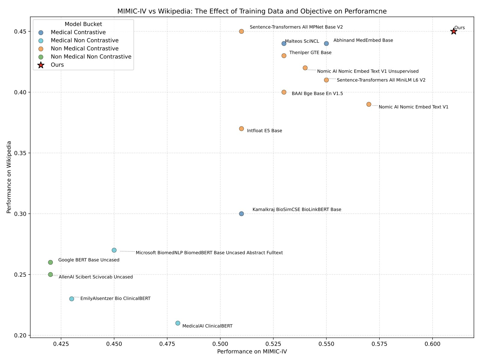
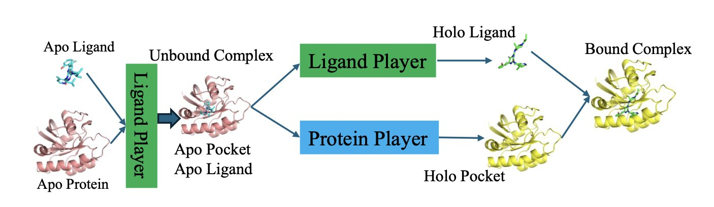
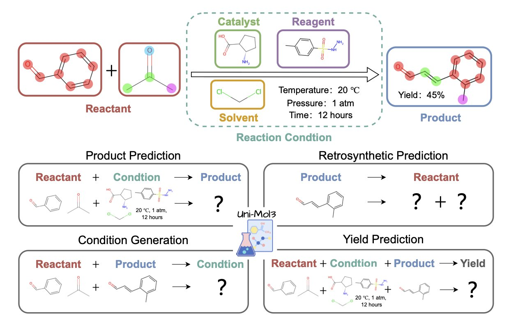

## Table of Contents
1. Faced with messy medical texts, a new AI model, MedTE, fed on massive real-world data, proves that general-purpose AI is an amateur in medicine on a new, extremely tough "medical NLP exam."
2. By modeling molecular docking as a "game" where the protein and ligand adapt to each other, a new algorithm improves both speed and accuracy in the difficult problem of flexible docking.
3. A new foundation model called Uni-Mol3 teaches AI to "read" the 3D language of molecules, trying to turn the art of organic reaction prediction into a more rigorous computational science.

## 1. AI that understands medical records? Pass this new exam first.

We’ve all tried it. You feed a clinical trial report or an electronic health record to one of those all-knowing general large language models (LLMs), and you get back an answer that looks plausible but is actually nonsense. Why? Because medicine has its own unique language, grammar, and even slang.

General AI learns from the vast internet. It might have read a Wikipedia entry, but it has never been in an emergency room at 3 a.m. It doesn't know that "SOB" here means "shortness of breath," not something else. It can't tell the difference between a drug's brand name, chemical name, and internal code. So using these models for serious medical data is often a disaster.

Some early specialized models, like BioBERT, were a step in the right direction. But they were like medical students who only read textbooks. Their diet was too "clean," consisting mostly of well-formatted text like PubMed abstracts.

The researchers behind MedTE prepared a rich and realistic "diet" for their model. In addition to clean data from PubMed, Wikipedia, and ClinicalTrials.gov, they threw in real clinical notes from the MIMIC-IV database—full of abbreviations, jargon, and even doctors' personal shorthand. You have to let the AI roll around in the mud of information before it can learn to swim.

The learning method is also key. They used self-supervised contrastive learning. To put it simply, this method constantly gives the model true-or-false questions. For instance, it shows the model two pieces of text and says, "Both of these mention Drug A for treating lung cancer, so they are semantically 'close'." Then it shows two others: "This one is about heart bypass surgery, and that one is about diabetes, so they are 'far'." After millions of such training cycles, the model gradually builds a meaningful semantic map that follows medical logic.

The researchers didn't just praise their own work. They not only released the model but also created a brand-new "Medical Text Embeddings Benchmark" (MedTEB). This isn't a simple multiple-choice test. It's a comprehensive benchmark with 51 different tasks, from text classification and clustering to relationship determination and information retrieval. It's as if they not only trained a top student but also wrote the final exam for the course.

The results were clear. MedTE outperformed all previous models on this exam.

We finally have a more reliable tool to mine the gold sleeping in massive text datasets. Whether it's screening patients who meet specific criteria from electronic health records or finding clues of adverse drug reactions from tens of thousands of clinical trial reports, an AI that truly "knows the field" can create a leap in efficiency.

📜Paper: https://arxiv.org/abs/2507.19407
💻Code: <https://github.com/MohammadKhodadad/MedTE>

## 2. A New Game in Molecular Docking: Let the Protein and Ligand Play Against Each Other

Molecular docking. People in drug discovery have a love-hate relationship with it. For decades, it's been a cornerstone of our toolkit, but we all know how unreliable it can be. Especially when dealing with "flexible docking," where both the protein pocket and the ligand molecule can move freely. It's like trying to fit a wiggling key into a shaking lock. A complete nightmare.

Most existing AI docking models try to use one big, all-encompassing neural network to understand both the key and the lock at the same time. The problem is, the key (the small molecule) and the lock (the protein pocket) are vastly different in complexity and physical properties. Forcing one model to solve for both is like asking a weightlifter to run a marathon. Something just feels off.

But this new paper on arXiv proposes a creative new approach: "The Docking Game." They don't see it as a simple optimization problem. They see it as a game.

In this game, there are two players:
1.  **The Ligand Player**: An AI model dedicated to predicting the best conformation for the small molecule.
2.  **The Protein Player**: Another AI model dedicated to predicting how the pocket's side chains will respond to the ligand.

How is the game played? Through an algorithm called "LoopPlay." The process is like a sparring match between two masters, constantly probing and adapting to each other.

First, the Ligand Player makes a move: "I think this conformation looks good." It then sends this conformation information to the Protein Player.

The Protein Player looks at it and responds: "Oh? You want to lie down like that? In that case, this phenylalanine in my pocket needs to rotate this way to fit you better." It then sends its adjusted pocket conformation back to the Ligand Player.

Receiving this new information, the Ligand Player thinks: "So the pocket will change like that. My original conformation might not be the best anymore. I need to adjust."

And so, they pass information back and forth in an outer loop, adapting to each other. At the same time, in their own inner loops, they perform "self-improvement," constantly refining their predictive abilities. This continues until both players feel they can't make any more unilateral improvements—reaching what's known as a "Nash Equilibrium." At this point, they have found a binding mode that is most comfortable for both.

This idea acknowledges the differences between proteins and ligands and equips each with its own "expert system." This makes the learning process more targeted and more aligned with physical reality.

The results show this new approach works. The paper reports that its performance in predicting the correct binding mode is about 10% better than the previous state-of-the-art method. In a mature field like molecular docking, a 10% improvement is a number worth paying attention to. Even better, it's fast, averaging just 0.32 seconds per molecular pair. This means it's fully capable of being used for large-scale virtual screening.

📜Paper: <https://arxiv.org/abs/2508.05006v1>

## 3. AI Learns the 3D Language of Molecules to Crack Chemical Reactions

AI for predicting chemical reactions has always been something that sounds great but is frustrating to use.

Most existing models still live in a 2D world. They understand molecules by reading SMILES strings—which is like trying to understand how an engine works by reading a parts list. It knows what parts are there, but it has no idea how they are arranged in space or how they fit together.

The essence of a chemical reaction, however, lies in the dance of electron clouds in three-dimensional space. The angle from which a nucleophile attacks, the direction from which a leaving group departs—all of this is determined by stereochemistry. Looking only at 2D is like a blind person trying to describe an elephant.

Uni-Mol3 confronts the problem head-on: chemistry is 3D.

At the core of Uni-Mol3 is something called a "Mol-Tokenizer." It translates a molecule's 3D structure, along with other physicochemical properties, into a "molecular language" that AI can understand. It's no longer reading letters like "C-C-O-H." Instead, it directly learns the things that truly determine reactivity, like a molecule's spatial shape and charge distribution. This gives the AI "3D glasses" to view chemical reactions for the first time.

Its training method is also systematic, involving two steps. The first step is "molecule pre-training," where the model first learns the "words"—the grammatical rules and internal logic of single molecules. The second step is "reaction pre-training," where the model starts learning "sentences"—what kind of stories happen and what reaction rules are followed when multiple molecules meet.

This "learn words, then learn grammar" strategy allows Uni-Mol3 to perform like a veteran on a range of tasks that chemists care about most. Give it reactants and reagents, and it can predict the major product with an awareness of stereochemistry. Give it a complex target molecule, and it can suggest several plausible retrosynthesis routes like a seasoned synthetic chemist. Even more, it can make a reasonable guess about reaction conditions (which catalyst, which solvent) and the final yield.

This means that in the future, we might not have to blindly screen dozens of reaction conditions. We can let an AI give us a shortlist first. It means that when designing a completely new synthetic route, we have a tireless, well-read assistant to provide inspiration.

Of course, its predictions still need to be judged by experienced humans and, more importantly, verified by hand in the lab. But it is undoubtedly a powerful new tool. It is taking the computational simulation of chemical reactions from the era of 2D "stick figures" into the era of 3D "high-definition modeling."

📜Paper: <https://arxiv.org/abs/2508.00920>
