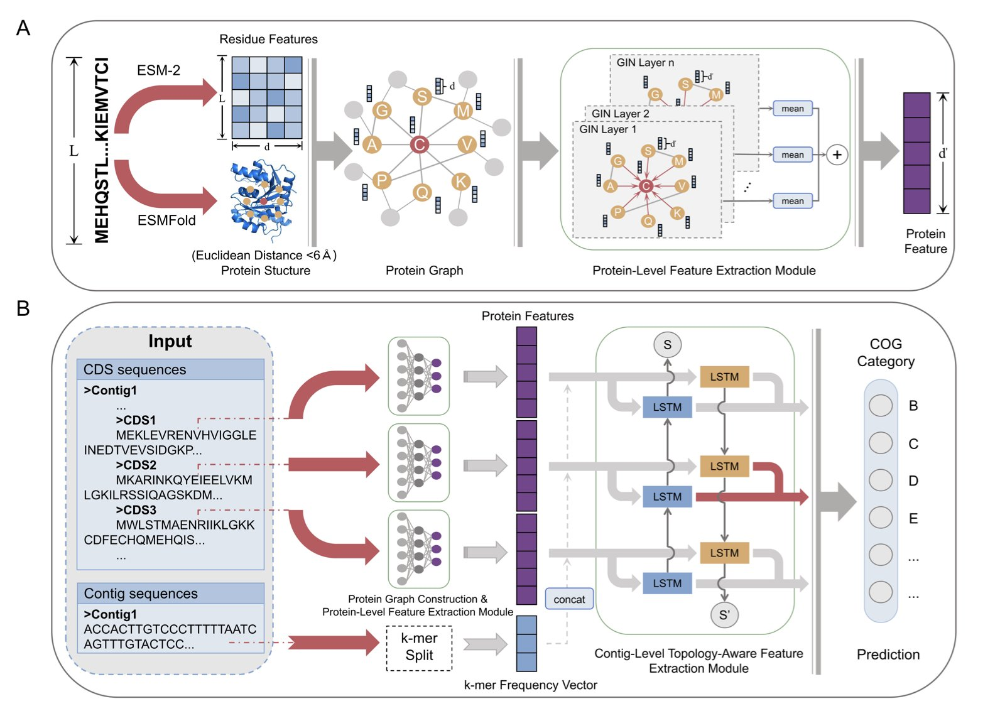
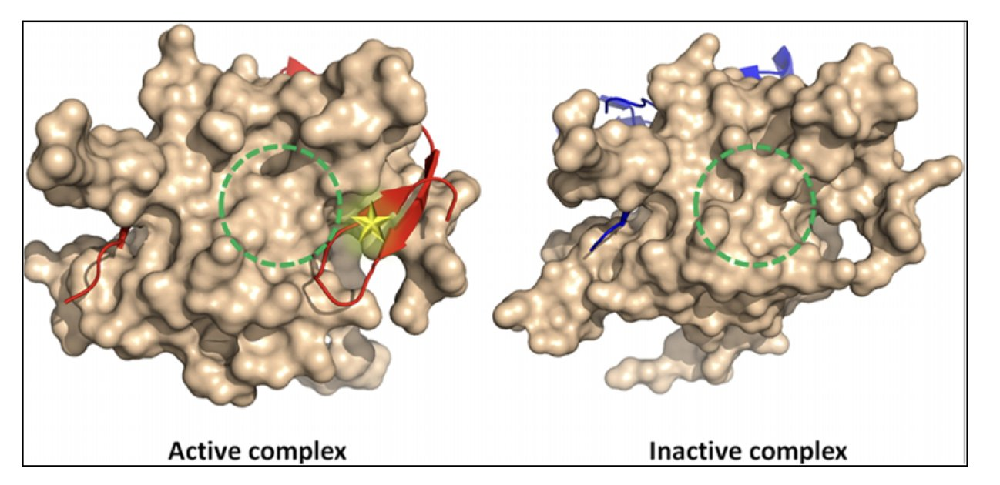
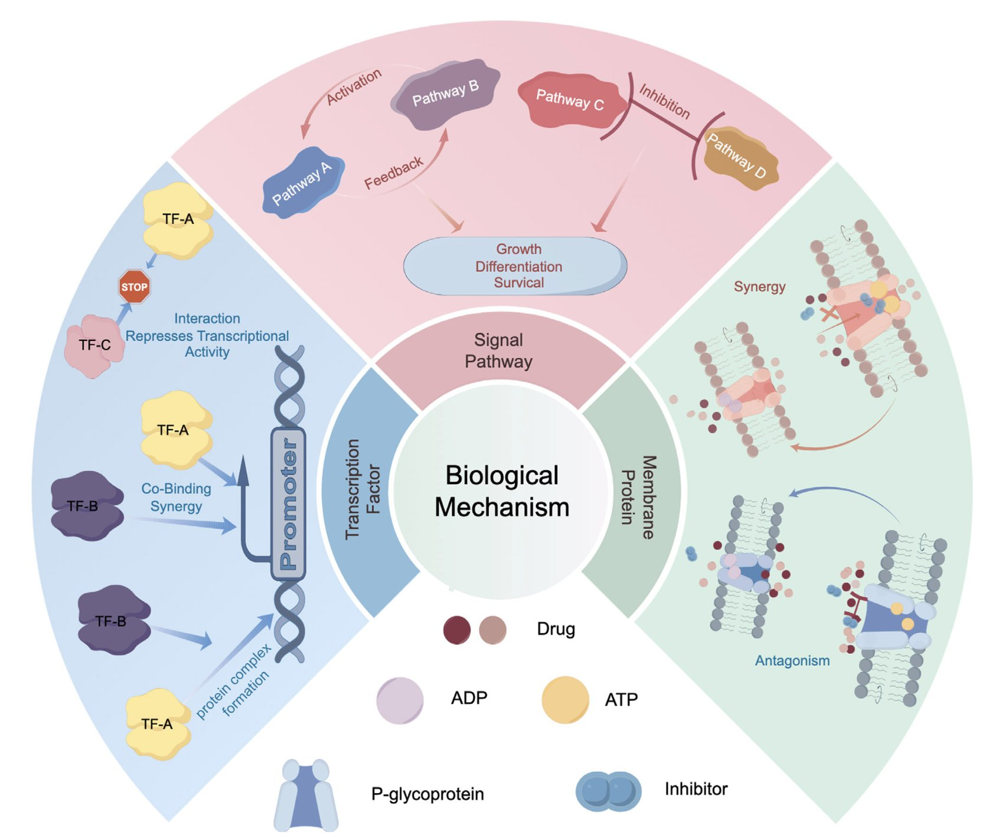

## Table of Contents
1. CAML forces AI to look not just at a protein's "resume" (sequence and structure) but also at its "address" and "neighbors" (genomic context), greatly improving function prediction accuracy.
2. Q-MOL models proteins not as rigid "locks" but as flexible "energy landscapes." This lets it find hidden allosteric "valleys" on flat surfaces, and it achieved an impressive 36% hit rate in real-world screening.
3. This review paper argues that the future of drug combination prediction lies in AI learning to read the 3D "physical battlefield" of protein structures, rather than just staring at the 2D "strategy map" of signaling pathways.

## 1. AI Protein Function Prediction: The Importance of Looking at 'Neighbors'

In functional genomics, data analysts often act like molecular-level HR managers. A newly sequenced metagenome can throw thousands of unknown proteins at you. These are the "job candidates." All you have is their "resume"—their amino acid sequence—and a "headshot" of varying quality from AlphaFold, their 3D structure. Based on this, you have to guess if the protein is a kinase, a transporter, or something else.

In the past, our AI models basically did the same thing. They were powerful "resume screeners," able to extract deep insights from sequence and structure. But they always ignored a piece of information that any biologist intuitively knows is critical: **Where does this candidate live? And what do its neighbors do**?

CAML aims to give this "HR manager" a state-of-the-art "background check" tool.

CAML's architecture is like a comprehensive hiring process:
1.  **Step One: Review the resume**.
    It uses a modern "dream team." ESM-2, a "linguistics expert," reads the protein's amino acid sequence. At the same time, a Graph Isomorphism Network (GIN) inspects the protein's contact map, which represents its 3D structure. This first step thoroughly assesses the protein's individual qualifications.

2.  **Step Two: Conduct a background check**.
    This is CAML's key feature. It looks at which other genes are "neighbors" with the target gene on its chromosome fragment (contig). In the microbial world, this is a powerful clue. Functionally related genes are often organized together into "functional communities" called operons. It’s like discovering a job applicant lives on a street full of top software engineers. You'd have good reason to suspect they're at least a product manager, if not a programmer. CAML uses a Bidirectional Long Short-Term Memory (BiLSTM) network to read these gene neighborhood relationships, creating a "social network" profile for the protein.

3.  **Step Three: Make a final decision**.
    Finally, CAML combines the protein's "resume" and its "background check report" for a final, comprehensive evaluation. This produces its most reliable judgment about the protein's function.

So, how does this new HR manager perform?

It outperforms all the older models that only looked at resumes. And not by a small margin. Its accuracy and F1 scores are often 50% or 60% higher. Ablation studies confirmed that this performance boost comes mainly from the previously ignored, yet valuable, genomic context information.

📜Title: Protein Function Prediction via Contig-Aware Multi-Level Feature Integration
📜Paper: https://www.biorxiv.org/content/10.1101/2025.08.07.669053v1

## 2. Q-MOL: Mapping Protein 'Terrains' to Find Drugs

Computer-aided drug design has long been guided by a classic but increasingly inadequate metaphor: "lock and key."

We treat proteins as rigid "locks" with a fixed shape and drug molecules as equally rigid "keys." All our computations are then attempts to see if a key fits a lock, and how snugly.

But we all know that's not the whole story.

A protein isn't a piece of granite. It's more like a machine made of countless tiny, interconnected springs and hinges, constantly vibrating and breathing. Sometimes, a drug molecule needs to "knock" on the door, and only then will the protein reveal a "hidden pocket" that wasn't there before. We call this "induced fit." Traditional docking programs, which treat proteins as rigid bodies, are mostly helpless against this dynamic complexity. And they are even less useful for "intrinsically disordered proteins," which resemble a pile of cooked spaghetti.

Q-MOL tries to solve this problem with an approach that is closer to physical reality.

It takes a "ligand-centric" view. It no longer asks, "Can this key fit into this lock?" Instead, it asks, "For this key, where on the entire surface of the lock is the most comfortable, lowest-energy 'sweet spot'?"

To answer this, Q-MOL no longer sees the protein receptor as a fixed 3D structure, but as a multi-dimensional "potential energy landscape." You can imagine this as a highly detailed "topographical map" with mountains, valleys, plains, and basins. This map implicitly contains all of the protein's possible, low-energy flexible conformations.

Now, the docking process becomes a very intuitive physical one. Q-MOL places the ligand molecule, like a glass marble, onto this "topographical map." Then it lets the marble roll freely under gravity until it settles in the lowest-energy "valley."

This "valley" might be the classic active site we already know. But it could also be a tiny, hidden "dip" in a seemingly flat area on the protein's surface—the "allosteric pocket" we've been looking for.

Does this work in the real world?

They applied this system to a protease from the West Nile virus, a real and difficult drug target. They had Q-MOL select the 50 most promising molecules from a virtual compound library. Then they went back to the lab and tested all 50. It turned out that 18 of them showed real inhibitory activity.

A 36% hit rate.

They also used the platform on notoriously "undruggable" targets like c-Myc and β-catenin, and successfully predicted potential allosteric binding sites.

📜Title: Q-MOL: High Fidelity Platform for In Silico Drug Discovery and Design
📜Paper: https://www.biorxiv.org/content/10.1101/2025.08.06.668254v1

## 3. AI for Drug Combinations: From Pathway Maps to a 3D Battlefield

In drug development, especially in oncology, we dream of creating synergistic combinations where 1+1>2. But the reality is that we often spend a fortune only to get antagonistic effects where 1+1<1, plus a host of toxic side effects.

Why?

Because our old way of predicting drug combination effects is like looking at a simplified subway map.

We look at a signaling pathway diagram and say, "Drug A blocks station A, and Drug B blocks station B, so this line should shut down!" But we ignore that a cell isn't just a few isolated subway lines. It's a crowded, chaotic, three-dimensional city full of transfers and surface streets.

This review paper aims to shift our focus from that flat "subway map" to the 3D, dynamic "city" itself. It makes a clear call: **Stop looking only at pathways, look at structures**!

Its core argument is physically intuitive. The root cause of drug synergy or antagonism isn't abstract arrows, but specific molecular "handshakes."
*   **What might synergy look like**? Maybe Drug A binds to protein X and, like a key, twists it into a new shape. This new shape happens to expose a perfect, previously nonexistent binding pocket, allowing Drug B to bind with very high affinity.
*   **And antagonism**? Maybe Drug A makes protein X "shy," causing it to fold in on itself and hide the binding site for Drug B.

Before AlphaFold and other structure prediction AIs, systematically thinking about this kind of molecular "butterfly effect" was just a fantasy. Now, AI gives us a chance to be the "choreographer" of this complex molecular ballet. This review systematically outlines how AI can be used to analyze how drugs alter a protein's conformational ensemble, how they affect protein-protein interaction interfaces, and how they compete for the same transporter "channel."

But now for a dose of reality.

The review also points out the elephant in the room—**data**.

Where are we going to get enough high-quality training data? We don't even have enough reliable data for single drug-protein interactions, let alone for **drug combinations**. Systematically measuring how hundreds of drug combinations affect the dynamics and functions of thousands of proteins inside a cell is an engineering challenge so vast it would intimidate any experimental scientist.

📜Title: Protein Spatial Structure Meets Artificial Intelligence: Revolutionizing Drug Synergy–Antagonism in Precision Medicine
📜Paper: https://advanced.onlinelibrary.wiley.com/doi/10.1002/advs.202507764
