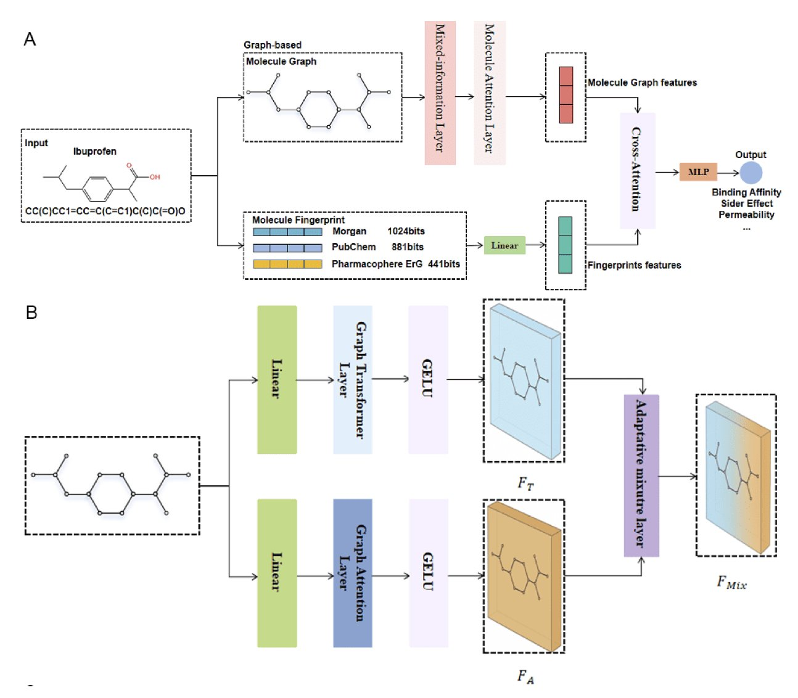
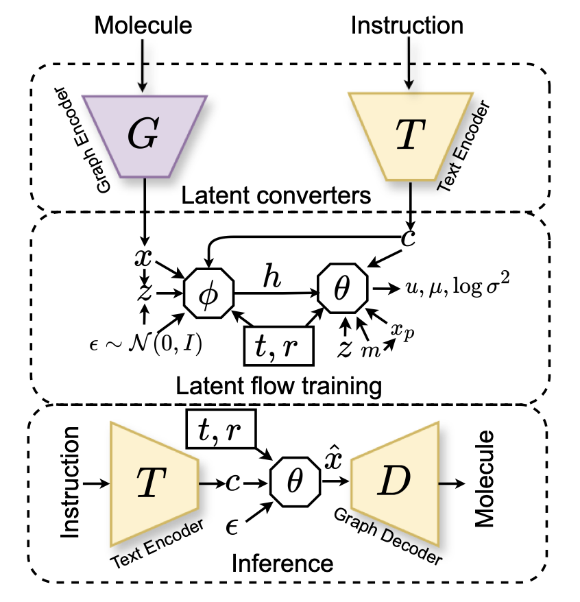
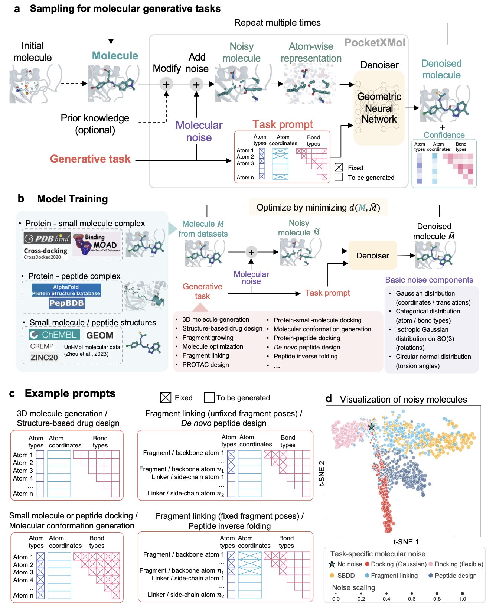
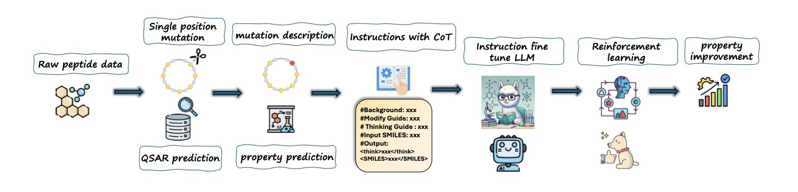
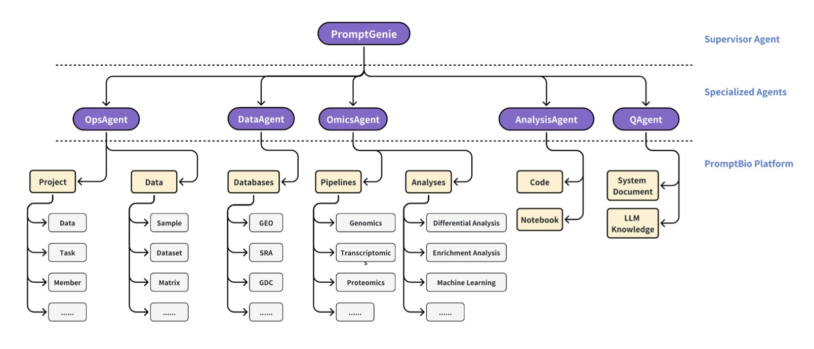

## Table of Contents
1. MLFGNN tries to capture both local details and global structure by fusing graph attention networks, graph transformers, and molecular fingerprints. It shows strong benchmark performance, but its value in real drug discovery projects is yet to be proven.
2. MolSnap challenges slow and expensive diffusion models with a new, nearly instantaneous generation method that also produces higher-quality molecules.
3. PocketXMol uses a fundamental, atom-level perspective to build a true "one-model-fits-all" molecular design platform, proving its real-world utility with wet lab results.
4. By learning a "Chain-of-Thought," PepThink-R1 can not only provide results when optimizing cyclic peptides but also explain *why* it made those changes, moving beyond black-box AI.
5. PromptBio is an AI-driven "bioinformatics department in a box" that automates everything from standard multi-omics analysis to custom workflows in natural language, addressing the core reproducibility problem in the field.

## 1. MLFGNN: Correcting the Nearsightedness and Farsightedness of Graph Neural Networks

Is a molecule's property determined by a specific functional group, or by its overall topology?

The answer is "both."

This creates a big challenge for Graph Neural Networks (GNNs). Most models are good at one or the other. They either focus on local details, like looking through a high-power microscope at an ester group or a halogen, or they take a bird's-eye view, grasping the molecule's overall shape and flexibility. It's hard to get one model to have both types of "vision."

MLFGNN uses a Graph Attention Network (GAT) to handle local information. You can think of a GAT as a team of sniffer dogs, highly sensitive to the chemical environment around each atom. This is the model's "nearsighted" ability, responsible for identifying key groups that determine local reactivity or binding patterns.

Next, to get "farsighted" vision, the researchers brought in a graph transformer. Transformers dominate natural language processing because they excel at capturing long-range dependencies. Here, they're used to examine the entire molecular graph, understanding interactions that span multiple chemical bonds, like the molecule's overall dipole moment or complex steric effects.

The cleverest part is the "adaptive fusion mechanism." It works like an intelligent autofocus system. If the property the model is predicting (like water solubility) depends more on the molecule's overall polar surface area, the system gives more weight to global information (the transformer's output). If it's predicting metabolic stability at a specific site, the local chemical environment (the GAT's output) is more important. This mechanism lets the model learn to adapt to the situation instead of using a one-size-fits-all approach.

And they didn't stop there. The researchers also integrated traditional molecular fingerprints. Fingerprints are veterans in cheminformatics—simple, fast, and built on decades of chemical knowledge. MLFGNN uses a cross-attention module to let the new features learned by the GNN "talk" with these classic fingerprint features, allowing them to complement each other. It's like having a talented young chemist consult an experienced old master, which prevents the GNN from overthinking things in the complex graph space.

The benchmark results in the paper look great, as always. MLFGNN outperformed existing top methods on several public datasets. But that's like passing a driving test. The real challenge is taking this car onto the "dirt roads" of a real drug discovery project. Real-world molecular libraries are full of biases and unseen scaffolds. Will this sophisticated "hybrid power" system hold up, or will it overfit due to its complexity?

The code is open source, so the entire community can now take MLFGNN for a spin. We can test it with our own messy, challenging proprietary data. Only then will we know if this new model is a magic tool that can turn lead into gold, or just another shiny object that dazzles on benchmarks but fails in practice.

📜Title: Multi-Level Fusion Graph Neural Network for Molecule Property Prediction
📜Paper: https://arxiv.org/abs/2507.03430v1
💻Code: https://github.com/lhb0189/MLFGNN

## 2. One-Click AI Drug Generation: MolSnap Moves Beyond Slow Diffusion Models

If you follow AI drug discovery, you've heard of "Diffusion Models."

They are the current darlings, capable of generating very high-quality molecules. But they have a fatal flaw: they are slow. Painfully slow. They work like a meticulous sculptor, starting with a random block of "noise" marble and patiently chipping away, step by step, to reveal the final molecular shape. This process can take hundreds or even thousands of steps.

It's an elegant process, but in the fast-paced world of drug discovery, the results might be good, but they arrive too late.

MolSnap's message to diffusion models is: "You're too slow!"

It has two main weapons.

The first is "Variational Mean Flow" (VMF). You don't need to understand the complex math behind it. You just need to know that it turns molecular generation from a thousand-step process into a one-shot deal. Instead of inching its way from noise to a molecule, it learns the "road map" from the start to the end and then jumps directly to the destination. The paper says it only needs 1-5 function evaluations to get the job done. In terms of computational efficiency, that's like trading a bicycle for a jet.

The second, which is key to ensuring quality, is the "Causal-Aware Transformer" (CAT). This solves another big problem. Many models that generate molecules from text (e.g., "I want a molecule that inhibits kinases and is water-soluble") act like they're playing with a word puzzle, forcing features together without regard for chemical logic. CAT, however, enforces "causal dependency" during generation. It's like building with Lego—you have to put down the base before you can add bricks on top. This respect for the logic of chemical construction leads to a stunning result: **100% chemical validity**. It won't generate molecules with five-coordinate carbons or other oddities that make organic chemists' blood pressure rise.

So, MolSnap is not just fast; it's high-quality. The molecules it generates are better in novelty and diversity than those from the best existing methods.

This allows us to explore chemical space in an interactive way with almost no delay. We can quickly test "what-if" ideas, much like talking to a chatbot. "What would a molecule with three hydrogen bond donors and a cLogP of less than 2 look like?" MolSnap can give you an answer almost instantly.

📜Title: MolSnap: Snap-Fast Molecular Generation with Latent Variational Mean Flow
📜Paper: https://arxiv.org/abs/2508.05411v1

## 3. AI Drug Discovery: This Time, It Made Active Molecules

Our hard drives are filled with a zoo of AI drug design tools. There's one for generating small molecules, another for designing peptides, and yet another for docking. They all work in their own separate worlds. Every time you want to try something new, you have to find a new tool and learn its unique dialect.

PocketXMol feels like an attempt to unify the field.

PocketXMol argues that we should stop drawing lines between small molecules and peptides. At the most fundamental physical level, what are they? They are just collections of atoms arranged in a specific three-dimensional way inside a protein's pocket.

So, PocketXMol uses this fundamental, unbiased "atom-level" perspective to train a massive foundation model. It doesn't learn "chemistry"; it learns "how atoms should be placed." It’s like teaching an AI to be a chef not by making it memorize a million recipes, but by teaching it the principles of thermodynamics, molecular gastronomy, and the Maillard reaction.

Its training method, "recovering structure from noise," is similar to diffusion models. But its application is "task-prompted." You don't need to fine-tune the model for every new task. You just talk to it like you would to ChatGPT: "Hey, design a small molecule that binds to this pocket," or "Design a peptide that fits into this groove." It understands and starts "creating" at the atomic level.

Okay, that's the theory. I only care about one thing: **Does it work**?

The researchers didn't just get a high score on benchmarks (though it did come in first on 11 out of 13 tasks). They actually tested it.
*   They had PocketXMol design inhibitors for Caspase-9. The AI-designed molecules showed activity comparable to commercially available inhibitors.
*   They had PocketXMol design peptides that bind to PD-L1. The success rate was far higher than random screening.

Succeeding in both small molecules and peptides—two fields with very different rules—is strong proof of the power of its unified "atom-level" representation. The AI doesn't need to know what an amino acid or a benzene ring is. It just needs to know which combinations of atoms are most stable in a given physicochemical environment.

📜Title: PocketXMol: An Atom-level Generative Foundation Model for Molecular Interaction with Pockets
📜Paper: https://www.biorxiv.org/content/10.1101/2024.10.17.618827v2
💻Code: https://github.com/pengxingang/PocketXMol

## 4. PepThink-R1: A Cyclic Peptide Optimization AI That Can 'Think'

Using Large Language Models (LLMs) to design peptides is no longer new. We give a model an initial cyclic peptide sequence, ask it to optimize it, and it gives us a new sequence with good predicted metrics. But if you ask it, "Why did you change the alanine at position 5 to a non-natural amino acid?" it can't answer.

This black-box model, where we know the "what" but not the "why," makes it hard to fully trust AI-generated designs. We don't know if a change was based on learned chemical principles or just a random correlation in the training data.

The PepThink-R1 framework enables an LLM not only to do the work of cyclic peptide optimization but also to "write a lab notebook" explaining its process.

#### How do you teach an AI to "write a lab notebook"?

The core technique is "Chain-of-Thought" (CoT).

The authors built a new training dataset where each pair of "before-and-after" cyclic peptide sequences is paired with a "design rationale" as a label.

This "design rationale" explicitly states:

They used this data with "work logs" to perform supervised fine-tuning (SFT) on the LLM. This is like teaching the model, step-by-step, how to connect a specific amino acid modification to a desired improvement in pharmaceutical properties.

#### From "Learning to Think" to "Autonomous Exploration"

Once the model has a basic grasp of this "think-then-modify" pattern through SFT, PepThink-R1 enters its second phase: **Reinforcement Learning (RL**).

In this stage, the model begins to autonomously explore different amino acid modifications. For each change it makes, it receives a "reward score." This score is a composite evaluation of the new peptide's chemical validity and the degree of improvement in properties like lipophilicity and stability.

Through trial and error, the model gradually learns which "operations" earn high scores and which modifications are dead ends.

This two-step "SFT + RL" strategy gives the model a solid starting point, preventing it from getting lost in the vast search space of reinforcement learning. The RL phase then gives the model the ability to go beyond its training data and discover new, potentially better solutions.

#### What were the results?

Compared to general-purpose LLMs and the specialized baseline model PepINVENT, PepThink-R1 showed a clear advantage in both optimization success rate and the interpretability of its results. Its High-Quality Success Rate (HQSR) reached 0.890, meaning the vast majority of its suggestions are reliable and valuable.

Most importantly, the "chains of thought" it generates are valuable information in themselves. They can inspire us to think about structure-activity relationships from new angles, turning AI into an intelligent partner we can actually "talk" with in our research.

📜Paper: https://arxiv.org/abs/2508.14765v1

## 5. PromptBio: Your AI Bioinformatics Expert Team

Bioinformatics analysis is the engine of modern biomedical research and the nightmare of countless graduate students: a pile of scripts from unknown sources, an environment that never works, and the classic line, "It runs on my machine." Trying to reproduce your own analysis six months later is nearly impossible. The field is full of manual, workshop-style practices, and reproducibility is a disaster.

The PromptBio platform aims to rescue us from this disaster. It's not just another standalone analysis tool. Its architecture is a "multi-agent system"—basically, it gives you an AI team with a manager and specialized agents, each with its own job.

This team has several star employees:

The first is **DiscoverFlow**. Think of it as an extremely rigorous, almost obsessive-compulsive "assembly line worker." You give it a standard multi-omics analysis task, and it will execute it following a predefined, unchangeable workflow (a Directed Acyclic Graph, or DAG). The benefit? Absolute reproducibility. The results will be identical whether it's run today or tomorrow, by you or by me. For large-scale, standardized data processing, this is exactly what we need.

The second is **ToolsGenie**, the team's "creative genius." You no longer need to learn complex command lines. You just tell it in plain English: "Hey, find the genes in my tumor samples that are overexpressed and are also kinases." ToolsGenie will then select the right tools, generate the scripts, assemble them, and give you the answer. It frees you from the tedious details of "how to do it," letting you focus on the scientific questions of "what to do" and "why."

The third is **MarkerGenie**, the team's "librarian" and "literature analyst." When you get a list of genes from the first two modules, do you still have to go to PubMed and search for them one by one to see if they are known biomarkers? MarkerGenie does that work for you. It automatically searches the literature and gives you a summary report on the roles these genes have played in disease.

From the very beginning, PromptBio has prioritized **security and compliance**. It includes encryption, access control, and audit logs, all aimed at HIPAA and SOC2 standards. This clearly shows that its goal is to be used in real clinical settings, handling sensitive patient data. This is a completely different level of thinking from projects that are just for academic use.

📜Paper: https://www.biorxiv.org/content/10.1101/2025.07.05.663295v1
