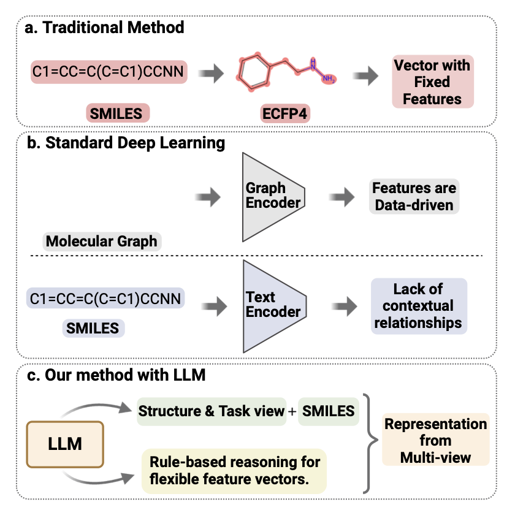
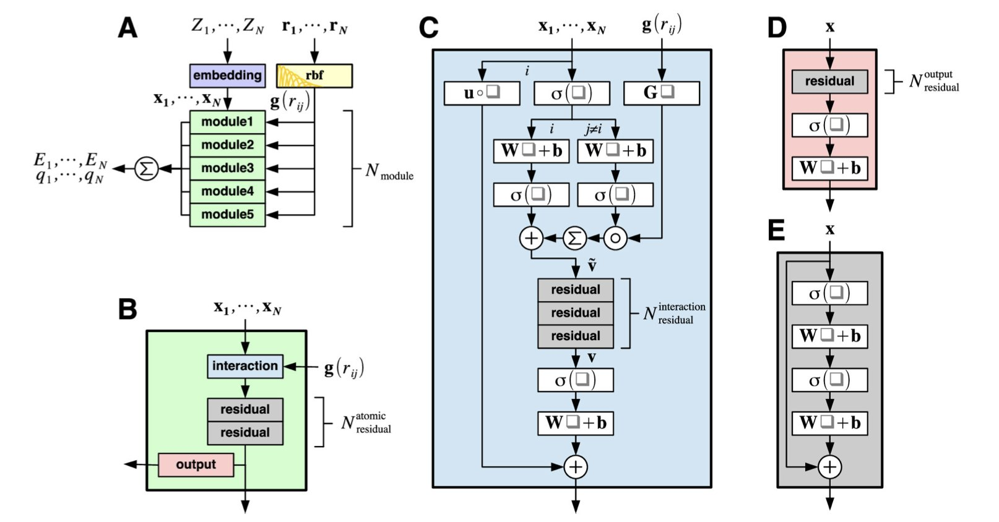
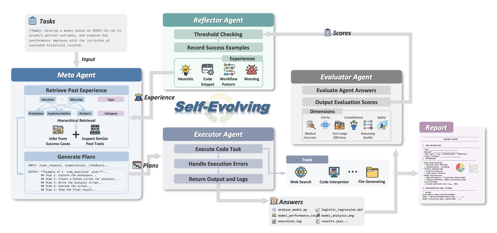

## 目录  
1. M2LLM 通过强迫一个大型语言模型从多个视角——结构、任务和化学规则——来审视分子，从而创造出比任何单一方法都更丰富、更强大的分子表征。
2. 这篇综述系统地总结了机器学习如何让分子动力学模拟在保持量子化学精度的同时，把计算速度提升了几个数量级，让我们能研究更真实、更复杂的生物体系。
3. HealthFlow 最可怕的地方不是它有多强，而是它能从过去的失败中学习，像一个会复盘的顶尖研究员一样，不断进化自己的研究策略。

## 1. M2LLM：AI 学会像化学家一样看分子  
  
  

一直以来我们试图教会计算机像一个经验丰富的药物化学家一样思考。但这是一件极其困难的事。因为一个化学家在看一个分子的时候，他的大脑里，其实是在同时处理好几件事。  
  
他首先会看这个分子的**结构**——这里有个苯环，那里有个很活泼的酰胺键。然后，他的大脑会立刻切换到**任务模式**——我们现在是想让这个分子穿过血脑屏障，还是想让它去抑制一个激酶？这两个任务，对分子的要求可是天差地别。最后，他还会自动地调用他几十年来积累下来的、无数的**化学规则**和直觉——「这个四元环看起来张力很大，在体内可能不稳定」，「这个分子看起来太油了，溶解度肯定好不了」。  
  
大多数 AI 模型只学会了第一件事。你给它一个 SMILES 字符串，它能学到一些关于结构的统计学规律。但这就像是让一个只懂语法的机器人，去写一首伟大的诗。它可能会写出一些语法正确的句子，但它没有灵魂，因为它不懂语境，也不懂修辞。  
  
M2LLM 最核心的创新，就是「多视角学习」。  
  
它不再只给 AI 看那串枯燥的 SMILES 字符串。在处理每一个分子之前，它会先准备好一个「案情简介」，里面包含了三个关键部分：  
1.  **结构视角** ：这还是基础，告诉 AI 这个分子是由哪些原子和化学键组成的。  
2.  **任务视角** ：这是点睛之笔。它会用自然语言，把我们想解决的问题，也一并告诉 AI。比如：「请预测这个分子是否能穿过血脑屏障。」这就像是给了那个机器人一个明确的「写作主题」。  
3.  **规则视角** ：它还会把一些已知的、重要的化学物理规则（比如分子量、脂水分配系数等），也作为「背景知识」，提供给 AI。  
  
然后，M2LLM 会把这三种不同维度的信息，动态地融合在一起，去生成一个最终的、无比丰富的分子「指纹」（也就是我们说的表征）。  
  
那么，这个被「多重赋能」了的 AI，表现如何呢？  
  
结果在多个行业里公认的、出了名难搞的基准测试集上，都取得了最好的成绩。无论是在预测血脑屏障通透性（BBBP 数据集），还是在预测临床毒性（ClinTox 数据集）上，它都把那些「单线程思维」的前辈们，甩在了身后。  
  
作者们还测试了不同的「大脑」——也就是不同的 LLM 底层模型，比如专为科学文献训练的 Galactica，和更通用的 LLaMa。结果发现，不同的「大脑」，其「思维偏好」也不同。Galactica 更擅长利用那个「任务视角」，这很合理，因为它读过太多的科学论文，它更懂得如何去理解一个具体的科学问题。  
  
M2GLLM 的价值在于指明一条如何让 AI「更好地理解问题」的道路。与其去疯狂地堆砌更多的参数和数据，不如先退后一步，想一想，我们人类专家在解决问题时，到底依赖了哪些不同维度的信息。然后，再想办法，把这些信息，以一种 AI 能听懂的语言，教给它。  
  
📜Title: M2LLM: Multi-view Molecular Representation Learning with Large Language Models  
📜Paper: https://arxiv.org/abs/2508.08657v1  

## 2. AI 驱动的分子动力学：看得更准、跑得更快  
  
  

分子动力学（MD）模拟是我们理解微观世界的一扇窗。无论是研究一个药物分子如何与靶点蛋白结合，还是观察蛋白质如何折叠，MD 都能给我们提供原子级别的、动态的视角。  
  
但 MD 模拟一直面临一个两难的抉择：**精度** vs. **速度**。  
  
我们一直梦想着，能有一种方法，既有量子化学的精度，又有经典力场的速度。这篇综述告诉我们，机器学习正在让这个梦想变成现实。  
  
#### 机器学习力场（MLFFs）：鱼与熊掌，可以兼得  
  
MLFFs 是这场变革的核心。它的思路是这样的：  
我们先用高精度的量子化学方法，去计算一堆有代表性的小分子体系，得到它们精确的能量和原子间作用力。然后，我们把这些高质量的「参考答案」喂给一个机器学习模型（比如神经网络），让模型去学习「原子排布」和「体系能量/力」之间的函数关系。  
  
一旦模型训练好了，它就成了一个超级快速的「能量/力」计算器。你给它一个新的原子构象，它不再需要去解复杂的薛定谔方程，而是直接通过学习到的函数，瞬间给出一个接近量子精度的结果。  
  
这就实现了「量子精度，经典速度」的目标。我们现在可以模拟数千个原子，跑纳秒级别的尺度，而精度却远高于传统力场。  
  
#### AI 增强采样：不错过任何一个精彩瞬间  
  
生物和化学世界里，很多关键的事件，比如化学反应的发生、蛋白质构象的罕见变化，都像是昙花一现。用常规的 MD 模拟，你可能跑上一年也等不到一次。  
  
AI 增强的采样方法，就是来解决这个问题的。它能帮助我们更智能地探索分子的构象空间，不再像无头苍蝇一样乱撞，而是主动地去寻找那些能量势垒高、但可能隐藏着重要信息的区域。这大大提高了我们观察到慢过程和罕见事件的效率。  
  
#### 这些技术能用在哪？  
  
这篇综述列举了一系列令人兴奋的应用：  
  
训练数据的质量、如何处理长程静电相互作用等，都是领域内还在努力解决的问题。但这篇综述清晰地指出，机器学习和分子动力学的结合，正在从根本上改变我们研究分子世界的方式。  
  
📜Paper: https://doi.org/10.26434/chemrxiv-2025-6vdl2  

## 3. AI 有了复盘能力：HealthFlow 自主进化  
  
  

我们现在用的很多 AI Agent，就像一个极其聪明、记忆力超群，但毫无常识的实习生。你让他去分析一份电子病历（EHR）数据，他会严格按照你给的流程跑，哪怕那个流程里有个明显的坑，他也会毫不犹豫地跳进去，而且下次你再让他做类似任务，他还会以同样优美的姿势再跳一次。  
  
我们缺的不是更强的计算能力，而是一个能「长记性」的 AI。  
  
HealthFlow 试图解决的，不是 AI 的「智商」问题，而是它的「情商」和「经验」问题。  
  
它的创新点是一种叫做「元规划」（Meta Planning）的自主演进机制。  
  
这是什么意思？就是 HealthFlow 在完成一次任务后，会进行「复盘」。它会分析：「这次任务，我用了 A、B、C 三个步骤，最后成功了，很好，把这个成功经验记下来。上次那个任务，我用了 D、E、F，结果搞砸了，为什么？哦，原来是 D 步骤里处理缺失值的方法不对，下次再遇到类似情况，我得换个方法。」  
  
它在自己的脑子里，建立了一个动态的、不断更新的「策略知识库」。这让它从一个只会执行固定程序的机器，变成了一个能从经验中学习、不断调整自己工作流的智能体。它就像一个 GPS，不仅能规划路线，而且在你上次跟着它走错一条路之后，它会记住那个路口，下次自动帮你绕开。  
  
为了证明这套机制不是花架子，研究者们自己搭建了一个全新的、更难的基准测试平台 EHRFlowBench。他们没有去那些现成的、可能已经被「过度优化」的数据集上刷分，而是直接从已发表的顶级临床研究中，提取出真实的、复杂的、充满噪音和陷阱的数据分析任务。  
  
在这片为难 AI 而生的「盐碱地」上，HealthFlow 毫无悬念地击败了其他最先进的 AI 框架。这不仅是因为它的某个算法组件更优秀，而是因为它在战略层面就赢了——它是一个会学习如何学习的系统。  
  
当然，HealthFlow 离一个能独立主持科研项目的「AI 科学家」还很远。它学到的是解决问题的「策略」，而不是生物学或医学的「第一性原理」。它不会因为分析了更多数据就突然顿悟了癌症的发病机理。  
  
我们正在从打造更锋利的「工具」，转向培养更「研究伙伴」。一个不知疲倦、记忆力完美、而且还能不断从错误中吸取教 - 训的伙伴，它会对未来的科学研究带来什么样的冲击？  
  
📜Paper: https://arxiv.org/abs/2508.02621v1
