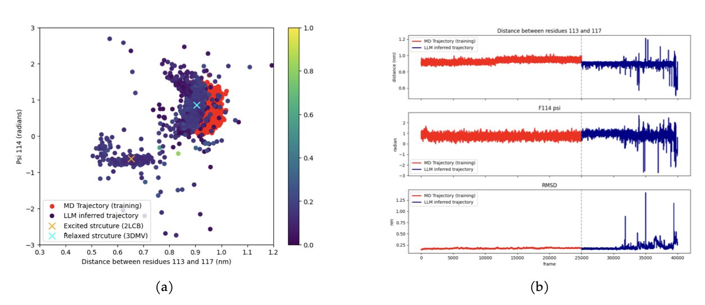
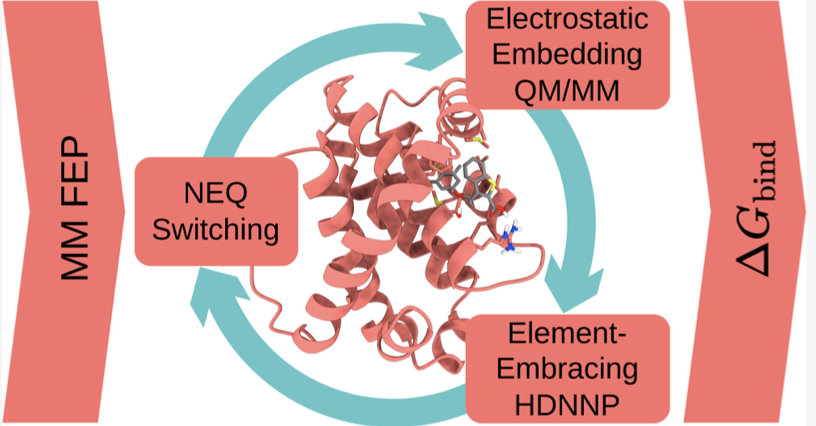
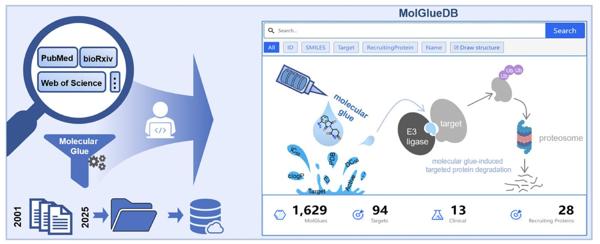

## 目录  
1. MD-LLM-1 不再是传统分子动力学的「录像机」，它更像一个能凭空想象出蛋白质「未公开」构象的「导演」，能直接跳过巨大的能垒看到另一边的风景。
2. 这套方法巧妙地用机器学习给昂贵的量子化学计算装上了「涡轮增压」，让原本遥不可及的、针对金属药物的精确结合自由能计算，第一次变得触手可及。
3. MolGlueDB 系统性地整理并开放了迄今为止最全面的分子胶降解剂数据，为这个新兴领域的药物研发人员提供了一个急需的、一站式的信息检索和分析平台。

## 1. AI 玩转分子动力学：预测蛋白质的另一面  
  
  

分子动力学（MD）模拟，就像让你蒙着眼睛在一片巨大的、崎岖的山脉中寻找一个特定的山谷。你只能一步一步地走，很容易就陷在某个小山坳里（局部能量极小值），然后花上数百万个 CPU 小时，也翻不过那座最高的山峰，看不到另一边更广阔的风景。  
  
而 MD-LLM-1，这篇论文里的新方法，就像是给了你一架可以瞬间传送的无人机。  
  
研究者们用一个叫 FoldToken 的方案，把蛋白质的三维结构，翻译成了一串串 AI 能读懂的「单词」。然后，他们用一个大语言模型（Mistral 7B，并且用 LoRA 进行了高效微调），来当「作家」，根据上文，去写下一个最合理的「句子」（也就是下一个构象）。  
  
这个「AI 作家」不是在机械地复述它读过的故事。最让人觉得有点毛骨悚然的，是它的泛化能力。研究者们做了一个堪称「魔鬼级」的测试：他们只用 T4 溶菌酶的「基态」（也就是最常见的稳定状态）数据来训练模型。然后，他们让模型去自由「创作」。结果，模型不仅生成了基态，还生成了那个能量更高、更难到达、但功能上至关重要的「激发态」。反过来也一样，用激发态训练，它也能找到基态。  
  
这说明它学的不是一条具体的轨迹，而是蛋白质构象变化的「物理语法」。它理解了从一个状态到另一个状态的内在逻辑，所以它能绕过两者之间那座巨大的能量壁垒，直接告诉你山那边的样子。  
  
很多疾病的发生、药物的结合，都与蛋白质那些罕见的、瞬时的「激发态」有关。传统 MD 想要捕捉到它们，就像想用相机拍到一颗子弹出膛的瞬间一样困难。而 MD-LLM-1 提供了一个全新的、可能成本低得多的范式。  
  
当然，目前这个模型还是个「专才」，不是「通才」。它是针对特定体系进行训练的，还不是一个能下载下来就用在任何蛋白上的通用工具。但它所展示的可能性，是突破性的。它预示着一个未来：我们可以直接让 AI 去「想象」和「生成」那些最重要的功能性构象，而不是傻傻地等待模拟轨迹撞大运。  
  
📜Title: MD-LLM-1: A Large Language Model for Molecular Dynamics  
📜Paper: https://arxiv.org/abs/2508.03709  

## 2. AI 给量化装上涡轮：精准计算结合自由能  
  
  

计算结合自由能，这是做计算辅助药物设计的人的终极梦想，也是终极折磨。它就像是计算化学领域的「圣杯」，谁能又快又准地算出来，谁就掌握了预测药物活性的关键。  
  
我们手头通常有两种武器。一种是经典力场（MM），快得像闪电，但粗糙得像用石头画画，尤其是在遇到一些它「不认识」的原子，比如过渡金属时，它就彻底瞎了，因为它参数库里根本没有这些东西。另一种是量子力学（QM），精确得像显微镜，但慢得能让你等到海枯石烂，用它来算一个完整蛋白的自由能，简直是天方夜谭。  
  
于是，我们有了 QM/MM，一个折衷：把关键区域（比如配体和结合口袋）用 QM 精算，其他部分用 MM 粗算。但这依然不够。要做自由能微扰（FEP）这种需要海量采样的计算，即使是 QM/MM 也还是太慢了。  
  
这个研究开发了一个机器学习势（ML Potential），这个 AI 模型专门学习那个小小的、但至关重要的 QM 区域的行为。  
  
它不需要你预先用 QM/MM 算几百万个点来喂饱它。它用的是「主动学习」（Active Learning）。这就像你雇了一个绝顶实习生。你不用手把手教他所有事。你让他自己去做模拟，当他遇到一个自己从未见过、感到「不确定」的构象时，他会停下来，举手问你：「老板，这个情况我没见过，您能亲自用 QM/MM 帮我算一下吗？」你只需要回答他这一个问题，他就会立刻学会，然后信心满满地继续工作。  
  
通过这种「按需提问」的方式，它把原来需要成千上万次昂贵 QM/MM 计算的任务，压缩到了几百次。  
  
而这套方法的真正威力，在 GRP78–NKP1339 这个例子上体现得淋漓尽致。NKP1339 是一个含钌（Ru）的抗癌化合物。任何一个做过分子模拟的人都知道，要在经典力场里处理钌，简直是噩梦。而这套 ML/MM 的方法，却毫不费力地给出了与实验符合得很好的结合自由能。  
  
一大批过去我们因为含有金属而束手无策的药物靶点——比如各种金属蛋白酶——现在终于有了一套可靠的、可行的计算评估工具。我们不再需要靠「猜」或者用一些不靠谱的参数去凑合。  
  
📜Title: Machine Learning-Enhanced Calculation of Quantum-Classical Binding Free Energies  
📜Paper: https://doi.org/10.1021/acs.jctc.5c00388  

## 3. MolGlueDB：首个分子胶靶向降解剂专属数据库  
  
  

靶向蛋白降解（TPD）这个领域，PROTAC 技术已经声名鹊起，但另一个分支——分子胶（Molecular Glues），正吸引着越来越多的关注。  
  
分子胶和 PROTAC 一样，都是利用我们细胞内自带的「垃圾处理系统」（泛素 - 蛋白酶体系统）去降解致病蛋白。但它的作用方式更「精巧」。它不像 PROTAC 那样，需要一个长长的链条去把目标蛋白和 E3 连接酶「捆」在一起。分子胶更像一块小小的「磁铁」，它能诱导目标蛋白和 E3 连接酶的表面发生构象变化，让两个原本互不理睬的蛋白，突然变得「情投意合」，从而形成三元复合物，启动降解。  
  
这种模式，让分子胶在处理一些传统小分子和 PROTAC 都难以成药的靶点（比如没有明显结合口袋的转录因子）时，显示出了巨大的潜力。沙利度胺的「传奇重生」，就是分子胶经典的案例。  
  
#### 领域的痛点：数据「孤岛」  
  
随着分子胶领域的火热，相关的研究论文和专利如雨后春笋般涌现。但这给研发人员带来了一个新问题：**信息过载和分散**。  
  
A 公司的专利里报道了一个新骨架，B 大学的论文里发表了一个新的作用机制，C 实验室的会议摘要里提到了一个失败的案例……这些宝贵的数据，散落在互联网的各个角落，形成了一个个「数据孤岛」。我们想系统性地了解，目前都有哪些 E3 连接酶被用过？针对某个特定靶点，都有哪些成功的分子胶骨架？构效关系（SAR）是怎样的？做这些调研，需要耗费大量的时间和精力。  
  
MolGlueDB 这个在线数据库，就是为了解决这个痛点而生的。  
  
#### MolGlueDB 提供了什么？  
  
它就像一个专门为分子胶领域建立的「中央图书馆」。  
1.  **全面收录** ：它从 241 篇出版物中，整理了超过 1800 个条目，涵盖了 1600 多种不同的分子胶。这些分子涉及 28 种不同的 E3 连接酶（招募蛋白）和 94 个不同的降解靶点。  
2.  **丰富的信息维度** ：对于每一个分子，数据库都提供了详细的信息，包括：  
    *   **化学结构** ：这是药物化学家最关心的。  
    *   **生物活性数据** ：结合亲和力（Kd, IC50）、降解能力（DC50, Dmax）。  
    *   **理化性质** ：分子量、cLogP 等。  
3.  **强大的搜索功能** ：除了常规的文本搜索，它还支持「化学结构搜索」。这意味着，可以画一个感兴趣的化学骨架，然后让数据库找出所有包含这个骨架的分子胶。这个功能，对于做新分子设计和专利分析，价值巨大。  
4.  **收录「失败」案例** ：这是我觉得这个数据库做得非常好的地方。它不仅收录了那些有降解活性的分子，也收录了很多经过测试但没有活性的「阴性」数据。这些「失败」的案例，对于我们理解一个分子为什么「不行」，和理解它为什么「行」，同样重要。  
  
此外，数据库还收录了一些表现出分子胶行为的 PROTAC 分子，这也体现了这两个技术之间的内在联系。  
  
MolGlueDB 把零散的知识，汇聚成了一个系统性的、可供查询和分析的知识库，无疑会加速整个领域的创新进程。  
  
📜Paper: https://academic.oup.com/nar/advance-article/doi/10.1093/nar/gkaf811/8239508
