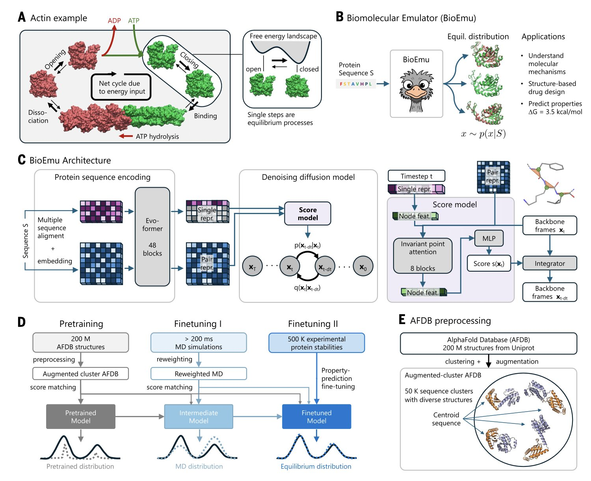
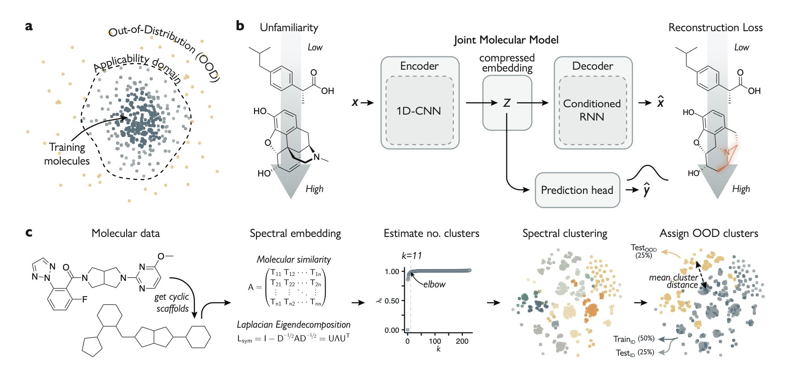
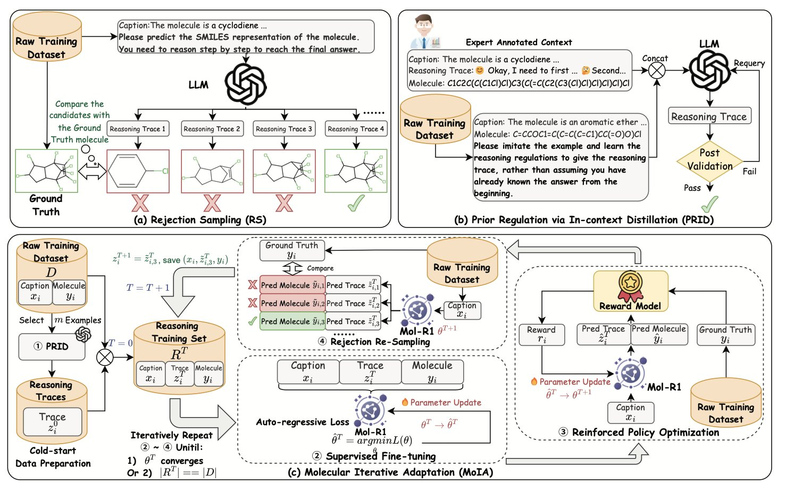
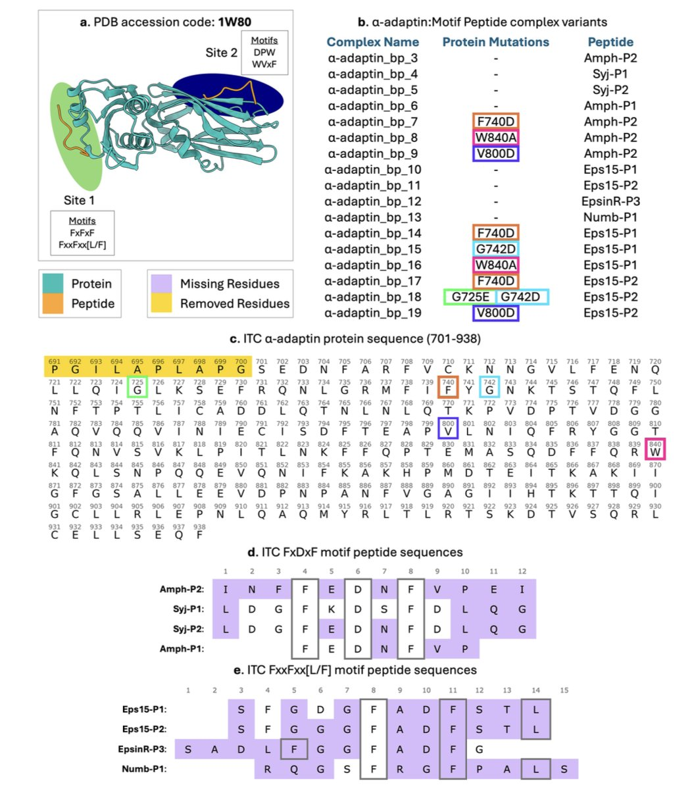
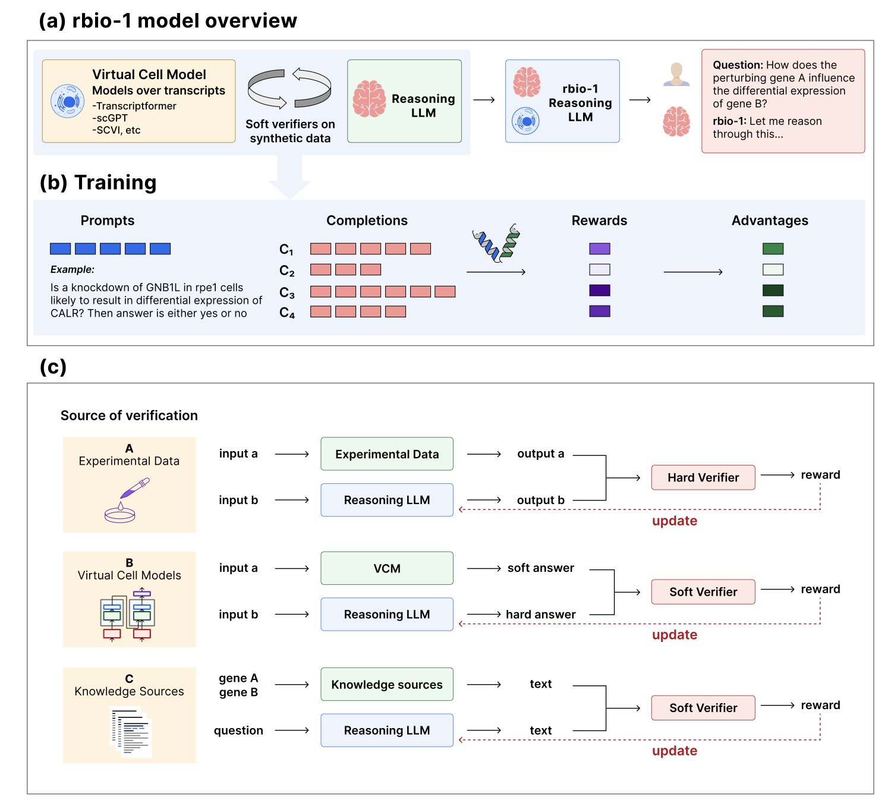

## Table of Contents
1. BioEmu uses generative AI to create "movies" of proteins, much faster than traditional molecular dynamics. This opens up a new path for high-throughput studies of protein function and drug discovery.
2. Researchers trained a model to do two things at once: reconstruct molecules and predict their properties. From this, they created an "unfamiliarity" score that can both identify truly novel molecules and tell us when to be skeptical of an AI's predictions.
3. Mol-R1 uses an iterative training framework to turn a large language model (LLM) into an expert that can design molecules and explain its chemical reasoning step-by-step. This improves the AI's reasoning ability and reliability in drug discovery.
4. The PEPBI database gives AI high-quality "textbooks" for the first time, providing detailed structures of protein-peptide complexes along with precise experimental thermodynamic data (ΔG, ΔH, ΔS). Now AI can learn some physical chemistry.
5. rbiol has a large language model learn from a "virtual cell," using massive amounts of simulated data to train an AI that understands biological reasoning. It performs as well as, and sometimes better than, models trained on expensive experimental data.

## 1. BioEmu: AI makes proteins "move," faster than MD

AlphaFold gave us a high-resolution snapshot of a protein, which is a big deal. But a protein is more like a movie. It twists, breathes, and changes shape to do its job. To watch this "movie," the traditional method is Molecular Dynamics (MD), but that's like hand-drawing an animation frame by frame. It’s incredibly time-consuming and computationally expensive. Now, BioEmu gives us a high-speed camera.

Researchers use AlphaFold as a powerful reader to understand a protein's sequence and extract its features. Then, they use a diffusion model to "draw" the 3D structure. This is like an artist who understands the laws of physics. The model doesn't just draw randomly; it generates a whole ensemble of dynamic, equilibrium conformations based on rules. To help the model learn, researchers fed it a huge amount of data: over 200 milliseconds of MD simulation trajectories and 500,000 experimental data points on protein stability. That’s like making it watch a massive library of training films.

The model successfully reproduced known protein conformational changes, like the DFG-in/out flip in kinases. Its performance in predicting protein folding free energy is also solid, with a mean absolute error of less than 0.9 kcal/mol and a Spearman correlation of about 0.6. This level of accuracy is reliable enough for researchers who need to assess the stability of mutants. You could use it to quickly screen hundreds of point mutations and see which ones might break your protein.

BioEmu helps us see binding pockets that are hidden in static structures. The targets for many allosteric inhibitors are only revealed for a moment as a protein moves. BioEmu gives us a chance to capture these fleeting moments on a large scale, opening the door to discovering new drug targets.

BioEmu and MD work together. BioEmu acts as a high-throughput screening tool, quickly narrowing down the vast space of possibilities to the most promising conformations. Then, MD can step in for fine-grained, physics-based simulations to validate the results, focusing precious computational resources where they matter most. What once required a dedicated computational team might now be done by an experimental scientist on a workstation. This lowers the barrier for exploring protein dynamics.

📜Title: Scalable emulation of protein equilibrium ensembles with generative deep learning
📜Paper: https://www.science.org/doi/10.1126/science.adv9817

## 2. When AI learns to say "I don't know"

In AI drug discovery, there's a problem known as the "streetlight effect."

You can train a model on thousands of known kinase inhibitors and then ask it to find new hits in a huge virtual library. What will it give you? Most likely, a bunch of molecules that look a lot like the ones you fed it. It's like looking for your keys at night, but only under the streetlight. AI is good at digging where there's light, but the real treasures are often hidden in the dark, unexplored chemical space.

The bigger problem is that the AI doesn't know when it has wandered into uncharted territory. It will still give you a prediction, but that prediction might be no better than a coin toss. We need a tool that lets the AI raise a flag when it enters an unknown domain, telling us, "No signal here, don't fully trust my prediction."

A preprint on ChemRxiv has created such a flag.

The researchers trained a Joint Molecular Model. This model had to learn two completely different things at the same time:
1.  **Predict properties**: Determine if a molecule is active. This is standard.
2.  **Reconstruct the molecule**: The model first compresses an input molecule into a low-dimensional "fingerprint" containing its core information (the autoencoder's encoding step). Then, using only this fingerprint, it has to "draw" the original molecule back exactly as it was (the decoding step).

This is like training an art restorer. You need them to not only identify fakes but also be able to perfectly reassemble a shattered vase from its pieces.

The model is clever. When you show it a strange new molecule it has never seen before, it struggles with the reconstruction step. It just never learned that particular "style" during training. How badly it reconstructs the molecule—its "reconstruction error"—perfectly quantifies how **unfamiliar** the new molecule is to the model.

This flag not only works, it has a scale.

The paper didn't stop at nice computational results. The team used the model to screen for two clinically important kinase targets. Their strategy was bold: they specifically looked for molecules that the model predicted to be **active** but also flagged as highly **unfamiliar**.

This was a high-risk, high-reward search. And they won. The researchers selected a group of candidate molecules and tested them in wet lab experiments. They found several new inhibitors with micromolar activity. The chemical scaffolds of these molecules had almost nothing in common with the molecules used to train the model.

They really did find the keys in the dark.

This work provides a compass for scientists navigating the vast chemical universe. It complements existing tools like uncertainty quantification. Now, when we look at a prediction from an AI, we can ask not only, "How sure are you?" but also, "Is this something you know well?"

📜Title: Molecular deep learning at the edge of chemical space
📜Paper: https://doi.org/10.26434/chemrxiv-2025-qj4k3-v3

## 3. Mol-R1: Teaching AI to "think" like a chemist

A Large Language Model (LLM) is like a gifted but rebellious student. If you give it a complex organic chemistry problem, it can often give you the right answer. But if you ask, "How did you figure that out?" it might just give you a look and expect you to understand.

This "black box" problem is a serious issue in drug discovery. We don't need an oracle that just gives us answers. We need a partner who can analyze, make mistakes, and learn with us.

If an AI can't explain why it thinks a certain molecule has potential, we can't trust it. And we certainly can't bet millions of dollars in R&D funds on its "because I said so."

Mol-R1 aims to solve this problem by teaching AI not just to think, but to write down its thought process.

**No textbook? We'll print our own**!

The biggest obstacle to training an AI to reason is the lack of a good "chemistry reasoning textbook." We have massive molecule databases, but very few datasets that record a chemist's complete chain of thought.

The Mol-R1 researchers came up with a method called Prior Regulation via In-context Distillation (PRID). It's like showing the gifted student one page of a perfectly solved problem from a top expert, complete with clear steps, and then saying, "Got it? Now, using that same logic and style, create 100 similar problems and write out the solutions just as clearly."

Through this distillation process, they used a very small number of expert-annotated examples to guide the LLM in generating its own thick, high-quality "chemistry problem set," full of detailed reasoning. This solved the fundamental problem of not having a textbook.

**Reading isn't enough; you need to practice**.

Once they had the textbook, the next step was to learn efficiently. Mol-R1 uses a training strategy called Molecule Iterative Adaptation (MoIA), which simulates how a top student learns:
1.  **Supervised Fine-Tuning (SFT**): This is like the student memorizing the textbook we just printed, learning all the correct examples and mimicking the expert's way of thinking.
2.  **Reinforcement Policy Optimization (RPO**): This is like the teacher giving the student new problems that aren't in the book, letting them practice and learn from trial and error. Correct answers get a high score (reward), and wrong answers get a low score. Through this feedback, the student starts to explore the wider chemical space not covered in the textbook.

The key to MoIA is that it's an **iterative** cycle. The student reads the book, then does a set of problems. After finishing the problems with new insights, they go back and read the book again. Then they tackle a harder set of problems. Through this cycle of learning, practicing, and re-learning, the model's abilities improve continuously.

**The final result: an expert you can trust**

After this special training, Mol-R1 not only surpassed existing models in its ability to generate correct molecules, but the "solution steps" it produced were clearer, more coherent, and more chemically sound than ever before.

This work also led to a welcome discovery: **the higher the quality of the AI's written reasoning, the more reliable the final answer**. A student who can explain every step clearly is far more likely to get the right answer than one who just gives you a number.

📜Title: Mol-R1: Towards Explicit Long-CoT Reasoning in Molecule Discovery
📜Paper: https://arxiv.org/abs/2508.08401

## 4. The PEPBI database: a bridge between protein-peptide structure and thermodynamics

Using AI to design peptide drugs is one of the hottest fields right now. But everyone faces the same problem: **there is very little good data available for training AI**.

The missing data isn't just any data. It's a specific pairing: a high-resolution 3D structure of a protein-peptide complex on one side, and the corresponding, precise binding thermodynamics measured in a lab on the other.

**Structure** is like a photograph that tells us **how** a peptide binds.
**Thermodynamic data** (Gibbs free energy ΔG, enthalpy ΔH, entropy ΔS) is like a medical report that tells us **how well** they bind, and whether the binding is driven by passion (enthalpy-driven) or compatibility (entropy-driven).

Only when you have both structure and energy can an AI truly learn the fundamental logic of protein-peptide interactions, instead of just memorizing geometric shapes. This allows the model to understand why forming one hydrogen bond (enthalpy-driven) might be more important than filling a hydrophobic pocket (entropy-driven).

The PEPBI database, published in *Scientific Data*, was created to fill this gap.

#### What makes PEPBI so valuable?

1.  **Strict selection criteria**: The database has high standards for inclusion. Complexes must meet several firm requirements:
    *   Peptide length is limited to 5-20 amino acids, the "sweet spot" for therapeutic peptides.
    *   Crystal structure resolution must be better than 2.0 Å, ensuring every atom's position is clear.
    *   Sequence similarity between complexes cannot be too high, which ensures data diversity and prevents the AI model from becoming biased.
2.  **Gold-standard thermodynamic data**: The ΔG, ΔH, and ΔS values in the database all come from gold-standard experiments like Isothermal Titration Calorimetry (ITC), ensuring the data is reliable.
3.  **A bonus "feature pack**": The database provides more than just raw materials. The researchers used tools like Rosetta to pre-calculate 40 interface properties for each complex, such as buried surface area, number of hydrogen bonds, and shape complementarity.

This is like a service that not only gives you the ingredients but also washes and chops them for you. AI modelers can take these features and use them directly for training, saving a lot of time on data preprocessing.

#### The value of the PEPBI database

📜Paper: https://www.nature.com/articles/s41597-025-05754-7

## 5. rbiol: Training a smarter biology AI with "virtual cells"

Training an AI for biology is like training a medical student. The best way is to have them do experiments themselves and get a feel for the raw data. But biology experiments are famously expensive and time-consuming. You can't just run a large-scale experiment for every question. The costs add up, and the stress does too.

So, is there a cheaper way? The rbio model came up with an idea: **hire a "virtual tutor" to teach the AI**.

#### What are "virtual tutors" and "soft verification"?

The "virtual tutors" are existing biological world models. While not perfect, these models have internalized a vast amount of known biological knowledge and principles, much like an old professor. For example, some models can predict how a cell's transcriptome will change after a specific gene is knocked out.

The "soft verification" paradigm proposed in the paper has a general-purpose LLM learn from these virtual tutors.

The training process works like this:
1.  First, ask the LLM a question, like, "If I knock out gene A, will the expression of gene B increase or decrease?"
2.  The LLM provides its own reasoning and answer.
3.  Then, give the same question to a "virtual tutor" (like a transcriptome prediction model) and have it calculate the answer.
4.  Finally, use the "virtual tutor's" answer as the ground truth (a soft label) to grade the LLM's work, telling it what it got wrong and how to correct it.

Through thousands of rounds of these simulated Q&As and quizzes, the LLM gradually distills the biological knowledge from the "virtual tutor" into its own network.

#### Does this method work?

The results are quite surprising. The rbio model, trained this way, was used to predict the outcomes of **real-world** gene perturbation experiments. Its performance was comparable to models trained on **real experimental data**, and it even outperformed them on some tasks.

This shows that knowledge can be transferred and distilled efficiently. The LLM wasn't just memorizing the simulator's outputs; it seems to have genuinely grasped some fundamental, generalizable biological reasoning skills.

The sources for "soft verification" can also be diverse. We can bring in several "virtual tutors" from different fields at the same time—one who is an expert in transcriptomics, another in gene ontology, and a third in protein-protein interactions. By learning from all of them, the LLM can become a well-rounded expert.

This work lays out a clear and feasible roadmap for building a general "virtual cell" reasoning engine. It shows us that we don't have to wait until we've uncovered every secret of the cell through experiments to start building useful AI. We can first solidify our existing knowledge into world models, and then use these models to teach the next generation of smarter biology AIs that can talk to us and help us think.

📜Paper: https://www.biorxiv.org/content/10.1101/2025.08.18.670981v3
