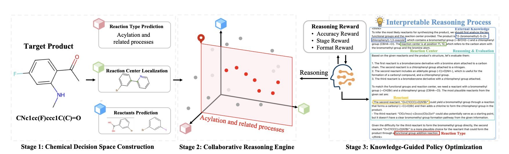
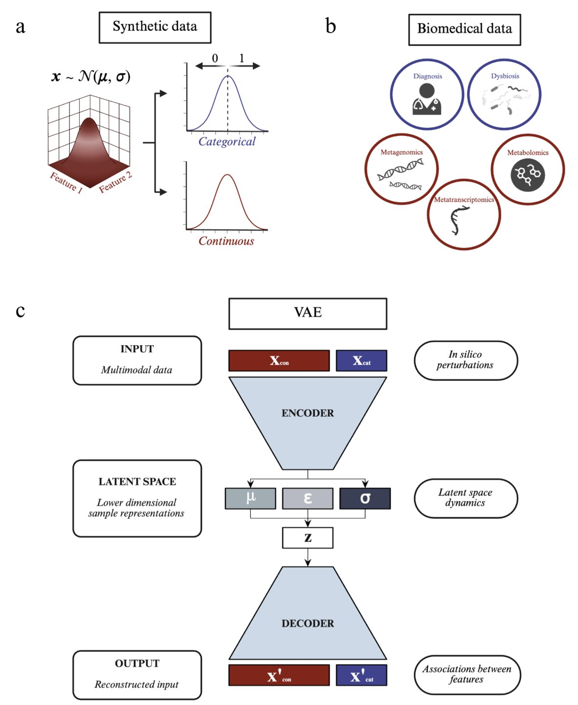
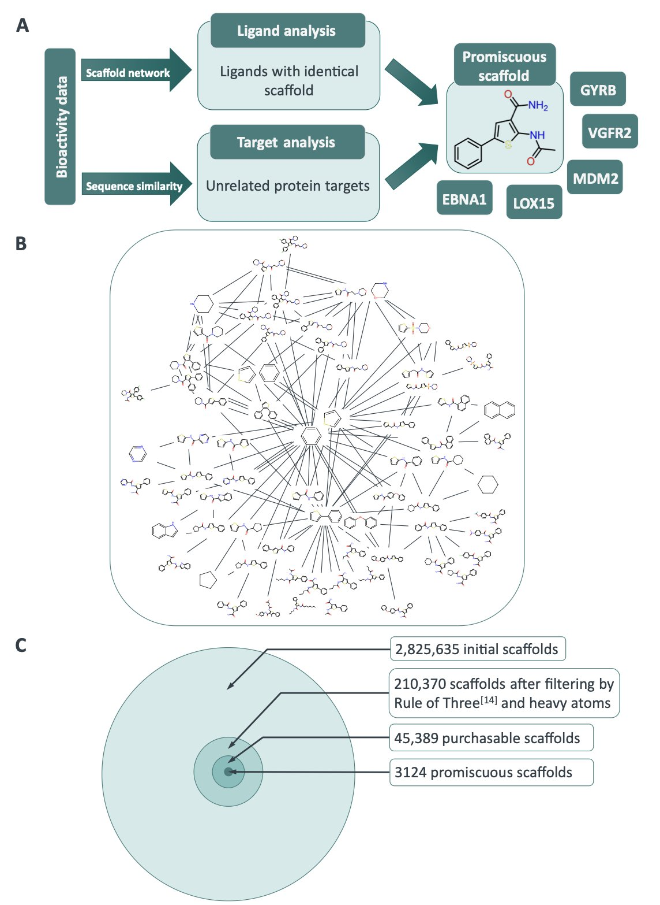

## 目录  
1. Retro-Expert 通过强化学习，让大模型在专业模型的「沙盒」里学会了化学家的思维方式，不仅给出逆合成路线，还告诉你它为什么这么想。
2. 研究者用模拟数据给变分自编码器（VAE）来了场「体测」，发现它的表现好坏，全看你喂的数据质量（比如特征纠缠度）。这篇论文就是一份 VAE 的使用和避坑指南。
3. 这项研究颠覆了传统认知，证明了那些「广撒网」的分子片段并非总是坏事。它们更像一把能打开多把锁的万能钥匙，反过来揭示了不同蛋白质靶点之间隐藏的结构共性。

## 1. AI 化学家新范式：Retro-Expert 让逆合成可解释  
  
  

市面上的逆合成 AI，像极了考试只写答案不写步骤的学生。你给它一个分子，它吐出几条路线，但你问它为什么这么解，它就给你一个高冷的背影。这让一线做实验的化学家很头大：谁敢拿经费和头发陪一个无法解释自己的黑箱去赌？  
  
Retro-Expert 试图解决这个信任危机。  
  
研究者组建了一个「专家组」，成员是几个在特定反应类型上训练有素的专用模型。这些专家负责头脑风暴，提出各种可能的反应切断方式，构建出一个高质量的化学决策「沙盒」。然后，主角——一个大语言模型 (Large Language Model, LLM) 登场。它的任务不是从零开始蛮干，而是像个经验丰富的项目组长，在沙盒里推理决策，找出最高效的合成路径。  
  
这里的精髓是强化学习 (Reinforcement Learning, RL)。这套方法好比训练围棋 AI，不靠死记硬背棋谱，而是在一次次对弈中，自己领悟制胜之道。Retro-Expert 里的大语言模型也是如此，它在化学决策空间里不断试错，如果选择的路径最终导向一个准确又逻辑自洽的方案，就会获得奖励。久而久之，它就学会了像化学家一样思考，懂得什么反应在特定环境下更靠谱，哪些官能团凑在一起会「打架」。  
  
这样做的好处很直接。首先，模型终于肯开口了。它不再只甩给你一张冷冰冰的反应物清单，而是会附上一段基于化学原理的解释，比如：「我选择在这里切断，因为这是个经典的 Wittig 反应，底物好买，反应条件也温和。」这种坦诚，是化学家与 AI 建立信任的基础。  
  
其次，这个框架很灵活。化学知识日新月异，新反应层出不穷。Retro-Expert 的模块化设计，意味着有了更好的「专家模型」，可以直接插进来升级系统，不必推倒重来。在快节奏的药物研发领域，这是一个巨大的工程优势。  
  
当然，只在计算机上跑得好还不够。研究者们穿上白大褂，用湿实验验证了模型。他们不仅成功合成了一个文献里查无此人的分子，还为另一个已知分子找到了一条全新的合成路线。  
  
📜论文标题：Retro-Expert: Collaborative Reasoning for Interpretable Retrosynthesis  
📜论文地址：<https://arxiv.org/abs/2508.10967v1>  

## 2. VAE 多组学整合：别急着用，先看看这份「避坑指南」  
  
  

现在搞生物医学研究的，手里没几个「组学」数据，都不好意思跟人打招呼。基因组、转录组、蛋白质组、代谢组……数据维度越来越多。怎么把这些五花八门的数据整合起来，挖出有用的生物学规律，是计算生物学领域的头号难题之一。  
  
变分自编码器（Variational Autoencoder, VAE）就是解决这个问题的工具之一。你可以把它想成一个超级「数据压缩机」，能把高维复杂的多组学数据，压进一个更本质的低维「潜在空间」。理论上，在这个空间里，样本关系一目了然，我们甚至能做「虚拟实验」(*in silico* perturbations)——比如，在电脑里模拟调高某个基因的表达，看看哪个代谢物会跟着起哄。  
  
听起来很美。但现实中，我们常常把 VAE 当成黑箱来用。模型跑完，结果给你了，但这结果靠不靠谱？模型的表现，是算法的锅，还是数据的锅？大家心里都没底。  
  
这篇论文就给这个「黑箱」砸开一道缝，让我们瞅瞅里面到底啥情况。  
  
#### 用「合成数据」来建立「标准答案」  
  
研究者没有一头扎进复杂的真实生物数据里，因为在真实数据中，我们永远不知道「标准答案」是什么。  
  
所以，他们先自己动手，造了一系列「合成数据集」。在这些数据集里，变量间的关系是他们提前设定好的，也就是已知的「标准答案」。这就像出卷老师自己先做一遍卷子，手里捏着标准答案。  
  
然后，他们用这些合成数据，去系统地「拷问」多模态 VAE 模型：  
  
#### 几个关键的实践启示  
  
通过这些严谨的基准测试，研究者们得出了一些指导意义的结论：  
1.  **数据质量是王道** ：模型的重建能力，和数据本身的属性（比如特征纠缠度、样本/特征比）高度相关。把数据扔给模型前，先花时间理解和预处理数据，比瞎调模型参数管用得多。  
2.  **「虚拟扰动」要小心用** ：他们把「虚拟扰动」的方法，从只能处理基因敲除这类离散变量，扩展到了能处理蛋白质或代谢物浓度变化等连续变量。这更贴近生物学的真实情况。  
3.  **需要更鲁棒的评估方法** ：他们发现，传统的统计检验在评估「虚拟扰动」效应时，容易报假警（假阳性）。因此，他们提出了一种更可靠的量化新方法。  
  
最后，他们把从合成数据里学到的经验，应用到真实的炎症性肠病（IBD）多组学数据集上，展示了这套框架在解决实际问题中的潜力。  
  
这项工作就像一份严谨的「用户手册」或「实验报告」。VAE 这个工具很好，但在用之前，最好先摸清它的脾气。  
  
📜Paper: https://doi.org/10.1101/2025.08.18.670835  
💻Code: https://github.com/Simon-Rasmussen-Lab/MOVE  

## 3. 分子「海王」的自我修养：药物设计里的 Bug 还是 Feature？  
  
  

在药物发现领域，「滥交」（promiscuous）这个词，绝对是项目负责人的「血压飙升器」。它和「毒性」、「不溶」一起，常年霸占「千万别用这些词形容我的候选化合物」排行榜前三。一个滥交的分子，就像个社交花蝴蝶，在细胞里四处「放电」，结合一堆本不该碰的靶点，通常是通往脱靶效应、毒副作用和项目失败的单程票。  
  
所以，我们向来对这类分子唯恐避之不及。  
  
但这篇 ChemRxiv 上的预印本，却问出了一个反常识的问题：**在我们把这些「花蝴蝶」扔进垃圾桶前，能不能先听听它们想说什么？**  
  
作者先是从 ChEMBL 这个巨大的数据库里，系统性地揪出了 3124 个有「前科」的化学骨架。然后，他们深入研究了其中一个：苯基噻吩类骨架。它能同时结合五种完全不同的蛋白质。  
  
通过对接模拟，他们发现，这五个风马牛不相及的蛋白质，竟然共享着一个相似的疏水性「子口袋」。  
  
这个滥交的片段，就像一把能打开五扇门上五把不同锁的万能钥匙。它能做到这一点，是因为这五把锁虽然外观、功能各异，但内部的「锁芯」结构竟然是相似的。这个片段，无意中发现了蛋白质世界里的一条「通用漏洞」。  
  
这一下，故事的性质就变了，从一个坏消息，变成了一个好消息。  
  
如果这是一个通用漏洞，我们是不是可以拿着这把万能钥匙，去主动寻找其他装有类似「锁芯」的门？  
  
他们就是这么做的。研究者拿着这个苯基噻吩的结构，在整个 PDB（蛋白质结构数据库，Protein Data Bank）里筛选，寻找其他拥有类似「子口袋」的蛋白质。结果，他们找到了一个意想不到的新靶点——来自寄生虫克氏锥虫的克鲁斯蛋白酶（Cruzipain）。  
  
到这里，这还是个计算化学的好故事。但他们紧接着回到实验室，在试管里验证了这个预测。结果证实，这个片段确实能抑制克鲁斯蛋白酶的活性。  
  
这为从事基于片段的药物设计（Fragment-based Drug Design, FBDD）的研究者，提供了一套全新的「狩猎」策略。过去，我们先确定一个猎物（靶点），再去武器库（片段库）里寻找能打中它的子弹。现在，我们可以反过来，先从那些最「滥交」、命中率最高的「子弹」出发，看看它们到底能打中哪些不同的猎物。这是一种从化学空间出发，反向探索生物学空间的全新思路。  
  
但这还没完。这套策略最精妙的收尾在于：一旦你理解了你的片段为何滥交（因为它完美契合了那个广泛存在的「通用锁芯」），你就可以在把它「生长」成一个完整药物分子时，有意识地让新加上去的「胳膊」和「腿」，去与你真正想要的那个靶点上、那些**独一无二**的区域相互作用。  
  
你利用了它的滥交性来帮你「敲开大门」，然后再通过理性设计赋予它专一性，确保它只待在正确的房间里。  
  
所以，「滥交」，到底是 Bug 还是 Feature？这取决于你想从它身上得到什么。你觉得呢？  
  
📜Title: Promiscuous scaffolds: Friend or foe in fragment-based drug design?  
📜Paper: https://doi.org/10.26434/chemrxiv-2025-bmv1h
