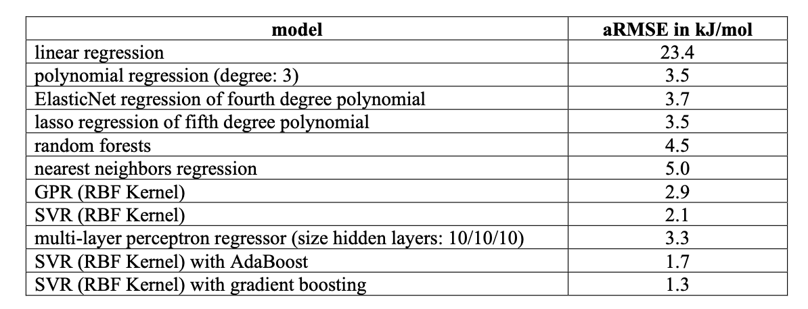
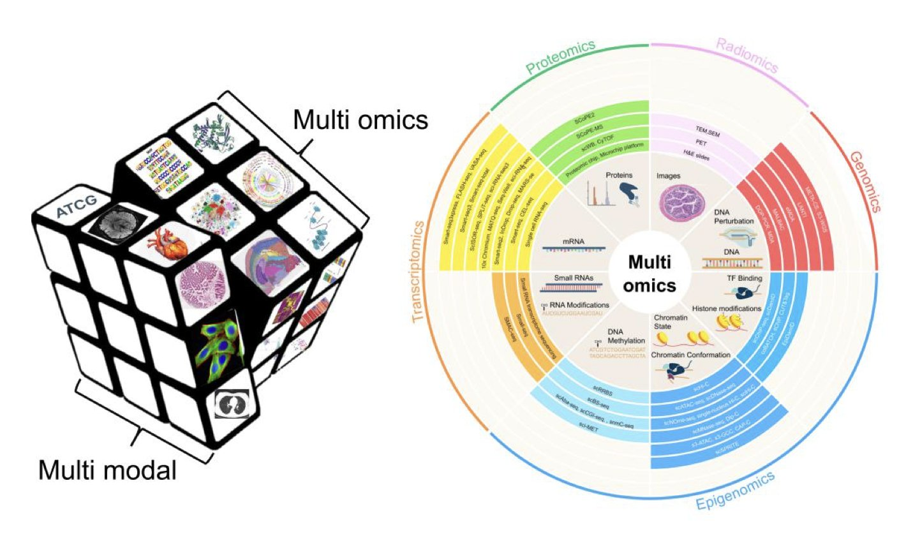
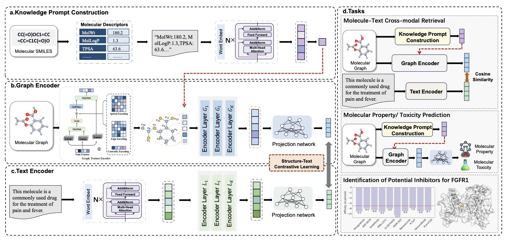

## 目录  
1. 一种新的机器学习方法，通过聚焦几个关键的量子化学特征，能够以 3% 的误差快速、准确地预测氢键强度，在普通笔记本电脑上即可完成。
2. 研究者正在构建一个由 AI 专家团队驱动的「虚拟人」，在计算机中模拟药物从分子到全身的完整旅程，挑战新药研发最大的转化鸿沟。
3. MolPrompt 给 AI 一份化学「小抄」（知识提示），迫使它在学习分子图谱时，必须同步理解其理化性质，从而掌握更深刻、有用的化学知识。

## 1. AI 精准预测氢键强度：快、准、省  
  
  

氢键在化学和生物学中无处不在，它维系着 DNA 双螺旋，决定蛋白质的折叠，也主导着药物分子与靶点蛋白的结合。要准确测量一个氢键的强度，却并不容易。  
  
过去只有两种选择：用简单的经验规则猜测，速度快但结果不准；或者用超级计算机进行高精度的量子化学计算，结果准确但耗时数天，成本高昂。一个兼顾速度与准确性的工具是该领域的长期追求。近期的一项研究提供了这样的解决方案。  
  
#### AI 学会了问正确的问题  
  
这项工作的思路是，不构建一个处理整个复杂分子体系的黑箱模型，而是引导 AI 关注几个最根本的物理量。  
  
模型的运作方式如下：研究人员先用标准的量子化学程序对体系进行快速计算，但不直接使用完整的三维结构，而是从中提取几个关键数值：  
  
1.  氢键**受体**原子的部分电荷。  
2.  氢键**供体**原子的部分电荷。  
3.  氢键中，氢原子与其共价连接的供体原子之间的**键序**。  
  
这个过程好比预测汽车速度：不给 AI 看整车照片，而是直接提供发动机排量、车重和轮胎尺寸等核心参数。AI 的任务从复杂的图像识别，转变为一个更简单、更接近问题本质的回归问题。  
  
当 AI 的输入是这些蕴含物理化学意义的「金标准」特征时，其学习效率和准确性都得到提升。  
  
#### 结果怎么样？又快又好  
  
研究人员将这些特征输入一个由支持向量回归（Support Vector Regression）和梯度提升两种机器学习方法组合的模型。模型的平均绝对百分比误差仅为 3%。对于氢键能这种易受环境影响的微妙相互作用，这个精度足以指导多数药物设计和材料科学研究。  
  
该模型还能处理简单线性模型难以解决的「协同效应」。在真实体系中，氢键并非孤立存在，而是相互影响形成网络。新模型能捕捉这种复杂的非线性关系。  
  
这项工作的另一个关键优势是**效率**。  
  
研究人员发现，计算输入特征时，无需使用最昂贵、最精确的量子化学方法。一种较经济的密度泛函方法（BLYP）与一种更昂贵的杂化密度泛函方法（B3LYP）给出的最终预测结果几乎没有差异。  
  
他们进一步测试了成本更低的半经验方法（xTB2）。结果显示，尽管精度略有下降，其结果对于快速的初步分析仍然适用。  
  
用户不再需要计算集群，在普通笔记本电脑上即可为自己的体系快速获得可靠的氢键强度估算。  
  
该方法是一个可广泛应用的实用工具，而非仅限于理论的探索，能够改变相关研究的日常工作方式。  
  
📜Title: Estimating the Hydrogen Bond Strength by Machine Learning Approaches  
📜Paper: https://chemrxiv.org/engage/chemrxiv/article-details/68a47621728bf9025e2d81c4  
💻Code: 10.5281/zenodo.16902603  

## 2. AI 虚拟人：新药研发的终极飞行模拟器  
  
  

药物研发最大痛点是：转化鸿沟。  
  
一个化合物在细胞和动物实验中效果显著，进入人体临床试验后却常常失效。无数项目与资金因此付诸东流。现有的计算模型和 AI 工具过于零散，有的精于分子对接，有的善于药代动力学预测，但它们各自为政，无法看到全局。  
  
这篇论文构想了一个能整合全局的框架：在计算机中构建一个「虚拟人」。  
  
#### 这不是一个 AI，这是一个团队  
  
这个「全身 AI 智能体」（Full-Body AI-Agent）框架的特点在于，它并非构建一个全能的 AI，而是组建一个协同工作的团队。  
  
该框架如同一个生物医药研发公司，下设七个核心部门：  
  
每个部门都是一个专门的 AI 智能体，拥有各自擅长的数据和模型。一个中央协调的大语言模型 (Large Language Model, LLM) 担任整个团队的「项目经理」。  
  
#### AI 是怎么开项目会的？  
  
这个框架的工作方式就像一场项目会。  
  
例如，评估一种新药的长期肝毒性，「项目经理」LLM 会拆解任务。它先指令「分子部」AI 分析药物与肝细胞内各种酶的相互作用。接着，将分子层面的结果交给「细胞部」AI，模拟肝细胞的反应。随后，「组织部」和「器官部」AI 根据细胞变化，预测整个肝脏的结构与功能将受到的影响。  
  
这个过程是双向的。若「器官部」AI 发现肝功能指标异常，会将信息反馈给「项目经理」。项目经理可能回头询问「分子部」AI，确认问题是否源于药物的某个特定化学基团，以及能否修改分子结构来规避。  
  
这种跨层级、反复迭代的沟通，模拟了真实的科研流程。  
  
#### 两个实战演练  
  
为展示可行性，作者设计了两个应用场景。  
  
第一个是**肿瘤转移智能体**。它模拟癌症转移过程：一个肿瘤细胞如何脱离原位，进入血液，并在另一器官定植。这个 AI 团队会综合分析分子信号、细胞行为和全身生理环境，给出一个「转移风险评分」。  
  
第二个是**药物智能体**。它在计算机中指导临床前评估，例如在器官芯片上测试药物。它不只分析芯片数据，还会结合药物在其他器官的分布和代谢等全身生理环境，提供更接近人体的预测。  
  
实现一个完整的「数字孪生人」仍很遥远。这个框架对高质量、标准化的多维度数据需求巨大。但它描绘了一张蓝图。  
  
AI 制药的未来，或许不依赖某个单一算法的突破，而在于如何像管理高效团队一样，组织不同尺度的知识和模型。这个框架不会取代科学家，但它能提供一个前所未有的「飞行模拟器」，让药物在进入人体前，就能预知哪条路线最安全，哪里可能遇到风暴。  
  
📜Paper: https://arxiv.org/abs/2508.19800  

## 3. MolPrompt：用知识提示教 AI 看懂分子  
  
  

教 AI 学习化学，就像教孩子看图识字。我们给 AI 一张分子结构图和一段文字描述，让它学会二者间的对应关系。  
  
这种多模态学习方法，能让 AI 学会关联图文，但它没有学到本质。它就像一个孩子，能将「苹果」这个词和苹果图片对应，却不知道苹果是甜是脆，可以食用。它只学会了模式匹配。  
  
这个新框架名为 MolPrompt 展示了一种教 AI 真正理解化学的方法。  
  
#### AI 也需要一本「辅导书」  
  
它的思路是在现有框架上增加了一个符合化学家直觉的模块。  
  
它给 AI 配了一本「辅导书」。  
  
它的工作方式如下：  
  
训练时，MolPrompt 不只给 AI 分子的图谱和名称，还额外提供一份「知识提示」（knowledge prompt）。  
  
这份提示源于经典的分子描述符，例如脂水分配系数（logP）、分子量、氢键给体与受体数量。MolPrompt 将这些描述分子核心特性的理化参数，自动转换成自然语言。  
  
例如，它会生成这样一句话：「这是一个分子量中等、具有中等亲脂性、并有三个氢键受体的分子。」  
  
#### 从「两点一线」到「三位一体」  
  
AI 的学习任务从简单的「图 - 文」配对，转变为「图 - 文 - 知识」的三位一体。  
  
AI 必须理解，一个分子的结构图和文本描述，源于其内在的理化性质。  
  
这好比教孩子认识苹果，除了看图片、读单词，还要让他亲自咬一口。当图片、单词和「甜脆口感」三者关联起来，他才真正理解了苹果。  
  
#### 这东西靠谱吗？  
  
理解了化学的「口感」后，AI 的表现获得了提升。  
  
在分子性质预测、毒性评估和跨模态检索等任务中，MolPrompt 的表现优于没有「知识提示」的先进模型。  
  
更重要的是一项实战演练：研究者用 MolPrompt 寻找抗癌靶点 FGFR1 的新抑制剂，成功识别出潜在的候选分子。  
  
这表明 MolPrompt 学到的化学知识，能够转化为药物发现中的有效见解，而不只停留在提升学术数据集的得分。  
  
AI 辅助药物发现的未来，或许不只依赖于更大的模型和数据。如何将人类科学家积累的，基于第一性原理的化学知识，有效地教给 AI，同样关键。  
  
📜Title: MolPrompt: Improving multi-modal molecular pre-training with knowledge prompts  
📜Paper: https://academic.oup.com/bioinformatics/advance-article/doi/10.1093/bioinformatics/btaf466/8240326  
💻Code: https://github.com/catly/MolPrompt
