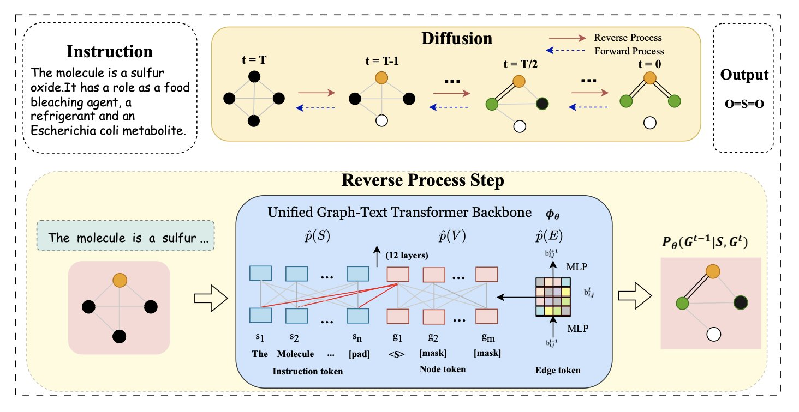
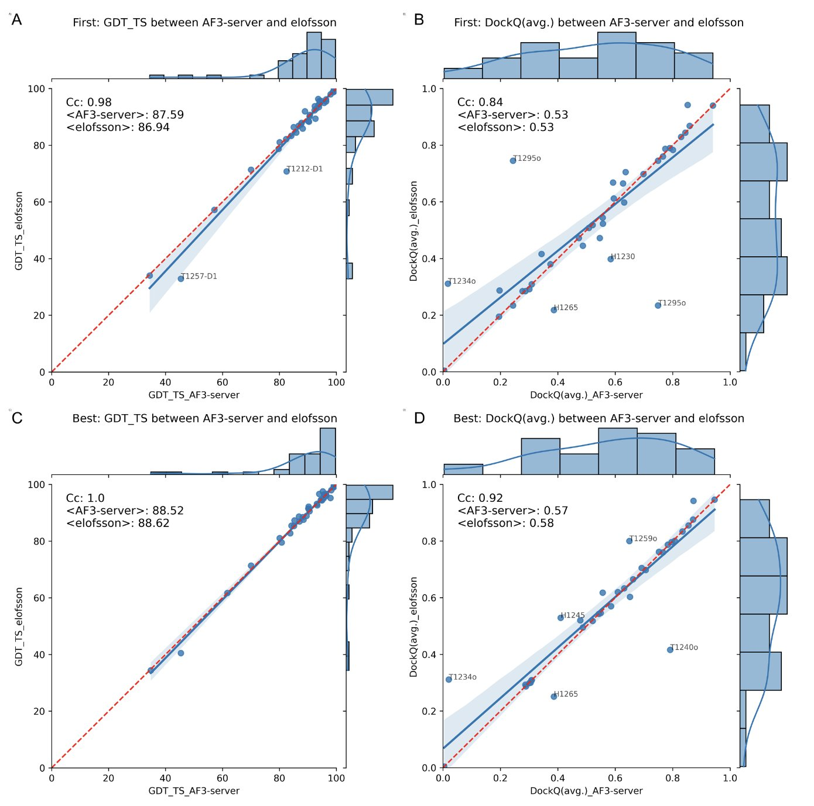
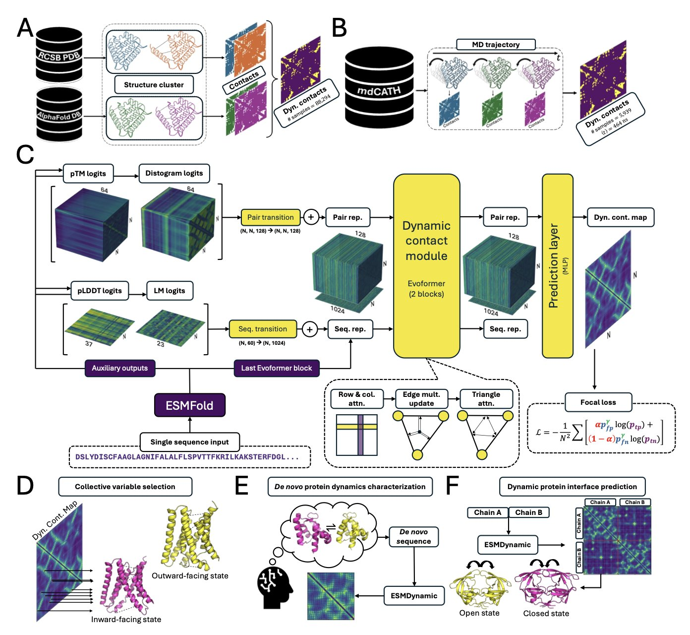

## 目录  
1. UTGDiff 是一款能直接读取化学家文字指令，并将其翻译成新分子结构的 AI，让按需设计分子成为可能。
2. AlphaFold3 迎来一次进化，首次将非蛋白分子纳入预测。但 CASP16 的官方结果表明，它在复合物、RNA 和硬靶点上并非无敌，老方法配合聪明策略依然能打。
3. ESMDynamic 学习了海量蛋白质「电影」，仅凭单条氨基酸序列，就能快速预测蛋白质的动态行为。这项任务过去需要超级计算机才能完成。

## 1. AI 按指令造分子：从文本到图谱  
  
  

让计算机设计分子，常常面临沟通障碍。化学家想下达这样的指令：「设计一个分子，包含一个吡啶环，通过酰胺键连接到一个噻唑环上，且溶解度要好。」但 AI 无法直接理解。过去的工具要求使用 SMILES 这类机器语言或复杂的参数来约束生成过程，如同要求建筑师依据砖头数量而非设计蓝图来盖房子。  
  
过去的 AI 模型只能匹配关键词，无法理解深层设计意图。就像你告诉它「我想要个蓝色的、四个轮子的东西」，它可能会给你一辆蓝色的购物车。  
  
北京大学和香港大学的一项新研究，让这个只会匹配关键词的 AI 学会了读懂设计蓝图。  
  
#### AI 是怎么学会「看图说话」的？  
  
新模型名为 UTGDiff。它没有将理解文本和生成分子图谱作为两个独立任务再强行拼接。它将二者置于一个统一的框架内，使其在整个生成过程中持续「对话」。  
  
UTGDiff 采用一种称为扩散模型 (Diffusion Model) 的方法。这个过程好比修复一张充满噪点的旧照片。初始状态是一张模糊的分子图谱，由随机的原子和化学键构成，同时还有一条清晰的文字指令，例如「我想要一个带吡啶环的噻唑」。  
  
AI 的任务就是逐步去除这张图谱上的噪点。关键在于，在去除噪点的每一步，AI 都会参照那条文字指令，判断当前操作是否让分子更接近指令描述的结构。  
  
这种在生成过程中持续、细粒度的文本指导，是 UTGDiff 的核心机制。它在生成的每一步都用文本指令校准方向，确保过程的准确性。  
  
#### 结果怎么样？  
  
当 AI 学会参照指令来构建分子后，生成结果的质量大幅提升。  
  
在多项任务中，UTGDiff 的表现超越了现有方法。它生成的分子与人类指令的相似度更高，化学有效性也好，产出的不是无效的随机组合。  
  
UTGDiff 还具备出色的「零样本」 (Zero-shot) 能力。面对训练中未见过的新指令，它也能理解并执行，无需额外训练。  
  
这项工作改变了分子生成的方式，我们可以开始尝试将脑中的构想直接告知机器，并观察其转化为真实的分子结构。  
  
📜Title: Instruction-Based Molecular Graph Generation with Unified Text-Graph Diffusion Model  
📜Paper: https://arxiv.org/abs/2408.09896  
💻Code: https://github.com/ran12/UTGDiff  

## 2. AlphaFold3 在 CASP16：进化了，但还没成神  
  
  

AlphaFold3 (AF3) 发布后，赞誉与质疑并存。现在，权威的 CASP16 结构预测竞赛公布了结果，让我们可以在同一个赛场上，检验 AF3 的真实水平。  
  
#### 最大的变化：从专科医生到全科医生  
  
AF3 相较于 AF2 最大的进步，是它不再局限于蛋白质。它学会了处理小分子、核酸（RNA）、离子等。对药物发现领域，这简化了流程。过去用 AF2 预测靶点结构，还需用另一套软件预测药物分子如何结合。AF3 将这两步合二为一。  
  
可以这样理解：AF2 像个顶级的蛋白质木匠，手艺精湛，但只做木工。AF3 则像个总承包商，除了木工，还能处理水电和装修。整个流程因此简化，对非计算专家也更友好。  
  
#### 硬碰硬：它真的比 AF2 强很多吗？  
  
AF3 比 AF2 强，但优势有限。  
  
在预测蛋白质复合物时，AF3 的表现略好于 AF2。但一个有趣的发现是，如果给 AF2 足够的计算资源进行「海量采样」（即穷举试错），其最终表现与 AF3 并无差异。  
  
这表明 AF3 在蛋白质结构预测的核心引擎上，可能没有突破性突破。它的优势更多体现在整合与易用性，而非绝对的预测精度。  
  
#### 裂缝出现：AF3 在哪里会翻车？  
  
任何工具都有边界，AF3 也不例外。CASP16 的结果指出了它的几个弱点。  
  
首先是**复合物的组成（stoichiometry**）。AF3 在预测多亚基蛋白复合物时，常会搞错各个亚基的数量。它能画出漂亮的引擎，却可能漏掉几个活塞。对于理解生物机器的运作，这是个根本性缺陷。  
  
其次是**RNA 结构**。RNA 像煮过的面条，柔软无定形，其结构预测向来是难题。AF3 作了尝试，结果尚可，但远未达到其在蛋白质预测上的统治地位，甚至未能在此单项拔得头筹。  
  
最后是**高难度靶点**。对于结构新颖、缺少同源蛋白参考的「硬骨头」，AF3 的表现并未超越其他顶尖方法。在探索生物学的未知领域时，仍需依赖多种工具与人类智慧，而非单一的「万能神器」。  
  
#### 新的挑战：怎么从一堆「正确答案」里挑出最好的？  
  
和 AF2 一样，AF3 也不会只生成一个答案，而是输出一堆看似合理的模型。新问题随之而来：如何从中选出最接近真实结构的模型？CASP16 的报告也强调，结构预测能力在飞速提升，但评估和筛选最佳模型的能力却相对滞后。  
  
AF3 是一项了不起的工程成就。它更通用、更易用，进一步降低了结构预测的门槛。但它并非魔法，也不是结构生物学的终点。难题依然存在，旧问题解决了，新问题又浮现。  
  
📜Title: AlphaFold3 at CASP16  
📜Paper: https://onlineliibrary.wiley.com/doi/epdf/10.1002/prot.70044  

## 3. ESMDynamic：单序列预测蛋白动态  
  
  

AlphaFold 如同一个高精度「照相机」，能拍出蛋白质清晰的静态「证件照」。但蛋白质在细胞内是动态的，像一台持续扭动、折叠的复杂机器。药物分子常常结合于静态「证件照」中无法捕捉的瞬时「激活」构象上。  
  
要观察蛋白质的动态，需要借助分子动力学（MD）模拟。MD 像一台拍摄分子世界「电影」的摄像机，但它耗能巨大且拍摄缓慢。获得一段有意义的动态影像，往往需要一个计算集群运行数周。  
  
ESMDynamic 提供了一个「快进」工具。  
  
#### AI 的学习方式  
  
ESMDynamic 通过学习海量已有的蛋白质动态数据（一部分来自实验，一部分来自大规模 MD 模拟），掌握了蛋白质序列与动态行为间的规律，如同导演「阅片无数」后掌握了叙事技巧。它能识别出哪些氨基酸序列会构成柔性环区，或导致蛋白口袋的开合。  
  
输入一条全新的氨基酸序列（「剧本」），ESMDynamic 就能利用学到的规律，快速预测出哪些氨基酸（「演员」）之间会发生频繁的动态接触。  
  
#### 实践检验  
  
在两个大规模 MD 数据集上，ESMDynamic 的表现与需要更多输入的复杂模型（如 AlphaFlow）相当，但预测速度更快。  
  
它在几个关键挑战上也表现出色：  

ESMDynamic 提供了一个高效的「勘景工具」。在投入大量计算资源进行模拟前，可以用它快速定位蛋白质动态中值得关注的关键区域，预判「精彩剧情」的发生位置。  
  
📜Title: ESMDynamic: Fast and Accurate Prediction of Protein Dynamic Contact Maps from Single Sequences  
📜Paper: https://www.biorxiv.org/content/10.1101/2025.08.20.671365v1
