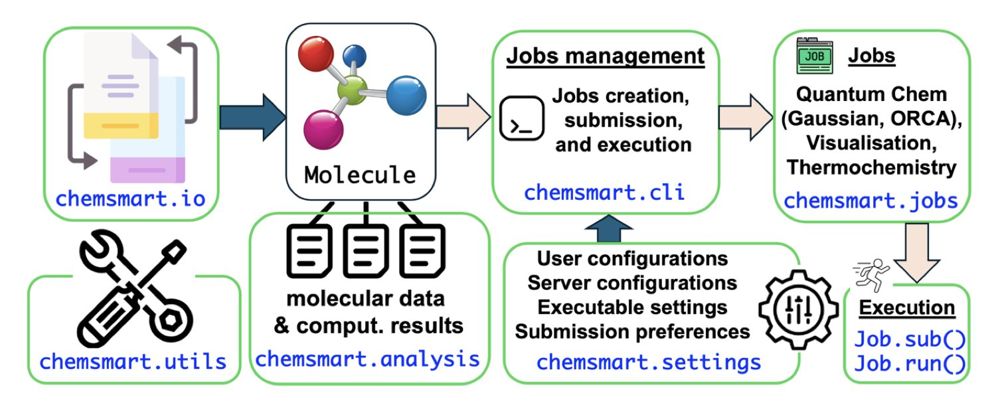
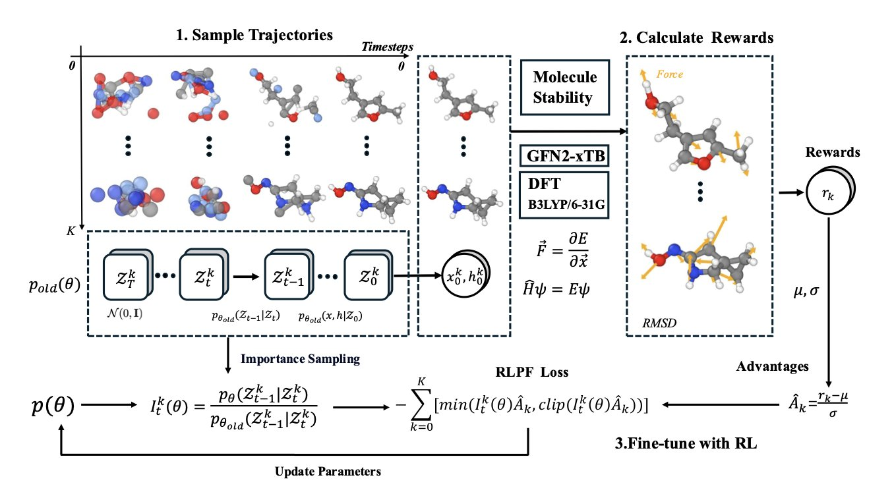
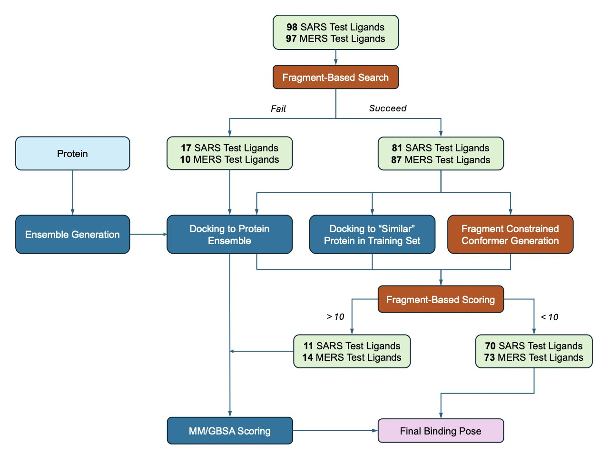
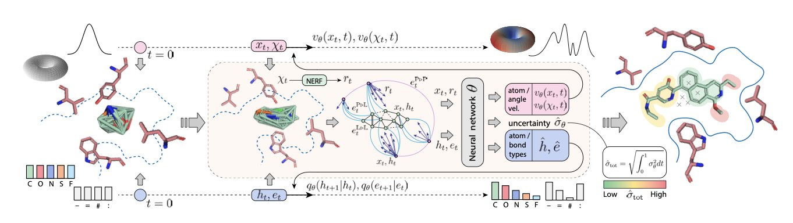

## 目录  
1. Chemsmart 是一个开源的「瑞士军刀」工具包，旨在将计算化学中繁琐的手动流程自动化，让科学家专注于科学思考，而非文件格式转换。
2. 这个新框架为 AI 生成模型引入物理学「家教」，通过强化学习奖励化学上稳定、真实的分子，引导 AI 超越简单的形态模仿。
3. DrugReasoner 是一款能预测新药获批概率的 AI。它通过对比已知的成功与失败药物来解释预测过程，如同化学家一般推理，从而揭示了预测模型的内部逻辑。
4. 结合已知分子片段信息指导并修正传统对接，新流程提升了药物分子结合姿态预测的准确性，展现了数据与物理结合的优势。
5. DRUGFLOW 学习「好分子」的完整分布，如同绘制一张完整的藏宝图，由此实现了更真实、可控的分子生成。

## 1. Chemsmart：告别计算化学的「手工作坊」  
  
  

亲手操作过量子化学计算的人都清楚：工作的大部分内容是处理繁琐的数据，如同一个数据勤杂工，真正用于思考深奥化学问题的时间很少。  
  
研究者的日常工作流通常如下：用一个软件绘制分子，保存为特定格式；为了计算，再将其转换为另一种格式。接着，需要手动编写输入文件，仔细设定参数，然后提交到计算集群，在等待中频繁检查任务状态。计算结束后，还要从庞大的输出文件中，通过手动或自编脚本提取能量、坐标等关键数据。最后，将这些数据导入可视化软件，生成报告所需的图片。  
  
流程中的每一步都伴随着重复劳动、格式不兼容和人为失误的风险。尽管我们拥有 Gaussian、ORCA 这类强大的计算引擎，却始终在手动为它们「加燃料、清积碳」。  
  
#### Chemsmart：计算化学的「项目管家」  
  
Chemsmart 工具包的目标是成为管理整个研究流程的「项目管家」，解决研究中的实际痛点。  
  
作为一个开源 Python 工具包，Chemsmart 的设计思路是：将计算化学中最繁琐的手动操作自动化。  
  
它的工作方式如下：  
  
首先，它定义了一个核心的`Molecule`对象，可以将其理解为一个「通用文件格式」。不同化学软件产生的分子和数据，都能先转换为这个标准对象，从而解决格式不兼容问题，如同为所有软件配备了万能翻译器。  
  
其次，它将完整的计算流程拆分为独立的模块化任务，例如「几何优化」、「过渡态搜索」和「热力学分析」。使用者可以像搭建乐高积木一样，将这些模块组合起来，构建全自动化的工作流。  
  
使用者只需下达指令，例如：「优化这个分子，计算其频率，并生成 PyMOL 可视化文件。」接下来的工作便可完全交给它。Chemsmart 会自动准备输入文件、提交任务、监控进程、解析结果，并将所有文件整理归档。  
  
#### Chemsmart 带来的改变  
  
研究者得以从重复、缺乏创造性的劳动中解脱，专注于化学问题本身。  
  
对于新手，Chemsmart 降低了入门门槛。使用者无需记忆各种软件晦涩的输入参数，只需调用几个简单的 Python 函数。  
  
对于资深研究者，它提升了工作效率和可重复性。对上百个分子执行标准化的计算流程成为可能，这对构效关系等研究至关重要。  
  
Chemsmart 的所有代码均已开源，并采用模块化设计。因此，它既能作为独立工具使用，也能作为 Python 库，无缝集成到更复杂的定制化分析流程中。  
  
Chemsmart 是一个经验丰富的工程师为解决日常痛点而打造的实用工具箱。对于一线研究者，一个称手的工具箱，其价值有时会超过一个遥远的理论。  
  
📜Title: Chemsmart: Chemistry Simulation and Modeling Automation Toolkit for High-Efficiency Computational Chemistry Workflows  
📜Paper: https://arxiv.org/abs/2508.20042v1  

## 2. AI 生成分子：终于学会了物理  
  
  

与 3D 分子生成模型打过交道的人都清楚一个现实：这些 AI 是顶级的艺术家，却是末流的工程师。  
  
你给它一个任务，它能「画」出一些结构新颖、看起来很美的分子。但把这些「艺术品」放到物理学的放大镜下，问题就来了。键长不对，键角扭曲，原子之间挤得像早高峰的地铁。这些分子在真实世界里根本站不住脚。  
  
我们一直想要一个能懂物理的 AI 工程师。新提出的 RLPF 框架，正是朝这个方向迈出的坚实一步。  
  
#### 给 AI 请个物理家教  
  
研究者没有去构建一个看过更多数据的、更复杂的 AI。他们另辟蹊径，为 AI 引入了一位物理学「家教」和一套「奖惩机制」。  
  
这个家教是**力场**，奖惩机制则是**强化学习**（Reinforcement Learning, RL）。  
  
它的工作方式如下：  
  
扩散模型生成分子的过程并非一步到位。它像雕塑家从一团模糊的「原子云」开始，逐步刻画细节。  
  
RLPF 框架在雕塑家每刻一刀后，都让旁边的物理学「家教」评估一次。  
  
家教（力场）会判断，这一刀是让整个结构的内部应力变大还是变小？是让它更稳定，还是更接近散架？  
  
如果这一步让分子变得更稳定、更符合物理规律，AI 就得到一个「奖励」，并记住这是个好操作。  
  
如果这一步让分子变得更不稳定，AI 就受到一个「惩罚」，并学会避免这条路。  
  
经过这种持续的物理反馈与奖惩循环，AI 在创作的每一步都必须思考物理后果，超越了单纯模仿训练数据中分子形态的局限。  
  
#### 效果如何？  
  
经过「家教」调教的 AI，生成的分子质量上了一个台阶。  
  
在 QM9 标准数据集上，它生成的分子中，物理稳定性的比例从 82% 提升到了 93% 以上。  
  
这个「家教」框架具备通用性，能指导 EDM、GeoLDM、UniGEM 等不同的扩散模型。它是一个普适的、可即插即用的「增强模块」。  
  
这项工作跳出了比拼模型参数的范式，代表了一种根本性的思路转变。它将物理学知识注入到 AI 的生成过程中。  
  
📜Title: Guiding Diffusion Models with Reinforcement Learning for Stable Molecule Generation  
📜Paper: https://arxiv.org/abs/2508.16521  
💻Code: https://github.com/ZhijianZhou/RLPF/tree/verl_diffusion  

## 3. DrugReasoner：能解释自己的 AI 预测  
  
  

药物发现领域充斥着各类 AI 预测模型，它们可以预测分子的溶解度、毒性或结合亲和力。但很少有人敢将数亿美元的临床试验，完全押注于一个 AI 模型给出的数字。  
  
因为这些模型大多是黑箱。  
  
当一个模型给出 0.87 的成药性得分，却无法解释原因时，它就像一个只报数字的算命先生。决策者无法判断预测是基于严谨计算还是随机猜测，这种无法解释的结果，应用价值有限。  
  
DrugReasoner 的设计正是为了解决这个痛点。  
  
#### AI 学会了「举一反三」  
  
研究者训练 AI 掌握了化学家的一项核心技能：**比较**。  
  
当输入一个新设计的候选药物时，DrugReasoner 会检索知识库，找出结构最相似的已知药物。随后，它将这些相似药物分为两组：一组是已成功上市的，另一组是在临床试验中失败的。  
  
最后，它生成一份推理报告，例如：  
  
「此分子有 73% 的概率获批。其 A 部分结构与某成功抗癌药相似，该结构通常成药性良好。但其 B 部分结构与某因肝毒性失败的分子类似，这会降低其获批概率。」  
  
这种解释方式提供了可用于决策的清晰信息。  
  
#### 结果怎么样？  
  
在包含大量真实药物分子的数据集上测试，DrugReasoner 的预测准确率（AUC 为 0.73）与传统的机器学习方法（如 XGBoost）相当，并优于另一新近发布的模型 ChemAP。  
  
这表明，模型在提供可解释性的同时，并未牺牲预测准确性。  
  
预测新药能否获批，受科学、商业、运气等多种变量影响。在此背景下，AUC 0.73 是一个可靠的成绩，但并非完美无缺。  
  
研究者承认，为防止模型通过记忆 SMILES 字符串「作弊」，训练时未提供分子的 SMILES 表示。这或许限制了模型对精细化学结构的理解，但也证明了该推理方法在信息受限的情况下依然有效。  
  
📜Title: DrugReasoner: Interpretable Drug Approval Prediction with a Reasoning-augmented Language Model  
📜Paper: https://arxiv.org/abs/2508.18579  
💻Code: https://github.com/mohammad-gh009/DrugReasoner  

## 4. Polaris 挑战赛：用碎片知识提升对接精度  
  
  

一线从事结构药物设计的研究者对分子对接软件的感情很复杂。它的速度快，能在一夜之间筛选百万级分子库。但它的打分函数又常不可靠。软件会生成大量看似理想的结合姿态并给出高分，但实验验证的结果却往往不符。  
  
对接软件就像一个速度飞快但鲁莽的侦察兵，能迅速勘察整个战场，却也常把稻草人误报为敌人。研究者需要的是一副「敌我识别」眼镜。Polaris 挑战赛的一篇论文展示了这样一副眼镜。  
  
#### 别再让 AI 瞎猜了，给它一本「小抄」  
  
研究者的思路并非重造对接引擎，而是改进打分环节。他们认为 Vina 等工具在生成多样化姿态方面已足够好，短板在于打分。  
  
他们使用的「小抄」是数据库中成千上万个**小分子片段的晶体结构**。  
  
这些片段如同「路标」，通过实验数据标示出蛋白质口袋中哪些区域疏水、哪些位置适合形成氢键。  
  
新流程首先使用 VinaGPU 生成大量可能的结合姿态。随后，AI 利用「小抄」进行批改：检查分子中的基团是否与已知片段的「路标」位置匹配。若匹配则加分，反之则减分。  
  
流程还以更主动的方式利用这份「小抄」：**约束对接**。如同考前提示，它能引导对接程序从初始阶段就朝正确的方向搜索。  
  
#### 如果没有小抄怎么办？  
  
当缺乏可参考的片段数据时，流程会启用后备方案：**MM/GBSA重打分**。  
  
这种基于物理学的传统计算方法虽然比 Vina 的打分函数慢，但通常更准确。  
  
整个流程构成一个层层递进的过滤器：用最快的方法海选，用数据驱动的知识精选，最后用物理学方法复核。  
  
#### 这东西真的靠谱吗？  
  
研究者将该流程应用于新冠病毒（SARS-CoV-2）及其近亲中东呼吸综合征冠状病毒（MERS-CoV）的蛋白酶。  
  
结果显示，对超过一半的分子，该流程成功预测出与晶体结构误差在 2 埃以内的结合姿态。这在真实世界靶点上是一个可靠的成绩。  
  
他们还证明，从 SARS-CoV-2 片段数据中学到的知识，可以成功迁移并用于 MERS-CoV 的预测。  
  
这项工作提供了一个可部署的工程解决方案，旨在解决日常研究中的实际问题。计算药物发现的未来，在于巧妙地组合数据、物理学原理与化学直觉，而非依赖单一工具。  
  
📜Title: Polaris Challenge: Data-driven Priors to Improve Docking for Pose Prediction  
📜Paper: https://doi.org/10.26434/chemrxiv-2025-fv3c3  

## 5. DRUGFLOW：AI 学会了画「藏宝图」  
  
  

*   它学习整个「好分子」的分布，如同绘制一张完整的藏宝图，以此取代只标记单个宝藏点的旧方法。  
*   它内置了不确定性检测、蛋白质柔性等化学家需要的功能，让 AI 从艺术家向工程师转变。  
  
与生成式 AI 打过交道的人都清楚，AI 是顶级的艺术家，却是二流的化学家。给它一个蛋白质口袋，它能「画」出结构新颖、看似完美的分子。但这些分子大多只是在统计上「貌似」已知药物，AI 并未真正理解一个分子「好」在何处。  
  
就像一个只会临摹梵高画作的画匠，他能画出星空，却不懂其深意。  
  
DRUGFLOW 的目标，就是教 AI 去学天文学。  
  
#### 从「画快照」到「绘地图」  
  
这项工作的核心思路发生了转变。一个好药物本身就坐落在广阔「化学空间」里，是一片能量低、性质好的区域。因此，AI 的任务是学会绘制出这片区域的完整「地图」，取代以往生成单张「快照」的做法。  
  
DRUGFLOW 通过结合两种数学工具——连续流匹配（Continuous Flow Matching），可想象为用平滑曲线描绘地形；以及离散马尔可夫桥（Discrete Markov Bridges），可想象为在关键地标间建立逐步路径——来学习蛋白质口袋里所有「好分子」的**完整分布**。  
  
学会绘制地图后，AI 便从模仿的画匠，转变为能指出山峰与盆地的地理学家。  
  
#### AI 终于长了点「脑子」  
  
拥有全局观后，AI 便能实现一些过去难以企及的功能。  
  
首先是**不确定性**。DRUGFLOW 内置了「不靠谱探测器」。当它生成的分子落在地图上未曾探索的区域，它会直接提示：「我不确定这个分子是否可靠。」这种知道自己「不知道」的能力，能避免合成 AI 幻想出的分子。  
  
其次是**尺寸自适应**。生成分子时，它会动态调整大小，主动删除可能与蛋白质口袋产生空间位阻的原子。就像装修工把沙发塞进门前，会先拆掉沙发腿。  
  
最后是**蛋白质柔性**。升级版 FLEXFLOW 在生成配体分子的同时，能同步调整蛋白质口袋的氨基酸侧链朝向。真实世界里，蛋白质口袋并非坚硬的模具，而像一只柔软的手套。FLEXFLOW 如同一个真正的设计师，在设计手的同时，能让手套自适应手的形状。  

📜Title: Multi-Domain Distribution Learning for De Novo Drug Design  
📜Paper: https://arxiv.org/abs/2508.17815
