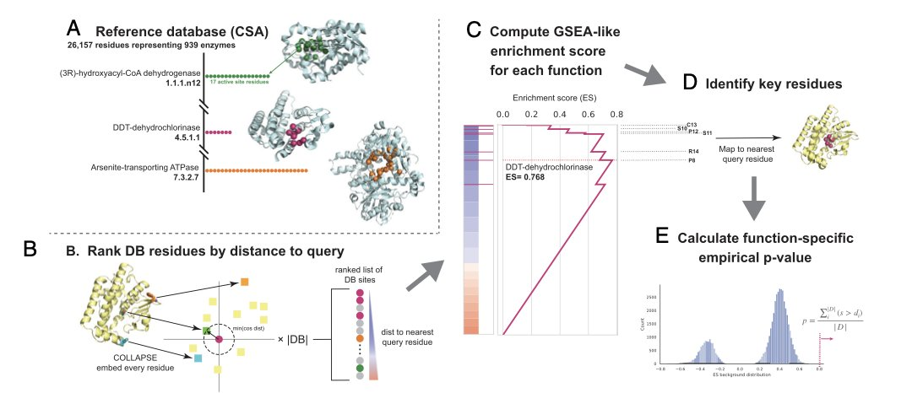
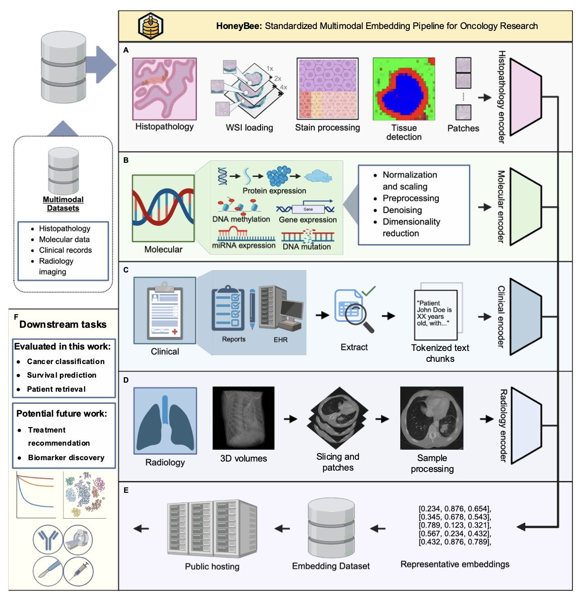
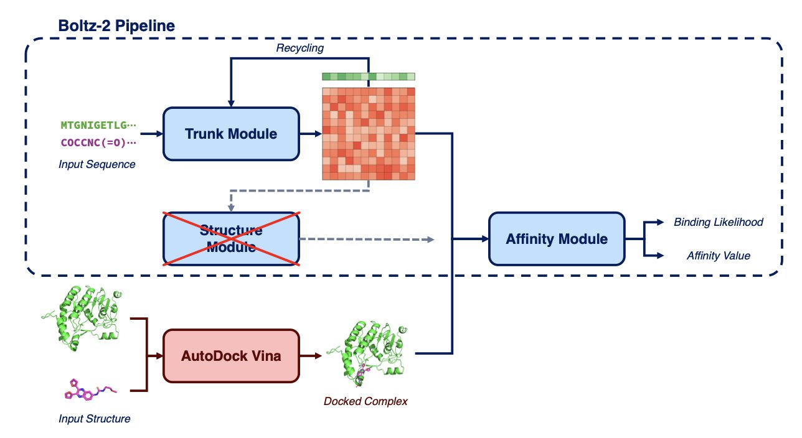

## 目录  
1. PARSE 聚焦于蛋白质上保守的局部微环境，而非整体结构，从而更精准地预测功能和活性位点，尤其擅长研究「黑暗蛋白质组」。
2. Honeybee 框架整合了癌症的各类数据。研究发现，简单的临床文本，其预测能力超过了复杂的基因组或影像数据。
3. Boltzina 让一个快速但粗略的工具完成初步工作，再由一个精准但缓慢的 AI 做最终评估，在药物虚拟筛选中兼顾了速度与准确性。

## 1. AI 预测蛋白功能：看局部，不看全局  
  
  

AlphaFold 绘制出数亿蛋白质的结构图谱，如同给了我们一张宇宙地图。但地图上绝大多数「星球」（蛋白质）的功能仍然未知，它们是广阔的「黑暗蛋白质组」。我们虽有其三维结构，却不知其功能。  
  
以往预测蛋白质功能，主要依靠 BLAST 比较氨基酸序列，或 Foldseek 比较整体三维结构。这两种工具都基于整体相似性。若两个蛋白质的序列或整体折叠差异较大，它们就会被判定为无关联。这种方法好比通过面部相貌判断亲缘关系，可能会忽略掉那些外貌不同但拥有共同家族特征的远亲。  
  
PNAS 上的一篇论文提出，AI 需要一副能识别这些局部「家族特征」的放大镜。  
  
#### 识别功能的「指纹」  
  
新方法 PARSE 基于一个生物学直觉：决定蛋白质功能的，是其微小且在进化中高度保守的活性或功能位点，而非庞大易变的整体结构。  
  
这个位点就是蛋白质的「指纹」。PARSE 的工作流程跳过了对整体结构的比较：  
  
首先，它将蛋白质分解为无数个重叠的局部微环境，每个环境都以一个氨基酸为中心。  
  
接着，它使用 COLLAPSE 工具，将每个局部环境的三维几何信息，转换为一个数字化的「指纹」（嵌入）。  
  
最后，它在一个大型数据库中，直接比较不同蛋白质的局部「指纹」，寻找高度相似的区域。  
  
#### 精准定位功能位点  
  
通过识别「指纹」，PARSE 的预测能力大幅提升。在预测蛋白质整体功能方面，它的表现与复杂的深度学习模型相当，F1 分数超过 85%。  
  
PARSE 的优势在于**精准定位**。它在预测「一个蛋白是激酶」的同时，还能高置信度地指出构成其活性位点的具体氨基酸。其定位精度超过了 DeepFRI 等现有方法。  
  
这种精确的靶点信息对药物研发至关重要。研发人员需要的是精确的「靶点地图」来指导定点突变或药物设计，而非模糊的功能标签。  
  
该方法速度很快，足以扫描整个人类蛋白质组。研究者利用这一优势，在一些功能未知的蛋白质中发现了新的潜在功能位点。  
  
这项工作为如何构建更符合生物学原理的 AI 提供了范例。它表明，研究关键的局部特征，有时比分析整体结构更有效。  
  
📜Title: Protein functional site annotation using local structure embeddings  
📜Paper: https://www.pnas.org/doi/10.1073/pnas.2513219122  

## 2. AI 肿瘤研究：临床数据才是王道  
  
  

肿瘤研究领域的数据量巨大，但开发其价值却充满挑战。一个癌症病人会产生多种数据：医生的临床笔记、病理科的全切片扫描（Whole Slide Imaging, WSI）、放射科的 CT 或 MRI 影像，以及基因测序图谱。这些数据分散在不同部门，如同语言不通的专家，难以描绘出患者的全貌。  
  
业界期待一个「总翻译」来整合所有信息，提供一个综合的患者视图。Honeybee 框架正是实现这一目标的尝试。  
  
#### Honeybee 如何拼凑完整拼图  
  
Honeybee 是一个开源框架，它能处理临床文本、病理影像、放射影像和分子数据。通过一系列 AI 基础模型，它为每位患者生成一个统一的「数字指纹」（embedding）。  
  
这个「数字指纹」有多种用途，例如预测生存期、进行疾病分类，或是在数据库中快速检索相似病例。  
  
整合所有数据，直觉上能带来更好的结果。但研究者在一万多名 TCGA 患者数据上进行严格测试后，得到了一个出乎意料的发现。  
  
#### 最强预测者：临床文本  
  
在比较不同数据类型的独立预测能力时，胜出的是**临床数据**，而非技术上更复杂的全切片扫描或基因组数据。  
  
由医生记录的临床文本，在 33 种癌症分类任务中，仅凭其生成的「数字指纹」，准确率就达到 98.5%。在检索相似病人方面，该数据的表现同样最佳。  
  
这好比预测一辆车的性能，人们可能以为需要发动机设计图（基因组）和风洞测试数据（影像），结果最准的预测却来自记录了每次加油和维修的行车日志。  
  
这个结果表明，在 AI 时代，高质量结构化临床数据的价值可能被低估了。  
  
当然，多模态数据依然有其价值。研究者发现，在预测总生存期这类更复杂的问题时，整合所有数据能取得比单一临床数据更好的结果。这表明，不同数据在解决不同问题时各有优势。  
  
#### 另一个意外：通才胜过专家  
  
研究者还测试了哪种 AI 模型最擅长解读临床笔记。直觉上，专门用医学文献训练的医疗 AI 应有优势。  
  
但测试结果显示，一个通用的模型（Qwen3）表现超过了专门的医疗模型。  
  
这可能是因为临床记录多为描述性自然语言，而非高度专业化的术语，而处理自然语言正是通用大语言模型的长项。  
  
Honeybee 框架作为一个开源工具，能够整合多种癌症数据。这项研究也用数据得出了两个重要启示：  
  
第一，临床数据拥有巨大的潜力，其价值不应被忽视。  
第二，在选择 AI 工具时，通用模型在某些任务上可能优于专用模型。  
  
📜Title: Honeybee: Enabling Scalable Multimodal AI in Oncology Through Foundation Model–Driven Embeddings  
📜Paper: https://arxiv.org/abs/2405.07460  

## 3. Boltzina：让 AI 筛选药物既快又准  
  
  

虚拟筛选长期存在一个矛盾：速度与准确性难以兼得。  
  
一方面，传统工具如 AutoDock Vina 是「快枪手」，能快速处理百万级分子，但其假阳性率高，不够精准。  
  
另一方面，新兴的 AI 模型如 Boltz-2 是「神射手」，预测精准。但它计算过程耗时，若用于筛选百万级分子库，项目周期将无法接受。  
  
研究人员一直寻求兼具速度和准确性的工具。Boltzina 为此提供了一个务实的解决方案。  
  
#### 快枪手与神射手联手  
  
Boltzina 的思路是流程再造，让两种工具分工合作。  
  
流程如下：  
  
第一步，由「快枪手」Vina 上场，将大量分子与蛋白质靶点进行对接，生成所有可能的对接「构象」（pose）。这一步追求的是速度和覆盖面，而非精准度。  
  
第二步，由「神射手」Boltz-2 进行最终评估。Boltzina 将 Vina 生成的构象直接提交给 Boltz-2 的打分模块，由后者评估每个构象的可靠性并打分。  
  
Boltzina 省略了 Boltz-2 最强大也最耗时的「结构共折叠」步骤，只利用其高效的打分模块。这好比请艺术鉴赏家为一批现成作品估价，而无需他从头雕刻。  
  
#### 组合策略的效果  
  
该流程在保持 Boltz-2 级别高筛选富集率的同时，将速度提升了近 12 倍。过去需要一周的计算量，现在一天内即可完成。  
  
研究者还进行了一些优化。他们发现，对 Vina 生成的多个构象的 Boltzina 得分进行平均，可以得到更稳定可靠的结果。  
  
他们还提出一个两阶段筛选策略：先用 Boltzina 从大型化合物库中快速筛选出数千个候选分子，再用完整的 Boltz-2 对这些候选分子进行精选。对于资源有限的项目，这是一个平衡了成本与收益的合理工作流。  
  
Boltzina 是一个工程解决方案。它并未发明一个全新的工具，而是将两个各有优劣的现有工具组合，解决了一线研发人员面临的实际问题。  
  
它让 Boltz-2 级别的预测能力，首次可以被用于几十万到几百万规模化合物库的实际筛选项目。  
  
📜Title: Boltzina: Efficient and Accurate Virtual Screening via Docking-Guided Binding Prediction with Boltz-2  
📜Paper: https://arxiv.org/abs/2508.17555v1  
💻Code: https://github.com/ohuelab/boltzina
