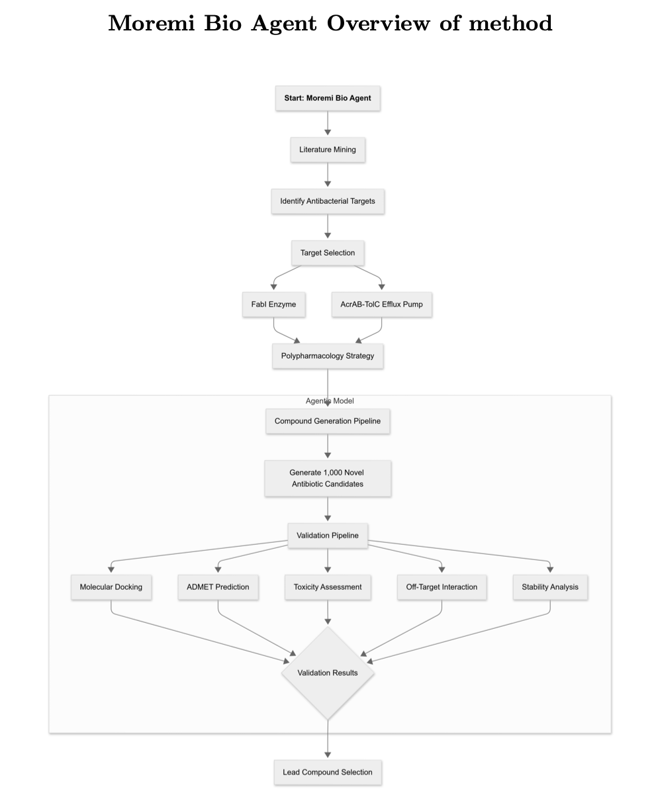
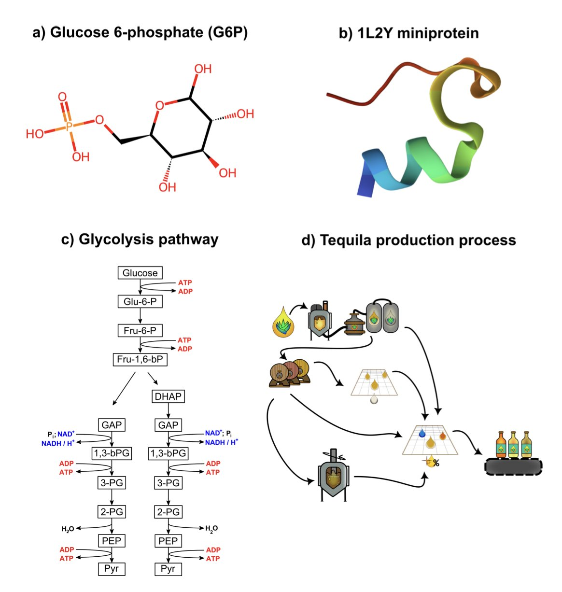
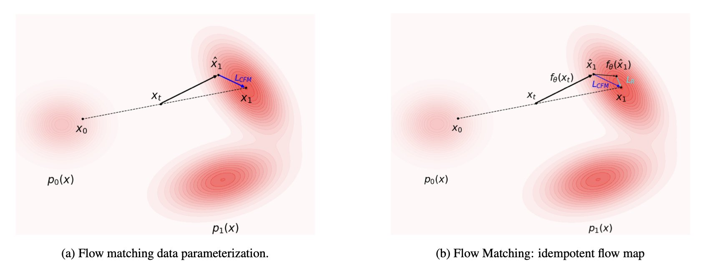

## Table of Contents
1. An autonomous AI agent designs a dual-target antibiotic from scratch, demonstrating a fully automated process to fight superbugs.
2. We finally have a mathematical tool that speaks chemistry's native language, allowing AI to see molecules not as a collection of atoms, but as a network of connections.
3. IDFlow uses physical energy as a "navigator" for AI, guiding it away from blind imitation toward a targeted search for the most stable and realistic 3D structures.

## 1. An AI Agent's "Two-Pronged Attack" on Superbugs

For decades, we’ve been losing the battle to develop new antibiotics. Whenever a new drug appears, Gram-negative bacteria like *Klebsiella pneumoniae* quickly figure out how to defeat it. It's like a never-ending game of whack-a-mole, and our toolbox is running low.

One widely accepted strategy is to stop attacking just one target. If you can destroy the enemy's munitions factory and their escape route at the same time, your odds of winning get a lot better.

#### The AI's Pincer Movement

Researchers chose two targets: the FabI enzyme and the AcrAB-TolC efflux pump. The FabI enzyme is a key machine on the "production line" bacteria use to build their cell membranes. The AcrAB-TolC efflux pump is the "escape hatch" bacteria use to expel drug molecules.

Attacking both at once creates a pincer movement.

Once the strategy was set, the job of executing it was handed to an AI.

#### The Autonomous AI Project Manager: Moremi Bio Agent

The star of this work is an AI agent called Moremi Bio. It isn't just a simple generative model; it's a fully automated project manager.

Here's how its workflow runs:

First, **Generation**. It designs 1,002 new molecules that could, in theory, inhibit both targets.

Second, **Screening**. It runs each of the 1,002 molecules through molecular docking, ADMET (Absorption, Distribution, Metabolism, and Excretion), and toxicity predictions.

Third, **Ranking**. It scores and ranks the molecules that pass the initial screening based on their drug-likeness.

The entire process is completely autonomous.

#### The AI's Results

Of the 1,002 initial molecules, 774 passed the preliminary ADMET benchmarks. In the end, the AI project manager delivered a short list of 60 candidate molecules.

Analysis showed that 391 of the molecules displayed "moderate" binding affinity for both targets.

But we need to be realistic about the word "moderate."

The AI can't yet design a nanomolar-level drug ready for clinical trials in one shot. These 60 molecules are more like a batch of high-quality lead compounds—a valuable starting point for development.

And that is the value of this work.

In traditional drug discovery, finding a starting point with dual-target activity and good drug-like properties could take a team a year or more.

Moremi Bio completed this difficult from-scratch exploration efficiently inside a computer.

This work demonstrates an engineering solution that can solve a real-world problem. It provides a better starting point, allowing researchers to focus their energy and resources on optimizing these promising molecules into actual drugs.

📜Title: Moremi Bio Agent: Leveraging Agentic Large Language Model for the Discovery of Broad-Spectrum Antibiotics for Enterobacteriaceae
📜Paper: https://www.biorxiv.org/content/10.1101/2025.08.21.671656v1

## 2. Graph Neural Networks: The Universal Language of Chemistry

For decades, we've tried to teach computers chemistry. The process was like describing a Ferrari to a blind person over the phone. You can list all the specs—four wheels, two doors, a V12 engine, a red body—but they will never grasp the essence of the machine: how all the parts **connect** in a beautiful and efficient way.

Past machine learning methods worked just like that. For each molecule, we would calculate hundreds of "molecular descriptors" like molecular weight, logP, number of rings, and hydrogen bond donors and acceptors. This is basically a detailed parts list. We fed this list to an AI and hoped it would figure out chemical principles. The AI sometimes guessed correctly, but it never really understood.

This review paper announces that a new era may have arrived. We've found a better language for communicating chemistry to AI.

#### Welcome to the World of Graphs

This new language is the graph. In mathematics, a graph is defined simply: a collection of nodes and the edges that connect them.

Now, think about a chemical molecule. It's a collection of atoms (nodes) and the chemical bonds that connect them (edges).

The correspondence is perfect.

When we represent a molecule as a graph, we're not just telling the AI, "There's a carbon atom here and an oxygen atom there." More importantly, we're telling it: "This carbon atom and that oxygen atom are **connected**."

Graph Neural Networks (GNNs) are AIs built to interpret this graph language.

The way they work is chemically intuitive. Information passes between connected atoms. A carbon atom will pass information to its neighbors, like "I'm an sp2-hybridized carbon bonded to an oxygen and a nitrogen." The neighbors receive this information and pass it on to their own neighbors. After a few rounds of this message passing, every atom in the molecule has a rich, deep understanding of its local chemical environment.

This is why GNNs perform so well at predicting molecular properties. They are no longer guessing based on a scattered parts list. They are making judgments after understanding the entire "design blueprint" of the molecule.

#### More Than Just Molecules

The beauty of this method is its universality.

A glucose molecule is a graph. The entire glycolysis pathway is also a graph, but now the nodes are metabolites and the edges are the chemical reactions that catalyze the transformations. We can use the exact same mathematical framework to study problems at completely different scales.

This review also looks to the future: 3D graphs that can understand spatial information, time-dependent graphs that describe chemical reaction processes, and vast knowledge graphs that connect drugs, targets, and diseases.

Graph Neural Networks are not just another buzzword. They represent a shift. We've finally stopped trying to force-translate chemistry into long strings of numbers that computers can process. Instead, we're starting to teach computers the native language of chemists—structure and connection.

📜Title: Graph Data Modeling: Molecules, Proteins, & Chemical Processes
📜Paper: https://arxiv.org/abs/2508.19356

## 3. A New Way for AI to Generate Molecules: Navigating with Physical Energy

In the world of AI-generated molecules, we've always had a nagging question: Is the AI "creating" or just "copying"?

Many generative models, like diffusion or flow matching models, are like a gifted but reckless artist. If you show one a thousand pictures of chairs, it can draw a thousand-and-first picture that looks like a chair. But if you ask it whether a person could sit on this new chair without it collapsing, it wouldn't know. It understands aesthetics, not mechanics.

In the serious engineering field of molecular design, just "looking like" a molecule is not nearly enough. A molecule must obey the fundamental laws of physics and chemistry, be energetically stable, and be able to exist in the real world. Otherwise, what the AI generates is science fiction, not science.

The way IDFlow works is like hiring a strict physics tutor for this artist AI.

#### Making the AI's Objective Function More "Physical"

The core of IDFlow is a simple change: it alters the AI's "learning objective."

A traditional flow matching model learns to make its generated output statistically similar to the training data.

IDFlow's objective, instead, is to make the "energy" of the generated molecule as low as possible.

Here, "energy" is defined as the model's "reconstruction error." In the process of generating a molecule, the AI constantly makes "guesses" and "corrections." The IDFlow training process forces every one of the AI's corrections to move in a direction that lowers the molecule's overall energy and improves its structural plausibility.

It's like teaching an architect to draw blueprints. Before, the only requirement was that the drawings looked like the examples. Now, every draft must pass a stability test from a structural mechanics software. The final blueprints are naturally both beautiful and buildable.

#### How Were the Results?

When the AI started respecting physics, the quality of its work improved significantly.

The researchers tested IDFlow's performance on two tasks that matter most to R&D scientists:

The first was **molecular docking**. The results showed that IDFlow's accuracy (measured by RMSD) in predicting how a drug molecule binds to a target protein surpassed existing baseline models.

The second was **protein backbone generation**. This is a much harder task, like asking the AI to design a completely new protein from scratch. IDFlow generated protein backbones with higher "designability," meaning it's more likely that an amino acid sequence can be found that will stably fold into that backbone. The structures it created were not just empty, pretty shells.

All of this was achieved without a huge additional computational cost.

This work takes AI a solid step forward, from a "pattern imitator" to a true "physical world simulator." It doesn't try to solve every problem with a black box. Instead, it integrates the fundamental physical principles we already know into the AI's learning process.

📜Title: Energy-Based Flow Matching for Generating 3D Molecular Structure
📜Paper: https://arxiv.org/abs/2508.18949
