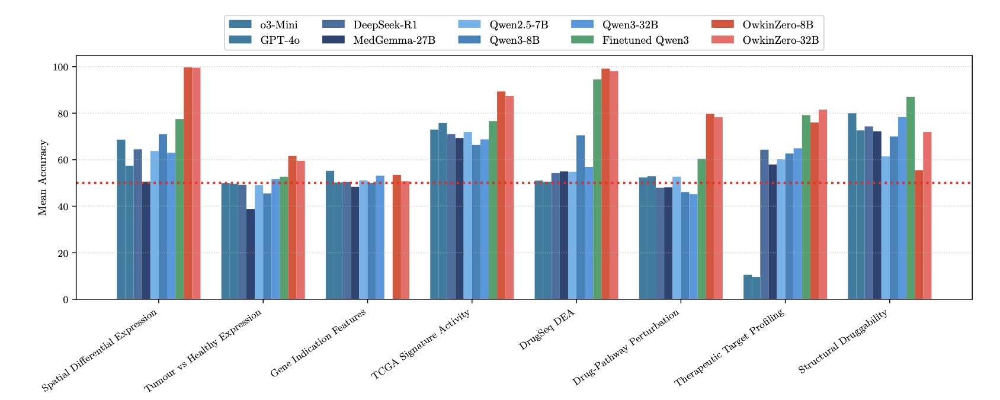
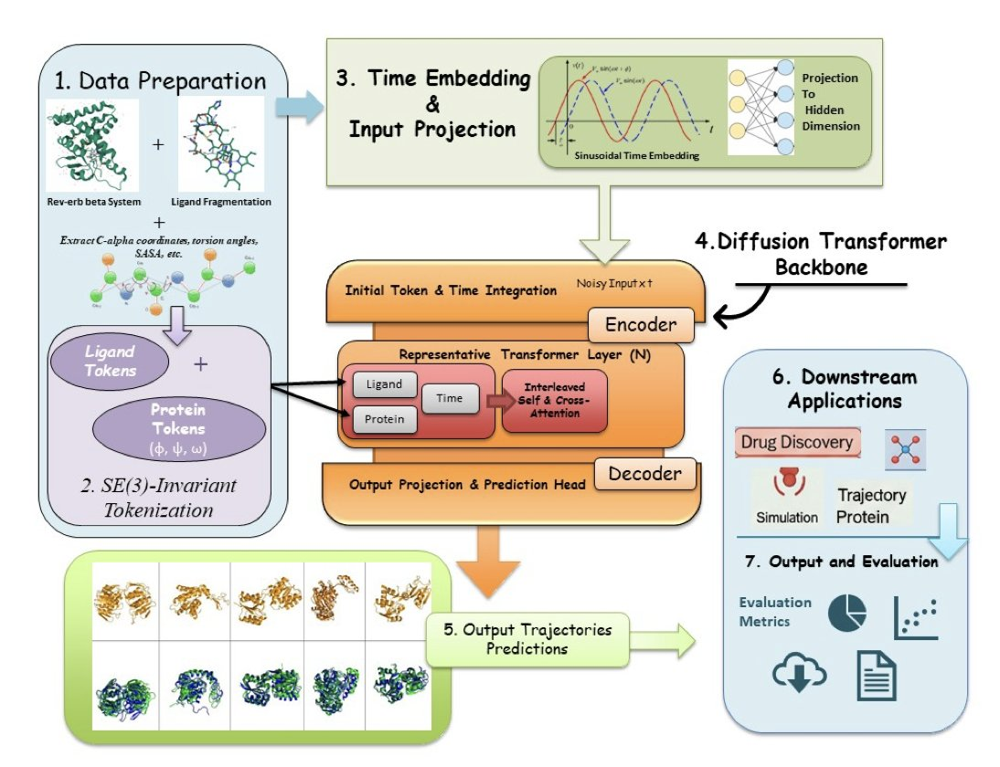
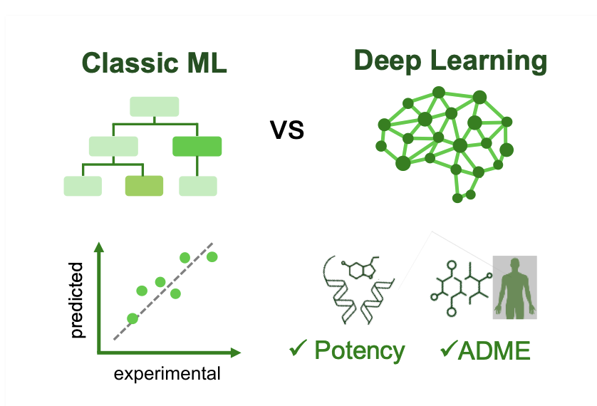

## 目录  
1. OwkinZero 在一个高质量、可验证的问答数据集上进行强化学习，证明了小而专的 AI 模型在生物学推理上，能击败更大、更通用的商业模型。
2. 生成式 AI 模型 HemePLM-Diffuse，其速度比传统分子动力学快 100 倍。它不再逐帧模拟，而是直接生成蛋白质与配体相互作用的完整动态过程。
3. 别再迷信复杂的模型了。真正的胜利属于混合策略：用深度学习搞定 ADME，用经典方法预测药效，但最重要的是，先把你数据里的「坑」填上。

## 1. AI 生物学推理：小模型击败大模型  
  
  

让大语言模型（LLM, Large Language Model）回答严肃的生物学问题，常会得到一种奇特的体验。它像个博览群书、天赋过人的实习生，引经据典，头头是道，却总让人觉得它并未真正理解。它在模仿海量文本，而非进行第一性原理的科学推理。  
  
这就是 LLM 的「生物学推理盲点」。一篇新论文，正中这个盲点。  
  
#### 别再奖励「花言巧语」了  
  
过去的 AI 训练，常奖励「思考过程」（Chain of Thought）。就像老师批改作业，即使答案错误，只要解题步骤写得详细，也会给辛苦分。  
  
OwkinZero 的研究者采用了更严格务实的方法：**只奖励正确答案**。  
  
他们使用的策略是「从可验证奖励中进行强化学习」（Reinforcement Learning from Verifiable Reward, RLVR）。这好比一场永无止境的客观题考试，AI 每回答一个问题，系统就用可靠的外部知识源核对。答对得奖励，答错受惩罚。  
  
这种直接的方法，迫使 AI 将全部精力集中于「如何得出正确结论」，而非「如何包装推理过程」。  
  
#### 真正的「秘密武器」：一本完美的教科书  
  
好的考试方法需要好的教材与题库，这正是这项工作的扎实之处。  
  
研究团队没有从互联网抓取数据，而是动员专家，构建了八个基准数据集，包含超过 30 万个高质量问答对。这些都是一线研发人员面临的真实问题：靶点成药性如何？该用小分子还是抗体？药物会引起何种细胞反应？  
  
他们相当于为 AI 编写了一套生物医药领域最权威的教科书和模拟试卷。  
  
#### 结果令人大跌眼镜  
  
用这套方法和教材训练出的中等规模模型 OwkinZero，表现如何？  
  
它在生物学推理任务上，稳定击败了体量和成本远超于它的通用商业大模型。  
  
这好比一位专攻单项的运动员，在专业指导下，战胜了样样通、样样松的全能明星。  
  
更有趣的是「泛化效应」。  
  
研究人员发现，一个仅用「靶点成药性」题库训练的专家模型，不仅精通本行，在它从未接触过的「药物扰动效应」预测任务上，表现也提升了。  
  
这个反直觉的结果，好比一个只上心脏病学课程的医学生，肾脏病学考试成绩也提高了。这表明模型学到的，并非孤立的心脏知识，而是贯穿医学的底层生理学和病理学原理。  
  
OwkinZero 似乎开始真正地「思考」生物学。  
  
也许我们无需等待无所不能的 GPT-6。利用专注、高质量的数据和恰当的训练方法，我们现在就能构建出在特定科学领域，比通用大模型更强大、更可靠的专家 AI。  
  
📜Title: OwkinZero: Accelerating Biological Discovery with AI  
📜Paper: https://arxiv.org/abs/2508.16315  

## 2. AI 导演分子电影：比 MD 快 100 倍  
  
  

跑过分子动力学 (Molecular Dynamics, MD) 模拟的人，都有过这种体验：MD 是观察分子世界的唯一「摄像机」，能让我们看到药物分子如何挤入靶点。但这台摄像机拍摄的是慢动作，续航也有限。  
  
药物结合或解离需要微秒乃至毫秒，而超级计算机集群运行数月，也只能捕捉到几百纳秒的片段。我们手握原子级分辨率的工具，却拍不完一部完整的「电影」。  
  
HemePLM-Diffuse 选择成为「导演」，而非「摄影师」。  
  
#### AI 如何学会「执导」  
  
优秀的导演无需亲自操作摄像机，他凭借阅片无数，理解了影像的内在逻辑。  
  
HemePLM-Diffuse，一个生成式 Transformer 模型，正是如此。它并未直接计算物理，而是学习了海量的 MD 模拟数据，从中掌握了蛋白质与配体相互作用的规律。  
  
它知道哪些化学基团倾向于同哪些氨基酸残基相互作用，也知道柔性的环区在配体靠近时通常如何响应。  
  
因此，不再需要逐帧拍摄。只需提供一个「剧本」——例如蛋白质 A 和配体 B 的初始和最终结合状态——AI 就能生成连接起点和终点的完整、高概率动态过程。  
  
这个过程更接近 DALL-E 生成图像，而非物理模拟。其速度源于跳过了繁琐的逐步积分计算。  
  
#### 「导演」的水平如何？  
  
为检验其可靠性，研究者在几项关键任务上对它进行了测试：  
  
1.  **配体修复  (Ligand Inpainting) ** ：移除轨迹中的配体，让模型将其复原。HemePLM-Diffuse 的平均 RMSD 仅为 0.91 Å，优于以往模型，证明其能准确理解配体与蛋白质的关系。  
  
2.  **轨迹插值  (Trajectory Upsampling) ** ：仅提供起始和结束两帧，让模型补全中间过程。它的表现同样出色，平均每帧 RMSD 为 1.03 Å，这对模拟昂贵体系很有价值。  
  
3.  **过渡路径采样 (Transition Path Sampling) ** ：生成从 A 状态到 B 状态的过渡路径。其 TPS 分数高达 0.95，表明生成的路径在物理上高度合理。  
  
在速度上，模拟一个含血红素的大体系 1 纳秒的动力学过程，它仅需 12 分钟，而传统 MD 方法则需数天。超过 100 倍的速度提升带来了质变。  
  
当前版本尚未显式地考虑溶剂（水分子）的影响，这对许多体系而言是一个简化。  
  
HemePLM-Diffuse 开辟了一条新路径，使我们向药物设计早期阶段，就能快速、大规模预测药物动力学（而不仅是热力学）的目标更近一步。  
  
📜Title: HemePLM–Diffuse: A Scalable Generative Framework for Protein–Ligand Dynamics in Large Biomolecular System  
📜Paper: https://arxiv.org/abs/2508.16587v1  

## 3. AI 制药对决：老方法未死，深度学习仅在 ADME 胜出  
  
  

在计算药物发现领域，一场对决正在上演。一方是久经考验的经典机器学习方法，如随机森林和梯度提升机；另一方是风头正劲的深度学习，携各种复杂神经网络登场。  
  
一篇来自「Polaris 抗病毒挑战赛」的论文，为这场对决给出了详尽的裁判报告，其结论可能让深度学习的支持者感到意外。  
  
#### 预测药效：老将风采依旧  
  
在预测化合物效力 (Potency) 的核心环节，结果是平局。  
  
经典的机器学习方法与需要巨大算力的深度学习模型表现不相上下。这说明，在预测分子与靶点结合强度这类任务上，模型的复杂程度不等于性能更优。  
  
#### 预测 ADME：深度学习的专场  
  
然而，在预测药代动力学，即吸收、分布、代谢、排泄 (Absorption, Distribution, Metabolism, and Excretion, ADME) 这一更复杂的领域，深度学习取得了决定性胜利。  
  
ADME 涉及多因素、非线性问题。一个分子的溶解度、渗透性和代谢稳定性由众多微妙的理化性质共同决定。识别这类复杂模式，正是深度学习的优势所在。  
  
#### 真正的「制胜秘诀」  
  
研究发现，数据处理方法比模型选择对结果的影响更大。  
  
关键在于处理「活性悬崖」 (activity cliffs) 现象。活性悬崖指两个化学结构几乎相同的分子，其生物活性却有天壤之别。这种数据会严重干扰模型学习。  
  
研究者采用了一个简单的策略：训练前，识别出这些引发困惑的数据对，并**暂时将其掩蔽**。这一数据预处理步骤，显著提升了经典模型和深度学习模型的预测准确性。  
  
我们与其争论哪种算法更高明，不如先花时间清理数据中的「坑」。  
  
另一项发现是，深度学习生成的分子嵌入 (learned embeddings) 在此次挑战赛中的表现，普遍不及沿用已久的经典化学描述符。这提醒我们，新方法未必优于经过时间检验的工具。  
  
总结而言，这场对决没有绝对的赢家。最佳策略是务实地结合两者：利用深度学习处理复杂的 ADME 预测，同时在药效预测上继续使用表现稳健的经典方法。但无论选择何种模型，首要任务都是审视并清理好你的数据。  
  
📜Title: Deep Learning vs Classical Methods in Potency & ADME Prediction: Insights from the Polaris Antiviral Challenge  
📜Paper: https://doi.org/10.26434/chemrxiv-2025-64fcb
