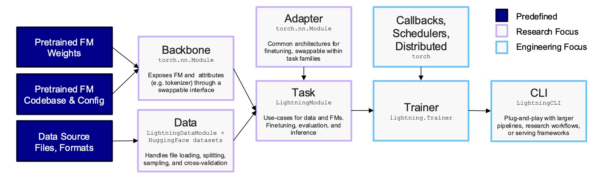
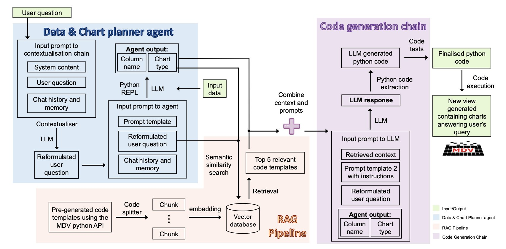
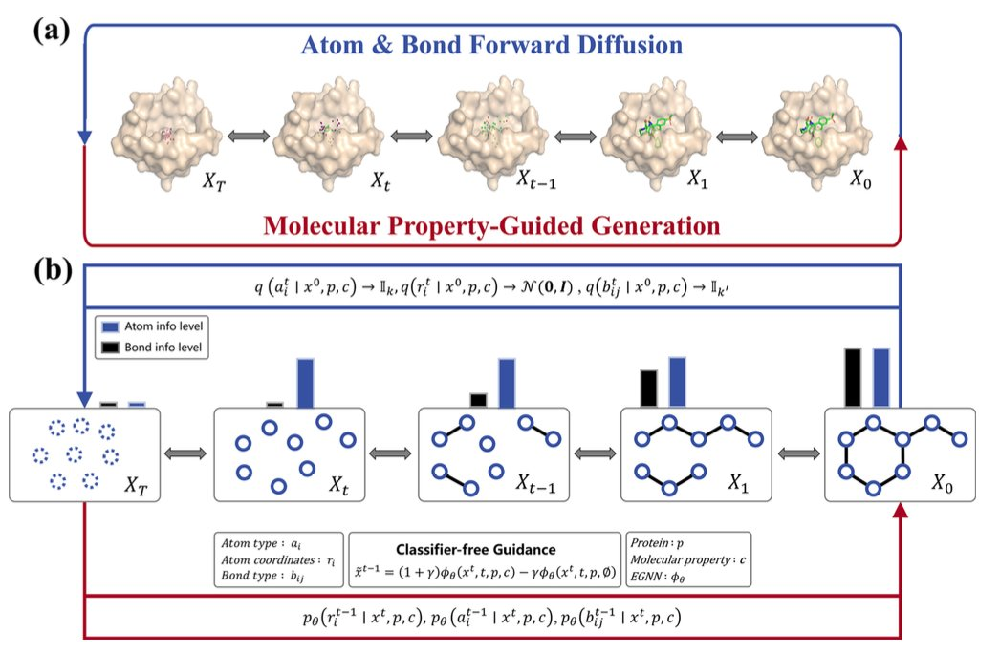
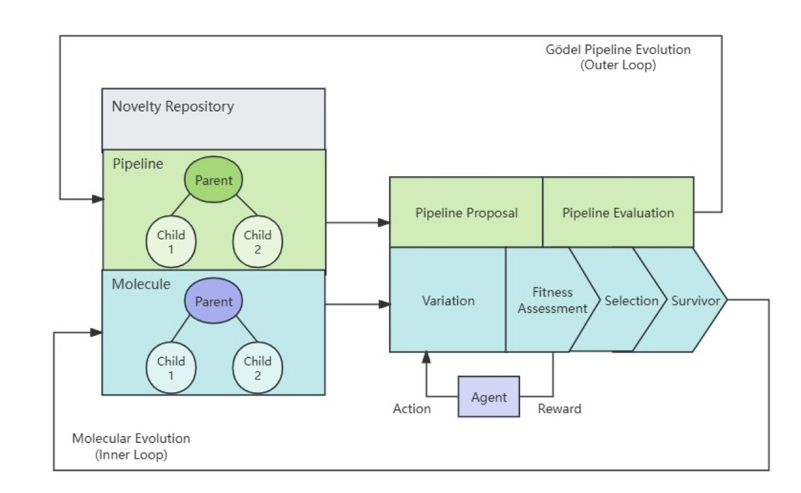
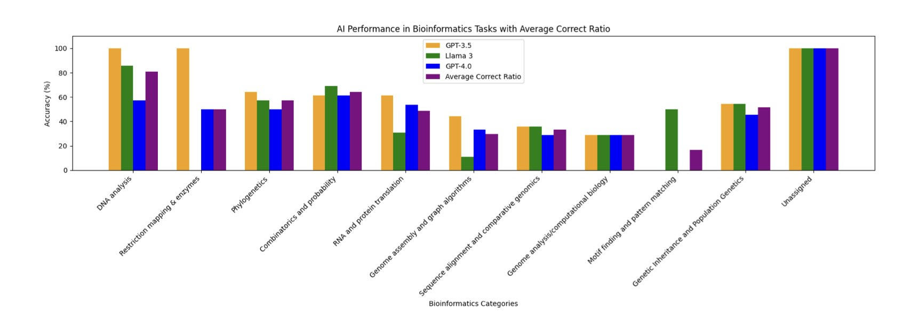

## Table of Contents
1. An open-source toolkit uses simple YAML files to turn building complex, reproducible multimodal biology foundation models from an engineering challenge into something like playing with LEGOs.
2. ChatMDV translates a researcher's natural language directly into executable code, making complex bioinformatics data visualization a tool for everyone in the lab, not just a skill for a few experts.
3. DiffGui builds chemical bonds while generating atoms, guided by binding affinity and drug-likeness. This makes the AI-generated molecules chemically valid structures, not just clouds of atoms.
4. An AI framework optimizes molecules through a "Darwinian" evolutionary loop and simultaneously optimizes its own drug discovery process through a "Gödelian" meta-learning loop.
5. General large models can solve many standard bioinformatics problems, but they are more like well-read students than researchers capable of independent thought.

## 1. AIDO.ModelGenerator: LEGOs for Multimodal Biology Models

Biologists are often held back by computation and engineering. In the era of large models, building a model that combines data like DNA, RNA, and protein is a complex process. Researchers need to be machine learning engineers and software specialists just to start their real biology work. The whole process is tedious, the results are hard to reproduce, and it slows down scientific discovery.

AIDO.ModelGenerator is a new tool that tackles this problem head-on. Its core idea is to standardize and modularize the complex process, like creating a LEGO set for biology foundation models. Users don't need to write code from scratch to build, fuse, and train models. They just need to prepare a YAML configuration file.

For example, if you want to use cross-attention fusion with a 3-billion-parameter DNA model and a 500-million-parameter RNA model, you just declare it in the YAML file. If you want to run a large model on a single A100 GPU using Parameter-Efficient Fine-Tuning (PEFT), that also just takes a few lines of configuration. This lowers the technical barrier from a machine learning expert to a scientist who can write a config file.

In a case study on Crohn's disease, the tool showed what it can do. Traditional differential expression analysis ranked the known clinical target SOX4 at position 6,068 out of nearly 19,000 genes—like finding a needle in a haystack. Using in-silico knockout, AIDO.ModelGenerator moved SOX4's rank up to 14. This is a huge leap, providing a clear lead for finding targets.

The tool also performed well in an RNA splicing prediction task. Using only a single modality is like trying to predict real-time traffic from a static map. By fusing DNA (the static genomic blueprint) and RNA (the dynamic expression messenger) data, the model's prediction performance improved by over 10%, achieving a new state-of-the-art (SOTA). This multimodal approach offers a more complete view for understanding complex biological systems.

The tool's focus on **reproducibility** solves a key problem in computational biology. In academic research, it's often difficult to reproduce experimental results. AIDO.ModelGenerator uses locked configuration files and deterministic runs to ensure every experiment produces the exact same result, down to the byte. This makes research findings reliable and verifiable. It also allows peers and reviewers to easily reproduce the entire workflow, reflecting scientific rigor.

AIDO.ModelGenerator is essentially an accelerator and a toolkit. It frees biologists from heavy engineering work so they can focus on the biology itself—forming hypotheses, designing experiments, and validating discoveries, without spending too much time debugging code and configuring environments.

📜Title: Rapid and Reproducible Multimodal Biological Foundation Model Development with AIDO.ModelGenerator
📜Paper: https://www.biorxiv.org/content/10.1101/2025.06.30.662437v1
💻Code: https://github.com/genbio-ai/ModelGenerator

## 2. ChatMDV: Bioinformatics Analysis Without the Code

Bioinformatics analysis has a high barrier to entry. It requires researchers to know both biology and programming, which slows down research. ChatMDV offers a solution. It acts like a translator, using a Large Language Model (LLM) and Retrieval-Augmented Generation (RAG) to turn a natural language request like "Show the expression of gene A in these cell clusters with a UMAP plot" directly into Python code that generates the chart. Data analysis becomes a conversation. Wet-lab scientists can explore data and test ideas themselves, quickly, without having to wait in line for a bioinformatician.

***

There’s an invisible wall in biology labs. On one side is hard-won single-cell sequencing data. On the other are the charts and statistics that reveal biological insights. In between stands a high wall built of Python, R, and complex software packages.

To get over this wall, a researcher can either spend years learning to code or hand their precious data to the bioinformatician whose schedule is always full, and then wait.

ChatMDV aims to tear down that wall.

#### AI as a Translator, You Just Ask Questions

ChatMDV's approach is simple: teach AI the language of biologists. It positions itself as a top-tier simultaneous interpreter.

Here’s how it works:

A researcher makes a request in plain language, like, "Show these cells in a UMAP plot and color them by cell type."

ChatMDV's internal "planning agent" breaks this sentence into a clear action plan: "The user wants a UMAP plot, colored by the data in the 'cell_type' column."

Next, a "code generation" module gets to work. It doesn't write code from scratch. Instead, it uses a Retrieval-Augmented Generation (RAG) process to find the most relevant code snippets and function usages from a predefined "code library" and "knowledge base." This is like a student taking an open-book exam. They don't need to memorize every detail, just know where to look things up and how to assemble the information correctly.

Finally, it generates a piece of Python code, runs it automatically, and presents the UMAP plot you asked for.

#### More Than Just Chatting, It's Interactive

The charts ChatMDV generates appear in an interactive viewer (MDV). After the AI creates the initial plot, you can fine-tune it just like in regular software—clicking, zooming, and filtering with your mouse.

This combination of natural language input and graphical interface fine-tuning lowers the barrier to entry and hints at the future of scientific software.

#### Is It Reliable?

The research team tested ChatMDV on three real-world datasets of increasing complexity, from simple PBMC data to a complex lung cancer atlas. It showed a high success rate on all of them, reaching 100% on the simplest tasks.

This shows it can handle the imperfect data found in real research.

While AI can't yet understand every vague research idea, ChatMDV proves that code-free, conversational interaction between scientists and their data is possible.

It will free bioinformaticians from many repetitive, basic visualization tasks, allowing them to focus on solving scientific problems that require more ingenuity and creativity.

📜Title: ChatMDV: Democratising Bioinformatics Analysis Using Large Language Models
📜Paper: https://www.biorxiv.org/content/10.1101/2025.08.26.671083v1

## 3. DiffGui: Building Molecules Like an Architect, Drawing the Skeleton Before Adding the Flesh

Anyone who has worked with 3D molecular generation models knows the reality: these AIs are good at arranging atoms but not so good at chemistry.

Given a protein pocket, an AI can generate a cloud of atoms that fills the 3D space well. But when you try to convert that cloud into a 2D structure diagram with chemical bonds, problems appear: five-bonded carbons, non-existent chemical bonds, and other structures that violate basic chemistry. It's like an architect marking where the columns go but ignoring the beams and floors, making the building impossible to construct.

A paper in Nature Communications introduces a method designed to make AI build the chemical bond framework at the same time it places the atoms.

#### First the Skeleton, Then the Flesh

The new model is called DiffGui, and its core idea is to **generate atoms and chemical bonds at the same time**.

It's a type of diffusion model. Traditional diffusion models start with a blurry "pixel cloud" of atoms and gradually make it clearer. DiffGui starts with a blurry "pixel cloud" **and** blurry "connecting lines" at the same time.

At each step of the generation, the model determines the type and position of the atoms, as well as the chemical bonds between them.

This way, chemical bonds become an inherent constraint in the generation process, not an afterthought. This ensures the final molecule is chemically sound from the ground up.

#### Giving the AI a "Compass"

Just having a chemically valid skeleton isn't enough. The goal is to generate a **good** molecule.

DiffGui introduces a **property guidance** mechanism. At each step of molecule generation, multiple property estimators provide feedback.

For instance, a "binding affinity" estimator judges whether the current step improves the molecule's binding to the target and guides it toward a tighter fit. A "drug-likeness" estimator reviews the molecule's chemical properties, like solubility or hydrogen bond features, and makes adjustments.

With this continuous, multi-dimensional guidance, the generation process shifts from simply imitating training data to an active, goal-oriented optimization toward a "good molecule."

#### Does This Actually Work?

Building the skeleton and using a compass at the same time has improved the quality of molecules generated by DiffGui.

In a series of benchmark tests, DiffGui outperformed existing methods.

In a real-world drug design case, researchers used the tool to successfully design new molecules that could adaptively bind to a mutated protein pocket. This shows that DiffGui can understand and respond to subtle changes in the chemical environment, making it a practical design tool.

📜Title: Target-aware 3D Molecular Generation Based on Guided Equivariant Diffusion
📜Paper: https://www.nature.com/articles/s41467-025-63245-0
💻Code: https://github.com/QiaoyuHu89/DiffGui

## 4. AI Drug Discovery: A Machine That Can Evolve Itself

AI drug discovery tools can generate molecules and predict properties, but most of them are **static**. Once a model is built, its performance is fixed. Improving it requires manual intervention and retraining. It's like having a good car, but to make it faster, you have to modify the engine yourself.

A new framework called the Darwin–Gödel Drug Discovery Machine (DGDM) aims to build a car that can **modify its own engine**.

#### Two Loops, Two Kinds of Evolution

The framework's core is two nested loops.

**The Inner Loop: Darwin's World**

The inner loop optimizes the **molecules**. It works like a miniature Darwinian evolution.

First, a generative model creates a diverse batch of candidate molecules. These molecules then enter a simulated "natural environment" for screening, which includes computational assessments like molecular docking, binding affinity prediction, and ADMET property analysis. The best-performing molecules are selected as "parents" to generate the next generation.

This cycle repeats, and with each generation, the molecules evolve to better meet the predefined goals, such as stronger binding affinity.

**The Outer Loop: Gödel's Ghost**

The outer loop doesn't optimize molecules. It optimizes the **discovery process itself**.

It's inspired by the "Gödel machine," a concept from mathematician Kurt Gödel for a machine that could theoretically inspect and modify its own code to improve itself.

In reality, you can't use strict mathematical logic to prove a process is better, so this framework uses **statistics**. The outer loop periodically suggests changes to the entire drug discovery process, such as swapping out a docking score function or adjusting the molecule generation strategy. The system then uses statistical tests to see if these changes improve overall performance. A change is only adopted if the data proves it is effective. This is a data-driven, risk-managed form of self-evolution.

#### What Were the Results?

The researchers ran a proof-of-concept with the system.

After optimization by the dual-loop system, the median binding affinity of candidate molecules improved, while their drug-likeness and novelty remained at 100%. This shows the system improved performance while still following basic chemical rules.

This is still a small-scale proof-of-concept focused on a single target. Integrating wet-lab data into a closed loop is the next challenge.

DGDM shows a possible direction for AI drug discovery: moving from using AI tools to building autonomous AI scientists that can improve themselves.

📜Title: The Darwin–Gödel Drug Discovery Machine (DGDM): A Self-Improving AI Framework
📜Paper: https://www.biorxiv.org/content/10.1101/2025.08.21.671415v1
💻Code: https://github.com/deep-geo/DGDM

## 5. AI Takes a Bioinformatics Exam, With Surprising Results

The Rosalind platform is a training ground for bioinformatics students. It has hundreds of classic computational problems, from calculating the GC content of DNA to finding the secondary structure of RNA. Most people who study bioinformatics have practiced on it.

Researchers in a new paper took three major Large Language Models (LLMs)—GPT-3.5, Llama-3-70B, and GPT-4o—to this exam room and tested them on 104 problems.

The results were unexpected.

#### Is Older Better?

**GPT-3.5** came out on top, getting 58% of the problems right. GPT-4o and Llama-3, two newer and more powerful models, had lower success rates of just 47%.

This doesn't mean GPT-3.5 is smarter than GPT-4o. One possible explanation is that Rosalind's problems are "textbook exercises" with standard answers, and GPT-3.5's training data might have just happened to include more of these ready-made solutions. The newer models, when faced with these problems, might overthink them, trying to solve them with more general but less optimal logic.

#### What is AI Good At, and What Isn't It?

This exam mapped out the "competence circle" of today's general large models.

They performed well on tasks with clear rules and direct calculations, like calculating various statistical properties of DNA. This is like giving a student a math problem that just requires plugging numbers into a formula. As long as they've memorized the formula, they're unlikely to get it wrong.

But when it came to open-ended problems requiring higher-level reasoning, like genome assembly and sequence alignment, the AIs all failed. This is like asking a student to solve a proof that requires multiple lines of thought and creativity. The isolated formulas in their head are no longer enough.

One finding from this paper is very telling: the AI's performance on a problem was highly correlated with the number of times humans had attempted that problem on the Rosalind platform.

It's like a student whose best performance on a practice test is on the exact same questions they've seen countless times in their review books.

This reveals how these AIs learn: they are closer to performing efficient pattern matching and information retrieval from a massive memory bank than they are to reasoning about bioinformatics from first principles.

So, these general large models are still useful. For students learning basic concepts, they are good teaching assistants. For researchers who need to quickly generate template code for standard analysis tasks, they are highly efficient interns.

📜Title: Out-of-the-box bioinformatics capabilities of large language models (LLMs)
📜Paper: https://www.biorxiv.org/content/10.1101/2025.08.22.671610v1
