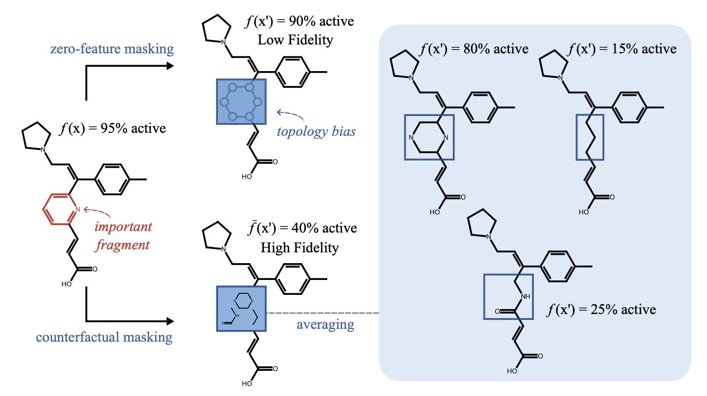
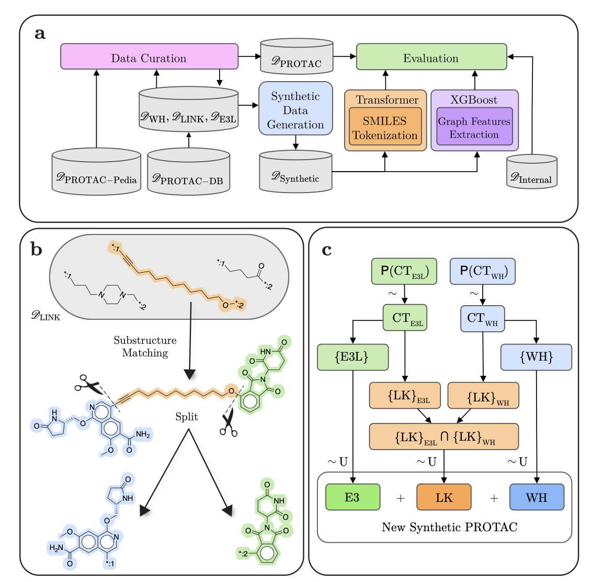
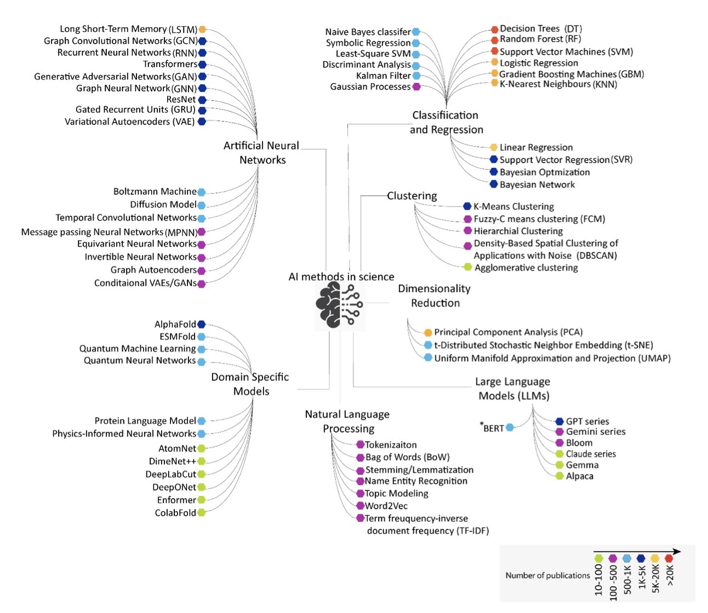

## 目录  
1. 通过用化学上合理的片段替换分子的一部分，这个新方法让 AI 的预测解释，对药物化学家变得有用且可指导。
2. PROTAC-Splitter 采用双模型混合策略，实现了 PROTAC 分子的自动化可靠拆分，为大规模数据分析与分子设计铺平了道路。
3. AI 在化学领域的突破，是一场新旧工具并存的缓慢进化，核心是从手工构建特征转向 AI 自主学习。

## 1. AI 解释终于学会了做化学  
  
  

过去的 AI 解释方法，通过删除原子来判断其重要性，创造出化学上不存在的分子，其解释对化学家没有实际意义。新方法不再删除，而是替换。它用一个化学上合理的片段，换掉分子的一部分，再询问 AI 的判断，这个过程模拟了药物化学家的真实思考方式。  
  
一线药物化学家对 AI 模型的感觉很复杂。你给它一个分子，它能迅速预测其溶解度、毒性或活性。但当你问为什么，AI 给出的解释却很笨拙。  
  
它会用一种叫「特征归零」的方法，直接抹掉分子的一部分。比如，它会移除一个苯环，然后说：「去掉苯环后，溶解度变好了，所以这个苯环不好。」  
  
这好比一个汽车工程师，为了说明引擎的重要性，把引擎从车里拆出来，然后指着那堆无法动弹的金属说：「看，没有引擎不行吧？」这种解释，对想改进引擎的人没有帮助。化学家无法处理一个被凭空删掉苯环的分子片段。  
  
#### 学会问一个更好的问题  
  
一篇新论文让 AI 学会了提出化学家关心的问题。这个新方法叫「**反事实掩蔽」（Counterfactual Masking**）。  
  
它的思路从「如果我们**删除**这个基团会怎样？」，转变为「如果我们**替换**掉这个基团会怎样？」  
  
它的工作方式如下：  
  
当想知道分子上某个甲基为何重要时，新方法不会抹掉它。它会用一个生成式 AI 模型，构想出一些化学上合理的替代品，比如把甲基换成乙基、氯原子或羟基。  
  
然后，它用这些新「合成」的、化学上真实存在的分子，询问预测模型：「这些新分子的性质有何变化？」  
  
这正是药物化学家在实验室的工作方式。我们不会只盯着一个分子，我们会思考：「如果把这个甲基换成三氟甲基，亲脂性会改变，会不会和口袋里的氨基酸产生新的相互作用？」  
  
这个新方法，将 AI 的解释语言与化学家的设计语言对齐了。  
  
#### 一种可指导的 AI 解释  
  
AI 的解释由此变得可指导。  
  
当 AI 建议把 A 基团换成 B 基团后，预测活性会提高，你就得到了一个可验证、并且化学上合理的下一步行动方案。它提供了一张能在实验室验证的合成路线图，而不是空泛的讨论。  
  
研究者在多个数据集上验证了该方法。他们发现，这种方法生成的反事实分子，化学结构更合理，合成可及性也更高。  
  
能完美预测一切的 AI 还很遥远。这个方法对计算资源的要求更高，生成式 AI 构想出的片段，也未必都容易合成。  

📜Title: Enhancing Chemical Explainability Through Counter-flanking Masking  
📜Paper: https://arxiv.org/abs/2508.18561  

## 2. AI 精准拆解 PROTAC，解放药物化学家  
  
  

处理 PROTAC 数据库的研究者，都体会过手动将其拆分为弹头 (warhead)、接头 (linker) 和 E3 连接酶配体 (E3 ligase ligand) 的繁琐。这项工作不仅耗时，且容易出错，严重制约了新分子的分析与设计。一项新的自动化解决方案为此而生。  
  
带标注的 PROTAC 数据稀缺，是机器学习方法遇到的首要障碍。为此，研究者主动出击，生成了 130 万个带详细注释的 PROTAC 分子。这批数据不仅用于训练模型，其本身也成为开放给整个社区的宝贵资源。  
  
有了数据，他们设计了一套组合方案。首先是 Transformer 模型，它精度高，在公开数据集上表现出色。但作为生成式模型，它偶尔会产生化学上不合理的结构，导致拆分后的片段无法复原。  
  
因此，他们还开发了一个基于图的 XGBoost 模型作为补充。该模型能 100% 保证化学合理性，确保拆分出的片段可以精确重构为原始分子。在药物研发中，可靠性至关重要。  
  
这两个模型的结合方式是这套方案的关键。研究者设计了一套混合策略：系统优先使用 Transformer 模型进行拆分。只有当其结果未能通过化学有效性检查时，系统才会自动切换到 XGBoost 模型。这个纠错机制确保了最终输出结果的可靠性。  
  
在药物研发的实际场景中，一个系统在追求高精度的同时，绝不能产出化学上无效的结果。PROTAC-Splitter 通过其混合策略实现了这一点。该工具已经开源，将帮助研究者们告别手动拆分 PROTAC 的低效工作。  
  
📜Title: PROTAC-Splitter: A Machine Learning Framework for Automated Identification of PROTAC Substructures  
📜Paper: https://doi.org/10.26434/chemrxiv-2025-bn1nv  
💻Code: http://github.com/ribesstefano/PROTAC-Splitter  

## 3. AI 化学突破：我们到底走到了哪一步？  
  
  

每隔几年，总有新技术宣称要让化学家失业。这次是人工智能。一篇综述分析了过去十年超过三十万份论文和专利，为这场技术变革描绘了一幅详尽的地图。  
  
地图显示，真实情况比预想的更复杂，也更有趣。  
  
#### 老兵不死，只是在默默干活  
  
随机森林、决策树等传统机器学习方法并未过时。在许多任务上，它们仍是最可靠的工具。  
  
这些方法根植于化学家积累的化学直觉。我们将这些直觉量化为数千个「分子描述符」——例如分子的脂水分配系数、拓扑极性表面积等，再将这些精心准备的特征「喂」给模型。  
  
这种「基于描述符」的方法让我们大致能理解模型的工作原理。  
  
#### 新贵登场，以及它带来的新问题  
  
2020 年后，图神经网络 (GNNs)、生成模型等复杂的神经网络架构开始普及。  
  
这些新工具引发了**端到端学习**的转变。  
  
我们不再需要手工准备分子描述符，而是直接将分子的二维或三维结构交给 AI，让它自主学习需要关注哪些特征。这是一个飞跃。  
  
大语言模型 (LLMs) 的加入，进一步拓展了应用边界。它们不仅预测分子性质，还在改变科研范式——从自动阅读海量文献、提出科学假说，到规划实验步骤。  
  
#### 最大的挑战：AI 的「黑箱」  
  
AI 正从一个我们能理解其规则的工具，转变为一个能力强大但决策过程不透明的「黑箱顾问」。  
  
它或许能提出卓越的设计方案，却无法解释原因。这种「不可解释性」在要求决策可追溯的严谨科学领域，是一个悬而未决的挑战。  
  
这篇综述也提到了其他难题：高质量数据的稀缺、数据隐私，以及如何量化 AI 预测的「不确定性」。  
  
所以，AI 化学的突破，目前尚未取代化学家。  
  
它更像一场工具的进化。我们正从一个规则尚可理解的世界，进入一个由我们不完全理解的机器书写新规则的世界。  
  
📜Title: The AI Revolution in Chemistry: Shaping the Future of Materials and Biomedical Sciences  
📜Paper: https://doi.org/10.26434/chemrxiv-2025-8lrf0
