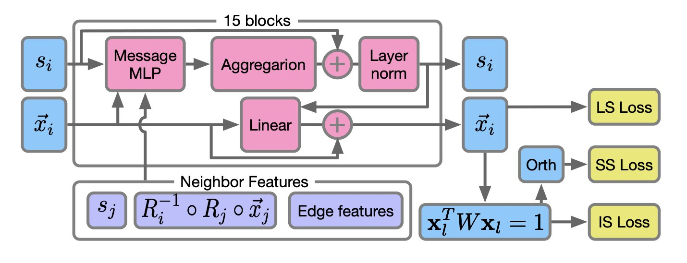

## Table of Contents
1. PETIMOT is an AI framework based on a graph neural network. It can rapidly and accurately infer complex protein dynamics directly from sparse, static 3D structures, providing a transformative tool for conformational analysis in drug discovery.
2. A study demonstrates that a simple, interpretable AI model capable of assessing its own prediction confidence can effectively predict the selectivity of hCA inhibitors and offer practical molecular design ideas.
3. SiMGen uses a local similarity approach to show that generating complex molecules doesn't require massive datasets, offering a more flexible and controllable new path for drug design.

## 1. PETIMOT: An AI that Predicts Protein Dynamics, Incredibly Fast

In drug discovery, protein dynamics are critical. Proteins aren't static structures; they constantly twist and fold. Capturing the specific conformations that allow a
