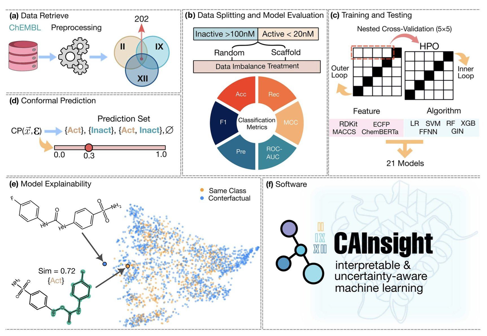
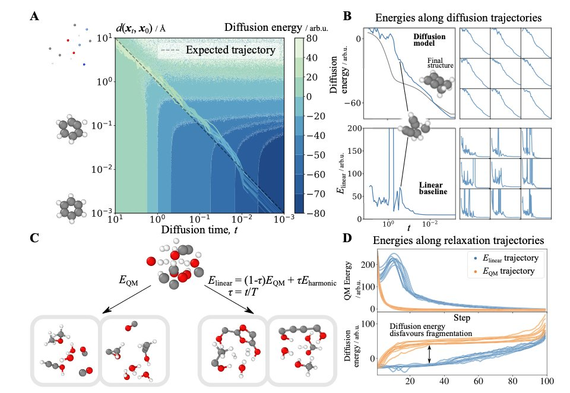

## 目录  
1. PETIMOT 是一个基于图神经网络的 AI 框架，它能直接从稀疏的静态 3D 结构中，快速、准确地推断出蛋白质复杂的动态运动，为药物研发中的构象分析提供了颠覆性的工具。
2. 一项研究证明，一个简单、可解释并能评估自身预测置信度的 AI 模型，能够有效预测 hCA 抑制剂的选择性，并提供可行的分子设计思路。
3. SiMGen 采用局部相似性方法，证明生成复杂分子无需海量数据，为药物设计提供了更灵活、可控的新思路。

## 1. PETIMOT：AI 预测蛋白动态，快到离谱  
  
  

在药物研发中，蛋白质的动态至关重要。它们并非静止结构，而是在持续扭动、折叠。捕捉到那些能让药物分子结合的特定构象，是成功的关键。传统上，观察这些动态依赖分子动力学（MD）模拟，这一过程既慢又昂贵。  
  
一个名为 PETIMOT 的新模型，能在几秒钟内完成这项任务。它本质上是解读蛋白质的 3D 结构图，并预测其动态变化。  
  
PETIMOT 绕开了 MD 模拟对精确力场和海量计算的依赖。它的核心思路是，既然蛋白质的运动模式在同源蛋白间具有共通性，模型可以直接从蛋白质数据库（PDB）中海量的已知静态结构里，学习这些运动的内在规律。  
  
为实现这一点，研究者使用**SE(3) 等变图神经网络**架构。这种架构将物理规律编码进模型：无论如何旋转或平移蛋白质，其内部运动模式保持不变。这让 AI 学习得更快、更准。  
  
PETIMOT 还建立在**蛋白质语言模型**（Protein Language Models, PLM）的基础上。PLM 已能从序列数据中理解氨基酸如何构成蛋白质，PETIMOT 则更进一步，教 AI 如何将这些静态的氨基酸残基组织成动态的构象变化。  
  
模型的核心是学习一个「运动可能性空间」（技术上称为位置协方差矩阵的本征空间）。它不预测一个蛋白会精确移动到某个点，而是描绘出其所有可能的移动方向与范围。这样，模型归纳出了一套通用的运动规律，而非记忆特定蛋白的动作。  
  
结果是，该模型处理整个测试集仅用 16 秒，而其他 AI 方法或传统物理方法需要数小时。  
  
这一进步将改变药物研发的两个关键环节。  
  
首先是**寻找隐蔽口袋**（cryptic pockets）。许多蛋白质的活性位点在常规状态下是关闭的，仅在特定动态构象下才会短暂开启一个可结合的口袋。过去依赖 MD 模拟等待口袋出现，效率很低。PETIMOT 能快速生成成百上千种高概率构象，供对接软件筛选，显著提高了找到这些口袋的机会。  
  
其次是**别构调节剂**的开发。别构药物结合在活性位点之外，通过改变蛋白质整体形状来发挥作用。PETIMOT 预测的蛋白质全局运动模式，为寻找潜在的别构位点提供了一张精确的地图。  
  
PETIMOT 也有其局限。它依赖已有的 3D 结构数据，无法处理结构未知的蛋白质。同时，它预测的是「运动的可能性」，而非在特定条件（如结合候选药物后）下的确定结果。  
  
因此，它最合适的定位是一个高效的「构象搜索引擎」，用于快速产生大量可靠的假说，再由 MD 模拟或生物实验等方法进行验证。  

📜Paper: <https://openreview.net/forum?id=aAhHA3DhpG>  

## 2. AI 预测蛋白选择性，并解释为什么  
  
  

药物发现的核心挑战之一是「选择性」：如何让药物分子只攻击目标靶点，而不误伤结构相似的「亲戚」蛋白。  
  
碳酸酐酶 (Carbonic Anhydrase, hCA) 家族就是这样一个例子。为了治疗癌症，研究者希望抑制 hCA IX 和 XII 亚型。然而，人体内广泛存在功能重要的 hCA II 亚型，一旦被错误抑制，就会引发副作用。因此，设计出能精准区分这些亚型的分子至关重要。  
  
过去，研究者常使用深度神经网络解决此类问题。这些模型虽然能给出预测，却像一个黑箱，无法解释其预测的依据。一个只告诉你「这个分子选择性好」却不说明原因的模型，对需要决定下一步合成方案的药物化学家帮助有限。一篇新论文提供了一套更符合化学家思维方式的工具。  
  
#### 简单模型胜出  
  
研究者比较了多种机器学习模型，从简单到复杂。  
  
结果，表现最好的并非复杂的深度学习网络，而是一个经典方法：**支持向量机 (Support Vector Machine, SVM) ** 结合 **化学指纹 (Extended-Connectivity Fingerprints, ECFP) **。  
  
这项结果表明，在许多化学问题中，高质量的数据和严谨的数据处理，其重要性超过了算法本身的复杂性。  
  
#### 可解释的预测  
  
该研究的价值不止于预测精度，更在于打开了模型的「黑箱」。它结合了两种方法：  
  
首先是**保形预测 (Conformal Prediction) **。这种方法让模型在给出预测的同时，量化自身的不确定性。它不再仅仅判断「分子有选择性」，而是提供一个置信度，例如「该分子具备选择性的置信度为 95%」。这种包含不确定性评估的预测，为决策提供了依据。  
  
其次是**反事实分析 (Counterfactual Analysis) **。该方法让 AI 能够用化学的逻辑进行解释。模型可以指出：「这个分子的高选择性，关键在于其尾部的磺酰胺基团。如果将其替换为羧酸，选择性便会下降。」  
  
这种分析将模糊的预测转化为清晰、可验证的科学假说，直接指导后续的分子设计。  
  
研究团队将整个分析流程整合成一个名为`CAInsight`的图形界面软件，使其从学术研究成果转化为可供实际项目使用的工具。  
  
这项工作将「可解释 AI」成功应用于药物发现。它表明，AI 的角色并非取代研究者的「神谕」，而是一个能够与之对话、理性评估自身局限的「高级顾问」。  
  
📜Title: Interpretable Machine Learning Unveils Carbonic Anhydrase Inhibition via Conformal and Counterfactual Prediction  
📜Paper: https://doi.org/10.26434/chemrxiv-2025-m69tw  

## 3. 零样本分子生成：SiMGen 的小数据魔法  
  
  

AI 制药领域普遍认为模型越大、数据越多，效果越好。模型参数动辄上亿，训练数据常覆盖整个 ZINC 数据库。一篇发表于《自然 - 通讯》的文章则提出了另一种思路。  
  
SiMGen 的工作方式不同。它不依赖暴力学习，而是利用「相似性」原理。好比一位顶尖的米其林大厨，无需学习成千上万份菜单（海量数据），只需品尝几道招牌菜（小型参考分子集），便能领悟每种风味（局部原子环境）的精髓。之后，他就能融会贯通，创造出全新的、甚至更复杂的菜肴。  
  
该方法的核心在于「局部性」。传统扩散模型生成大分子，如同一次性雕刻整块巨石，容易在细节处出错。SiMGen 逐个构建原子环境，好比用小块积木搭建复杂城堡。因此，论文中提到它能生成超过 100 个重原子的分子，也合乎情理。这对研究大环或天然产物的学者是一大助益。  
  
它处理元素类型的方式也很有特点。模型没有训练复杂的「炼金术」网络来预测原子替换，而是采用了一种改进的粒子群优化（Particle Swarm Optimization, PSO）算法。该算法的本质是一种智能试错：「将此处的碳原子换成氮原子，结果是否更接近参考分子？如果是，就保留更改。」这种方法简单、直接且有效，避免了大量计算。  
  
对药物研发人员而言，片段引导功能价值很高。研究者常有一个特定的化学片段，例如某个弹头或一个能与靶点紧密结合的苯环，希望 AI 能将其嵌入并补全分子剩余部分。SiMGen 能够实现这一点。它将研究者的想法（空间限制或化学片段）转化为生成过程中的一种约束，引导分子结构向期望的方向发展。这使 AI 从一个不可控的创造者，转变为可协作的设计师。  
  
SiMGen 挑战了对分子生成模型的固有认知，证明了优雅的算法设计和化学直觉，其价值有时会超过海量数据与算力。它为大型模型提供了一种补充，是一种更贴近化学家思维的新工具。模型的局限在于，参考集的质量决定了生成结果的上限。  
  
📜Title: Zero-shot 3D molecular generation via similarity kernels  
📜Paper: <https://www.nature.com/articles/s41467-024-50963-3>  
💻Code: <https://github.com/RokasEl/simgen>
