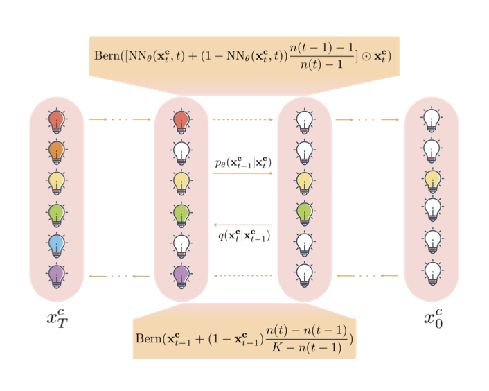
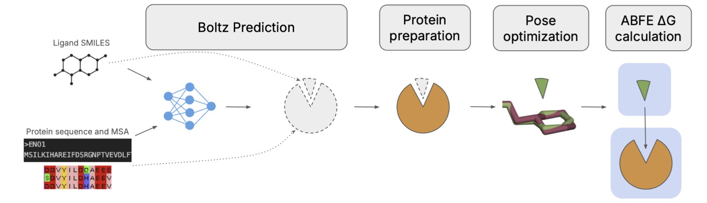
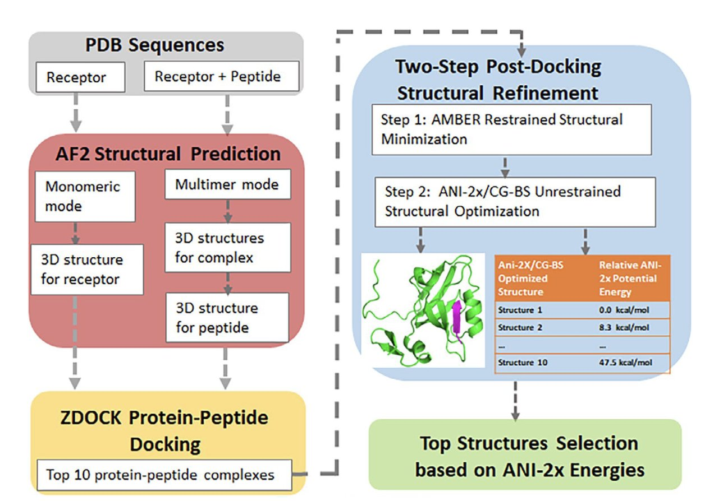
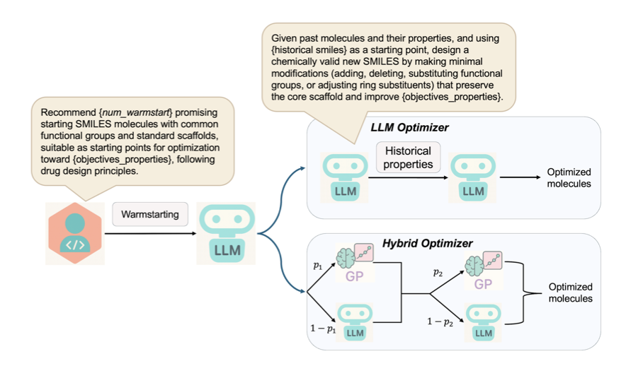
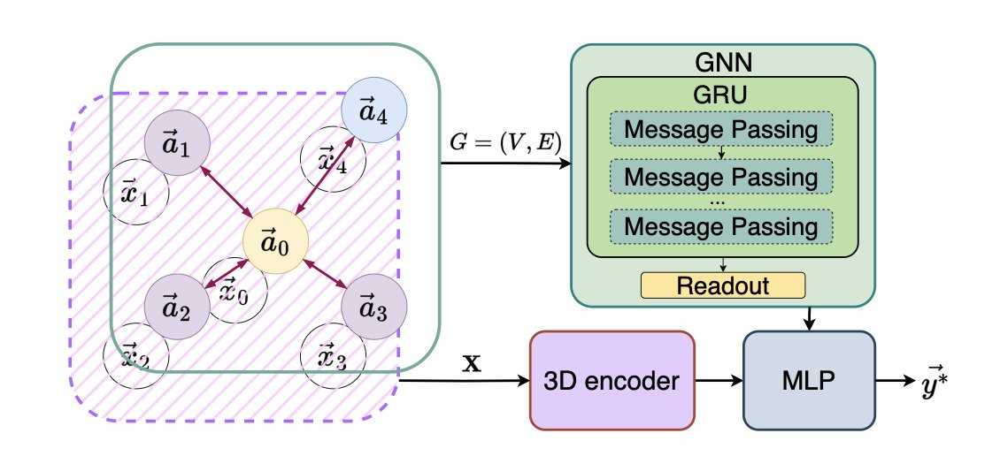

## 目录  
1. SLM 模拟侦探的排除法来生成生物序列。这种新的扩散模型，在 DNA 和蛋白质设计任务中，表现超过了参数量更大的模型。
2. Boltz-ABFE 框架将 AI 预测的蛋白质结构，首次成功用于高精度的自由能微扰（FEP）计算。这项金标准技术从此可以摆脱对实验晶体结构的依赖，为早期药物发现开辟了新路径。
3. 研究者开发了一套新的人工智能流程，即使在蛋白质与多肽的结构未知时，也能高效预测它们的结合方式，且在实际应用场景中表现出色。
4. AutoLead 框架将一个富有创造力的 AI 化学家（大语言模型）和一个严谨的数据统计学家（贝叶斯优化）联手，在药物先导优化的复杂任务中，取得了超越现有方法的成果。
5. 别再费劲搞复杂的等变网络了，简单粗暴地把分子转几圈再平均一下预测，效果出奇地好。

## 1. SLM 模型：像侦探一样用排除法生成分子  
  
  

在教 AI 设计生物序列这件事上，我们一直有点拧巴。  
  
我们最常用的方法是自回归模型，比如 GPT。它就像一个作家，从左到右，一个字一个字地写一个句子。这在语言上很自然，但在生物学里，一个蛋白质序列末端的氨基酸，可能会和最开头的氨基酸在三维空间里紧紧挨着。这种「从左到右」的线性思维，天生就水土不服。  
  
另一条路是扩散模型。它在生成图片和三维结构上大放异彩。你可以把它想象成一个修复旧照片的 AI，从一堆噪点开始，一步步把清晰的图像「还原」出来。这在处理连续、平滑的数据时很强大。但生物序列是由 20 种氨基酸或 4 种核苷酸组成的离散字母表。让一个习惯了调色板的画家去玩字母积木，总感觉别扭。  
  
ShortListing Model (SLM) 展示了一种更符合直觉的方法。  
  
#### AI 学会了当侦探  
  
SLM 的工作方式不像作家，也不像画家，它更像一个侦探。  
  
当需要在一个蛋白质的某个位置决定该放哪个氨基酸时，传统的自回归模型会直接猜一个。SLM 的做法是：  
  
第一步，它把所有 20 种氨基酸都当成「嫌疑人」。  
  
第二步，它分析「案发现场」的线索——这个位置周围的化学环境，然后排除一批最不可能的嫌疑人。比如，它可能会判断：「根据线索，此处不应是带正电的氨基酸，排除赖氨酸和精氨酸。」  
  
它会一步步缩小嫌疑人名单，也就是「Shortlisting」，直到只剩下最合理的那个。  
  
这个过程是一个并行的「排除」，取代了线性的「写作」，能更有效地处理生物学中复杂的长程依赖关系。  
  
#### 不只是聪明，还很高效  
  
这个「侦探」聪明且高效。它排除嫌疑人时，无需在复杂的连续三维空间中摸索，只需在几个定义清晰的「嫌疑人档案」（论文中称为「单纯形质心」）之间选择。这简化了计算，也提升了可扩展性。  
  
研究者还给这个侦探配备了一些工具，比如一个「重加权损失函数」，专门用来解决当嫌疑人太多（比如词汇量巨大的语言模型）时，侦探容易「看花眼」的问题。  
  
#### 结果怎么样？  
  
这个新上岗的侦探一出手就技惊四座。  
  
在 DNA 启动子和增强子设计任务上，它取得了当前最好的成绩。  
  
在蛋白质设计任务上，这个「轻量级」的 SLM，其表现甚至超过了参数量远大于它的「重量级」模型 ESM2-150M。  
  
这表明，在 AI 辅助的科学发现中，有效的路径或许在于寻找更贴近问题本质的算法，而非无休止地堆砌模型和算力。  
  
📜Title: ShortListing Model: A Streamlined Simplex Diffusion for Discrete Variable Generation  
📜Paper: https://arxiv.org/abs/2508.17345  
💻Code: https://github.com/GenSI-THUAIR/SLM  

## 2. AI 为 FEP 探路：告别晶体结构依赖  
  
  

在计算药物化学领域，自由能微扰（Free Energy Perturbation, FEP）是预测分子与靶点蛋白结合亲和力的金标准方法。但它有一个前提：必须要有高质量的、通过实验解析的蛋白质 - 配体复合物晶体结构。  
  
这在药物发现早期构成了一个难题。此时研究者面对的是大量新设计但尚未合成的分子，无法获得晶体结构。因此，FEP 这一工具在最需要它的阶段，反而无法使用。  
  
Boltz-ABFE 框架为此提供了解决方案。  
  
#### AI 当先锋，物理学殿后  
  
Boltz-ABFE 的思路是，用 AI 预测的结构代替实验结构。  
  
研究团队使用的 AI 模型是 Boltz-2，它可以同时对蛋白质和配体进行「共折叠」，直接生成复合物的 3D 结构。这个 AI 生成的结构随后被用于 FEP 计算。  
  
AI 的预测并非完美无瑕。  
  
#### 给 AI 当「纠错指导」  
  
研究发现，Boltz-2 在预测配体的精确化学结构时，偶尔会出错，例如搞错手性中心。这类错误对 FEP 计算的精度影响很大。  
  
为此，团队设计了一个自动化校正流程。他们利用 AI 预测的蛋白质口袋，使用传统的对接软件，将化学结构正确的配体重新置入其中。这一「校对」步骤提升了初始结构的质量。  
  
研究者还提到优化输入的重要性。例如，在预测前去除蛋白质序列中低置信度的柔性区域，或将已知的结合伴侣一并纳入模型。输入信息越符合生物学情境，输出结果就越可靠。  
  
#### 结果怎么样？  
  
在多个标准测试体系上，「AI 预测 + 物理计算」流程得到的结合能，与实验值的平均误差小于 1 kcal/mol。这个精度足以指导早期药物分子的设计与排序。  
  
因此，FEP 方法不再局限于有晶体结构的体系。对于缺乏结构信息的新靶点，或需要快速评估大量新化学骨架的项目，现在有了一个基于第一性原理的计算工具。  
  
该方法不会取代实验，但可以在实验前筛选掉不合适的分子，帮助研究者将资源集中于最有潜力的候选药物上。  
  
📜Title: Boltz-ABFE: Free Energy Perturbation without Crystal Structures  
📜Paper: https://arxiv.org/abs/2508.19385v1  

## 3. AI 蛋白对接：无结构也能精准预测  
  
  

蛋白质与多肽的结合，是理解生命过程和开发新药的基础。然而，当缺乏复合物的晶体结构时，预测它们的结合方式是一个重大挑战。一个研究团队为此开发了一套人工智能辅助流程，专门解决这类数据缺失的问题。  
  
该流程的核心是两个人工智能工具：AlphaFold 2（AF2）和 ANI-2x 神经网络力场。  
  
流程的第一步，是使用 AF2 的单体模式预测受体蛋白的三维结构。随后，AF2 切换到多体模式，在受体蛋白结构信息的辅助下，预测多肽的结构。这种将受体环境信息融入多肽预测的方法，使多肽的构象更接近真实状态，是这项工作的核心创新之一。  
  
得到各自的结构后，刚体对接程序 ZDOCK 开始搜寻蛋白质和多肽之间所有可能的结合构象，并筛选出得分最高的 10 个。这些候选构象先由 AMBER 进行初步优化，再由团队开发的 CG-BS 几何优化方法与 ANI-2x 神经网络力场进行精修。最后，ANI-2x 根据机器学习计算的能量对这些构象重新排序，确定最佳结合模式。  
  
研究团队在 LEADS-PEP 数据集上测试了该流程。这个数据集包含 62 个系统，多肽最长达 39 个氨基酸，且大多为无固定构象的随机卷曲。在受体、多肽和复合物的结构信息完全未知——一个严格的「实用场景」定义下，该流程取得了 34% 的成功率（仅考虑排名第一的预测），若考虑排名前三的预测，成功率则达到 45%。这与以往依赖部分已知结构的基准测试不同，是一个重要的进步。  
  
研究还发现，为受体和多肽分别采用 AF2 单体和多体模式建模，能获得最好的预测效果。在与对接软件 Glide 的对比中，当使用 AF2 预测的结构作为输入时，ZDOCK 的成功率（27%）高于 Glide（12.5%）。ANI-2x/CG-BS 精修环节也至关重要，它改善了对接结构的均方根偏差（RMSD），提升了成功率，并能从 ZDOCK 的初始结果中修正出正确的结合模式。  
  
该研究还探索了模型的跨复合物预测能力，发现 AlphaFold 2 的建模可以初步区分能够结合与不能结合的分子对。当前 ANI-2x 力场的一个局限是未考虑溶剂和熵效应。尽管如此，该流程的预测表现已能媲美甚至超过传统方法（文献报道的成功率在 4.3% 至 24.3% 之间）。用于 ANI-2x/CG-BS 优化的代码已经开源，便于同行复现工作，并为未来集成 AlphaFold 3 等新模型或整合包含溶剂校正的力场提供了基础。  
  
📜Paper: <https://onlinelibrary.wiley.com/doi/10.1002/jcc.70137>  
💻Code: <https://github.com/junmwang/pyani_mmff>  

## 4. AutoLead：LLM 与贝叶斯优化联手搞定先导优化  
  
  

在药物发现中，将苗头化合物优化为可进入临床的先导化合物，是成本高、挑战大的环节。这个过程需要同时提升分子活性，并兼顾溶解度、毒性、代谢稳定性等多个相互制约的特性。一个微小的结构改动，就可能影响分子的整体成药性。  
  
过去的 AI 方法在应对这种多目标优化问题时常有局限，难以像人类化学家一样进行权衡。  
  
#### 组建一个「AI 梦之队」  
  
AutoLead 框架的思路，是组建一个 AI 团队，让两种专长不同的 AI 模型协作。  
  
**第一个队员：富有创造力的化学家（LLM**）  
团队中的化学家是 **大语言模型** 。它学习了海量的化学反应和分子结构知识。给定一个起始分子，LLM 能像经验丰富的药物化学家一样，提出大量符合化学直觉的改造方案。它的长处在于发散思维，能探索更广阔的化学空间。  
  
**第二个队员：冷静严谨的统计学家（贝叶斯优化**）  
团队中的统计学家是 **贝叶斯优化  (Bayesian Optimization) ** ，具体由高斯过程模型实现。它根据已有实验数据和不确定性，评估 LLM 提出的众多方案。它的任务是进行风险控制和效率优化，通过建立预测模型，识别出最有希望的改造方向，并指导对未知化学空间的探索。  
  
#### 动态协同  
  
AutoLead 的关键在于两个模型的动态协同。工作流程循环进行：首先由 LLM 提出一批候选分子，再由贝叶斯优化模型评估排序，并选出最有潜力的分子用于下一轮迭代。通过这种方式，LLM 的创造力与贝叶斯优化的严谨性得以结合。  
  
为检验这一框架的性能，研究者设计了一个新的基准测试 LipinskiFix1000。任务是修复一批违反了经典「类药五原则」的分子，让它们重新符合成药性规则，并同时提升定量类药性估算（QED）等其他性质。  
  
AutoLead 在这个新基准测试和多个已有测试中，表现均优于当前的其他方法。结果表明，在解决复杂的多目标优化问题时，这种融合不同 AI 优势的策略比单一方法更有效。  
  
AutoLead 的成功表明，AI 在药物发现领域的应用方向，或许在于构建能模拟专家团队协作模式的 AI 工作流，而非寻找一个全能的单一模型。  
  
📜Title: AutoLead: An LLM-Guided Bayesian Optimization Framework for Multi-Objective Lead Optimization  
📜Paper: https://www.biorxiv.org/content/10.1101/2025.08.19.671029v1  

## 5. 旋转分子，大力出奇迹？3D GNN 新思路  
  
  

3D 分子建模的研究者都清楚旋转不变性带来的困扰。一个分子无论如何旋转，它本质上没有改变，但对模型而言，原子坐标的变化可能导致预测结果天差地别。这就像我们能认出一张正放的人脸，但倒过来看可能就反应不过来了。  
  
过去，解决这个问题主要有两个流派。一派是「手工派」，依赖化学家的直觉，手动设计一系列不随旋转变化的特征，例如键长、键角和二面角。这种方法可靠，但好比只用尺子和量角器去描述一尊雕塑，难免会丢失大量三维空间信息。另一派是「学院派」，借助复杂的数学工具，开发出各种 SE(3) 等变神经网络。这些网络理论上无懈可击，但在实践中，实现复杂，训练缓慢，有时因其精巧的设计反而损失了泛化能力。  
  
一篇新论文的作者们提出了一种实用主义的解决方案。他们的想法是：既然完美的等变性难以实现，不如换个思路。直接将分子在空间中随机旋转数十次，让模型对每次旋转后的分子都进行预测，最后将所有预测值取平均。  
  
这个方法的核心思想简单直接——通过对输入分子进行多次随机旋转并平均预测结果，来近似实现旋转不变性，从而绕开复杂的等变网络架构。单次预测可能因分子姿态不佳而产生偏差，但将来自不同角度的预测结果汇总平均，最终结果会趋向一个稳定、准确的中心值。这好比一个经验丰富的评审团，通过从不同角度观察，得出一个公正的结论。  
  
此方法最大的魅力在于其「即插即用」的特性。它是一个独立的编码器，能够无缝集成到现有的图神经网络（Graph Neural Network, GNN）模型中，无需修改主体代码即可提升模型的稳健性。  
  
在 QM9 等标准数据集上的测试结果验证了它的效果。尤其是在只使用 3 千或 1 万个样本的小数据集上，这种方法的表现超过了传统的径向基函数（RBF）特征和 PointNet 架构。这表明，在数据不足、模型容易过拟合的情况下，这种「多看几眼」的朴素方法反而更稳健，它迫使模型去学习更本质、不依赖于特定方向的构效关系。  
  
有趣的是，该方法与其他工具并不冲突。它可以和那些精心设计的几何特征结合使用，两者可以互补，共同提升性能。这表明数据驱动的表示学习和基于先验知识的特征设计可以相得益彰。  
  
至于计算成本，尽管需要进行数十次预测，但这些旋转和预测操作可以并行处理。在 GPU 上，增加的计算开销很小。用少量计算资源换取模型鲁棒性的大幅提升，这笔交易是划算的。  
  
所以，当你的 3D 模型因分子姿态问题而性能波动时，可以先试试这个简单直接的办法——让你的分子「转起来」。  
  
📜Title: Rotational Sampling: A Plug-and-Play Encoder for Rotation-Invariant 3D Molecular GNNs  
📜Paper: <https://arxiv.org/abs/2507.01073>
