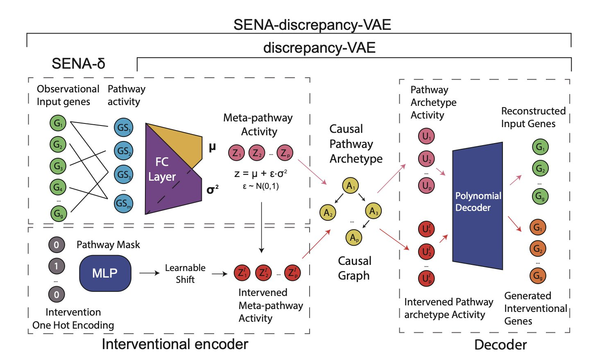

## Table of Contents
1. A new model called SENA-discrepancy-VAE gives causal inference AI a "biology dictionary," finally letting us see what it sees inside a cell.
2. GPT-5 performs impressively on biomedical question answering but has limitations in high-precision tasks. This points to a future of hybrid systems combining general large models with domain-specific ones.
3. For the first time, an AI independently proposed and accurately predicted a complex biological mechanism before it was experimentally verified, showing its potential as an engine for scientific discovery.
4. LLAMP is an innovative, species-aware AI model that significantly advances the fight against multidrug-resistant pathogens by accurately predicting the activity of antimicrobial peptides against specific bacteria, including unknown strains.
5. The next step for AI in chemistry isn't just recognizing more patterns, but learning to reason step-by-step like a scientist. This will fundamentally change how we do R&D.

## 1. AI That Understands Causality in Cells? A Hard Look at the SENA Model

If you're a biologist, you've probably been frustrated by AI's "black box." Sure, these models can make predictions. But if you ask *why* they made a certain prediction, you get a bunch of "latent variables" that nobody can make sense of. It's a jumble of numbers. Trying to extract real biological mechanisms from that is harder than finding a needle in a haystack.

The SENA-discrepancy-VAE model, from a recent paper, aims to turn that numerical mess into an orderly molecular map.

The idea is direct, almost "brute force." Older models let the AI learn freely and then tried to "translate" its results using biological knowledge, which usually worked poorly. The SENA model does the opposite. Before training even begins, it feeds the model a thick "biology pathway knowledge base." Specifically, its encoder (SENA-δ) is designed as a special masked multilayer perceptron where each node explicitly corresponds to a biological process. It's like instead of letting someone with no architectural knowledge build a house and then critiquing it, you give them a detailed blueprint from the start, showing them which walls are load-bearing and where the pipes go.

This way, the model's output isn't meaningless numbers. It directly corresponds to concepts we can understand, like "pathway A activity" or "pathway B activity." Better yet, it can distinguish between "causal pathway archetypes" directly triggered by a perturbation and the downstream "meta-pathway activities." In biology, this makes perfect sense—knocking out a gene might directly hit a core pathway, which then triggers a cascade of secondary reactions.

But talk is cheap. The researchers tested it on two real-world Perturb-seq datasets (Norman2019 and Wessels2023). And the results? In predicting complex problems like double-gene perturbations, its accuracy was on par with top models that had no biological constraints. In some cases, it was even slightly better. This is remarkable. We usually assume that the more constraints you add to a model, the more its performance is likely to drop. SENA proves that if you add the right constraints, an AI can perform beautifully even with its hands tied.

But that’s not the most exciting part. The real value is its interpretability. When the model tells you that perturbation A caused a change in factor X, and that factor X maps directly to the "oxidative stress pathway," that's not just a correlation. It’s a causal hypothesis supported by biological logic that can be tested. The researchers showed examples, like how the model independently discovered the relationship between hydrogen peroxide production and endothelial cell behavior, which aligns with known biology. This means we finally have a tool to systematically and logically mine new biological mechanisms from massive single-cell datasets.

Of course, it’s not perfect. The authors admit the model currently assumes one intervention corresponds to only one core latent factor, which is an oversimplification in the complex world of a cell. A single drug can set off ripples, affecting multiple pathways at once. Still, this is a major step toward a truly interpretable and trustworthy biological AI. It shows us that instead of letting AI wander alone in the dark, it's better to light its way with the lamp of biological knowledge from the start.

📜Title: Interpretable Causal Representation Learning for Biological Data in the Pathway Space
📜Paper: https://arxiv.org/abs/2506.12439v1
💻Code: https://github.com/ML4BM-Lab/SENA

## 2. A Benchmark of GPT-5 in Biomedicine: Is AI Drug Discovery at a Turning Point?

